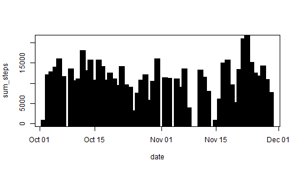

Reproducible Research Course Project 1 
========================================

##  1)Loading and preprocessing the data ##

### 1.1) Load the data ##


```r
file <- read.csv("activity.csv")
library(dplyr)
library(lubridate)
```

### 1.2) Preprocessing the data and loading libraries


```r
file$date  <- ymd(file$date)
```

## 2)What is mean total number of steps taken per day? ##

* For this part of the assignment, you can ignore the missing values in the dataset. *


```r
file_wna <- na.omit(file)
```

### 2.1) Calculate the total number of steps taken per day ###

```r
total_step_per_day <- summarise(group_by(file_wna,date),sum_steps=sum(steps))
```

### 2.2) Make a histogram of the total number of steps taken each day ###

```r
plot(total_step_per_day,type="h",lwd=10, lend="square")
```



### 2.3)Calculate and report the mean and median of the total number of steps taken per day ###

```r
 mean1 <- mean(total_step_per_day$sum_steps)
median1 <- median(total_step_per_day$sum_steps)
```
* Hence the mean is 1.0766189 &times; 10<sup>4</sup>   and the median is 10765 *

## 3) What is the average daily activity pattern? ##

### 3.1) Make a time series plot (i.e. type = "l") of the 5-minute interval (x-axis) and the average number of steps taken, averaged across all days (y-axis) ###


```r
agg <- summarise(group_by(file_wna,interval), steps=mean(steps))
plot(agg,type="l")
```


### 3.2) Which 5-minute interval, on average across all the days in the dataset, contains the maximum number of steps? ###

```r
max(file_wna$steps)
```

```
## [1] 806
```

## 4) Imputing missing values ##
** Note that there are a number of days/intervals where there are missing values (coded as NA). The presence of missing days may introduce bias into some calculations or summaries of the data. **

### 4.1) Calculate and report the total number of missing values in the dataset  ###

```r
sum(is.na(file))
```

```
## [1] 2304
```

### 4.2)Devise a strategy for filling in all of the missing values in the dataset ###
I am going to substitute each NA with a fixed value.
  I set the fixed value equivalent to the overall mean
  of the variable file_wna$steps
  
### 4.3) Create a new dataset that is equal to the original dataset but with the missing data filled in ###  


```r
file_wna2 <- file
file_wna2$steps[is.na(file_wna2$steps)] <- mean(file_wna$steps)
```

*Calculate the total number of steps taken per day with NA values filled dataset,i.e file_wna2 * 

```r
total_step_per_day2 <- summarise(group_by(file_wna2,date),sum_steps=sum(steps))
```
### 4.3) Make a histogram of the total number of steps taken each day and Calculate and report the mean and median total number of steps taken per day ###

* Do Do these values differ from the estimates from the first part of the assignment*


```r
par(mfrow=c(1,2))
plot(total_step_per_day,type="h",lwd=10, lend="square", main="With NAs",ylab="Sum of   Steps")
plot(total_step_per_day2,type="h",lwd=10, lend="square", main="NAs Filled",ylab="Sum   of Steps")
```


### What is the impact of imputing missing data on the estimates of the total daily number of steps? ###
As you can see from the above figure, the plot with the imputed NA values is more homogeneous and filled.


The Mean and Median of total number of steps per day with Missing Values

```r
mean(total_step_per_day$sum_steps)
```

```
## [1] 10766.19
```

```r
median(total_step_per_day$sum_steps)
```

```
## [1] 10765
```

The Mean and Median of total number of steps per day with the Imputed Missing Values data


```r
mean(total_step_per_day2$sum_steps)
```

```
## [1] 10766.19
```

```r
median(total_step_per_day2$sum_steps)
```

```
## [1] 10766.19
```

## 5)Are there differences in activity patterns between weekdays and weekends? ##

*For this part the weekdays() function may be of some help here. Use the dataset with the filled-in missing values for this part. * 

### 5.1) Create a new factor variable in the dataset with two levels - "weekday" and "weekend" indicating whether a given date is a weekday or weekend day. ### 


```r
file_wna2$day <- factor(format(file_wna2$date,"%A"))
levels(file_wna2$day) <- list(weekday=c("Monday","Tuesday","Wednesday","Thursday","Friday"), weekend=c("Saturday","Sunday"))
```

### 5.2)Make a panel plot containing a time series plot (i.e. type = "l") of the 5-minute interval (x-axis) and the average number of steps taken, averaged across all weekday days or weekend days (y-axis). ###

```r
day1 <- filter(file_wna2, day=="weekday")
day2 <- filter(file_wna2, day=="weekend")
week_day <- summarise(group_by(day1,interval), steps=mean(steps))
week_end <- summarise(group_by(day2,interval), steps=mean(steps))

par(mfrow=c(2,1))
plot(week_day,type="l",main="Weekday")
plot(week_end,type="l",main="Weekend")
```


```


