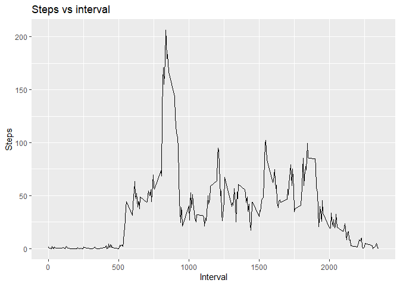

    library(ggplot2)
    library(data.table)

    #steps: Number of steps taking in a 5-minute interval (missing #values are coded as NA)
    #date: The date on which the measurement was taken in #YYYY-MM-DD format
    #interval: Identifier for the 5-minute interval in which #measurement was taken

    #Load data
    activity_data <- read.csv("activity.csv", header = TRUE) |>
      na.omit() |>
      data.table()

    #View(activity_data)

## Total steps per day

    #calculate total steps per day
    activity_data_bydate <- aggregate(steps ~ date, activity_data, sum)

    #histogram of the total steps taken each day
    activity_hist <- ggplot(data = activity_data_bydate, aes(x = steps)) +
      geom_histogram(binwidth = 1000, color = "black", fill = "steelblue3") +
      ggtitle("Total Steps per Day") 
      
    activity_hist

## Mean and median total steps per day

### Mean steps per day

    #calculate mean and median total steps per day
    mean(activity_data_bydate$steps)

    ## [1] 10766.19

### Median steps per day

    median(activity_data_bydate$steps)

    ## [1] 10765

## Time series plot (steps vs 5 minute interval)

    activity_timeseries <- aggregate(steps ~ interval, activity_data, mean )
    activity_timeseries_plot <- ggplot(data = activity_timeseries, aes( x = interval, y = steps)) +
      geom_line() +
      ylab("Steps")+
      xlab("Interval")+
      ggtitle("Steps vs interval")

    activity_timeseries_plot

    #maximim steps
    max_interval_steps <- max(activity_timeseries$steps)
    #interval at maximum steps
    activity_timeseries[activity_timeseries$steps == max(activity_timeseries$steps),]

    ##     interval    steps
    ## 104      835 206.1698

Maximum number of steps, 206.1698113, occurs during interval 835

## Impute missing values

    #dataset with NA's included
    activity_data_NA <- read.csv("activity.csv", header = TRUE) |>
      data.table()
    #View(activity_data_NA)

    #calculate total number of NA's
    NAs <- sum(is.na(activity_data_NA))
    #NAs

A total of 2304 missing values are present in the data set.

    #copy data
    new_activity_data <- activity_data_NA |>
      data.table()
    #assign mean to NAs
    replace_NA <- function(x) replace(x, is.na(x), mean(x, na.rm = TRUE))
    new_activity_data[] <- lapply(new_activity_data, replace_NA)

    ## Warning in mean.default(x, na.rm = TRUE): argument is not numeric or logical:
    ## returning NA

    #View(new_activity_data)
    #sum(is.na(new_activity_data))

    #calculate total steps per day
    new_activity_data_bydate <- aggregate(steps ~ date, new_activity_data, sum)

    #histogram of the total steps taken each day
    new_activity_hist <- ggplot(data = new_activity_data_bydate, aes(x = steps)) +
      geom_histogram(binwidth = 1000, color = "black", fill = "steelblue3") +
      ggtitle("Total Steps per Day (NA values replaced with mean steps)") 
      
    new_activity_hist

    #activity_hist

## Mean and median total steps per day: NA values replaced with mean number of steps

### Mean steps per day

    #calculate mean and median total steps per day
    mean(new_activity_data_bydate$steps)

    ## [1] 10766.19

### Median steps per day

    median(new_activity_data_bydate$steps)

    ## [1] 10766.19

Previously, the mean and median were 10766.19 and 10765, respectively
(essentially the same). Replacing all NA values with the column mean of
number of steps did not change the data. New mean an median are equal to
each other at 10766.19.

## Number of steps on weekdays vs weekends

    #create new factor variable with levels "weekday" and "weekend"
    #new column with dates reformatted
    new_activity_data$date <- as.Date(new_activity_data$date, format = "%Y-%m-%d")
    #new column for weekdays
    new_activity_data$weekday <- weekdays(new_activity_data$date)
    #weekday or weekend?
    new_activity_data$day <- ifelse(new_activity_data$weekday=='Saturday' | new_activity_data$weekday=='Sunday', 'weekend', 'weekday')

    #mean steps per interval on weekends and weekdays
    mean_weekday <- aggregate(steps ~ interval + day, data = new_activity_data,mean)
    #make a panel plot with time series plots of average steps vs interval for weekday and weekend

    activity_timeseries_daytype_plot <- ggplot(data = mean_weekday, aes( x = interval, y = steps)) +
      geom_line() +
      ylab("Steps")+
      xlab("Interval")+
      ggtitle("Steps vs Interval for Weekends and Weekdays")+
      facet_grid(day ~ .)

    activity_timeseries_daytype_plot

