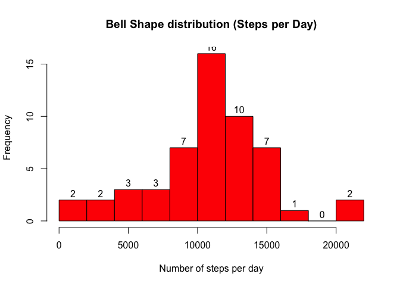
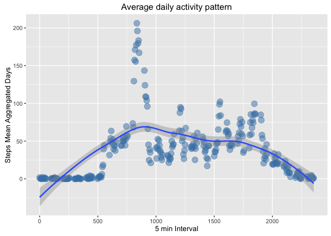
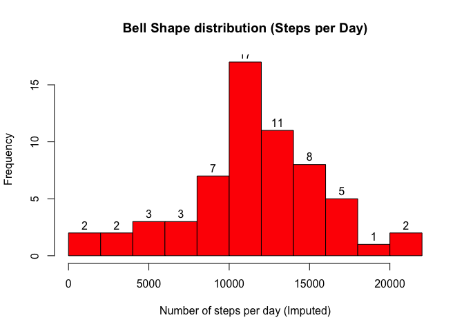
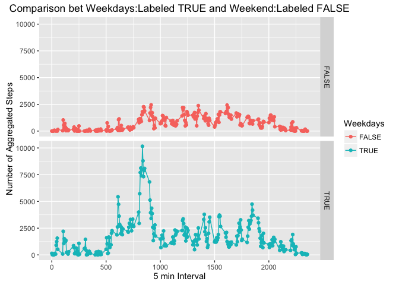

# Course_Assignment_1
Felix Barangan  
April 24, 2016  
                                         
## Introduction

It is now possible to collect a large amount of data about personal
movement using activity monitoring devices such as a
[Fitbit](http://www.fitbit.com), [Nike
Fuelband](http://www.nike.com/us/en_us/c/nikeplus-fuelband), or
[Jawbone Up](https://jawbone.com/up). These type of devices are part of
the "quantified self" movement -- a group of enthusiasts who take
measurements about themselves regularly to improve their health, to
find patterns in their behavior, or because they are tech geeks. But
these data remain under-utilized both because the raw data are hard to
obtain and there is a lack of statistical methods and software for
processing and interpreting the data.

This assignment makes use of data from a personal activity monitoring
device. This device collects data at 5 minute intervals through out the
day. The data consists of two months of data from an anonymous
individual collected during the months of October and November, 2012
and include the number of steps taken in 5 minute intervals each day.

## Data

The data for this assignment can be downloaded from the course web
site:

* Dataset: [Activity monitoring data](https://d396qusza40orc.cloudfront.net/repdata%2Fdata%2Factivity.zip) [52K]

The variables included in this dataset are:

* **steps**: Number of steps taking in a 5-minute interval (missing
    values are coded as `NA`)

* **date**: The date on which the measurement was taken in YYYY-MM-DD
    format

* **interval**: Identifier for the 5-minute interval in which
    measurement was taken

The dataset is stored in a comma-separated-value (CSV) file and there
are a total of 17,568 observations in this
dataset.
               
### Loading and preprocessing the data
        
The following are libraries and packages used:

```r
library(dplyr)
```

```
## Warning: package 'dplyr' was built under R version 3.2.2
```

```
## 
## Attaching package: 'dplyr'
```

```
## The following objects are masked from 'package:stats':
## 
##     filter, lag
```

```
## The following objects are masked from 'package:base':
## 
##     intersect, setdiff, setequal, union
```

```r
library(ggplot2)
```

```
## Warning: package 'ggplot2' was built under R version 3.2.4
```

```r
library(mice)
```

```
## Warning: package 'mice' was built under R version 3.2.3
```

```
## Loading required package: Rcpp
```

```
## Warning: package 'Rcpp' was built under R version 3.2.4
```

```
## mice 2.25 2015-11-09
```

```r
library(knitr)
```

```
## Warning: package 'knitr' was built under R version 3.2.3
```

```r
library(xtable)
```

```
## Warning: package 'xtable' was built under R version 3.2.3
```
        

Downloaded zip file from the Rdpeng Repo and eventually unzip using OS specific program. Check and set specific directory in your Rstudio using:

```r
getwd()
```
        
In my case, I named the .csv file as "activity.csv"
Load file:

```r
#load csv file
activity <- read.csv( "activity.csv")
```
       
This may not be necessary by I do like to have a general rule to check the data file

```r
str(activity)
```

```
## 'data.frame':	17568 obs. of  3 variables:
##  $ steps   : int  NA NA NA NA NA NA NA NA NA NA ...
##  $ date    : Factor w/ 61 levels "2012-10-01","2012-10-02",..: 1 1 1 1 1 1 1 1 1 1 ...
##  $ interval: int  0 5 10 15 20 25 30 35 40 45 ...
```

```r
names(activity)
```

```
## [1] "steps"    "date"     "interval"
```

```r
xt <- xtable(summary(activity))
print(xt)
```

```
## % latex table generated in R 3.2.1 by xtable 1.8-2 package
## % Sun Apr 24 17:13:22 2016
## \begin{table}[ht]
## \centering
## \begin{tabular}{rlll}
##   \hline
##  &     steps &         date &    interval \\ 
##   \hline
## 1 & Min.   :  0.00   & 2012-10-01:  288   & Min.   :   0.0   \\ 
##   2 & 1st Qu.:  0.00   & 2012-10-02:  288   & 1st Qu.: 588.8   \\ 
##   3 & Median :  0.00   & 2012-10-03:  288   & Median :1177.5   \\ 
##   4 & Mean   : 37.38   & 2012-10-04:  288   & Mean   :1177.5   \\ 
##   5 & 3rd Qu.: 12.00   & 2012-10-05:  288   & 3rd Qu.:1766.2   \\ 
##   6 & Max.   :806.00   & 2012-10-06:  288   & Max.   :2355.0   \\ 
##   7 & NA's   :2304   & (Other)   :15840   &  \\ 
##    \hline
## \end{tabular}
## \end{table}
```
                
Based on the above summary, It turned out that there are 2304 NA's on the variable "step".

Run a code to determine if there are any other NA value that will affect analysis. Coerce Date variable from character to date to extract days of the week value


```r
stepsNull <- sum(is.na(activity$steps))
dateNull <- sum(is.na(activity$date))

activity$Date <- as.POSIXct(activity$date)
```

Converted the file to tbl.df using dplyr package for ease of table manipulation.  
Please check [Hadley Wickham's tutorial on dpylr][1]
        

```r
#convert csv to dplyr (tbl.df) removing NA's
activity <- tbl_df(activity)
activity_No_NA <- activity %>%
        filter(!is.na(steps)) %>%
        select(steps, Date, interval)
```
        

```r
xtActivity <- xtable(activity)
print(xtActivity)
```

```
## Warning in formatC(x = structure(c(1349064000, 1349064000, 1349064000,
## 1349064000, : class of 'x' was discarded
```
## Assingment rubrics
###What is mean total number of steps taken per day?
1. Calculate the total number of steps taken per day
2. Calculate and report the mean and median of the total number of steps taken per day
3. Make a histogram of the total number of steps taken each day


```r
statsPerDay <- activity_No_NA %>%
        group_by(Date) %>%
        summarise(Steps = sum(steps), meanSteps = mean(steps)) %>%
        select(Date, Steps, meanSteps)
```

Histogram

```r
hist(stepsPerDay$Steps , breaks = 10,
        xlab = "Number of steps per day",
        freq = TRUE,
        main = "Bell Shape distribution (Steps per Day)",
        axes = TRUE,
        col = "red",
        labels = TRUE,
        type = "count")
```

```
## Warning in plot.window(xlim, ylim, "", ...): graphical parameter "type" is
## obsolete
```

```
## Warning in title(main = main, sub = sub, xlab = xlab, ylab = ylab, ...):
## graphical parameter "type" is obsolete
```

```
## Warning in axis(1, ...): graphical parameter "type" is obsolete
```

```
## Warning in axis(2, ...): graphical parameter "type" is obsolete
```

<!-- -->

### What is the average daily activity pattern?
1. Make a time series plot (i.e. type = "l") of the 5-minute interval (x-axis) and the average number of steps taken, averaged across all days (y-axis)
2.Which 5-minute interval, on average across all the days in the dataset, contains the maximum number of steps?

The above question can be easily reproduce and manipulated using dplyr package.

```r
intervalStats <- activity_No_NA %>%
        group_by(interval) %>%
        summarise(sum = sum(steps),
                  mean = mean(steps)) %>%
        arrange(ave = desc(mean))
```


```r
intervalStats
```

```
## Source: local data frame [288 x 3]
## 
##    interval   sum     mean
##       (int) (int)    (dbl)
## 1       835 10927 206.1698
## 2       840 10384 195.9245
## 3       850  9720 183.3962
## 4       845  9517 179.5660
## 5       830  9397 177.3019
## 6       820  9071 171.1509
## 7       855  8852 167.0189
## 8       815  8349 157.5283
## 9       825  8236 155.3962
## 10      900  7603 143.4528
## ..      ...   ...      ...
```
The 835th minute interval is the maximum steps recorded.

```r
subset(intervalStats, interval == 835)
```

```
## Source: local data frame [1 x 3]
## 
##   interval   sum     mean
##      (int) (int)    (dbl)
## 1      835 10927 206.1698
```
        

```r
# Plot using
q <- ggplot (intervalStats, aes(interval, mean))
p  <- q + geom_point(color = "steelblue", size = 4, alpha = 1/2 ) + geom_smooth() + labs(title = "Average daily activity pattern") + labs(x = "5 min Interval", y = "Steps Mean Aggregated Days")

print(p)
```

<!-- -->

### Imputing missing values
Note that there are a number of days/intervals where there are missing values (coded as NA). The presence of missing days may introduce bias into some calculations or summaries of the data.

- Calculate and report the total number of missing values in the dataset (i.e. the total number of rows with NAs)

To answer this question, I decided to use the [mice package][2].
to find the total number of row, first I decided to copy the original csv.

```r
activity2 <- read.csv( "activity.csv")

# change to Df
activity2df_ <- tbl_df(activity2)
activity2df_$Date <- as.POSIXct(activity2df_$date)

str(activity2df_)
```

```
## Classes 'tbl_df', 'tbl' and 'data.frame':	17568 obs. of  4 variables:
##  $ steps   : int  NA NA NA NA NA NA NA NA NA NA ...
##  $ date    : Factor w/ 61 levels "2012-10-01","2012-10-02",..: 1 1 1 1 1 1 1 1 1 1 ...
##  $ interval: int  0 5 10 15 20 25 30 35 40 45 ...
##  $ Date    : POSIXct, format: "2012-10-01" "2012-10-01" ...
```


```
##       date interval Date steps     
## 15264    1        1    1     1    0
##  2304    1        1    1     0    1
##          0        0    0  2304 2304
```


- Devise a strategy for filling in all of the missing values in the dataset. The strategy does not need to be sophisticated. For example, you could use the mean/median for that day, or the mean for that 5-minute interval, etc.


```r
#If you would like to check the imputed data, for instance for the variable steps, 
# tempdata_$imp$steps
#The mice() function takes care of the imputing process

tempdata_ <- mice(activity2df_)
```


```r
summary(tempdata_)
```

```
## Multiply imputed data set
## Call:
## mice(data = activity2df_)
## Number of multiple imputations:  5
## Missing cells per column:
##    steps     date interval     Date 
##     2304        0        0        0 
## Imputation methods:
##    steps     date interval     Date 
##    "pmm"       ""       ""       "" 
## VisitSequence:
## steps 
##     1 
## PredictorMatrix:
##          steps date interval Date
## steps        0    1        1    0
## date         0    0        0    0
## interval     0    0        0    0
## Date         0    0        0    0
## Random generator seed value:  NA
```

```r
str(tempdata_$imp$steps)
```

```
## 'data.frame':	2304 obs. of  5 variables:
##  $ 1: int  0 0 0 0 0 0 0 13 7 137 ...
##  $ 2: int  0 0 0 0 0 0 0 24 0 0 ...
##  $ 3: int  0 0 0 0 44 0 139 0 0 619 ...
##  $ 4: int  0 0 0 0 0 0 0 0 277 0 ...
##  $ 5: int  0 0 0 32 0 156 0 0 0 158 ...
```

Now we can get back the completed dataset using the complete() function.

```r
completedData <- complete(tempdata_, 1)
str(completedData)
```

```
## 'data.frame':	17568 obs. of  4 variables:
##  $ steps   : int  0 0 0 0 0 0 0 13 7 137 ...
##  $ date    : Factor w/ 61 levels "2012-10-01","2012-10-02",..: 1 1 1 1 1 1 1 1 1 1 ...
##   ..- attr(*, "contrasts")= num [1:61, 1:60] 0 1 0 0 0 0 0 0 0 0 ...
##   .. ..- attr(*, "dimnames")=List of 2
##   .. .. ..$ : chr  "2012-10-01" "2012-10-02" "2012-10-03" "2012-10-04" ...
##   .. .. ..$ : chr  "2" "3" "4" "5" ...
##  $ interval: int  0 5 10 15 20 25 30 35 40 45 ...
##  $ Date    : POSIXct, format: "2012-10-01" "2012-10-01" ...
```

convert data to df

```r
completedDataDf_ <- tbl_df(completedData)
```

- Create a new dataset that is equal to the original dataset but with the missing data filled in.

New activity data with imputed values

```r
stepsPerDay_withImput <- completedDataDf_ %>%
        group_by(Date) %>%
        summarise(Steps = sum(steps)) %>%
        select(Date, Steps)
```

- Make a histogram of the total number of steps taken each day and Calculate and report the mean and median total number of steps taken per day. Do these values differ from the estimates from the first part of the assignment? What is the impact of imputing missing data on the estimates of the total daily number of steps?

New histogram for data with imputed values
The results may not greatly differ with that of the non imputed data. There probably just a change in the variance.
The mice method used is the 'pmm'. please see [r-blooger for further info][2]

```r
hist(stepsPerDay_withImput$Steps , breaks = 10,
     xlab = "Number of steps per day (Imputed)",
     freq = TRUE,
     main = "Bell Shape distribution (Steps per Day)",
     axes = TRUE,
     col = "red",
     labels = TRUE,
     type = "count")
```

```
## Warning in plot.window(xlim, ylim, "", ...): graphical parameter "type" is
## obsolete
```

```
## Warning in title(main = main, sub = sub, xlab = xlab, ylab = ylab, ...):
## graphical parameter "type" is obsolete
```

```
## Warning in axis(1, ...): graphical parameter "type" is obsolete
```

```
## Warning in axis(2, ...): graphical parameter "type" is obsolete
```

<!-- -->

### Are there differences in activity patterns between weekdays and weekends?

- Create a new factor variable in the dataset with two levels – “weekday” and “weekend” indicating whether a given date is a weekday or weekend day.
Convert date to extract day of the week.

```r
dayofWeek <- weekdays(as.Date(activity2df_$date))
```

Using dplyr, create another variable- Weekday using "mutate", then group by 5 minute interval and Weekdays (Days of the week).
- Weekdays will be labeled = TRUE
-Weekends will be labeled = FALSE


```r
weekPatterns <- completedDataDf_  %>%
        mutate(dayofWeek = weekdays(as.Date(activity2df_$date)))  %>%
        mutate(Weekdays = as.character(dayofWeek %in% c("Monday","Tuesday","Wednesday","Thursday","Friday"))) %>%
        group_by (interval, Weekdays) %>%
        summarise(NumberSte = sum(steps))
```
        
Plot using ggplot2

```r
q2 <- qplot(interval,NumberSte, data = weekPatterns, color= Weekdays, facets =  Weekdays~.)
printq2 <- q2 + geom_line() +  labs(title = "Comparison bet Weekdays:Labeled TRUE and Weekend:Labeled FALSE") + labs(x = "5 min Interval", y = "Number of Aggregated Steps")
print(printq2)
```

<!-- -->


submitted by :  
                           
Felix Barangan
*- MS, Health Informatics, Business Informatics
*- Medical Laboratory Scientist
*- Registered Nurse
*- Certified OBIEE Implementation Specialist
        
[1]: https://www.youtube.com/watch?v=8SGif63VW6E
[2]: http://www.r-bloggers.com/imputing-missing-data-with-r-mice-package/
