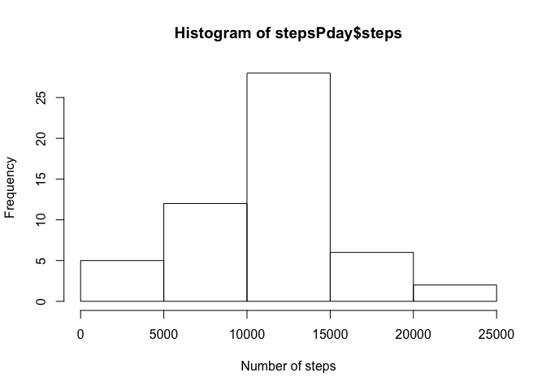
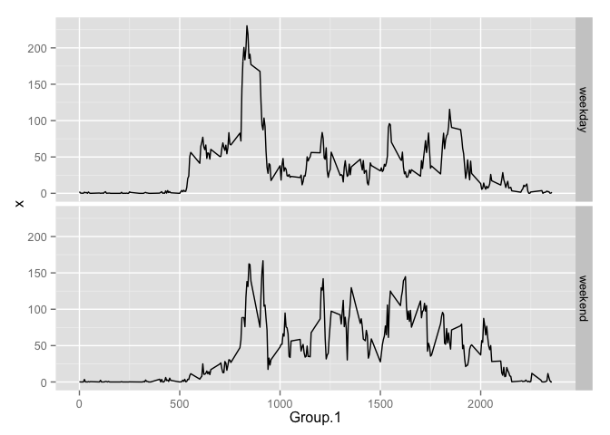

# Reproducible Research: Peer Assessment 1


## Loading and preprocessing the data
This bit will load the data and also convert the date column which is in factor format into dates.

```r
steps<-read.csv("activity.csv")
steps$date<-as.Date(steps$date)
```
## What is mean total number of steps taken per day?
To find out the mean number of total steps we are going to sum up the steps per day (stepsPday) then take the mean, excluding the NAs.

```r
stepsPday<-aggregate(steps[c("steps")], FUN=sum ,by=list(steps$date))
```
Below is the a Table showing the total number of steps per day

```r
stepsPday
```

```
##       Group.1 steps
## 1  2012-10-01    NA
## 2  2012-10-02   126
## 3  2012-10-03 11352
## 4  2012-10-04 12116
## 5  2012-10-05 13294
## 6  2012-10-06 15420
## 7  2012-10-07 11015
## 8  2012-10-08    NA
## 9  2012-10-09 12811
## 10 2012-10-10  9900
## 11 2012-10-11 10304
## 12 2012-10-12 17382
## 13 2012-10-13 12426
## 14 2012-10-14 15098
## 15 2012-10-15 10139
## 16 2012-10-16 15084
## 17 2012-10-17 13452
## 18 2012-10-18 10056
## 19 2012-10-19 11829
## 20 2012-10-20 10395
## 21 2012-10-21  8821
## 22 2012-10-22 13460
## 23 2012-10-23  8918
## 24 2012-10-24  8355
## 25 2012-10-25  2492
## 26 2012-10-26  6778
## 27 2012-10-27 10119
## 28 2012-10-28 11458
## 29 2012-10-29  5018
## 30 2012-10-30  9819
## 31 2012-10-31 15414
## 32 2012-11-01    NA
## 33 2012-11-02 10600
## 34 2012-11-03 10571
## 35 2012-11-04    NA
## 36 2012-11-05 10439
## 37 2012-11-06  8334
## 38 2012-11-07 12883
## 39 2012-11-08  3219
## 40 2012-11-09    NA
## 41 2012-11-10    NA
## 42 2012-11-11 12608
## 43 2012-11-12 10765
## 44 2012-11-13  7336
## 45 2012-11-14    NA
## 46 2012-11-15    41
## 47 2012-11-16  5441
## 48 2012-11-17 14339
## 49 2012-11-18 15110
## 50 2012-11-19  8841
## 51 2012-11-20  4472
## 52 2012-11-21 12787
## 53 2012-11-22 20427
## 54 2012-11-23 21194
## 55 2012-11-24 14478
## 56 2012-11-25 11834
## 57 2012-11-26 11162
## 58 2012-11-27 13646
## 59 2012-11-28 10183
## 60 2012-11-29  7047
## 61 2012-11-30    NA
```
Removing the NAs here is a histogram of the total number of steps taken each day.

```r
hist(stepsPday$steps,xlab="Number of steps")
```

 

The mean and median below, respectivley

```r
mean(stepsPday$steps ,na.rm = TRUE)
```

```
## [1] 10766.19
```

```r
median(stepsPday$steps,na.rm=TRUE)
```

```
## [1] 10765
```

## What is the average daily activity pattern?
To get the average daily pattern we will first remove the NAs then average the steps per interval

```r
dailypat<-subset(steps,complete.cases(steps)==TRUE)
avgint<-aggregate(dailypat$steps,FUN=mean,by=list(dailypat$interval),rm.na=TRUE)
plot(avgint,type="l",xlab="Interval",ylab="Average Steps")
```

 

Its obvious to see that one interval stands out with the most average number of steps.

```r
subset(avgint,avgint$x==max(avgint$x))
```

```
##     Group.1        x
## 104     835 206.1698
```

## Imputing missing values
First we will look at how many values we are missing.  To do this we will take the total number of records in the original dataset then subtract the count of complete cases.  This leaves us with the below

```r
length(steps$steps)-length(complete.cases(dailypat))
```

```
## [1] 2304
```
The model I am going to use to fill in the missing values will be to take the average steps for that interval.  The below will first merge the steps then when there is an NA use the average for that interval


```r
names(avgint)[names(avgint)=="Group.1"]<-"interval"
stepsfilled<-merge(steps,avgint)
stepsfilled$clean<-ifelse(is.na(stepsfilled$steps)==TRUE,stepsfilled$x,stepsfilled$steps)
stepsfilled<-stepsfilled[,c(5,3,1)]
names(stepsfilled)[names(stepsfilled)=="clean"]<-"steps"
stepsPdayF<-aggregate(stepsfilled[c("steps")], FUN=sum ,by=list(stepsfilled$date))
```
Now we will plot a histogram and compute the mean and median for the fixed data


```r
hist(stepsPdayF$steps,xlab="Number of steps")
```

 

Below you will be presented the updated mean and median along side the originals.  In the case of the mean it has not changed and the median has shifted to be the same as the mean.

```r
paste(mean(stepsPdayF$steps), mean(stepsPday$steps ,na.rm = TRUE),sep="  ")
```

```
## [1] "10766.1886792453  10766.1886792453"
```

```r
paste(median(stepsPdayF$steps),median(stepsPday$steps,na.rm=TRUE),sep="  ")
```

```
## [1] "10766.1886792453  10765"
```

avgint<-aggregate(dailypat$steps,FUN=mean,by=list(dailypat$interval),rm.na=TRUE)
## Are there differences in activity patterns between weekdays and weekends?
To determine if there are differences we will first figure out which records are from weekends and which are not.


```r
stepsfilled$day<-weekdays(stepsfilled$date)
stepsfilled$daytype<-ifelse(stepsfilled$day=="Sunday" | stepsfilled$day=="Saturday","weekend","weekday")

Day_int_avg<-aggregate(stepsfilled$steps,FUN=mean,by=list(stepsfilled$interval,stepsfilled$daytype),rm.na=TRUE)
require(ggplot2)
```

```
## Loading required package: ggplot2
```

```r
p <- ggplot(Day_int_avg, aes(Group.1, x)) + geom_line()
p + facet_grid(Group.2 ~ .)
```

 
