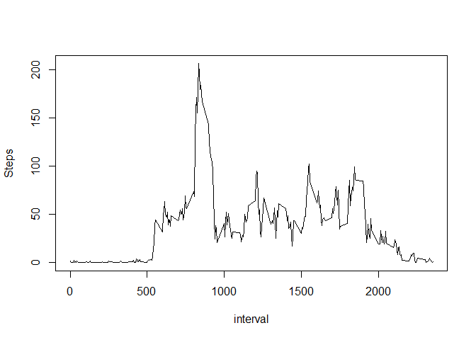
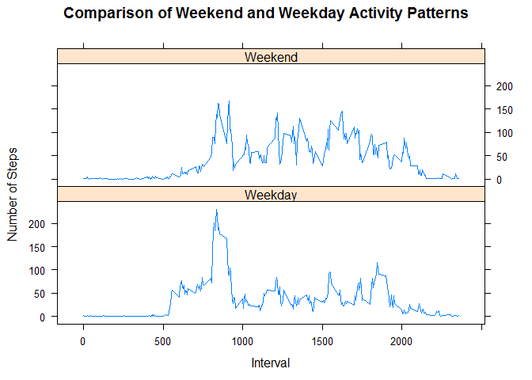

# Reproducible Research: Peer Assessment 1
### Raju Vulapalli
### January 10, 2016

This document shows the results for Reproducible Research: Assignment 1.

First setting up the working directory and initiating few functions used in the data analysis

```r
setwd("~/GitHub/RepData_PeerAssessment1")
library(knitr)
```

```
## Warning: package 'knitr' was built under R version 3.2.3
```

```r
library(ggplot2)
library(plyr)
library(dplyr)
```

```
## Warning: package 'dplyr' was built under R version 3.2.3
```

```
## 
## Attaching package: 'dplyr'
```

```
## The following objects are masked from 'package:plyr':
## 
##     arrange, count, desc, failwith, id, mutate, rename, summarise,
##     summarize
```

```
## The following objects are masked from 'package:stats':
## 
##     filter, lag
```

```
## The following objects are masked from 'package:base':
## 
##     intersect, setdiff, setequal, union
```

```r
library(lubridate)
```

```
## 
## Attaching package: 'lubridate'
```

```
## The following object is masked from 'package:plyr':
## 
##     here
```

## Loading and preprocessing the data

The file is read by read.csv and can be checked with str and head function.  The date was formatted to avoid any issues.

```r
activitydata <- read.csv("activity.csv")

# check the data
head(activitydata)
```

```
##   steps       date interval
## 1    NA 2012-10-01        0
## 2    NA 2012-10-01        5
## 3    NA 2012-10-01       10
## 4    NA 2012-10-01       15
## 5    NA 2012-10-01       20
## 6    NA 2012-10-01       25
```

```r
str(activitydata)
```

```
## 'data.frame':	17568 obs. of  3 variables:
##  $ steps   : int  NA NA NA NA NA NA NA NA NA NA ...
##  $ date    : Factor w/ 61 levels "2012-10-01","2012-10-02",..: 1 1 1 1 1 1 1 1 1 1 ...
##  $ interval: int  0 5 10 15 20 25 30 35 40 45 ...
```

```r
#Changing the data into dateformat using lubridate
activitydata$date <- ymd(activitydata$date)
```


## What is mean total number of steps taken per day?


```r
# Calculate the total number of steps taken per day

dailySteps <- with(activitydata, tapply(steps, date, sum, na.rm = T))

#histogram

hist(dailySteps, breaks = 15, xlab = "Steps per Day", main = "Histogram of Steps per Day")
```

\

```r
# Mean  of the daily steps
mean_steps <- mean(dailySteps)
mean_steps
```

```
## [1] 9354.23
```

```r
#Median of the daily steps
median_steps<- median(dailySteps)
median_steps
```

```
## [1] 10395
```
As shown in the histogram, the majority of steps taken per day is between 10,000 to 12,500.
Simple calculation shows theat the mean steps taken per day is 9354 and median number of steps is 10,395.


## What is the average daily activity pattern?

We need to calculate the average number of steps taken for each interval to investigate the daily activity patter.  After calculating the intervals and average steps in a day, we can plot interval and steps to find out the daily activity pattern.  We can also use this data to determine which 5-min interval contains the largest number of steps for an average day.


```r
#Daily Activity plotting to find out which interval has largest number of steps for an average day
library(plyr)
library(dplyr)
daily_activity <- ddply(activitydata, .(interval), summarize, Steps= mean(steps, na.rm=T))
with(daily_activity, plot(interval, Steps, type = "l"))
```

\

```r
#check data
head(daily_activity)
```

```
##   interval     Steps
## 1        0 1.7169811
## 2        5 0.3396226
## 3       10 0.1320755
## 4       15 0.1509434
## 5       20 0.0754717
## 6       25 2.0943396
```

```r
tail(daily_activity)
```

```
##     interval     Steps
## 283     2330 2.6037736
## 284     2335 4.6981132
## 285     2340 3.3018868
## 286     2345 0.6415094
## 287     2350 0.2264151
## 288     2355 1.0754717
```

```r
# max daily activity
daily_activity[which.max(daily_activity$Steps),]$interval
```

```
## [1] 835
```

Based on this analysis, this individual took most steps at 835th interval

## Imputing missing values

First we need to determine how many missing values are there in this data set.  Then we also need to determine which dates have null values for steps

```r
#total number of missing values
sum(is.na(activitydata$steps))
```

```
## [1] 2304
```

```r
# Dates where steps data is NA
missingDates <- unique(activitydata[is.na(activitydata$steps), ]$date)
missingDates
```

```
## [1] "2012-10-01 UTC" "2012-10-08 UTC" "2012-11-01 UTC" "2012-11-04 UTC"
## [5] "2012-11-09 UTC" "2012-11-10 UTC" "2012-11-14 UTC" "2012-11-30 UTC"
```

```r
#determining the number of missing values and  dates using intervals

sapply(missingDates, function(X) sum(is.na(activitydata[activitydata$date == X, ]$steps)))
```

```
## [1] 288 288 288 288 288 288 288 288
```


## Adding a default value of the missing values

One solution is to use the average activity pattern we found in the above section to fill in the missing values.  The missing values are populated with mean steps of interval.

```r
#fillin missing values with mean steps of interval

New_activitydata <- activitydata
missingValues <- is.na(New_activitydata$steps)
averageInterval <- tapply(New_activitydata$steps,New_activitydata$interval, mean, na.rm=TRUE, simplify = TRUE)
New_activitydata$steps[missingValues] <- averageInterval[as.character(New_activitydata$interval[missingValues])]

#check if missing values exists in New_activitydata
sum(is.na(New_activitydata$steps))
```

```
## [1] 0
```

```r
#mean and median of New_activitydata without null values
New_dailySteps <- with(New_activitydata, tapply(steps, date, sum, na.rm = T))
median(New_dailySteps)
```

```
## [1] 10766.19
```

```r
# contstruct histogram with Null value filled data and compare it with original histogram.
par(mfrow = c(1,2))
hist(dailySteps, breaks = 5, xlab = "Steps per Day", main = "Original Steps per Day", ylim = c(0, 40))
hist(New_dailySteps, breaks = 5, xlab = "Steps per Day", main = "After Imputing Missing Values", ylim = c(0, 40))
```

\

We can see a difference in the frequency of mean steps increase from original histogram to that of imputed missing value histograph.

## Are there differences in activity patterns between weekdays and weekends?

We need to add factor variable "Weekend" which has two levels (Weekday and Weekend).  The activity can be computed again separating the data with by interval and by the Weekend factor.


```r
New_activitydata$Weekend <- weekdays(New_activitydata$date) == "Saturday" | weekdays(New_activitydata$date) == "Sunday"
New_activitydata$Weekend <- factor(New_activitydata$Weekend, levels = c(F, T), labels = c("Weekday", "Weekend"))

activity <- ddply(New_activitydata, .(interval, Weekend), summarize, steps = mean(steps, na.rm = T))

# plotting data to compare weekend and weekday activity
library(lattice)
```

```
## Warning: package 'lattice' was built under R version 3.2.3
```

```r
xyplot(steps ~ interval | Weekend, activity, type = "l", layout = c(1, 2), ylab = "Number of Steps", xlab = "Interval", main = "Comparison of Weekend and Weekday Activity Patterns")
```

\

As you can see in the above graph,there is a clear difference between weekday and week end activity pattern. This individual has lot of activity only in the mornings of weekday. This could be attributed to the activity to go reach workplace and activity is lower during the rest of the day.  Where as the activity continued thorugh out the day during weekend. 
