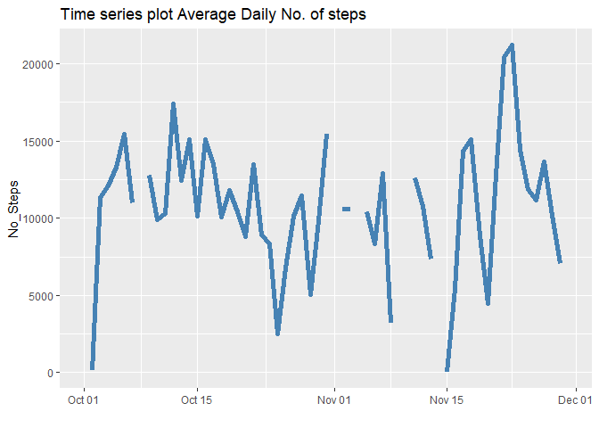
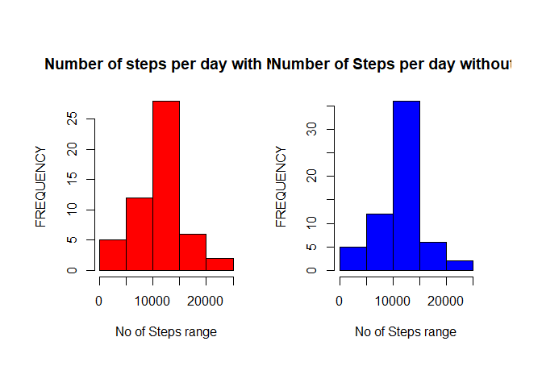
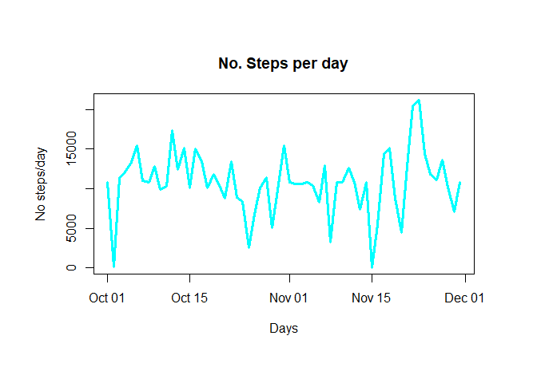
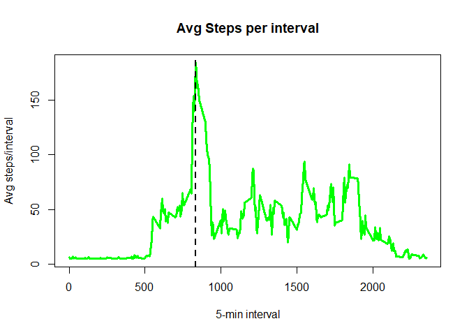
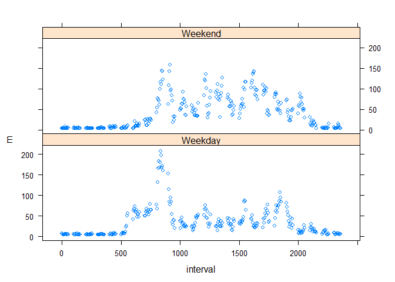

## Loading and preprocessing the data

- We will read in the data and get the total number, mean and median steps per day
- We consolidate results in a dataframe **Summarized_data** as follows:

```r
Activities<-read.csv("activity.csv",header = T)

No_steps_per_Day<-tapply(Activities$steps,Activities$date,sum)
Mean_steps_per_Day<-tapply(Activities$steps,Activities$date,mean)
Median_steps_per_Day<-tapply(Activities$steps,Activities$date,median)

Activities$Days_as_chr<-as.character(Activities$date)
Activities$Days_as_dates<-as.Date(Activities$Days_as_chr)
Avg_Days<-unique(Activities$Days_as_dates)

Summarized_data <- data.frame(
    day = Avg_Days,
    No_Steps = No_steps_per_Day,
    Mean = Mean_steps_per_Day,
    Median = Median_steps_per_Day
)
```

## What is mean total number of steps taken per day?

- We just computed total, mean and median steps per day, using functions **sum()**, **mean()** and **median()**
- A histogram and time series plot of total/mean steps per day is depicted, where we observe must frequent total steps are from 10k-15k steps, and highest total steps is around 20k.
- Similarly from  day 30 to day 40 we got the most frequent Average steps per Day,and highest mean steps per day is about 70. Overall **Mean steps is 37.4 steps per Day**

```r
par(mfrow = c(1,2))
hist(No_steps_per_Day,col = "red",main = "Number of steps per day",xlim = c(0,25000),
     xlab = "No of Steps range",ylab = "FREQUENCY")
with(Summarized_data,plot(day,No_Steps,type = 'l',main = "Number of steps per day",
                          xlab = "Days",ylab = "No. steps/day",col = "red",lwd = 3)) #makes a time series plot
```

<!-- -->

```r
par(mfrow = c(1,2))
hist(Mean_steps_per_Day,col = "blue",main = "Mean steps per day",xlim = c(0,100),
     xlab = "Mean No of Steps range",ylab = "FREQUENCY")
with(Summarized_data,plot(day,Mean,type = 'l',main = "Mean steps per day",
                          xlab = "Days",ylab = "Mean steps/day",col = "blue",lwd = 3)) #makes a time series plot
```

<!-- -->

```r
summary(Summarized_data)
```

```
##       day                No_Steps          Mean             Median 
##  Min.   :2012-10-01   Min.   :   41   Min.   : 0.1424   Min.   :0  
##  1st Qu.:2012-10-16   1st Qu.: 8841   1st Qu.:30.6979   1st Qu.:0  
##  Median :2012-10-31   Median :10765   Median :37.3785   Median :0  
##  Mean   :2012-10-31   Mean   :10766   Mean   :37.3826   Mean   :0  
##  3rd Qu.:2012-11-15   3rd Qu.:13294   3rd Qu.:46.1597   3rd Qu.:0  
##  Max.   :2012-11-30   Max.   :21194   Max.   :73.5903   Max.   :0  
##                       NA's   :8       NA's   :8         NA's   :8
```

## What is the average daily activity pattern?

- Using **ggplot package** we make a time series plot. Because there are some missing data, the plot will look discontinuous. 
- We can observe from the plot that *the day with highest number of steps was around Nov-21 of that year*.

```r
library(ggplot2)
# A time series plot
ggplot(Summarized_data, aes(x=day, y=No_Steps)) +
    geom_line() + 
    geom_line( color="steelblue",size = 2) +
    xlab("") +
    labs(title = "Time series plot Average Daily No. of steps") 
```

```
## Warning: Removed 2 rows containing missing values (geom_path).

## Warning: Removed 2 rows containing missing values (geom_path).
```

<!-- -->

## Imputing missing values

- We simply take the average from the previous averaged data, and substitute NA's values with this calculated average. **This average is 37.38 steps/day**. 
- We can always compare the Total steps before and after NA has been imputed. In general,average No. of steps remain the same as seen in the histograms.
- A new data set called **Summarized_data_NA** is created, to gather computations after NA imputation, including per interval statistics.
- A new *continuous* time series plot can be built, with no NA's in it.


```r
Value_To_Replace<-mean(Mean_steps_per_Day,na.rm=T)
Activities_no_NA<-Activities
Activities_no_NA[is.na(Activities$steps),1]<-Value_To_Replace

No_steps_per_Day_no_NA<-tapply(Activities_no_NA$steps,Activities_no_NA$date,sum)
No_steps_per_interval<-tapply(Activities_no_NA$steps,Activities_no_NA$interval,sum)
Mean_steps_per_interval<-tapply(Activities_no_NA$steps,Activities_no_NA$interval,mean)
Median_steps_per_interval<-tapply(Activities_no_NA$steps,Activities_no_NA$interval,median)
Avg_5min_int<-unique(Activities_no_NA$interval)

Summarized_data_no_NA <- data.frame(
    interval = Avg_5min_int,
    No_Steps = No_steps_per_interval,
    Mean = Mean_steps_per_interval,
    Median = Median_steps_per_interval
)

Summarized_data$No_Steps_no_NA<-No_steps_per_Day_no_NA

par(mfrow = c(1,2), oma = c(2,2,2,2))
hist(No_steps_per_Day,col = "red",main = "Number of steps per day with NA",xlim = c(0,25000),
     xlab = "No of Steps range",ylab = "FREQUENCY")
hist(No_steps_per_Day_no_NA,col = "blue",main = "Number of Steps per day without NA",xlim = c(0,25000),
     xlab = "No of Steps range",ylab = "FREQUENCY")
```

<!-- -->

```r
par(mfrow = c(1,1))
with(Summarized_data,plot(day,No_Steps_no_NA,type = 'l',main = "No. Steps per day",
                          xlab = "Days",ylab = "No steps/day",col = "cyan",lwd = 3))
```

<!-- -->

## What is the 5-min interval with the max number of steps?

- We learned from the time series plot, that *the maximum Number of steps was around Nov-21st with a value of 21194 steps*. 
- Using the stats from the imputed dataset, We compute the 5-min interval that contains the maximum number of steps. *This turns out to be the 835th interval* 
- We can observe this in the following time series plot.


```r
Maximum_Step<-max(No_steps_per_interval)
Activities_5min_int<-subset(Summarized_data_no_NA$interval,
                            Summarized_data_no_NA$No_Steps==Maximum_Step)
par(mfrow = c(1,1))
with(Summarized_data_no_NA ,plot(interval,Mean,type = 'l',main = "Avg Steps per interval",
                          xlab = "5-min interval",ylab = "Avg steps/interval",col = "green",lwd = 3))
abline(v=835,col = "black",lty=2,lwd = 2)
```

<!-- -->

```r
print(paste("The 5 min interval with max avg of steps is:", Activities_5min_int))
```

```
## [1] "The 5 min interval with max avg of steps is: 835"
```

## Are there differences in activity patterns between weekdays and weekends?

- We use the function **weekdays()** to discriminate weekdays and weekend days.
- We also use **dplyr package** to average the number of steps per 5 min interval by weekdays and weekends categories.
- We  create a plot using **lattice package**, to compare activity pattern between weekdays and weekends.
- From the plots *it appears on weekends people is active throught the day, whereas on the weekdays, they are more active in morning/noon hours*. 

```r
Activities_no_NA$Days_of_week<-weekdays(Activities_no_NA$Days_as_dates)
Activities_no_NA$DayType<-ifelse(Activities_no_NA$Days_of_week=="Saturday"|Activities_no_NA$Days_of_week=="Sunday",
                                    "Weekend","Weekday")
library(dplyr)
```

```
## Warning: package 'dplyr' was built under R version 3.6.2
```

```
## 
## Attaching package: 'dplyr'
```

```
## The following objects are masked from 'package:stats':
## 
##     filter, lag
```

```
## The following objects are masked from 'package:base':
## 
##     intersect, setdiff, setequal, union
```

```r
tbl_df(Activities_no_NA)
Activities_Summarized <-
    Activities_no_NA %>%
    group_by(interval,DayType) %>%
    summarize(m = mean(steps),v = var(steps)) %>%
    print
```


```r
library(lattice)
xyplot(m ~ interval | DayType, data = Activities_Summarized, layout = c(1, 2))
```

<!-- -->
