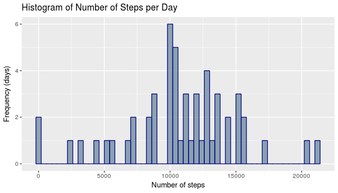
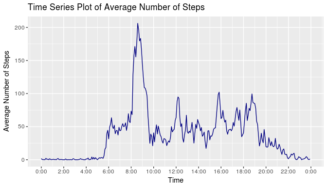
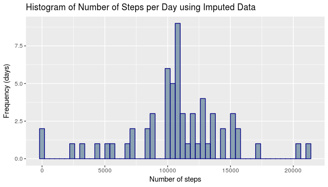
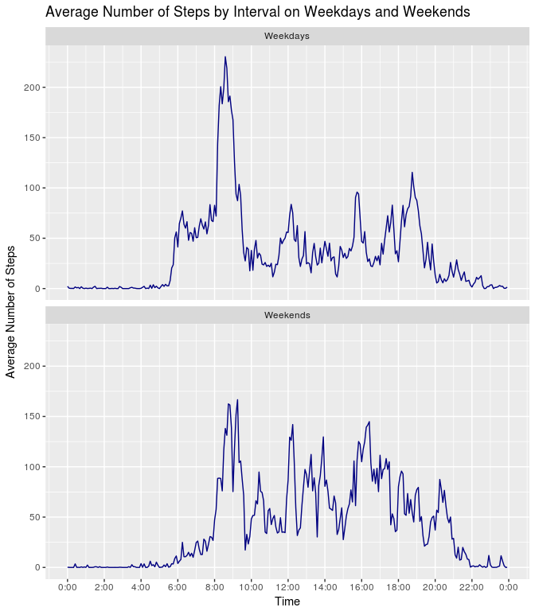

# Reproducible Research: Peer Assessment 1
## Introduction

We wish to use the data from an activity monitoring device such as a Fitbit, Nike Fuelband or 
Jawbone Up to investigate activity patterns.  We are interested both in the profile of activity 
across the days of the trial and the distribution of activity on an average day.

## Loading and preprocessing the data

The dataset consists of two months of activity of a single individual, as gathered by an activity 
monitoring device. The data were recorded every 5 minutes, and the dataset contains both dates and
an interval identifier based on the time in minutes.


```r
activitydata <- read.csv("/home/susannah/Statistics/JH_Reproducible/Week_2/data/activity.csv")
```


```r
summary(activitydata)
```

```
##      steps                date          interval     
##  Min.   :  0.00   2012-10-01:  288   Min.   :   0.0  
##  1st Qu.:  0.00   2012-10-02:  288   1st Qu.: 588.8  
##  Median :  0.00   2012-10-03:  288   Median :1177.5  
##  Mean   : 37.38   2012-10-04:  288   Mean   :1177.5  
##  3rd Qu.: 12.00   2012-10-05:  288   3rd Qu.:1766.2  
##  Max.   :806.00   2012-10-06:  288   Max.   :2355.0  
##  NA's   :2304     (Other)   :15840
```

From the summary of the data, we can see that there are 2304 missing values for steps, probably due
to the device requiring or being on charge or not being worn for some other reason, such as bathing 
or showering.

## What is mean total number of steps taken per day?

The total number of steps taken for each day were calculated, and a histogram generated to investigate
the distribution of the number of steps per day.  At this stage in the analysis, missing data were 
simply being excluded.


```r
library(dplyr)
activityperday <- na.omit(activitydata) %>%
    group_by(date) %>%
    summarise(steps = sum(steps)) %>%
    as.data.frame()
```


```r
library(ggplot2)
ggplot(data=activityperday, aes(steps)) +
    geom_histogram(binwidth = 400,
                   col = "navy",
                   fill = "skyblue4",
                   alpha = 0.6) +
    labs(title = "Histogram of Number of Steps per Day") +
    labs (x = "Number of steps", y = "Frequency (days)")
```

<!-- -->

The histogram appears to show a tendency towards a left skew, with an edge peak at 0. We can assume the 
0 values are outliers, since unless the subject were in hospital it would be impossible to actually 
get through a day with no steps at all. 


```r
stepmean <- as.integer(mean(activityperday$steps))
stepmedian <- as.integer(median(activityperday$steps))
```

The (rounded) mean number of steps per day is 10766, and the median is 10765, 
a difference which is extraordinarily unlikely to be significant.  This can be explained by the
edge peak counterbalancing the skew in the distribution.  Interestingly, these averages are very 
close to 10000 steps, the default target per day on Fitbits and other such devices. The left skew
suggests that the subject either makes some effort to exceed this target, or has several days where
he/she is naturally very active.

## What is the average daily activity pattern?

To investigate the daily activity profile, we grouped the data together according to the time they
were recorded, and took the mean across all the days for each interval measured.  Missing data were 
again omitted.


```r
library(dplyr)
intervalav <- na.omit(activitydata) %>%
    group_by(interval) %>%
    summarise(steps = mean(steps)) %>%
    as.data.frame()
```

The interval names are not suitable to generate axis ticks for the time axis because they are integers
which look like times rather than contiguous numbers.  As the dataset is sorted we simply generate 
sequences, minute values for the plotting and human-readable times for the labels.


```r
library(dplyr)
minutes <- sort(c(seq(0, 1435, 5)))
intervalav <- intervalav %>%
    mutate(minutes)
```

By producing a simple time series plot of the average number of steps taken for each interval, we 
can see the pattern of activity, as measured by step count, throughout the day.


```r
library(ggplot2)
ggplot(data=intervalav, aes(minutes, steps)) +
    geom_line(col="navy") +
    labs(title = "Time Series Plot of Average Number of Steps") +
    labs (x = "Time", y = "Average Number of Steps") +
    scale_x_continuous(breaks=c(seq(0, 1440, 120)), labels=paste0(c(seq(0,22,2),0), rep(":00", 12))) 
```

<!-- -->

From the histogram, we can deduce that the subject gets up somewhere between half past five and 
around eight o'clock, and takes some sort of significant exercise between eight and nine-thirty.
This could be his or her commute to work, or perhaps jogging or the gym before work. Activity levels
during the morning are modest. There is a small peak at midday, probably lunch time, again at four, 
and another at seven. Activity between four and seven is generally higher than that in the late morning 
or early afternoon, though there is no peak as tall as that at morning commute time.  This suggests 
that the trip home from work happens at a less fixed time, or that the morning peak was augmented
by some kind of planned exercise. By half past seven activity is tailing off and it would appear the 
subject goes to bed some time between ten and midnight.


```r
maxsteps <- which.max(intervalav$steps)
maxstepsint <- intervalav$interval[maxsteps]
maxstepstime <- sprintf("%04d", maxstepsint)
maxstepstime <- format(strptime(maxstepstime, format="%H%M"), format = "%H:%M")
```

The 5 minute time interval containing the maximum number of steps (averaged across all days) 
is at 08:35. 

## Imputing missing values


```r
isna <- is.na(activitydata)
misseddata <- sum(isna)
misseddatasteps <- sum(is.na(activitydata$steps))
```

There are 2304 pieces of missing data in this dataset, 2304 of which are
in the steps column.

We propose to impute the missing data using means (crude, but functional). As we have seen, all
the missing data are steps values, and there is considerable variation in the mean number of steps 
per interval, according to the time of day.  It therefore makes most sense to fill in missing 
datapoints using the mean number of steps for that time interval, not the overall mean or the mean
for the day. 

The data including the imputed results are stored in a new dataset for further investigation.


```r
newactivdata <- activitydata
# Loop over the indices of the missing data
for(index in which(isna)) {
    # What is the interval value for the missing datapoint?
    intmissing <- activitydata$interval[index]
    # What is the index of that interval in the averaged steps per interval dataset?
    intav <- which(intervalav$interval == intmissing)
    # Use the steps value from the averaged dataset to impute the missing value
    newactivdata$steps[index] <- intervalav$steps[intav]
}
```


```r
newisna <- sum(is.na(newactivdata))
```

We can verify that there are 0 missing datapoints remaining.

Next we group the data by day, as we did previously for the unimputed data.


```r
library(dplyr)
newactivityperday <- newactivdata %>%
    group_by(date) %>%
    summarise(steps = sum(steps, na.rm=TRUE)) %>%
    as.data.frame()
```

Then we display the data in a histogram, as before.


```r
library(ggplot2)
ggplot(data=newactivityperday, aes(steps)) +
    geom_histogram(binwidth = 400,
                   col = "navy",
                   fill = "skyblue4",
                   alpha = 0.6) +
    labs(title = "Histogram of Number of Steps per Day using Imputed Data") +
    labs (x = "Number of steps", y = "Frequency (days)")
```

<!-- -->


```r
newstepmean <- as.integer(mean(newactivityperday$steps))
newstepmedian <- as.integer(median(newactivityperday$steps))
```

The (rounded) mean number of steps per day is 10766, and the median is 10766.
Both have increased, the mean (unsuprisingly) more than the median. The edge peak remains at zero, 
as we have not eliminated outliers. The data are looking fairly similar, though the maximum around
the mean is both taller and a little wider. 

The averages are still close to 10000 steps, which is the default suggested target number of steps 
per day on a Fitbit. This suggests that the target may be to some degree inspirational to the 
individual, although it may also simply be his/her natural activity level. 

## Are there differences in activity patterns between weekdays and weekends?

Common work schedules suggest that there might be a difference between activity patterns in
the week and those at the weekend. To investigate this we need to generate an indicator variable which
tells us whether a day is a weekday or not. 


```r
library(dplyr)
isweekend <- as.factor(grepl("S.+",weekdays(as.Date(newactivdata$date))))
levels(isweekend) <- c("Weekdays", "Weekends")
newactivdata <- newactivdata %>%
    mutate(isweekend)
```

As before, we sort the dataset, and generate tick points and labels for the axes.


```r
library(dplyr)
newintervalav <- newactivdata %>%
    group_by(interval, isweekend) %>%
    summarise(steps = mean(steps, na.rm=TRUE)) %>%
    as.data.frame()
```


```r
library(dplyr)
newminutes <- sort(c(seq(0, 1435, 5), seq(0, 1435, 5)))
newintervalav <- newintervalav %>%
    mutate(newminutes)
```

We can now create time series plots of the activity patterns on weekdays and weekends so that they
can be easily compared. 


```r
library(ggplot2)
ggplot(data=newintervalav, aes(x=newminutes, y=steps)) +
    geom_line(col="navy") +
    labs(title = "Average Number of Steps by Interval on Weekdays and Weekends") +
    labs (x = "Time", y = "Average Number of Steps") +
    scale_x_continuous(breaks=c(seq(0, 1440, 120)), labels=paste0(c(seq(0,22,2),0), rep(":00", 12))) +
    facet_wrap(~isweekend, nrow=2)
```

<!-- -->

From these plots we can see a clear difference between the activity profiles of the individual on 
weekdays and at the weekend. Peak activity is at a similar time in the morning, though the peak is 
not so high at weekends The activity on weekends between six thirty and eight is far lower, suggesting 
a more leisurely start to the day. In contrast, in the main part of the day the individual is more
active at the weekend, with several peaks coming close to the height of the half past eight maximum. 
Activity during the week has largely tailed off by eight in the evening, whereas at the weekend it is
closer to nine.

## Conclusion

The data show that there is a distinct difference in the activity profile on weekends versus that on 
weekdays. The individual starts and stops moving later but maintains a more consistent and higher profile
of activity throughout the day, whereas in the week activity is very strongly concentrated first thing in
the morning and rises again at the end of the workday. 

The analysis of the steps per day shows an interesting tendency.  The average activity per day is very 
close to the threshold which typically provides a "reward" from the monitoring device, and the distribution 
suggests that the individual may actively be trying to exceed this level.  To determine whether the targets 
on the device are truly motivational, or whether it is simply the wearing of a monitoring device or 
even coincidence would require further investigation. 

It would be interesting to conduct a randomised controlled study on a larger pool of people, using Fitbits 
whose suggested targets were customised to different levels. The control could be 10000 steps as here, or 
no target set (if that is possible).
