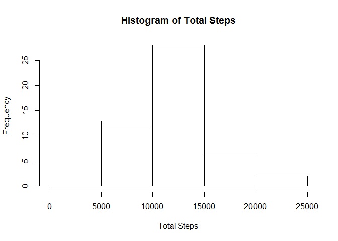
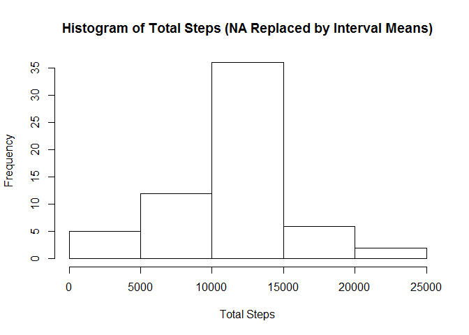
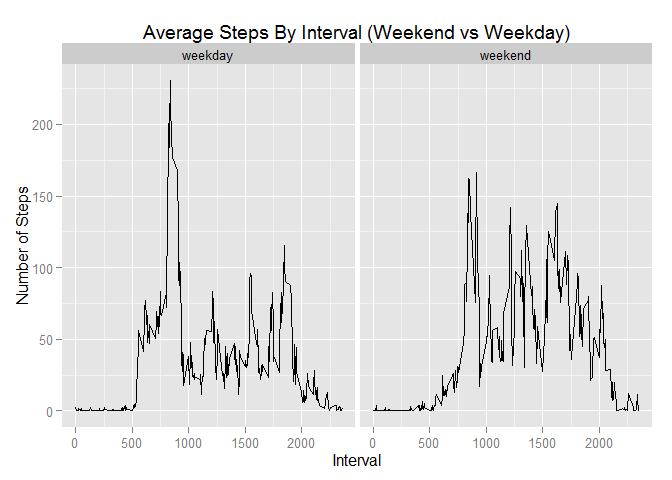

# Reproducible Research: Peer Assessment 1
Jackie Goor  
January 9, 2016  

```r
## Load required libraries
library(dplyr)
```

```
## Warning: package 'dplyr' was built under R version 3.1.3
```

```
## 
## Attaching package: 'dplyr'
## 
## The following objects are masked from 'package:stats':
## 
##     filter, lag
## 
## The following objects are masked from 'package:base':
## 
##     intersect, setdiff, setequal, union
```

```r
library(data.table)
```

```
## Warning: package 'data.table' was built under R version 3.1.3
```

```
## 
## Attaching package: 'data.table'
## 
## The following objects are masked from 'package:dplyr':
## 
##     between, last
```

```r
library(grid)

library(ggplot2)
```

```
## Warning: package 'ggplot2' was built under R version 3.1.3
```

```r
### Set working directory
setwd("C:/Users/jackson/Documents/GitHub/ReproducibleResearch_Project1/RepData_PeerAssessment1")

### Constants
FIGURE_PATH = file.path(getwd(), "figures")
```

```r
## Loading and preprocessing the data
activityData <- read.table(unz("activity.zip", "activity.csv"), header=T, quote="\"", sep=",")

### What is the total # of steps taken per day? [Ignore missing values]
### sort then group data by date
activityDataByDate <- arrange(activityData, date) %>% group_by(date)

### total steps for each date
activityDataByDate <- summarize(activityDataByDate, totalSteps = sum(steps, na.rm = TRUE))

### Make a histogram of the total # of steps taken per day
hist(activityDataByDate$totalSteps, 
        main="Histogram of Total Steps",
        xlab="Total Steps")
```

 

```r
### Calculate and report the mean and median of the total # of steps taken per day
### Output to console
mean(activityDataByDate$totalSteps)
```

[1] 9354.23

```r
median(activityDataByDate$totalSteps)
```

[1] 10395

```r
## What is the average daily activity pattern?
### sort then group data by interval
activityDataByInterval <- arrange(activityData, interval) %>% group_by(interval)

### average steps for each interval
activityDataByInterval <- summarize(activityDataByInterval, avgSteps = mean(steps, na.rm = TRUE))

plot(activityDataByInterval$interval, activityDataByInterval$avgSteps, type="l", xlab="Interval",
     ylab="Average Steps", main="Average Daily Activity Pattern (Average Steps Per Time Interval)")
```

 

```r
### Which 5-minute interval, on average across all the days in the dataset, contains 
### the maximum number of steps? 
### --> 206 steps for interval = 835
### Output to console
max(activityDataByInterval$avgSteps)
```

[1] 206.1698

```r
subset(activityDataByInterval, select=interval, 
        activityDataByInterval$avgSteps==max(activityDataByInterval$avgSteps))
```

Source: local data frame [1 x 1]

  interval
     (int)
1      835

```r
## Imputing missing values
### Calculate and report the total number of missing values in the dataset (i.e. the 
### total number of rows with NAs)
NAs<-filter(activityData,is.na(activityData$steps))

### --> Total # of NAs = 2304
count(NAs)
```

Source: local data frame [1 x 1]

      n
  (int)
1  2304

```r
### Apply the mean for each interval to missing values for each interval.
### Copy original activityData to activityDataWithMeanForMissing.
activityDataWithMeanForMissing = copy(activityData)

### Loop thru each activityDataByInterval record and apply its avgSteps to NA records in
### activityDataWithMeanForMissing (for matching interval).
### Filter the activityDataWithMeanForMissing to this interval and NA records.
### Set "steps" for these rows to avgSteps for the current (i) activityDataByInterval.
for (i in 1:length(activityDataByInterval$interval)) 
{
        activityDataWithMeanForMissing$steps[activityDataWithMeanForMissing$interval==activityDataByInterval$interval[i] & is.na(activityDataWithMeanForMissing$steps)] <- activityDataByInterval$avgSteps[i]
}

### Make a histogram of the total number of steps taken each day. 
### Calculate and report the mean and median total number of steps taken per day.
### Do these values differ from the estimates from the first part of the assignment?
### These values do differ from the first part of the assignment. 

### What is the impact of imputing missing data on the estimates of the total daily number of steps?
### The values are inflated since the NAs have been replaced by average values.
### sort then group data by date
activityDataWithMeanForMissingByDate <- arrange(activityDataWithMeanForMissing, date) %>% group_by(date)

### total steps for each date
activityDataWithMeanForMissingByDate <- summarize(activityDataWithMeanForMissingByDate, totalSteps = sum(steps, na.rm = TRUE))

hist(activityDataWithMeanForMissingByDate$totalSteps, 
        main="Histogram of Total Steps (NA Replaced by Interval Means)",
        xlab="Total Steps")
```

 

```r
### Calculate and report the mean and median of the total # of steps taken per day
### Output to console
mean(activityDataWithMeanForMissingByDate$totalSteps)
```

[1] 10766.19

```r
median(activityDataWithMeanForMissingByDate$totalSteps)
```

[1] 10766.19

```r
## Are there differences in activity patterns between weekdays and weekends?
## Yes. Overall the weekend values are higher than weekday - perhaps person has 
## a desk job during the week.
### Create a new factor variable in the dataset with two levels - "weekday" and "weekend" 
### indicating whether a given date is a weekday or weekend day.
### First identify the day-of-week (e.g. "Monday")
activityDataWithMeanForMissing$dayOfWeek <- weekdays(as.Date(activityDataWithMeanForMissing$date))

### If dayOfWeek is Saturday or Sunday, create and set dayOfWeekType="weekend"
activityDataWithMeanForMissing$dayOfWeekType[activityDataWithMeanForMissing$dayOfWeek=="Saturday" | activityDataWithMeanForMissing$dayOfWeek=="Sunday"] <- "weekend"

### Now set the rest to "weekday"
activityDataWithMeanForMissing$dayOfWeekType[is.na(activityDataWithMeanForMissing$dayOfWeekType)] <- "weekday"

### Make a panel plot containing a time series plot (i.e. type = "l") of the 5-minute 
### interval (x-axis) and the average number of steps taken, averaged across all weekday 
### days or weekend days (y-axis).
### sort then group data by interval
activityDataWithMeanForMissingByIntervalDayOfWeekType <- arrange(activityDataWithMeanForMissing, interval, dayOfWeekType) %>% group_by(interval, dayOfWeekType)

### average steps for each interval by dayOfWeekType
activityDataWithMeanForMissingByIntervalDayOfWeekType <- summarize(activityDataWithMeanForMissingByIntervalDayOfWeekType, avgSteps = mean(steps, na.rm = TRUE))

### Use ggplot2 qplot()
plot1 <- qplot(interval, avgSteps, 
      data = activityDataWithMeanForMissingByIntervalDayOfWeekType, 
      facets = dayOfWeekType ~ .,
      geom="path",
      main="Average Steps By Interval (Weekend vs Weekday)",
      xlab="Interval",
      ylab="Number of Steps")
      
### Below statement puts panel titles on the top of each panel instead of on the side.
plot1 + facet_grid(. ~ dayOfWeekType)
```

 
