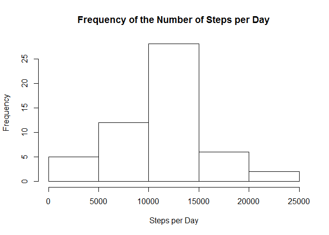
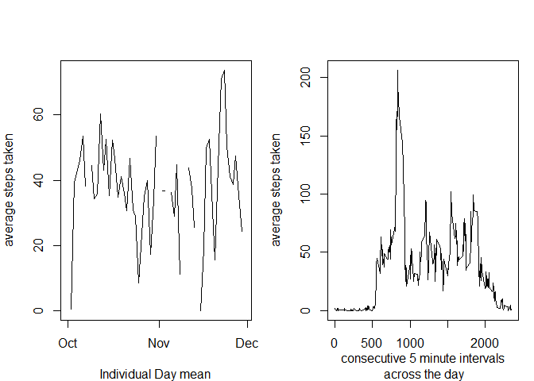
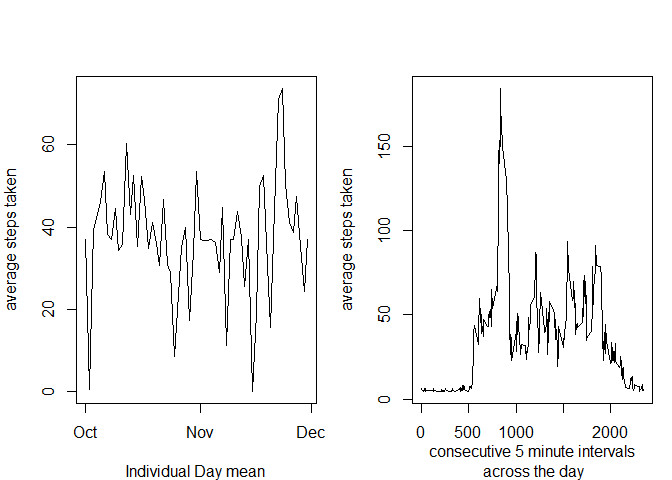
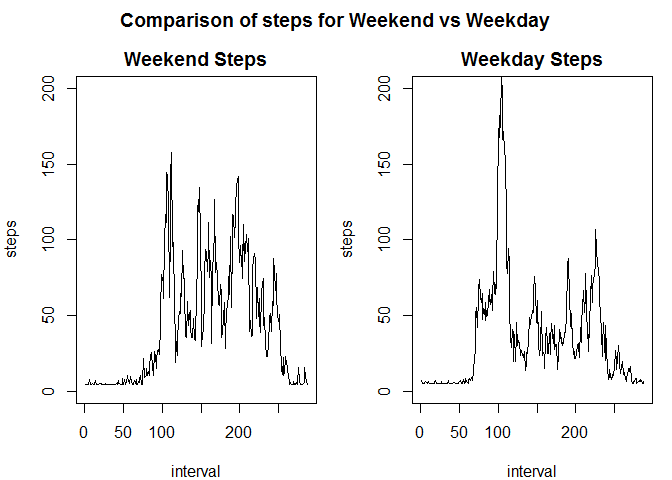

# Reproducible Research: Peer Assessment 1
This report is the analysis of an invidual's walking activity collected during the months of October 2012 and November 2012, by a monitoring device.The data comes from Coursera's Reproducible Research Class.   

## 1. The first step in the analysis consists of downloading the data from https://d396qusza40orc.cloudfront.net/repdata%2Fdata%2Factivity.zip


```r
knitr::opts_chunk$set(echo = TRUE)

## create file if it does not exist
if (!file.exists("Rsteps")) {
  dir.create("Rsteps")
}
##Download url
fileUrl <- "https://d396qusza40orc.cloudfront.net/repdata%2Fdata%2Factivity.zip"
download.file(fileUrl, destfile = "./Rsteps/steps.zip", method = "curl")
dateDownloaded <- date()

##unzip and read file plus change date from factor to POSIXct 
ss <-unzip("./Rsteps/steps.zip", exdir = "./Rsteps")
dat <- read.csv("./Rsteps/activity.csv")
dat$date <-as.POSIXct(dat$date, format="%Y-%m-%d")
date <- as.Date(dat$date)
date2 <- unique(date)
```

## 2. Calculate the number of steps per day and produce a histogram.


```r
knitr::opts_chunk$set(echo = TRUE)
sum1 <- aggregate(.~date, data=dat, sum, na.action=NULL)
hist(sum1$steps, main = "Frequency of the Number of Steps per Day", xlab = "Steps per Day", ylab = "Frequency")
```

<!-- -->

## 3. Calculate the median and mean number of steps per day.


```r
mean1 <- aggregate(.~date, data=dat, mean, na.action=NULL)
median1 <- aggregate(.~date, data=dat, median, na.action=NULL)
median_mean <- cbind(mean1[1:2], median1[2])
colnames(median_mean)<- c("date","mean-steps","median-steps")
mean2 <- aggregate(.~interval, data=dat, mean)


library(pander)
```

```
## Warning: package 'pander' was built under R version 3.2.5
```

```r
panderOptions("digits", 4)
pander(median_mean)
```


--------------------------------------
   date     mean-steps   median-steps 
---------- ------------ --------------
2012-10-01      NA            NA      

2012-10-02    0.4375          0       

2012-10-03    39.42           0       

2012-10-04    42.07           0       

2012-10-05    46.16           0       

2012-10-06    53.54           0       

2012-10-07    38.25           0       

2012-10-08      NA            NA      

2012-10-09    44.48           0       

2012-10-10    34.38           0       

2012-10-11    35.78           0       

2012-10-12    60.35           0       

2012-10-13    43.15           0       

2012-10-14    52.42           0       

2012-10-15     35.2           0       

2012-10-16    52.38           0       

2012-10-17    46.71           0       

2012-10-18    34.92           0       

2012-10-19    41.07           0       

2012-10-20    36.09           0       

2012-10-21    30.63           0       

2012-10-22    46.74           0       

2012-10-23    30.97           0       

2012-10-24    29.01           0       

2012-10-25    8.653           0       

2012-10-26    23.53           0       

2012-10-27    35.14           0       

2012-10-28    39.78           0       

2012-10-29    17.42           0       

2012-10-30    34.09           0       

2012-10-31    53.52           0       

2012-11-01      NA            NA      

2012-11-02    36.81           0       

2012-11-03     36.7           0       

2012-11-04      NA            NA      

2012-11-05    36.25           0       

2012-11-06    28.94           0       

2012-11-07    44.73           0       

2012-11-08    11.18           0       

2012-11-09      NA            NA      

2012-11-10      NA            NA      

2012-11-11    43.78           0       

2012-11-12    37.38           0       

2012-11-13    25.47           0       

2012-11-14      NA            NA      

2012-11-15    0.1424          0       

2012-11-16    18.89           0       

2012-11-17    49.79           0       

2012-11-18    52.47           0       

2012-11-19     30.7           0       

2012-11-20    15.53           0       

2012-11-21     44.4           0       

2012-11-22    70.93           0       

2012-11-23    73.59           0       

2012-11-24    50.27           0       

2012-11-25    41.09           0       

2012-11-26    38.76           0       

2012-11-27    47.38           0       

2012-11-28    35.36           0       

2012-11-29    24.47           0       

2012-11-30      NA            NA      
--------------------------------------

```r
#library(xtable)
#print(median_mean, type="html")
#library(knitr)
#kable(median_mean)
```

## 4. Time series plot for the average number of steps taken


```r
par(mfrow = c(1, 2), mar = c(4, 4, 2, 1), oma = c(0, 0, 2, 0))
plot(x = median_mean$date, y=median_mean$mean, type = "l", ylab = "average steps taken", xlab = "Individual Day mean")
plot(x = mean2$interval, y=mean2$steps, type = "l", ylab = "average steps taken", xlab = " consecutive 5 minute intervals \n across the day")
```

<!-- -->

## 5. Determine the max interval


```r
max(median_mean$`mean-steps`, na.rm=TRUE)
```

```
## [1] 73.59028
```

```r
which(median_mean$`mean-steps` == max(median_mean$`mean-steps`, na.rm=TRUE))
```

```
## [1] 54
```

## 6. Imputing missing data by taking the average number of steps across all days and times and replacing the "NA".


```r
dat3 <- dat
dat3$steps[is.na(dat3$steps)] <- as.numeric(37)
dat3$steps <- as.numeric(as.character(dat3$steps))

#mean_steps_v2 <-tapply(dat3$steps, dat3$interval, FUN=mean)
#median_steps_v2 <-tapply(dat3$steps, dat3$interval, FUN=median)

mean_steps_v2 <- aggregate(.~date, data=dat3, mean, na.action=NULL)
median_steps_v2 <- aggregate(.~date, data=dat3, median, na.action=NULL)
median_mean2 <- cbind(mean_steps_v2[1:2], median_steps_v2[2])
colnames(median_mean2)<- c("date","mean-steps","median-steps")
mean3 <- aggregate(.~interval, data=dat3, mean)


library(pander)
panderOptions("digits", 4)
pander(median_mean2)
```


--------------------------------------
   date     mean-steps   median-steps 
---------- ------------ --------------
2012-10-01      37            37      

2012-10-02    0.4375          0       

2012-10-03    39.42           0       

2012-10-04    42.07           0       

2012-10-05    46.16           0       

2012-10-06    53.54           0       

2012-10-07    38.25           0       

2012-10-08      37            37      

2012-10-09    44.48           0       

2012-10-10    34.38           0       

2012-10-11    35.78           0       

2012-10-12    60.35           0       

2012-10-13    43.15           0       

2012-10-14    52.42           0       

2012-10-15     35.2           0       

2012-10-16    52.38           0       

2012-10-17    46.71           0       

2012-10-18    34.92           0       

2012-10-19    41.07           0       

2012-10-20    36.09           0       

2012-10-21    30.63           0       

2012-10-22    46.74           0       

2012-10-23    30.97           0       

2012-10-24    29.01           0       

2012-10-25    8.653           0       

2012-10-26    23.53           0       

2012-10-27    35.14           0       

2012-10-28    39.78           0       

2012-10-29    17.42           0       

2012-10-30    34.09           0       

2012-10-31    53.52           0       

2012-11-01      37            37      

2012-11-02    36.81           0       

2012-11-03     36.7           0       

2012-11-04      37            37      

2012-11-05    36.25           0       

2012-11-06    28.94           0       

2012-11-07    44.73           0       

2012-11-08    11.18           0       

2012-11-09      37            37      

2012-11-10      37            37      

2012-11-11    43.78           0       

2012-11-12    37.38           0       

2012-11-13    25.47           0       

2012-11-14      37            37      

2012-11-15    0.1424          0       

2012-11-16    18.89           0       

2012-11-17    49.79           0       

2012-11-18    52.47           0       

2012-11-19     30.7           0       

2012-11-20    15.53           0       

2012-11-21     44.4           0       

2012-11-22    70.93           0       

2012-11-23    73.59           0       

2012-11-24    50.27           0       

2012-11-25    41.09           0       

2012-11-26    38.76           0       

2012-11-27    47.38           0       

2012-11-28    35.36           0       

2012-11-29    24.47           0       

2012-11-30      37            37      
--------------------------------------

```r
#library(xtable)
#print(median_mean, type="html")
#library(knitr)
#kable(median_mean)
```

## 7. Plotting the incorparted imputed data with original data


```r
maintitlev2 = "Time Series of 5 minute interval averaged across all days \n with missing data imputed"
par(mfrow = c(1, 2), mar = c(4, 4, 2, 1), oma = c(0, 0, 2, 0))
plot(x = median_mean2$date, y=median_mean2$mean, type = "l", ylab = "average steps taken", xlab = "Individual Day mean")
plot(x = mean3$interval, y=mean3$steps, type = "l", ylab = "average steps taken", xlab = " consecutive 5 minute intervals \n across the day")
```

<!-- -->

## 8. Determining if individual is more active on weekends or weekdays


```r
dat4 <- dat3
dat4$dayOFweek <- weekdays(as.Date(dat4$date))
dat7 <- subset(dat4, dayOFweek =="Sunday" | dayOFweek =="Saturday")
dat8 <- subset(dat4, dayOFweek !="Sunday")
dat8 <- subset(dat8, dayOFweek !="Saturday")
wkend <-tapply(dat7$steps, dat7$interval, FUN=mean)
wkday <-tapply(dat8$steps, dat8$interval, FUN=mean)
mainmain <- "Comparison of steps for Weekend vs Weekday"
par(mfrow = c(1, 2), mar = c(4, 4, 2, 1), oma = c(0, 0, 2, 0))
plot(wkend, type = "l", main = "Weekend Steps", ylab = "steps", xlab = "interval", ylim= c(0,200))
plot(wkday, type = "l", main = "Weekday Steps", ylab = "steps", xlab = "interval", ylim= c(0,200))
title(mainmain, outer = TRUE, cex = 0.5)
```

<!-- -->


