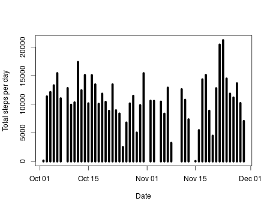
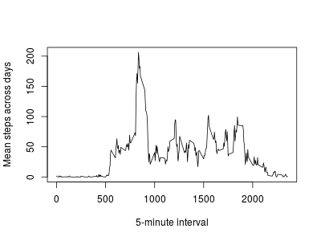

# Reproducible Research: Peer Assessment 1


## Loading and preprocessing the data
First, set the working directory and create the figures directory.
```{r, echo=TRUE}
setwd("~/RepData_PeerAssessment1/")

if (!file.exists("./figures/")){
   dir.create("figures")
}
```

This part checks whether the file has been downloaded and unzipped, and if not
then it does it.
```{r, echo=TRUE}
act.file = "https://d396qusza40orc.cloudfront.net/repdata%2Fdata%2Factivity.zip"

if (!file.exists("activity.zip")){
   download.file(url=act.file,
                 destfile="activity.zip",
                 method="curl")
}

if (!file.exists("activity.csv")){
   unzip("activity.zip")   
}
```

Next, it reads the file to a data frame (`act.df`). Note that the dates are
read in the correct class.

```{r, echo=TRUE}
act.df <- read.csv("activity.csv",colClasses=c("numeric","Date","numeric"))
```

## What is mean total number of steps taken per day?

Now a new data frame `tot.step` is created to sum steps per day.

```{r, echo=TRUE}
tot.step <- aggregate(steps ~ date,data=act.df,FUN=sum)
```

And the plot:

```{r, echo=TRUE,results="hide"}
png("./figures/tot.step.png",height=300,width=400)
hist(tot.step$steps,
     breaks="FD",
     main=NULL,
     xlab="Total steps per day")
dev.off()
```

The resulting image:



The mean and the median of the total steps per day are:
```{r, echo=TRUE}
list(Mean=mean(tot.step$steps), Median=median(tot.step$steps))
```

## What is the average daily activity pattern?

The `aggregate()` function for this part is similar to the previous one.
```{r, echo=TRUE}
avg.int <- aggregate(steps ~ interval,data=act.df,FUN=mean)
```
The resulting image:



Finding the max value is easy:

```{r, echo=TRUE}
max.idx <- which.max(avg.int$steps)
```

Make the interval a little bit prettier, using modulo and integer division:

```{r, echo=TRUE}
max.hr <- avg.int[max.idx,]$interval %/% 100
max.mn <- avg.int[max.idx,]$interval %% 100
hr.mn <- paste(max.hr,":",max.mn,sep="")
```
And finally display it all:

```{r,echo=TRUE}
data.frame(AvgSteps=avg.int[max.idx,]$steps,
           Interval=avg.int[max.idx,]$interval,
           Time=hr.mn)
```

Not that both in the plot and in the data, there is a high peak at around 8:35.
I guess that this is the time the individual walks to work.

## Imputing missing values

The method I used for imputing NAs is to give each interval the average step per
interval calculated before. Note that I `round` the steps because steps can only
be an integer. The code is not trivial, so comments added in the code.

```{r, echo=TRUE}
# Create a data frame containing only the NA rows
act.na <- act.df[is.na(act.df$steps),]
# Split this data frame on the date, prerequisite for lapply
act.na.spl <- split(act.na,act.na$date)
# Transform the NA values to the rounded average values
act.na.appl <- lapply(act.na.spl,
                      FUN=transform,
                      steps=round(avg.int$steps))
# Unsplit the data frame
act.na.unspl <- unsplit(act.na.appl,act.na$date)
# Remove the NA rows from the original data frame
act.narm <- act.df[complete.cases(act.df),]
# Combine the NA-stripped and NA-transformed data frames
act.na.merged <- rbind(act.narm,act.na.unspl)
# Order the new data frame so it looks nice
act.df.na <- act.na.merged[order(act.na.merged$date,
                                 act.na.merged$interval),]
```

## Are there differences in activity patterns between weekdays and weekends?
