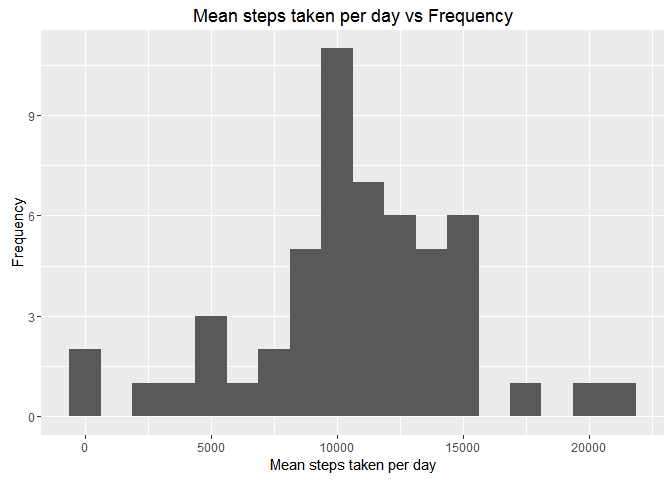
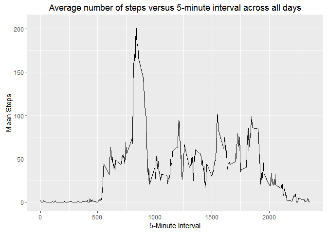
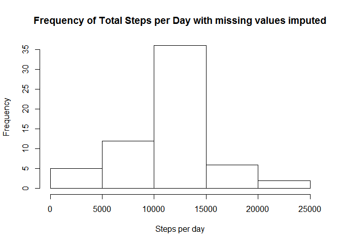
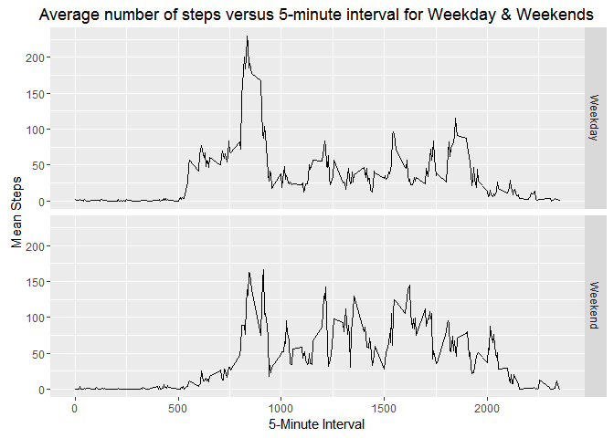

# Reproducible Research: Peer Assessment 1

#Loading and preprocessing the data


```r
setwd("H:/Documents/GitHub/RepData_PeerAssessment1")
df<-read.csv("activity/activity.csv")
```

#What is mean total number of steps taken per day?

###Histogram Plot - Total number of steps taken per day.

```r
library(ggplot2)
library(dplyr)
```

```
## 
## Attaching package: 'dplyr'
```

```
## The following objects are masked from 'package:stats':
## 
##     filter, lag
```

```
## The following objects are masked from 'package:base':
## 
##     intersect, setdiff, setequal, union
```

```r
#Creates aggregate dataset of date vs summed step count
totSteps<-aggregate(steps ~ date,df,sum, na.rm=TRUE)
ggplot(data=totSteps, aes(totSteps$steps))+geom_histogram(binwidth=1250)+xlab("Mean steps taken per day")+ylab("Frequency")+ggtitle("Mean steps taken per day vs Frequency")
```

<!-- -->

###Mean and Median of Total Steps taken

```r
stepsMean<-as.integer(mean(as.numeric(totSteps$steps)))
stepsMedian<-median(totSteps$steps)
```

-Mean number of total steps taken per day is 10766.

-Median number of total steps taken per day is 10765.

#What is the average daily activity pattern?

###Time Series Plot - Mean number of steps taken per day 

```r
#Creates aggregate dataset based on 5-minute interval vs mean step counts. Then plots time series
meanSteps<- aggregate(steps ~ interval,df,mean,na.rm=TRUE)
ggplot(data=meanSteps,mapping=aes(x=meanSteps$interval,y=meanSteps$steps))+geom_line()+xlab("5-Minute Interval")+ylab("Mean Steps")+ggtitle("Average number of steps versus 5-minute interval across all days")
```

<!-- -->

###Maximum value of Mean Steps averaged against all days over 5-minute interval

```r
stepMax<-max(meanSteps$steps)
```

-The maximum value of the Mean Steps averaged against all days over 5-minute interval is 206.1698113.

#Imputing missing values

###Count of missing Step values

```r
countNA<- sum(is.na(df$steps))
```

-Number of missing step values is 2304.

###Imputation of missing values using mean step value of the day

```r
#Creates a table with averaged step values for each 5-minute interval
meanSteps<- aggregate(steps ~ interval,df,mean,na.rm=TRUE)
#Creates a copy of the originally loaded dataset
imputeDS<-df
#iterates through all the observations. if steps is missing, it'll replace it with an averaged copy of steps for that 5-minute interval from meanSteps. It also creates a flag variable to indicate where a replacement has occured.
for (i in 1:length(imputeDS$steps))
    if (is.na(imputeDS$steps[i]) == TRUE) 
    {
      imputeDS$steps[i] = meanSteps$steps[which (meanSteps$interval == imputeDS$interval[i])]
      imputeDS$flag[i] = 1
    } else
    {
      imputeDS$flag[i] = 0
    }

#Checks to see if the number of those with true flag variable is equal to the countNA length (i.e. number of those replaced equals those actually missing)
if (sum(select(filter(imputeDS,flag==1),flag)) == countNA)
  {
    check = TRUE
  }
```


```r
countNA<- sum(is.na(imputeDS$steps))
```

-Number of missing step values after imputation is 0.

###Imputed Histogram Plot - Total number of steps taken per day

```r
totStepsImpute<-aggregate(steps ~ date,imputeDS,sum, na.rm=TRUE)
totStepsImpute<-setNames(totStepsImpute, c("Date","Steps"))
hist(totStepsImpute$Steps,xlab="Steps per day",main="Frequency of Total Steps per Day with missing values imputed")
```

<!-- -->

###Imputed Mean and Median of Total Steps taken

```r
#Creates mean & median variables from above created aggregate dataset
stepsMean<-as.integer(mean(as.numeric(totSteps$steps)))
stepsMedian<-median(totSteps$steps)
```

-Mean number of total steps taken per day is 10766 after imputing missing answers.

-Median number of total steps taken per day is 10765 after imputing missing answers.

#Are there differences in activity patterns between weekdays and weekends?

###Creating weekday & weekend indication variables

```r
imputeDS_day<-imputeDS

#Coerces date variable from factor to date type
imputeDS_day$date<-as.Date(imputeDS_day$date)
imputeDS_day<-mutate(imputeDS_day,day = weekdays(date))

#Creates conditional variables with two levels
imputeDS_day<- mutate(imputeDS_day, dayType=ifelse(imputeDS_day$day == "Monday" | imputeDS_day$day == "Tuesday" | imputeDS_day$day == "Wednesday" | imputeDS_day$day == "Thursday" | imputeDS_day$day == "Friday","Weekday","Weekend"))

#Takes mean across 5-minuter interval for weekdays and weekends
imputeDS_dayAgg<- aggregate(steps ~ interval + dayType, imputeDS_day, mean)
```

### Creating time series plots of 5-minute interval vs mean steps for each level of dayType variable.

```r
ggplot(data=imputeDS_dayAgg,mapping=aes(x=imputeDS_dayAgg$interval,y=imputeDS_dayAgg$steps))+geom_line()+xlab("5-Minute Interval")+ylab("Mean Steps")+ggtitle("Average number of steps versus 5-minute interval for Weekday & Weekends") + facet_grid(dayType~.)
```

<!-- -->
