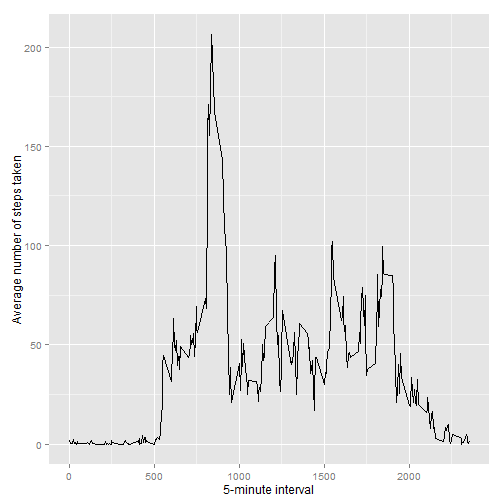
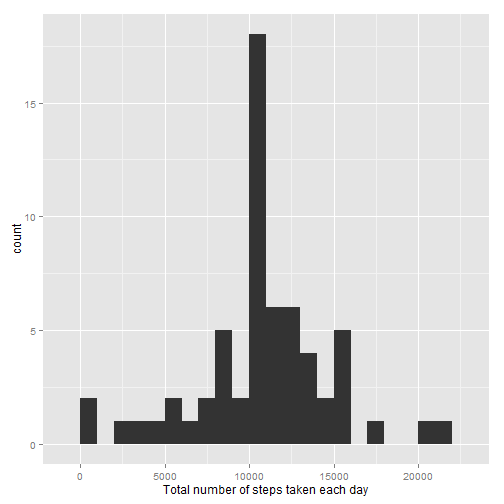
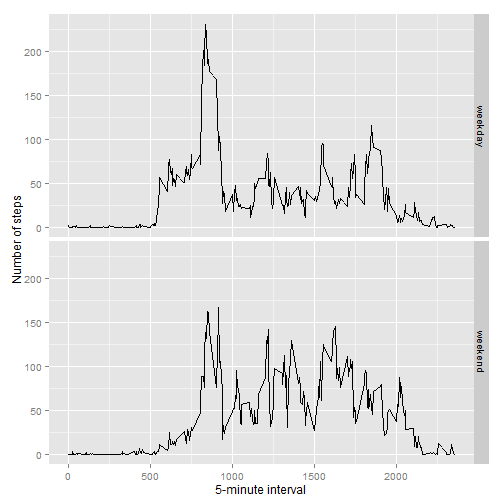

# Reproducible Research: Peer Assessment 1

## Loading and preprocessing the data


```r
data_table <- read.csv("activity.csv")
```

## What is mean total number of steps taken per day?

```r
library(ggplot2)
total.steps <- tapply(data_table$steps, data_table$date, FUN=sum, na.rm=TRUE)
qplot(total.steps, binwidth=1000, xlab="Total number of steps taken each day")
```

 

```r
mean(total.steps, na.rm=TRUE)
```

```
## [1] 9354.23
```

```r
median(total.steps, na.rm=TRUE)
```

```
## [1] 10395
```

## What is the average daily activity pattern?

```r
averages <- aggregate(x=list(steps=data_table$steps),
                      by=list(interval=data_table$interval), FUN=mean, na.rm=TRUE)
ggplot(data=averages, aes(x=interval, y=steps)) + geom_line() + xlab("5-minute interval") + ylab("Average number of steps taken")
```

 

Which 5-minute interval, on average across all the days in the data set, contains the maximum number of steps?


```r
averages[which.max(averages$steps), ]
```

```
##     interval    steps
## 104      835 206.1698
```

## Imputing missing values

First, number of missing values is counted


```r
missing <- is.na(data_table$steps)
# How many missing
table(missing)
```

```
## missing
## FALSE  TRUE 
## 15264  2304
```

Next, all the missing values are filled with mean value for that 5-minute interval.


```r
# Replace each missing value with the mean value of its 5-minute interval
fill.value <- function(steps, interval) {
    filled <- NA
    if (!is.na(steps))
        filled <- c(steps)
    else
        filled <- (averages[averages$interval==interval, "steps"])
    return(filled)
}
filled.data <- data_table
filled.data$steps <- mapply(fill.value, filled.data$steps, filled.data$interval)
```

Finally, a histogram is made using filled data set; mean and median total number of steps per day is calculated and reported.


```r
total.steps <- tapply(filled.data$steps, filled.data$date, FUN=sum)
qplot(total.steps, binwidth=1000, xlab="Total number of steps taken each day")
```

 

```r
mean(total.steps)
```

```
## [1] 10766.19
```

```r
median(total.steps)
```

```
## [1] 10766.19
```

Mean and median values are higher after imputing missing data. In the original data set, there are some days with `steps` values `NA` for any `interval`. The total number of steps taken in such days are set to zero(0) by default. However, after replacing missing `steps` values with the mean `steps` of associated `interval` value, these zero values are removed from the histogram of total number of steps taken each day.

## Are there differences in activity patterns between weekdays and weekends?

First, we need to find the day of week for each measurement in the dataset. In
this part, the dataset is used with the filled-in values.


```r
weekday.or.weekend <- function(date) {
    day <- weekdays(date)
    if (day %in% c("Monday", "Tuesday", "Wednesday", "Thursday", "Friday"))
        return("weekday")
    else if (day %in% c("Saturday", "Sunday"))
        return("weekend")
    else
        stop("invalid date")
}
filled.data$date <- as.Date(filled.data$date)
filled.data$day <- sapply(filled.data$date, FUN=weekday.or.weekend)
```

A panel plot is made containing plots of average number of steps taken on weekdays and weekends.


```r
averages <- aggregate(steps ~ interval + day, data=filled.data, mean)
ggplot(averages, aes(interval, steps)) + geom_line() + facet_grid(day ~ .) +
    xlab("5-minute interval") + ylab("Number of steps")
```

 

