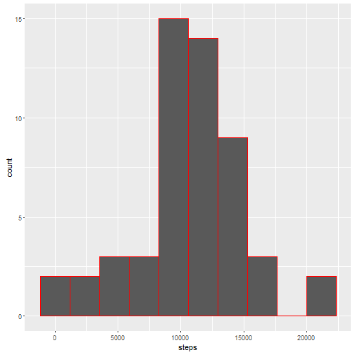
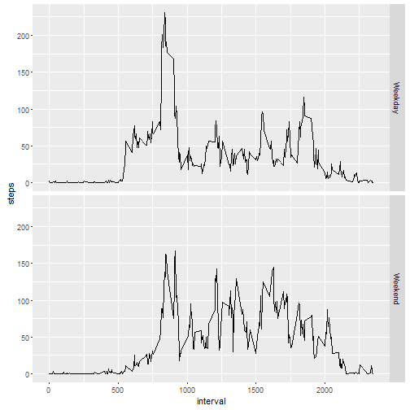

#Analysis of activity.csv Data

###Assignment 1

We start, as we often do, by downloading and loading the data.  The file is rather small, but, since we are doing the same assignment, I prefer to check if the file exists to save time. 


```r
if(!file.exists("activity.csv")){
  fileUrl<-"https://d396qusza40orc.cloudfront.net/repdata%2Fdata%2Factivity.zip"
  download.file(fileUrl,"Bugs.zip")
  unzip("Bugs.zip")
  unlink("Bugs.zip")
}
activity<-read.csv("activity.csv")
library("ggplot2")
```
###Assignment 2 
is to provide a histogram for the number of steps taken per day so Assignment 2a is to calculate the steps taken perday:

```r
steps_per_Day<-data.frame(date=unique(activity$date),
    steps=tapply(activity$steps,activity$date,sum))
```
I looked at the above function with na.rm=TRUE.  I did not lose any data/all of the days that reported NA reported 0 when the above was added to the function.

and assignment 2b is to make the histogram

```r
g<-ggplot(steps_per_Day,aes(steps))
g+geom_histogram(color="red",bins=10)
```

```
## Warning: Removed 8 rows containing non-finite values (stat_bin).
```



### Assignment 3 
is to calculate and report steps per day.  summmary() will do that nicely

```r
summary(steps_per_Day)
```

```
##          date        steps      
##  2012-10-01: 1   Min.   :   41  
##  2012-10-02: 1   1st Qu.: 8841  
##  2012-10-03: 1   Median :10765  
##  2012-10-04: 1   Mean   :10766  
##  2012-10-05: 1   3rd Qu.:13294  
##  2012-10-06: 1   Max.   :21194  
##  (Other)   :55   NA's   :8
```
and give us some extra information to boot

### Assignment 4
is to find the average daily pattern.  I constructed this pattern this way

```r
steps_per_interval.m<-data.frame(interval=unique(activity$interval),
      steps=tapply(activity$steps,activity$interval,mean,na.rm=TRUE))
```
and plotted it this way:

```r
g<-ggplot(steps_per_interval.m,aes(interval,steps))
g+geom_line()
```


###Assignment 5
The 5-minute interval, on average across all the days in the dataset, contains the maximum number of step is below


```r
steps_per_interval.m[steps_per_interval.m$steps==max(steps_per_interval.m$steps),1]
```

```
## [1] 835
```
###Assignment 6
A.  The summary in Assignment 3 reported that there were 8 entries missing.
B.  Each missing value for NA can be given the average value of steps_per_interval.m  This can be accomplished with:
c. I run this:

```r
activity1<-activity[is.na(activity$steps),3]
activity[is.na(activity$steps),1]<-sapply(activity1,function(y) 
     steps_per_interval.m[steps_per_interval.m$interval==y,2])
```
D. Then I re-run some previously named code

update steps per day

```r
steps_per_Day<-data.frame(date=unique(activity$date),
    steps=tapply(activity$steps,activity$date,sum))
```
plot Histogram

```r
g<-ggplot(steps_per_Day,aes(steps))
g+geom_histogram(color="red",bins=10)
```


run summary

```r
summary(steps_per_Day)
```

```
##          date        steps      
##  2012-10-01: 1   Min.   :   41  
##  2012-10-02: 1   1st Qu.: 9819  
##  2012-10-03: 1   Median :10766  
##  2012-10-04: 1   Mean   :10766  
##  2012-10-05: 1   3rd Qu.:12811  
##  2012-10-06: 1   Max.   :21194  
##  (Other)   :55
```
### Assignment 7
is done in step 6D above

### Assignment 8
A.Create a new factor variable in the dataset with two levels - "weekday" and "weekend" indicating whether a given date is a weekday or weekend day.

```r
activity$weekend<-weekdays(as.Date(activity$date),abbreviate=TRUE)%in% c("Sat","Sun")
activity$weekend<-as.factor(activity$weekend)
```
B.Make a panel plot containing a time series plot...
I can't wait to see the other people's stuff to see the right way to do this, because I am not sure this is it

```r
x<-split(activity,activity$weekend)
steps_per_interval1.m<-data.frame(interval=unique(x[[1]]$interval),
    steps=tapply(x[[1]]$steps,x[[1]]$interval,mean,na.rm=TRUE),weekend="Weekday")
steps_per_interval2.m<-data.frame(interval=unique(x[[2]]$interval),
    steps=tapply(x[[2]]$steps,x[[2]]$interval,mean,na.rm=TRUE),weekend="Weekend")
y<-rbind(steps_per_interval1.m,steps_per_interval2.m)
```
Nasty, right?
Here is the plot

```r
g<-ggplot(y,aes(interval,steps))
g+geom_line()+facet_grid(weekend~.)
```


