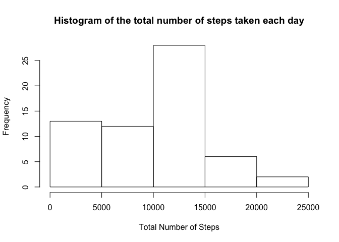
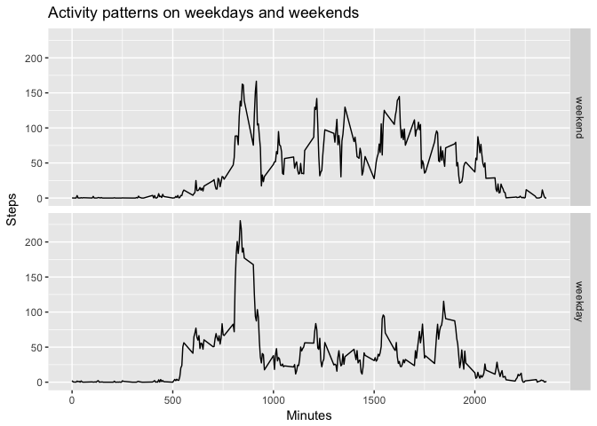

## Loading and preprocessing the data

Reading in the data.


```r
data<-read.csv("activity.csv",header=TRUE)
```

## What is mean total number of steps taken per day?

To answer this question we will first calculate the total number of steps taken per day.


```r
tot_step<-tapply(data$steps,data$date,sum,na.rm=TRUE)
```

We will then display a histogram of the total number of steps taken each day.


```r
hist(tot_step,main="Histogram of the total number of steps taken each day",xlab="Total Number of Steps")
```

<!-- -->

Finally, we will calculate the mean and median of the total number of steps taken per day.


```r
mean(tot_step,rm.na=TRUE)
```

```
## [1] 9354.23
```

```r
median(tot_step,rm.na=TRUE)
```

```
## [1] 10395
```

## What is the average daily activity pattern?

First we will calculate the average number of steps taken for each interval averaged across all days.


```r
av_steps<-tapply(data$steps,data$interval,mean,na.rm=TRUE)
```

Then we will create a time series plot of the 5-minute intervals and the average number of steps taken, averaged across all days. 


```r
plot(levels(as.factor(data$interval)),av_steps, type= "l",main="Daily Activity Pattern",xlab='Minutes',ylab="Steps")
```

<!-- -->

Find the 5-minute interval which contains the maximum number of steps on average accross all days. 

```r
which.max(av_steps)
```

```
## 835 
## 104
```

## Imputing Missing Values 

Count the number of missing values in the dataset.


```r
sum(is.na(data$steps))
```

```
## [1] 2304
```

Fill in the missing values with the corresponding 5-minute interval mean and create a new dataset that is equal to the original dataset but with the missing data filled in.


```r
data2<-data
k = 0
for(i in data2$steps){
  k = k+1
  if(is.na(data2$steps[k])=="TRUE"){
    current_interval = data2$interval[k]
    data2$steps[k]= av_steps[[as.character(current_interval)]]
  }
}
```

Calculate the total number of steps taken per day.


```r
tot_step2<-tapply(data2$steps,data2$date,sum)
```

Make a histogram of the total number of steps taken each day


```r
hist(tot_step2,main="Histogram of the total number of steps taken each day",xlab="Total Number of Steps")
```

<!-- -->

Calculate and report the mean and median total number of steps taken per day.


```r
mean(tot_step2)
```

```
## [1] 10766.19
```

```r
median(tot_step2)
```

```
## [1] 10766.19
```

As expected since we ignored the missing values in the beginning of the assignment, the total, mean and median steps values for each day differ when replacing the missing values with the mean. We get a lot less values between 0 and 10 000 and the distribution we get resembles more that of a normal distribution. This allows to highlight the fact that most days, 10 000 to 15 000 steps are taken. This is also the result we get back from the new mean and median calculation which no longer differ. 

## Are there differences in activity patterns between weekdays and weekends?

In order to answer this question we will first create a new factor variable in the dataset with two levels: "weekday" and "weekend".


```r
weekdays<-c("Monday","Tuesday","Wednesday","Thursday","Friday")
week<-factor((weekdays(as.Date(data2$date)) %in% weekdays),levels=c(FALSE,TRUE),labels=c("weekend","weekday"))
```

```
## Warning in strptime(xx, f <- "%Y-%m-%d", tz = "GMT"): unknown timezone
## 'zone/tz/2017c.1.0/zoneinfo/Europe/Zurich'
```

```r
data2<-cbind(data2,week)
```

Then we will create a time series plot of the 5-minute intervals and the average number of steps taken, averaged across all days. 


```r
library(ggplot2)
ggplot(data2,aes(interval,steps))+facet_grid(week~.)+stat_summary(fun.y=mean,geom="line")+labs(title="Activity patterns on weekdays and weekends",x="Minutes",y="Steps")
```

<!-- -->
