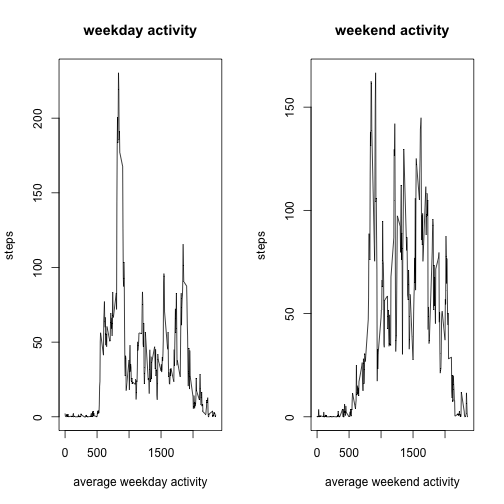

This is an R Markdown document created to present my analysis of the activity monitoring data.

Load the data and transfor into dataframe:


```r
activity<-read.csv("activity.csv")
activity<-data.frame(activity)
```

What is mean total number of steps taken per day?

For this question, I calculated the average number of steps taken per day and make a histogram for the result.


```r
stepsperday<-data.frame(tapply(activity$steps, activity$date, sum))
colnames(stepsperday)<-"Steps Per Day"
hist(stepsperday$`Steps Per Day`, main="Steps per day", xlab="Steps")
```

 

Mean of steps taken per day:


```r
meanstepsperday<-mean(stepsperday$`Steps Per Day`, na.rm = T)
meanstepsperday
```

```
## [1] 10766.19
```

Median of steps taken per day:


```r
medianstepsperday<-median(stepsperday$`Steps Per Day`, na.rm = T)
medianstepsperday
```

```
## [1] 10765
```

What is the average daily activity pattern?

I calculated the steps taken per 5-minute interval averaged acroos days. An extra column is added to spedify intervals.


```r
averagedailyactivity<-data.frame(tapply(activity$steps, activity$interval, mean, na.rm=T))
averagedailyactivity<-cbind(averagedailyactivity, activity[1:288, 3])
```

A plot is calculated as belows:


```r
plot(averagedailyactivity$`activity[1:288, 3]`, averagedailyactivity$tapply.activity.steps..activity.interval..mean..na.rm...T., type="l", main="Average Daily Activity", xlab="5-minute interval", ylab="steps")
```

 

The interval contaning the max steps is:


```r
max<-max(averagedailyactivity$tapply.activity.steps..activity.interval..mean..na.rm...T.)
averagedailyactivity[averagedailyactivity==max, 2]
```

```
## [1] 835
```

Imputing missing values

Number of total missing values is:


```r
n<-0
for (i in 1: nrow(activity)) {
     if (is.na(activity[i, 1]) ==TRUE) n<-n+1
}
n
```

```
## [1] 2304
```

Missing values are filled as the mean steps taken for the 5-minute interval.


```r
for (i in 1: nrow(activity)) {
        if (is.na(activity[i, 1]) ==TRUE)  {
                intervalnumber<-activity[i, 3]
                activity[i, 1]<-averagedailyactivity$tapply.activity.steps..activity.interval..mean..na.rm...T.[averagedailyactivity$`activity[1:288, 3]`==intervalnumber]
        }
}
```

Steps taken per day are recalculated and plot rebuilt:


```r
stepsperday<-data.frame(tapply(activity$steps, activity$date, sum))
colnames(stepsperday)<-"Steps Per Day"
hist(stepsperday$`Steps Per Day`, main="Steps per day", xlab="Steps")
```

 

The new mean steps taken per day:


```r
meanstepsperday2<-mean(stepsperday$`Steps Per Day`)
meanstepsperday2
```

```
## [1] 10766.19
```

The new median steps taken per day:


```r
medianstepsperday2<-median(stepsperday$`Steps Per Day`)
medianstepsperday2
```

```
## [1] 10766.19
```

Are there differences in activity patterns between weekdays and weekends?

I installed and loaded a new package to categorize weekdays and weekends.


```r
library(timeDate)
```

Added a new column to show weekday or weekend.


```r
activity$date<-as.Date(activity$date)
for (i in 1: nrow(activity)) {
        if (isWeekday(activity[i, 2]) ==TRUE) activity[i, 4]<-"weekday"
        else if (isWeekday(activity[i, 2])==FALSE)  activity[i, 4]<-"weekend"
}
```

I chose weekday activity and made a separate data frame


```r
weekdayactivity<-activity[which(activity$V4=="weekday"), ]
averageweekdayactivity<-data.frame(tapply(weekdayactivity$steps, weekdayactivity$interval, mean))
averageweekdayactivity<-cbind(averageweekdayactivity, activity[1:288, 3])
```

Weekend activity data is made:


```r
weekendactivity<-activity[which(activity$V4=="weekend"), ]
averageweekendactivity<-data.frame(tapply(weekendactivity$steps, weekendactivity$interval, mean))
averageweekendactivity<-cbind(averageweekendactivity, activity[1:288, 3])
```

Finally, a panel of plots is made:


```r
par(mfrow=c(1, 2))
plot(averageweekdayactivity$`activity[1:288, 3]`, averageweekdayactivity$tapply.weekdayactivity.steps..weekdayactivity.interval..mean., type="l", main="weekday activity", xlab="average weekday activity", ylab="steps")
plot(averageweekendactivity$`activity[1:288, 3]`, averageweekendactivity$tapply.weekendactivity.steps..weekendactivity.interval..mean., type="l", main="weekend activity", xlab="average weekend activity", ylab="steps")
```

 

knit2html()
