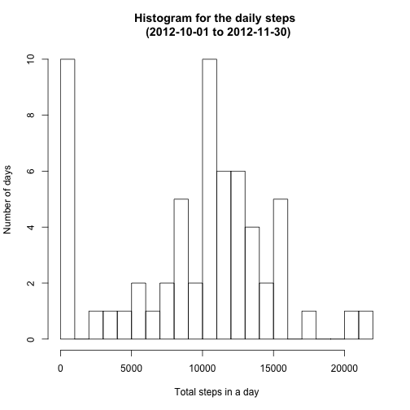
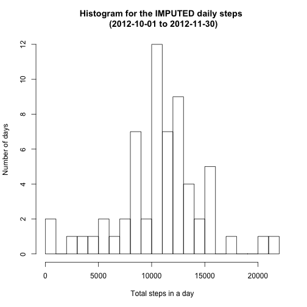
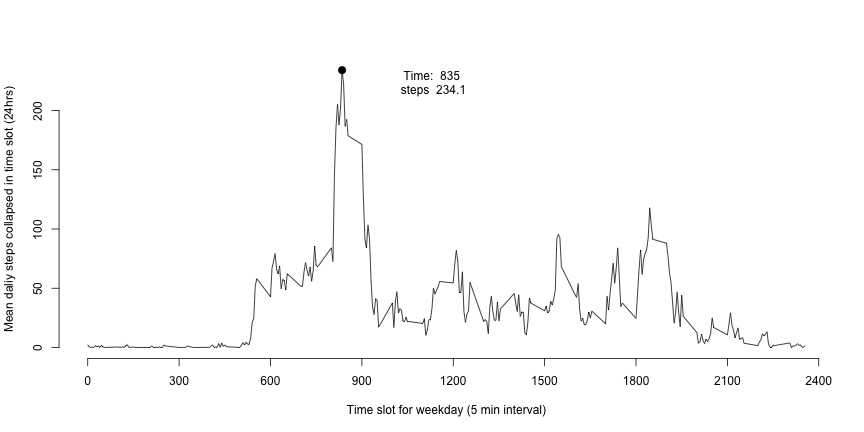
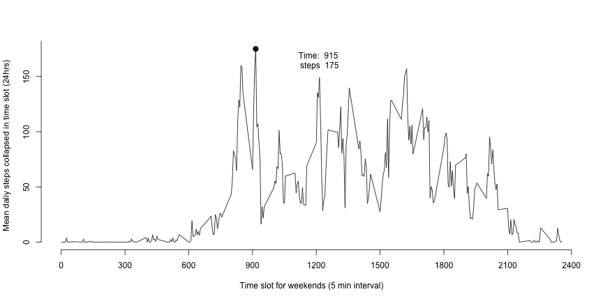
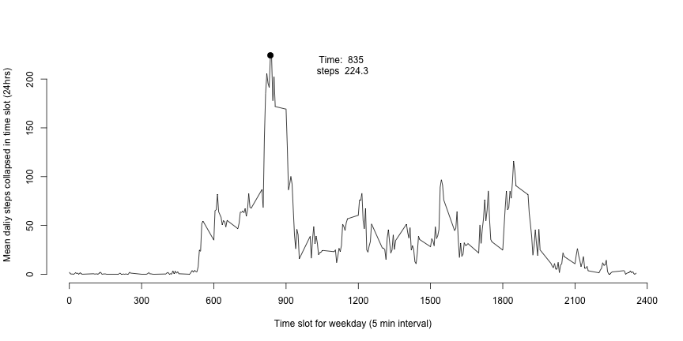
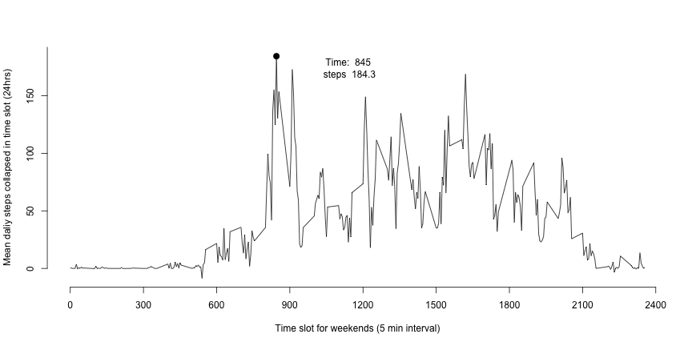

### Author: *Fred Zhou* 

## Loading and preprocessing the data

```r
data=read.table('activity.csv',sep=',',stringsAsFactors=T,header=T)
```

## What is mean total number of steps taken per day?
### Histogram for the daily steps

```r
sum_steps=tapply(data$steps, data$date, function(x) sum(x,na.rm=T))
hist(sum_steps,breaks=30,main='Histogram for the daily steps \n (2012-10-01 to 2012-11-30)',xlab='Total steps in a day',ylab='Number of days')
```

 

### Table for the mean and median total number of steps taken per day


```r
library(xtable)
mean_dailysteps=mean(sum_steps,na.rm=T)
median_dailysteps=median(sum_steps,na.rm=T)
table=matrix(c(mean_dailysteps,median_dailysteps),ncol=1)
colnames(table)='Value'
rownames(table)=c('Mean_steps_per_day','Median_steps_per_day')
print(paste('The mean value for the daliy steps is ',mean_dailysteps,', and the median value is',median_dailysteps))
```

[1] "The mean value for the daliy steps is  9354.22950819672 , and the median value is 10395"

```r
print(xtable(table, digits=2),type='html')
```

<!-- html table generated in R 3.1.0 by xtable 1.7-4 package -->
<!-- Mon Oct 12 19:33:24 2015 -->
<table border=1>
<tr> <th>  </th> <th> Value </th>  </tr>
  <tr> <td align="right"> Mean_steps_per_day </td> <td align="right"> 9354.23 </td> </tr>
  <tr> <td align="right"> Median_steps_per_day </td> <td align="right"> 10395.00 </td> </tr>
   </table>

## What is the average daily activity pattern?
### Plot

```r
pattern=tapply(data$steps,data$interval,function(x) mean(x,na.rm=T))
time_slot=as.numeric(names(pattern))
plot(time_slot,pattern,type='l',xlab='Time slot for a day (5 min interval)',ylab='Mean daliy steps collapsed in time slot (24hrs)',axes=FALSE)
axis(side=1, at=seq(0, 2400, by=300))
axis(side=2, at=seq(0, 200, by=50))
max_step=round(max(pattern),digits=1);max_index=which(pattern==max(pattern),pattern)
points(time_slot[max_index],max_step,cex=2,'blue',pch=20)
text(time_slot[max_index]+300,max_step-10,labels=paste('Time: ',time_slot[max_index],'\nsteps ',max_step),cex=1)
```

 
### Summary

```r
print(paste('For the average daily activity pattern, the peak activity happeds around   ',time_slot[max_index],', with the value of   ',max_step))
```

[1] "For the average daily activity pattern, the peak activity happeds around    835 , with the value of    206.2"

## Imputing missing values
### No. of Missing values

```r
NA_sum=sum(sum(is.na(data)))
print(paste('The Numbers of NA equals to ',NA_sum))
```

[1] "The Numbers of NA equals to  2304"
### Imputation
For the imputation, use the known interval data to make predictions.

```r
impu_data=data
time_list=unique(data[,3])
for (time_slot in time_list)
{
means=mean(impu_data[(!is.na(impu_data[,1])) & impu_data[,3]==time_slot,1])
sd=sd(impu_data[(!is.na(impu_data[,1])) & impu_data[,3]==time_slot,1])
impu_data[is.na(impu_data[,1]) &impu_data[,3]==time_slot,1]=means+sd*scale(rnorm(dim(impu_data[is.na(impu_data[,1]) & impu_data[,3]==time_slot,])[1]))
}
```
###Estimiation of mean and median of imputed data
Histogram 

```r
sum_steps_imputed=tapply(impu_data$steps, impu_data$date, function(x) sum(x,na.rm=T))
hist(sum_steps_imputed,breaks=30,main='Histogram for the IMPUTED daily steps \n (2012-10-01 to 2012-11-30)',xlab='Total steps in a day',ylab='Number of days')
```

 

Table


```r
library(xtable)
mean_dailysteps_imputed=mean(sum_steps_imputed,na.rm=T)
median_dailysteps_imputed=median(sum_steps_imputed,na.rm=T)
table_imputed=matrix(c(mean_dailysteps,median_dailysteps,mean_dailysteps_imputed,median_dailysteps_imputed),ncol=2)
colnames(table_imputed)=c('Value_obtained_from_imputed_set','Value_obtained_from_original_set')
rownames(table_imputed)=c('Mean_steps_per_day','Median_steps_per_day')

print(paste('The IMPUTED mean value for the daliy steps is ',mean_dailysteps_imputed,', and the IMPUTED median value is',median_dailysteps_imputed))
```

[1] "The IMPUTED mean value for the daliy steps is  10766.1886792453 , and the IMPUTED median value is 10802.0959483659"

```r
print(xtable(table_imputed, digits=2),type='html')
```

<!-- html table generated in R 3.1.0 by xtable 1.7-4 package -->
<!-- Mon Oct 12 19:33:26 2015 -->
<table border=1>
<tr> <th>  </th> <th> Value_obtained_from_imputed_set </th> <th> Value_obtained_from_original_set </th>  </tr>
  <tr> <td align="right"> Mean_steps_per_day </td> <td align="right"> 9354.23 </td> <td align="right"> 10766.19 </td> </tr>
  <tr> <td align="right"> Median_steps_per_day </td> <td align="right"> 10395.00 </td> <td align="right"> 10802.10 </td> </tr>
   </table>

```r
print('The Imputation makes the median more close to the mean value thus reduce the varations')
```

[1] "The Imputation makes the median more close to the mean value thus reduce the varations"


## Are there differences in activity patterns between weekdays and weekends?
Compare pattern based on imputated/raw dataset
Appened the factor of weekdays


```r
weekdays_list=c('Monday', 'Tuesday', 'Wednesday', 'Thursday', 'Friday')
impu_data$weekday=(weekdays(as.Date(impu_data$date)) %in% weekdays_list)
data$weekday=(weekdays(as.Date(impu_data$date)) %in% weekdays_list)
```

### Pattern in WEEKDAYS (Raw)


```r
weekday_data=data[impu_data$weekday,]
pattern=tapply(weekday_data$steps,weekday_data$interval,function(x) mean(x,na.rm=T))
time_slot=as.numeric(names(pattern))
plot(time_slot,pattern,type='l',xlab='Time slot for weekday (5 min interval)',ylab='Mean daliy steps collapsed in time slot (24hrs)',axes=FALSE)
axis(side=1, at=seq(0, 2400, by=300))
axis(side=2, at=seq(0, 200, by=50))
max_step=round(max(pattern),digits=1);max_index=which(pattern==max(pattern),pattern)
points(time_slot[max_index],max_step,cex=2,'blue',pch=20)
text(time_slot[max_index]+300,max_step-10,labels=paste('Time: ',time_slot[max_index],'\nsteps ',max_step),cex=1)
```

 

### Pattern in WEEKENDS (Raw)


```r
weekend_data=data[!impu_data$weekday,]
pattern=tapply(weekend_data$steps,weekend_data$interval,function(x) mean(x,na.rm=T))
time_slot=as.numeric(names(pattern))
plot(time_slot,pattern,type='l',xlab='Time slot for weekends (5 min interval)',ylab='Mean daliy steps collapsed in time slot (24hrs)',axes=FALSE)
axis(side=1, at=seq(0, 2400, by=300))
axis(side=2, at=seq(0, 200, by=50))
max_step=round(max(pattern),digits=1);max_index=which(pattern==max(pattern),pattern)
points(time_slot[max_index],max_step,cex=2,'blue',pch=20)
text(time_slot[max_index]+300,max_step-10,labels=paste('Time: ',time_slot[max_index],'\nsteps ',max_step),cex=1)
```

 

### Pattern in WEEKDAYS (Imputed)


```r
weekday_data=impu_data[impu_data$weekday,]
pattern=tapply(weekday_data$steps,weekday_data$interval,function(x) mean(x,na.rm=T))
time_slot=as.numeric(names(pattern))
plot(time_slot,pattern,type='l',xlab='Time slot for weekday (5 min interval)',ylab='Mean daliy steps collapsed in time slot (24hrs)',axes=FALSE)
axis(side=1, at=seq(0, 2400, by=300))
axis(side=2, at=seq(0, 200, by=50))
max_step=round(max(pattern),digits=1);max_index=which(pattern==max(pattern),pattern)
points(time_slot[max_index],max_step,cex=2,'blue',pch=20)
text(time_slot[max_index]+300,max_step-10,labels=paste('Time: ',time_slot[max_index],'\nsteps ',max_step),cex=1)
```

 

### Pattern in WEEKENDS (Imputed)


```r
weekend_data=impu_data[!impu_data$weekday,]
pattern=tapply(weekend_data$steps,weekend_data$interval,function(x) mean(x,na.rm=T))
time_slot=as.numeric(names(pattern))
plot(time_slot,pattern,type='l',xlab='Time slot for weekends (5 min interval)',ylab='Mean daliy steps collapsed in time slot (24hrs)',axes=FALSE)
axis(side=1, at=seq(0, 2400, by=300))
axis(side=2, at=seq(0, 200, by=50))
max_step=round(max(pattern),digits=1);max_index=which(pattern==max(pattern),pattern)
points(time_slot[max_index],max_step,cex=2,'blue',pch=20)
text(time_slot[max_index]+300,max_step-10,labels=paste('Time: ',time_slot[max_index],'\nsteps ',max_step),cex=1)
```

 


