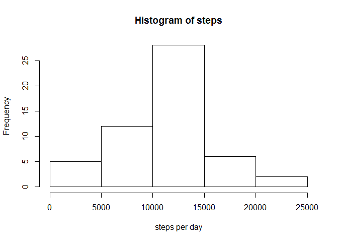
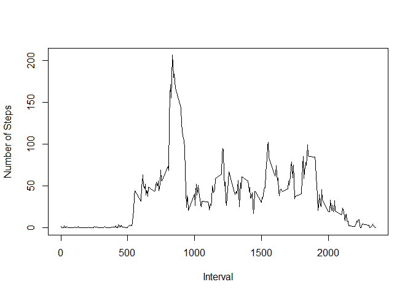
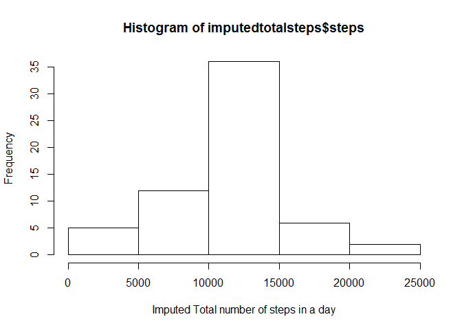
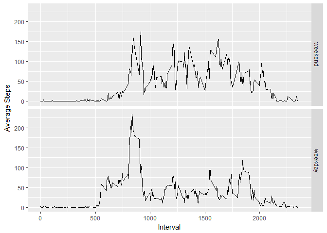

# Reproducible Research: Peer Assessment 1
## Loading and preprocessing the data


```r
download.file("https://github.com/AkthemRehab/RepData_PeerAssessment1/raw/master/activity.zip","activity2.zip")
datedownloaded<-date()
readfile<-read.csv(unz("activity2.zip","activity.csv"),na.strings = "NA")
readfile$date<-as.Date(readfile$date)
```

## What is mean total number of steps taken per day?

```r
totalsteps <- aggregate(steps~date,data = readfile,sum,na.rm=TRUE)
with(totalsteps,hist(steps,xlab = "steps per day"))
```

<!-- -->

```r
dev.off()
```

```
## null device 
##           1
```

```r
stepsmean <- round(mean(totalsteps$steps),digits = 0)
stepsmedian <- round(median(totalsteps$steps),digits = 0)
```
The mean of the total number of steps is 1.0766\times 10^{4} while the median is equal to 1.0765\times 10^{4}.

## What is the average daily activity pattern?

```r
aveactivity <- aggregate(steps~interval,data = readfile,mean)
maxsteps<-aveactivity[which.max(aveactivity$steps), ]
plot(aveactivity$interval,aveactivity$steps, type = "l",xlab = "Interval", ylab = "Number of Steps")
```

<!-- -->

```r
dev.off()
```

```
## null device 
##           1
```

The maximum average steps are 206 steps that occur at the interval 835

## Imputing missing values

```r
totalnas<-sum(is.na(readfile$steps))
```
The number of missing values in the data set is equal to 2304.

###Strategy for filling missing values
- The straregy used is filling the missing values with the equivelant mean of that interval.

```r
# in here we create the new data set and fill the NAs with the mean of the equivelant interval as per the strategy.
imputedreadfile <- readfile

for (i in 1:nrow(readfile)){
        interval <-imputedreadfile$interval[i]
        if (is.na(imputedreadfile$steps[i])){
              imputedreadfile$steps[i] <- aveactivity$steps[aveactivity$interval==interval]
      }
}
```
Complete cases check:

```r
sum(complete.cases(readfile))
```

```
## [1] 15264
```

```r
sum(complete.cases(imputedreadfile))
```

```
## [1] 17568
```
Make a histogram of the total number of steps taken each day and Calculate and report the mean and median total number of steps taken per day. Do these values differ from the estimates from the first part of the assignment? What is the impact of imputing missing data on the estimates of the total daily number of steps?


```r
imputedtotalsteps<-aggregate(steps~date,data = imputedreadfile,sum,na.rm=TRUE)
hist(imputedtotalsteps$steps, xlab="Imputed Total number of steps in a day")
```

<!-- -->
New mean and median are calculated below:

```r
imputedstepsmean<-round(mean(imputedtotalsteps$steps),digits = 0)
imputedstepsmedian<-round(median(imputedtotalsteps$steps),digits = 0)
imputedstepsmean - stepsmean
```

```
## [1] 0
```

```r
imputedstepsmedian - stepsmedian
```

```
## [1] 1
```
From the above, you can notice that filling the NAs with the interval mean did not affect the mean nor the median of the total steps.
## Are there differences in activity patterns between weekdays and weekends?

```r
readfile$date<-as.Date(readfile$date)
library(timeDate)
readfile$wkday<-factor(isWeekday(readfile$date),levels=c(FALSE, TRUE), labels=c('weekend', 'weekday'))
```
Here is the histogram:

```r
library(ggplot2)
intervalaggregate<-aggregate(steps~(wkday+interval),readfile,FUN = mean,na.rm=TRUE)
ggplot(intervalaggregate,aes(interval,steps)) + facet_grid(wkday~.) + geom_line() + xlab("Interval") + ylab("Average Steps")
```

<!-- -->
