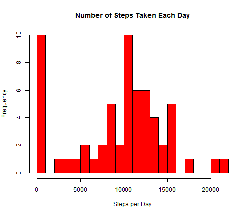
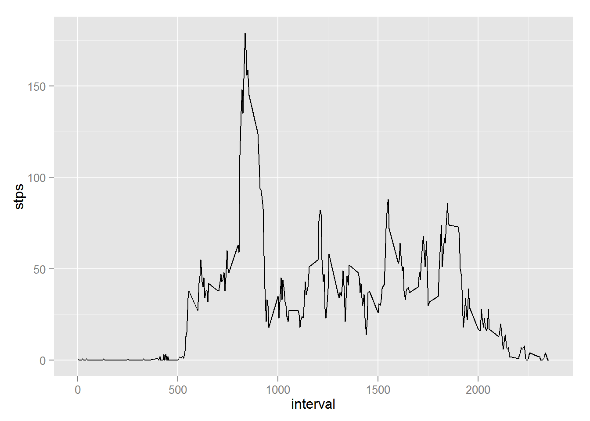
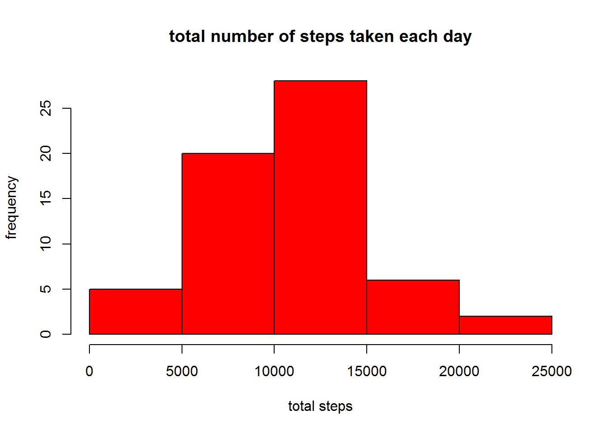
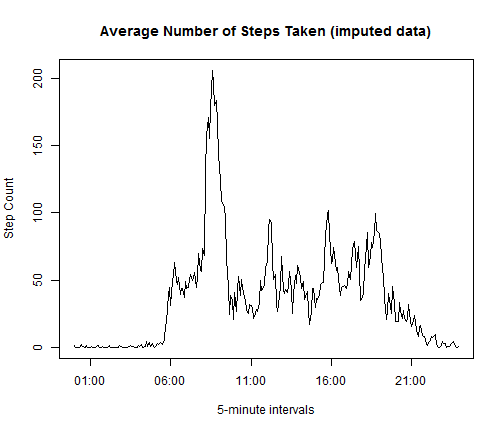
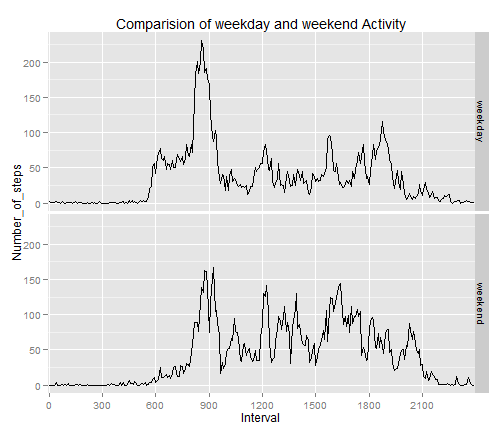

# Reproducible Research: Peer Assessment 1

Step count data from a monitoring device collected at 5 minute intervals 
throughout the day are examined. The data are from one individual 
during the months of October and November 2012.

## Loading and preprocessing the data

First some setup is necessary. The ggplot2 library is loaded. The working
directory is set and the workspace is cleared.


```r
opts_chunk$set(echo = TRUE)
```


```r
library(ggplot2)
sessionInfo()
```

```
## R version 3.0.3 (2014-03-06)
## Platform: x86_64-w64-mingw32/x64 (64-bit)
## 
## locale:
## [1] LC_COLLATE=English_United States.1252 
## [2] LC_CTYPE=English_United States.1252   
## [3] LC_MONETARY=English_United States.1252
## [4] LC_NUMERIC=C                          
## [5] LC_TIME=English_United States.1252    
## 
## attached base packages:
## [1] stats     graphics  grDevices utils     datasets  methods   base     
## 
## other attached packages:
## [1] ggplot2_0.9.3.1 knitr_1.5      
## 
## loaded via a namespace (and not attached):
##  [1] colorspace_1.2-4 digest_0.6.4     evaluate_0.5.3   formatR_0.10    
##  [5] grid_3.0.3       gtable_0.1.2     MASS_7.3-29      munsell_0.4.2   
##  [9] plyr_1.8.1       proto_0.3-10     Rcpp_0.11.1      reshape2_1.2.2  
## [13] scales_0.2.4     stringr_0.6.2    tools_3.0.3
```

```r
setwd("~/studyJH-DataSci/5-repData/RepData_PeerAssessment1")
rm(list = ls())
```


Next the data file is loaded and some date-time vectors are created 
for graphing proposes. Also a factor vector is created to identify 
entries as following on weekdays or weekends.


```r
stp <- read.csv("activity.csv", header = TRUE, na.strings = "NA")
t9HM <- as.character(90000 + as.numeric(stp$interval))
datetime <- strptime(paste(stp$date, t9HM), "%Y-%m-%d 9%H%M")
steptime <- strptime(t9HM[1:288], "9%H%M")
wd <- weekdays(datetime)
wd <- ifelse((wd == "Saturday" | wd == "Sunday"), "weekend", "weekday")
stp <- cbind(stp, datetime, wd)
```


## What is mean total number of steps taken per day?

Executing the following code.


```r
dsum <- aggregate(stp$steps, by = list(stp$date), FUN = sum, na.rm = TRUE)
names(dsum) <- c("Day", "cntStep")
summary(dsum$cntStep)
```

```
##    Min. 1st Qu.  Median    Mean 3rd Qu.    Max. 
##       0    6780   10400    9350   12800   21200
```


We see the step count mean is 9354.2295 and 
the median is 10395. 
The histogram of the step count by days is here.


```r
hist(dsum$cntStep, breaks = seq(0, 22000, 1000), col = "red", main = "Number of Steps Taken Each Day", 
    xlab = "Steps per Day")
```

 


## What is the average daily activity pattern?


```r
dstep <- aggregate(stp$steps, by = list(factor(stp$interval)), FUN = mean, na.rm = TRUE)
names(dstep) <- c("int5min", "meanStep")
summary(dstep)
```

```
##     int5min       meanStep     
##  0      :  1   Min.   :  0.00  
##  5      :  1   1st Qu.:  2.49  
##  10     :  1   Median : 34.11  
##  15     :  1   Mean   : 37.38  
##  20     :  1   3rd Qu.: 52.83  
##  25     :  1   Max.   :206.17  
##  (Other):282
```


Here is a time series plot of the 5-minute interval (x-axis) and the average 
number of steps taken, averaged across all days (y-axis).


```r
plot(steptime, dstep$meanStep, type = "l", main = "Average Number of Steps Taken by 5-minute interval", 
    xlab = "5-minute intervals", ylab = "Step Count")
```

 


The maximum step count averaged over time of day intervals is 
206.1698 and occures in the 
835 interval.

## Imputing missing values

The total number of missing values in the dataset (i.e. the total number of 
rows with NAs) is 2304. This correspones to to eight day 
on which the recording device was probabily not on and recording.


```r
sum(is.na(stp$steps))
```

```
## [1] 2304
```


A new dataset that is equal to the original dataset but with the missing 
data filled in by using the mean for that 5-minute interval is created.


```r
steps2 <- stp$steps
steps_mean <- rep(dstep$meanStep, 61)
steps2[is.na(steps2)] <- steps_mean[is.na(steps2)]
```


The summary statistics for this imputed data set are as follows:


```r
dsum2 <- aggregate(steps2, by = list(stp$date), FUN = sum)
dstep2 <- aggregate(steps2, by = list(factor(stp$interval)), FUN = mean)
names(dsum2) <- c("Day", "cntStep")
summary(dsum2$cntStep)
```

```
##    Min. 1st Qu.  Median    Mean 3rd Qu.    Max. 
##      41    9820   10800   10800   12800   21200
```


We see the step count mean is 1.0766 &times; 10<sup>4</sup> and 
the median is 1.0766 &times; 10<sup>4</sup>. 
The histogram of the step count by days for the imputed data is here. 


```r
hist(dsum2$cntStep, breaks = seq(0, 22000, 1000), col = "blue", main = "Number of Steps Taken Each Day (imputed data)", 
    xlab = "Steps per Day")
```

 


The time series plot for the imputed data of the 5-minute interval (x-axis)
and the average number of steps taken, averaged across all days (y-axis) 
is here. 


```r
plot(steptime, dstep2$x, type = "l", main = "Average Number of Steps Taken (imputed data)", 
    xlab = "5-minute intervals", ylab = "Step Count")
```

 


## Are there differences in activity patterns between weekdays and weekends?

The imputed data is used to look at activity patterns between weekdays and 
weekends.


```r
dstep3 <- aggregate(steps2, by = list(factor(stp$interval), stp$wd), FUN = mean)
names(dstep3) <- c("Interval", "wd", "Number_of_steps")
```


```r
p <- ggplot(dstep3, aes(x = Interval, y = Number_of_steps, group = wd, main = "Title")) + 
    geom_line()
p <- p + ggtitle("Comparision of weekday and weekend Activity")
p <- p + facet_grid(wd ~ .)
p <- p + scale_x_discrete(breaks = dstep3$Interval[seq(1, 288, by = 36)])
print(p)
```

 


While the peak activity is not as high on weekends as weekdays, activity 
is more substained thoughout the day on weekends.

