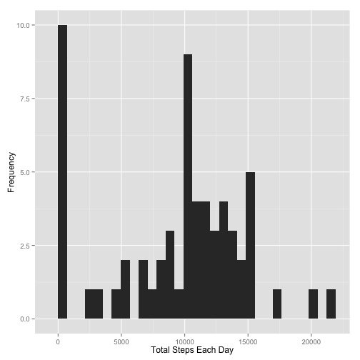
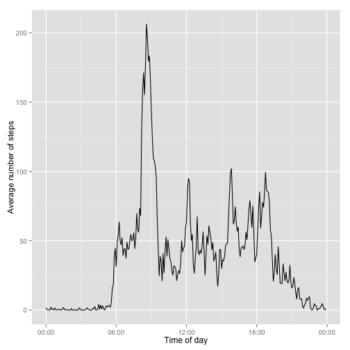
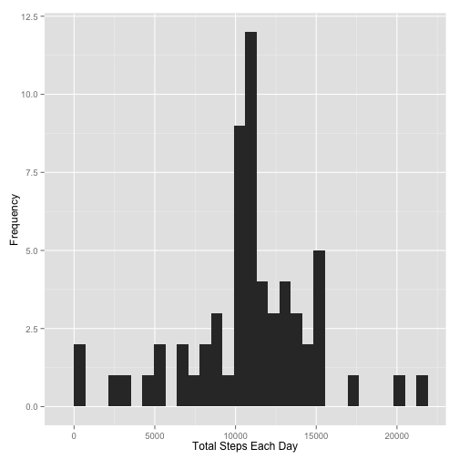
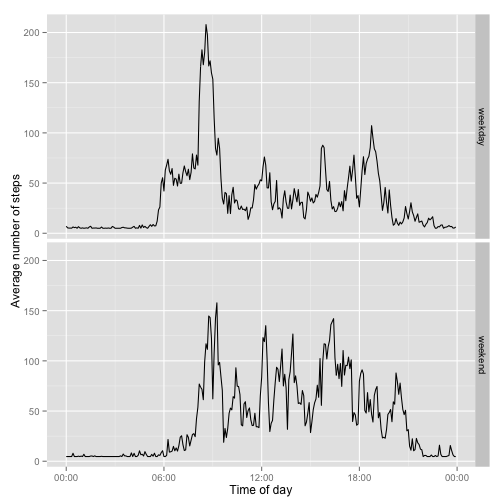

Reproducible Research: Peer Assessment 1
=================================================

**Author:** Amit Kumar Gupta (amit024003)  
**Date Created:** 14 Nov 2014  
**Date Modified:** 16 Nov 2014  


This program, in R markdown, is for first assignment of coursera course "Reproducible Research" (repdata-008).
This code answers the questions asked for this assignment.

## Get Data

This is to get data from provided data source if it doesn't exists in current
directory. This code would not download data file if desired out csv file 
exists or zip data file exists in current directory.


```r
dataURL <- "https://d396qusza40orc.cloudfront.net/repdata%2Fdata%2Factivity.zip"
dataZipFile <- "activity.zip"
dataFile <- "activity.csv"

if(!file.exists(dataFile)) {
    if(!file.exists(dataZipFile)) {
        download.file(dataURL, destfile=dataZipFile, method="curl", quiet=TRUE)
    }
    unzip(dataZipFile)
}
```

## Loading and preprocessing the data
This step comprises of following data processing actions:
- Load the data from the provided csv file. As mentioned in problem statement, loaded data should have 17568 observation points.
- Process the data into a format suitable for analysis. Converted the 5 mins interval to exact hour-min format and created extra field `dateTime` in `activityData`. Also, creating time field that is deriven from `dateTime` column and prepending the current date to make analysis easier as just need time for analysis.


```r
activityData <- read.csv(file=dataFile)
formatIntervaltoTime <- formatC(activityData$interval/100, 2, format='f' )
activityData$dateTime <- as.POSIXct(paste(activityData$date, formatIntervaltoTime),
                                    format='%Y-%m-%d %H.%M')
activityData$time <- as.POSIXct(format(activityData$dateTime, format='%H:%M:%S'), format='%H:%M:%S')
```

## What is mean total number of steps taken per day?
At this step ignor the `NA` values in data.
- Make a histogram of the total number of steps taken each day
- Calculate and report the mean and median total number of steps taken per day

First, determine the total number of steps each day.


```r
totalSteps <- tapply(activityData$steps, activityData$date, sum, na.rm=TRUE)
```

Plot the histogram of total number of staps taken each day.


```r
library(ggplot2)
qplot(totalSteps, xlab='Total Steps Each Day', ylab='Frequency', binwidth = max(totalSteps)/30)
```

 


Compute the mean and median of total number of steps taken each day.


```r
mean(totalSteps)
```

```
## [1] 9354.23
```

```r
median(totalSteps)
```

```
## [1] 10395
```

## What is the average daily activity pattern?

- Make a time series plot of the 5-minute interval (x-axis) and the average number of steps taken, averaged across all days (y-axis)
- Which 5-minute interval, on average across all the days in the dataset, contains the maximum number of steps?

First, compute the mean over each 5-minute time interval and convert into data.frame to plot easily. 


```r
stepsMean <- tapply(activityData$steps, activityData$time, mean, na.rm=TRUE)
dailyPattern <- data.frame(time=as.POSIXct(names(stepsMean)), stepsMean=stepsMean)
```

Time-series plot of each 5-minute interval and avg number of steps across all days.


```r
library(scales)
ggplot(dailyPattern, aes(time, stepsMean)) + geom_line() +
    xlab('Time of day') + ylab('Average number of steps') +
    scale_x_datetime(labels=date_format(format='%H:%M'))
```

 

**Plot shows that in the morning (~7:30 - 9:00) number of steps are more.**

In last, determine the which 5-minute interval has highest number of steps.


```r
timeIntervalMaxSteps <- which.max(dailyPattern$stepsMean)
format(dailyPattern[timeIntervalMaxSteps, 'time'], format='%H:%M')
```

```
## [1] "08:35"
```

## Imputing missing values
Note that there are a number of days/intervals where there are missing values (coded as NA). The presence of missing days may introduce bias into some calculations or summaries of the data.


- Calculate and report the total number of missing values in the dataset (i.e. the total number of rows with NAs)


```r
summary(activityData$steps)
```

```
##    Min. 1st Qu.  Median    Mean 3rd Qu.    Max.    NA's 
##    0.00    0.00    0.00   37.38   12.00  806.00    2304
```

```r
sum(is.na(activityData))
```

```
## [1] 2304
```

- Devise a strategy for filling in all of the missing values in the dataset. The strategy does not need to be sophisticated. For example, you could use the mean/median for that day, or the mean for that 5-minute interval, etc.
- Create a new dataset that is equal to the original dataset but with the missing data filled in.


```r
activityData2 <- activityData
activityData2$steps <- with(activityData2, impute(steps, mean))
```

- Make a histogram of the total number of steps taken each day and Calculate and report the mean and median total number of steps taken per day. Do these values differ from the estimates from the first part of the assignment? What is the impact of imputing missing data on the estimates of the total daily number of steps?


```r
library(ggplot2)
updatedTotalSteps <- tapply(activityData2$steps, activityData2$date, sum)
qplot(updatedTotalSteps, xlab='Total Steps Each Day', ylab='Frequency', binwidth = max(updatedTotalSteps)/30)
```

 

The mean and median became same as data is imputed with daily data. 


```r
mean(updatedTotalSteps)
```

```
## [1] 10766.19
```

```r
median(updatedTotalSteps)
```

```
## [1] 10766.19
```

**Differences:** Yes, after filling the missing value means and median increase.


```r
mean(updatedTotalSteps) - mean(totalSteps)
```

```
## [1] 1411.959
```

```r
median(updatedTotalSteps) - median(totalSteps)
```

```
## [1] 371.1887
```

## Are there differences in activity patterns between weekdays and weekends?
Perform analysis over the filled data.

- Create a new factor variable in the dataset with two levels – “weekday” and “weekend” indicating whether a given date is a weekday or weekend day.


```r
getDayType <- function(date) {
    if (weekdays(date) %in% c('Saturday', 'Sunday')) {
        return('weekend')
    } else {
        return('weekday')
    }
}
```


```r
activityData2$dayTypes <- as.factor(sapply(activityData2$dateTime, getDayType))
```


- Make a panel plot containing a time series plot (i.e. type = "l") of the 5-minute interval (x-axis) and the average number of steps taken, averaged across all weekday days or weekend days (y-axis). See the README file in the GitHub repository to see an example of what this plot should look like using simulated data.


```r
meanStepsTimeAndWeekday <- tapply(activityData2$steps, interaction(activityData2$time, activityData2$dayTypes), mean)
panelPlotData <- data.frame(time=as.POSIXct(names(meanStepsTimeAndWeekday)),
                               meanStepsTimeAndWeekday=meanStepsTimeAndWeekday,
                               dayTypes=as.factor(c(rep('weekday', 288), rep('weekend', 288))))

ggplot(panelPlotData, aes(time, meanStepsTimeAndWeekday)) + 
    geom_line() +
    xlab('Time of day') +
    ylab('Average number of steps') +
    scale_x_datetime(labels=date_format(format='%H:%M')) +
    facet_grid( dayTypes ~ .)
```

 

**Plot shows that average number of steps are more in the morning of weekday as compare to weekend.**
