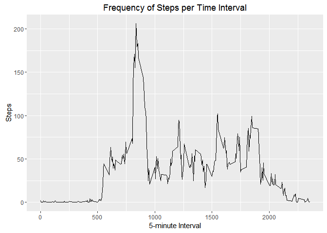
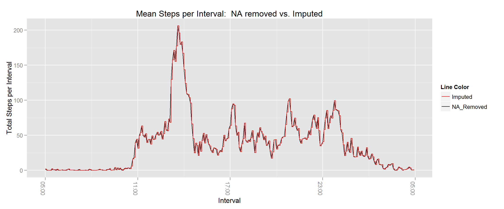

## Loading and preprocessing the data
***

Load the data from the activity.csv file into a dataframe called `activity`


```r
activity <- read.csv("activity.csv", header=TRUE)
str(activity)
```

```
## 'data.frame':	17568 obs. of  3 variables:
##  $ steps   : int  NA NA NA NA NA NA NA NA NA NA ...
##  $ date    : Factor w/ 61 levels "2012-10-01","2012-10-02",..: 1 1 1 1 1 1 1 1 1 1 ...
##  $ interval: int  0 5 10 15 20 25 30 35 40 45 ...
```

```r
head(activity)
```

```
##   steps       date interval
## 1    NA 2012-10-01        0
## 2    NA 2012-10-01        5
## 3    NA 2012-10-01       10
## 4    NA 2012-10-01       15
## 5    NA 2012-10-01       20
## 6    NA 2012-10-01       25
```

## What is mean total number of steps taken per day?
***

Create an array called `activityPerDay`, using the `tapply` to sum the steps per day. Use `na.rm = TRUE` to ignore missing values.


```r
activityPerDay <- tapply(activity$steps,activity$date,FUN=sum, na.rm = TRUE)
```

Use this array to create a historgram to show distribution of the total number of steps each day.


```r
hist(activityPerDay, xlab="Steps per day", ylab="Number of days", main =  "Steps per day", breaks = 20)
```

<!-- -->

Then calculate the `mean` and the `median`.


```r
meanActivityPerDay <- mean(activityPerDay)
medianActivityPerDay <- median(activityPerDay)
```

The mean and the median are 9354 and 10395 respectively.

## What is the average daily activity pattern?
***

Create an array called `activityPerInterval`, using the `tapply` to get mean number the steps per interval. Use `na.rm = TRUE` to ignore missing values.


```r
activityPerInterval <- tapply(activity$steps,activity$interval,FUN=mean, na.rm = TRUE)
```

Use this array to create a plot.


```r
plot(activityPerInterval, type="l", xlab="Interval", ylab="Average number of steps", main="Average number of steps per interval")
```

<!-- -->

Now find the interval with the highest mean


```r
maxActivityPerInterval <- max(activityPerInterval)
maxIntervalActivityPerInterval <- row.names(activityPerInterval)[which.max(activityPerInterval)]
```

The maximum mean is 206.1698113 for interval 835.

## Imputing missing values
***

Get the number of missing values in the `steps` column.


```r
numberOfNA <- sum(is.na(activity$steps))
```

The number of missing values in the `steps` column is 2304.  

A new dataframe `activityNew` is created. This is basically a copy of the `activity` dataframe. In this data frame , missing values in the `steps` column are replaced. A missing values for a particular interval is replaced with the median of the available values for that particular interval.


```r
activityNew <- activity
activityNew$steps[is.na(activityNew$steps)] <- with(activityNew, tapply(steps, interval, median, na.rm=TRUE))
```

Create an array called `activityPerDayNew`, using the `tapply` to get total number of the steps per day.


```r
activityPerDayNew <- tapply(activityNew$steps,activityNew$date,FUN=sum)
```

Use this array to create a historgram to show distribution of the total number of steps each day.


```r
hist(activityPerDayNew, xlab="Steps per day", ylab="Number of days", main =  "Steps per day", breaks = 20)
```

<!-- -->

Then calculate the `mean` and the `median` with both the `activityPerDay`.


```r
meanActivityPerDayNew <- mean(activityPerDayNew)
medianActivityPerDayNew <- median(activityPerDayNew)
```

The new mean and median are 9504 (this was 9354) and 10395 (this was 10395) respectively.

## Are there differences in activity patterns between weekdays and weekends?
***

Add a new column `IsWeekDay`, which is a factor column with values `weekday` and `weekend`


```r
activityNew$IsWeekDay <- !weekdays(as.Date(activityNew$date)) %in% c("Saturday","Sunday") 
activityNew$IsWeekDay <- factor(activityNew$IsWeekDay,levels=c(TRUE,FALSE),labels = c("weekday", "weekend"))
head(activityNew)
```

```
##   steps       date interval IsWeekDay
## 1     0 2012-10-01        0   weekday
## 2     0 2012-10-01        5   weekday
## 3     0 2012-10-01       10   weekday
## 4     0 2012-10-01       15   weekday
## 5     0 2012-10-01       20   weekday
## 6     0 2012-10-01       25   weekday
```

Create a new dataframe 'activityNewAggregated' that contains the mean number of `steps` per `interval` and `IsWeekDay`.


```r
activityNewAggregated <- aggregate(steps~interval+IsWeekDay,activityNew,mean)
```

Use this new dataframe to create an `xyplot`.


```r
library(lattice)
xyplot(steps ~ interval|IsWeekDay,  data = activityNewAggregated, type="l", layout = c(1,2))
```

<!-- -->
