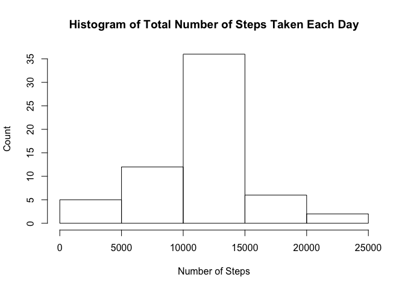

# Reproducible Research: Peer Assessment 1


## Loading and preprocessing the data

```r
activity <- read.csv("activity.csv",
                     colClasses = c("numeric", "Date", "numeric"),
                     na.strings = "NA")
```


## What is mean total number of steps taken per day?

```r
with(activity, hist(steps,
                    main = "Histogram of Total Number of Steps Taken Each Day",
                    xlab = "Number of Steps",
                    ylab = "Count"))
```

<!-- -->

```r
mean(activity$steps, na.rm = TRUE)
```

```
## [1] 37.3826
```

```r
median(activity$steps, na.rm = TRUE)
```

```
## [1] 0
```

## What is the average daily activity pattern?

```r
meanStepsByInterval <- with(activity,
                            tapply(steps, interval, mean,
                                   na.rm = TRUE, simplify = TRUE))
plot(names(meanStepsByInterval),
     meanStepsByInterval, type = "l",
     main = "Average Number of Steps Taken by 5-minute Interval",
     xlab = "Interval Number",
     ylab = "Number of Steps Taken")
```

<!-- -->

```r
meanStepsByInterval[which.max(meanStepsByInterval)]
```

```
##      835 
## 206.1698
```

## Imputing missing values

```r
sum(is.na(activity$steps))
```

```
## [1] 2304
```

```r
means <- data.frame(interval = names(meanStepsByInterval),
                    mean = meanStepsByInterval)
merged <- merge(activity, means)
merged <- transform(merged, steps = ifelse(is.na(steps), mean, steps))
activityNew <- with(merged, data.frame(merged[order(date, interval),
                                              c("steps", "date", "interval")],
                                       row.names = 1:nrow(activity)))
with(activityNew, hist(steps,
                       main = "Histogram of Total Number of Steps Taken Each Day",
                       xlab = "Number of Steps",
                       ylab = "Count"))
```

<!-- -->

```r
mean(activityNew$steps, na.rm = TRUE)
```

```
## [1] 37.3826
```

```r
median(activityNew$steps, na.rm = TRUE)
```

```
## [1] 0
```

## Are there differences in activity patterns between weekdays and weekends?

```r
activityNew$week <- ifelse(weekdays(activityNew$date) %in% c("Saturday", "Sunday"),
                           "Weekend", "Weekday")
meanStepsByIntervalWeekday <- with(subset(activityNew, week == "Weekday"),
                                   tapply(steps, interval, mean, simplify = TRUE))
meanStepsByIntervalWeekend <- with(subset(activityNew, week == "Weekend"),
                                   tapply(steps, interval, mean, simplify = TRUE))
meansWeekday <- data.frame(interval = as.numeric(names(meanStepsByIntervalWeekday)),
                           mean = meanStepsByIntervalWeekday, week = "Weekday")
meansWeekend <- data.frame(interval = as.numeric(names(meanStepsByIntervalWeekend)),
                           mean = meanStepsByIntervalWeekend, week = "Weekend")
mergedMeans <- data.frame(rbind(meansWeekday, meansWeekend), row.names = 1:576)

library(lattice)
xyplot(mean ~ interval | week, layout = c(1, 2),
       data = mergedMeans, type = "l",
       main = "Activity Patterns between Weekdays and Weekends",
       xlab = "Interval Number",
       ylab = "Number of Steps Taken")
```

<!-- -->
