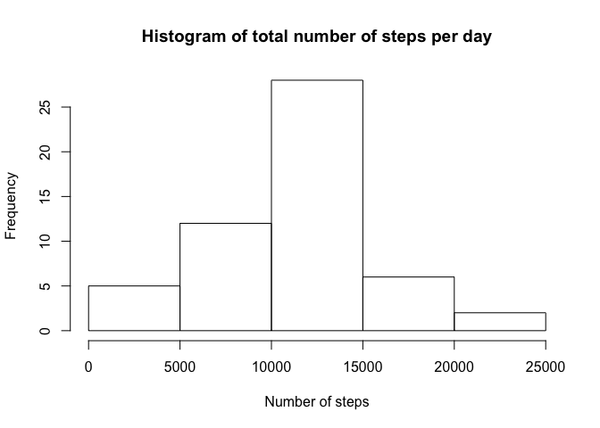

## Loading and preprocessing the data
In this data section I read the data from the shared folder. 


```r
library(tidyverse) #Need for the Pipes I will use in next step.
```

```
## ── Attaching packages ───────────────────────────────────────────────────────────────────────────────── tidyverse 1.3.0 ──
```

```
## ✓ ggplot2 3.3.1     ✓ purrr   0.3.4
## ✓ tibble  3.0.1     ✓ dplyr   1.0.0
## ✓ tidyr   1.1.0     ✓ stringr 1.4.0
## ✓ readr   1.3.1     ✓ forcats 0.5.0
```

```
## ── Conflicts ──────────────────────────────────────────────────────────────────────────────────── tidyverse_conflicts() ──
## x dplyr::filter() masks stats::filter()
## x dplyr::lag()    masks stats::lag()
```

```r
library(knitr)
options(digits=0) #Shows full numbers
options(scipen=999) #Removes scientific notation

activity <- read.csv("~/Reproducible Research/week2/activity.csv")
```

### Histogram of number of steps
Here, I do an histogram of the number of steps taken each day.


```r
data<- activity %>% 
    group_by(date) %>% 
    summarize(Steps_per_day=sum(steps))
```

```
## `summarise()` ungrouping output (override with `.groups` argument)
```

```r
hist(data$Steps_per_day)
```

<!-- -->

# What is the mean and median number of steps taken each day? 
As instructed, I use NA.RM to ignore the missings. 

```r
mean<-mean(data$Steps_per_day,na.rm=TRUE)
median<-median(data$Steps_per_day,na.rm=TRUE)
```

The mean number of steps is 10766 and the median is 10765. 

#What is the average daily activity pattern?
To study this, I will make a time series plot of the 5-minute interval (x-axis) and the average number of steps taken, averaged across all days (y-axis). For this, I aggregate the data per interval.


```r
data2<- activity %>% 
    group_by(interval) %>% 
    summarize(Steps_per_interval=mean(steps,na.rm=TRUE))
```

```
## `summarise()` ungrouping output (override with `.groups` argument)
```

```r
plot(data2$interval,data2$Steps_per_interval,type="l")
```

<!-- -->

```r
max<-max(data2$Steps_per_interval)

max2<-subset(data2,(data2$Steps_per_interval)==max)
```

Interval 835 is the one with the maximum or higher number of steps. The total number of steps is 206.

#Imputing missing values

```r
activity$missing<-ifelse(is.na(activity$steps)==TRUE,1,0)

data3<-activity %>% 
       summarize(Missing=sum(missing))

total_missing<-data3$Missing

rm(data3)
```

The total number of observation with a missing value is 2304.


```r
#Here I create a new dataset to avoid overwriting the old one
activity2<-activity

mean_steps<-mean(activity2$steps,na.rm=TRUE)

activity2$steps_imp<-ifelse(is.na(activity2$steps)==FALSE,activity2$steps,mean_steps)
```

Now, I create the new dataset per day, but using the imputed data.


```r
data_imp<- activity2 %>% 
    group_by(date) %>% 
    summarize(Steps_per_day_imp=sum(steps_imp))
```

```
## `summarise()` ungrouping output (override with `.groups` argument)
```

```r
hist(data_imp$Steps_per_day_imp)
```

<!-- -->

## Are there differences in activity patterns between weekdays and weekends?

```r
activity3<-activity2
activity3$date_new <- as.Date(activity3$date)
activity3$day<-weekdays(activity3$date_new)

activity3$weekend<-ifelse(activity3$day=="Saturday","Weekend",
                  ifelse(activity3$day=="Sunday","Weekend","Weekday"))
```


```r
library(lattice)
weekday_series<- activity3 %>% 
    group_by(weekend,interval) %>% 
    summarize(Steps_per_int_imp=mean(steps_imp))
```

```
## `summarise()` regrouping output by 'weekend' (override with `.groups` argument)
```

```r
xyplot(Steps_per_int_imp ~ interval | weekend,
       data = weekday_series,
       type = "l")
```

<!-- -->
