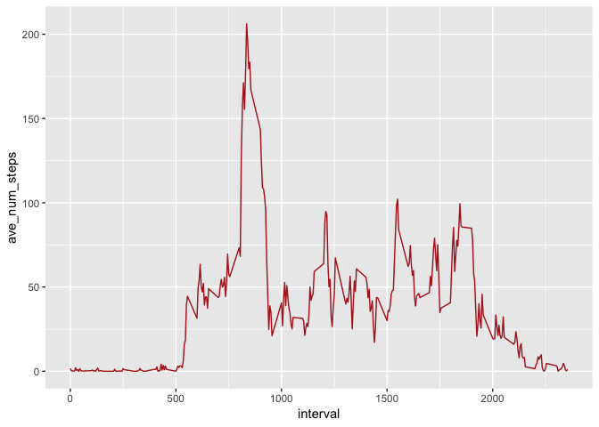
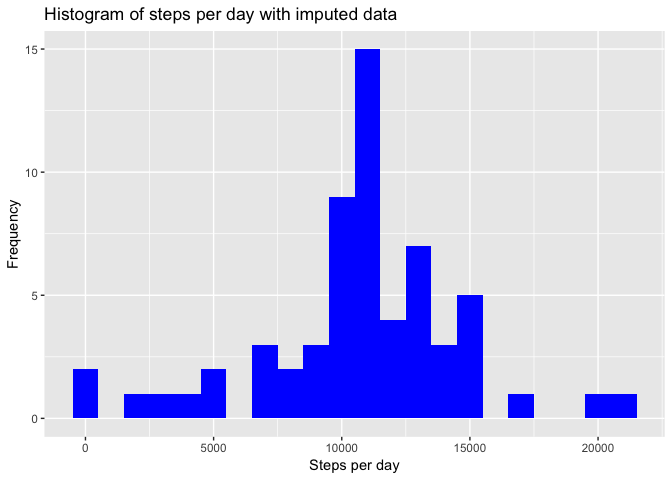
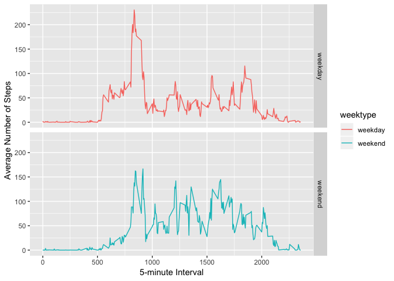

## Load R packages to be used to create this report

```r
library(knitr)
library(dplyr)
```

```
## 
## Attaching package: 'dplyr'
```

```
## The following objects are masked from 'package:stats':
## 
##     filter, lag
```

```
## The following objects are masked from 'package:base':
## 
##     intersect, setdiff, setequal, union
```

```r
library(ggplot2)
library(lubridate)
```

```
## 
## Attaching package: 'lubridate'
```

```
## The following object is masked from 'package:base':
## 
##     date
```

```r
### Set global option to show the output from execution of the code chunks
knitr::opts_chunk$set(echo = TRUE)
```
## Setting current working directory, loading the data
I copied the cloned repository to this folder using GitHub Desktop - /Users/deven/Documents/GitHub/RepData_PeerAssessment1 . With downloable data I got activity.zip file in the same folder that has the data to be used for this project.

```r
###
### Set the working directory.
### Note: You might need to change it to local path to folder on your computer where 
### the cloned repository might have been copied.
###
setwd("/Users/deven/Documents/GitHub/RepData_PeerAssessment1")

if(!file.exists('activity.csv')){
    unzip('activity.zip')
}
activityData <- read.csv('activity.csv')
```
## Tidying the data

```r
### When I checked the data using str(), noticed that the date is saved as factor ...
str(activityData)
```

```
## 'data.frame':	17568 obs. of  3 variables:
##  $ steps   : int  NA NA NA NA NA NA NA NA NA NA ...
##  $ date    : Factor w/ 61 levels "2012-10-01","2012-10-02",..: 1 1 1 1 1 1 1 1 1 1 ...
##  $ interval: int  0 5 10 15 20 25 30 35 40 45 ...
```

```r
### Converting activityData$date to the type date
activityData$date <- ymd(activityData$date)
str(activityData)
```

```
## 'data.frame':	17568 obs. of  3 variables:
##  $ steps   : int  NA NA NA NA NA NA NA NA NA NA ...
##  $ date    : Date, format: "2012-10-01" "2012-10-01" ...
##  $ interval: int  0 5 10 15 20 25 30 35 40 45 ...
```

```r
### number of NA in the activityData$steps column ... will keep that in mind while
### answering questions for this assignment
```

## Total number of steps taken per day  

##### Q 1: Calculate the total number of steps taken per day  


```r
steps_per_day <- activityData %>%
    filter(!is.na(steps)) %>% ## filter out rows that have NA in the steps columns
    group_by(date) %>%
    summarize(daily_total = sum(steps))  

steps_per_day ## this should have total daily steps for each day/date  
```

```
## # A tibble: 53 x 2
##    date       daily_total
##    <date>           <int>
##  1 2012-10-02         126
##  2 2012-10-03       11352
##  3 2012-10-04       12116
##  4 2012-10-05       13294
##  5 2012-10-06       15420
##  6 2012-10-07       11015
##  7 2012-10-09       12811
##  8 2012-10-10        9900
##  9 2012-10-11       10304
## 10 2012-10-12       17382
## # ... with 43 more rows
```

##### Q 2: If you do not understand the difference between a histogram and a barplot, research the difference between them. Make a histogram of the total number of steps taken each day  


```r
ggplot(steps_per_day, aes(x = daily_total)) +
    geom_histogram(fill = "blue", binwidth = 1000) +
    labs(title = "Histogram of steps per day", x = "Steps per day", y = "Frequency")  
```

<!-- -->

##### Q 3: Calculate and report the mean and median of the total number of steps taken per day  


```r
mean_daily_steps <- mean(steps_per_day$daily_total, na.rm = TRUE)
median_daily_steps <- median(steps_per_day$daily_total, na.rm = TRUE)
```


```r
mean_daily_steps
```

```
## [1] 10766.19
```


```r
median_daily_steps
```

```
## [1] 10765
```

## What is the average daily activity pattern?  

##### Q1: Make a time series plot (i.e. type = "l"of the 5-minute interval (x-axis) and the average number of steps taken, averaged across all days (y-axis)  


```r
interval <- activityData %>%
    filter(!is.na(steps)) %>% ## filter out rows that have NA in the steps columns
    group_by(interval) %>%
    summarize(ave_num_steps = mean(steps))  

ggplot(interval, aes(x=interval, y=ave_num_steps)) +
    geom_line(color = "firebrick")  
```

<!-- -->

##### Q2: Which 5-minute interval, on average across all the days in the dataset, contains the maximum number of steps?  


```r
interval[which.max(interval$ave_num_steps),]  
```

```
## # A tibble: 1 x 2
##   interval ave_num_steps
##      <int>         <dbl>
## 1      835          206.
```

## Imputing missing values  

##### Note that there are a number of days/intervals where there are missing values (coded as NA). The presence of missing days may introduce bias into some calculations or summaries of the data.  

##### Q1: Calculate and report the total number of missing values in the dataset (i.e. the total number of rows with NAs)  


```r
sum(is.na(activityData))
```

```
## [1] 2304
```

##### Q2: Devise a strategy for filling in all of the missing values in the dataset. The strategy does not need to be sophisticated. For example, you could use the mean/median for that day, or the mean for that 5-minute interval, etc. 

Strategy I am using is to fill in NAs with average of the interval.  

##### Q3: Create a new dataset that is equal to the original dataset but with the missing data filled in.  


```r
imputed_activityData <- activityData
nas <- is.na(imputed_activityData$steps) ## logical vector to track NAs
avg_interval <- tapply(imputed_activityData$steps, imputed_activityData$interval, mean, na.rm = TRUE, simplify=TRUE) ## calculate average for each interval
imputed_activityData$steps[nas] <- avg_interval[as.character(imputed_activityData$interval[nas])] ## where steps data is NA, impute average of the interval for its replacement value
```

##### Q4: Make a histogram of the total number of steps taken each day and Calculate and report the mean and median total number of steps taken per day. Do these values differ from the estimates from the first part of the assignment? What is the impact of imputing missing data on the estimates of the total daily number of steps?  


```r
steps_per_day <- imputed_activityData %>%
    filter(!is.na(steps)) %>% ## filter out rows that have NA in the steps columns
    group_by(date) %>%
    summarize(daily_total = sum(steps))  

steps_per_day ## this should have total daily steps for each day/date  
```

```
## # A tibble: 61 x 2
##    date       daily_total
##    <date>           <dbl>
##  1 2012-10-01      10766.
##  2 2012-10-02        126 
##  3 2012-10-03      11352 
##  4 2012-10-04      12116 
##  5 2012-10-05      13294 
##  6 2012-10-06      15420 
##  7 2012-10-07      11015 
##  8 2012-10-08      10766.
##  9 2012-10-09      12811 
## 10 2012-10-10       9900 
## # ... with 51 more rows
```

##### Making histogram  


```r
ggplot(steps_per_day, aes(x = daily_total)) +
    geom_histogram(fill = "blue", binwidth = 1000) +
    labs(title = "Histogram of steps per day with imputed data", x = "Steps per day", y = "Frequency")  
```

<!-- -->

##### Calculating the mean and median total number of steps taken per day  


```r
mean_daily_steps <- mean(steps_per_day$daily_total, na.rm = TRUE)
median_daily_steps <- median(steps_per_day$daily_total, na.rm = TRUE)
```


```r
mean_daily_steps
```

```
## [1] 10766.19
```


```r
median_daily_steps
```

```
## [1] 10766.19
```


##### Did mean and median change compared to fisrt part of the assignment? What is the impact of imputing missing data on the estimates of the total daily number of steps?  

My Answers:  

1. I didn't see significant difference in the mean and median values for intervals before and after imputing.  
2. Total number of daily steps values increased by imputing missing data. The overall distribution is more centrally distributed, standard deviation of the distribution should be lower now.  

## Are there differences in activity patterns between weekdays and weekends?  

##### For this part the  weekdays() function may be of some help here. Use the dataset with the filled-in missing values for this part.  

##### Create a new factor variable in the dataset with two levels – “weekday” and “weekend” indicating whether a given date is a weekday or weekend day.  


```r
imputed_activityData <- mutate(imputed_activityData, weektype = ifelse((weekdays(imputed_activityData$date) == "Saturday") | (weekdays(imputed_activityData$date) == "Sunday"), "weekend", "weekday"))  


imputed_activityData$weektype <- as.factor(imputed_activityData$weektype)  

head(imputed_activityData)
```

```
##       steps       date interval weektype
## 1 1.7169811 2012-10-01        0  weekday
## 2 0.3396226 2012-10-01        5  weekday
## 3 0.1320755 2012-10-01       10  weekday
## 4 0.1509434 2012-10-01       15  weekday
## 5 0.0754717 2012-10-01       20  weekday
## 6 2.0943396 2012-10-01       25  weekday
```


##### Make a panel plot containing a time series plot (i.e. type="l") of the 5-minute interval (x-axis) and the average number of steps taken, averaged across all weekday days or weekend days (y-axis). See the README file in the GitHub repository to see an example of what this plot should look like using simulated data.  


```r
interval_rev <- imputed_activityData %>%
    group_by(interval, weektype) %>%
    summarize(steps = mean(steps))  

ggplot(interval_rev, aes(x=interval, y=steps, color = weektype)) +
    geom_line() +
    facet_grid( weektype~.) +
    xlab("5-minute Interval") +
    ylab("Average Number of Steps")
```

<!-- -->


