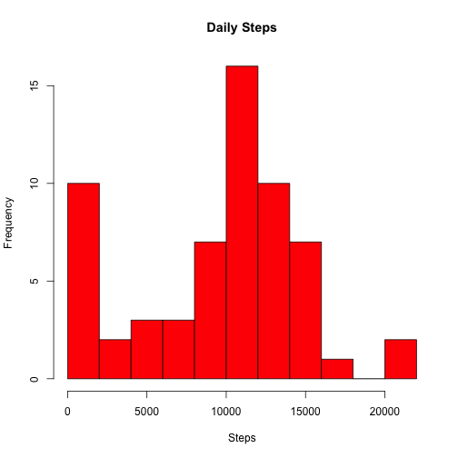
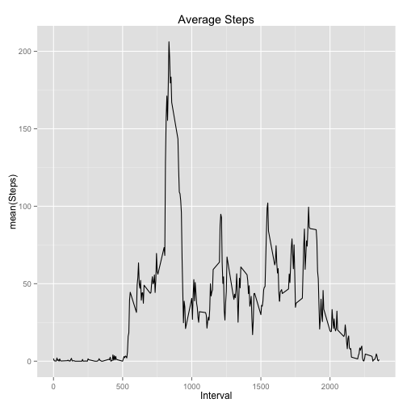
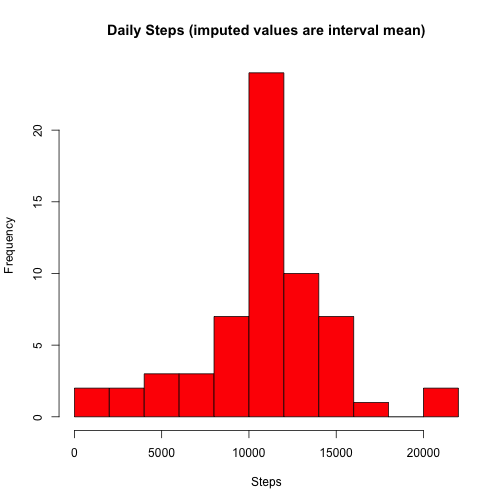
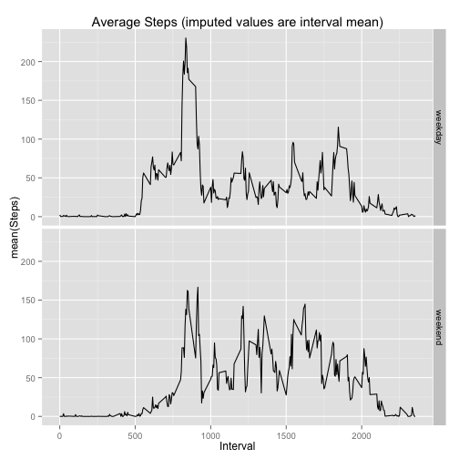

In the last 10 years a number of personal activity monitors such as ["Fitbit"](https://en.wikipedia.org/wiki/Fitbit) have emerged as part of the [Quantified Self Movement](https://en.wikipedia.org/wiki/Quantified_Self). The homework assignment requires simple analysis of activity monitor data which is descibed in the homework instructions as:

> This device collects data at 5 minute intervals through out the day. The data consists of two months of data from an anonymous individual collected during the months of October and November, 2012 and include the number of steps taken in 5 minute intervals each day.

## Loading and preprocessing the data

The data was downloaded from a [link](https://d396qusza40orc.cloudfront.net/repdata%2Fdata%2Factivity.zip) provided in the instructions for the ["Reproducible Research"](https://www.coursera.org/course/repdata) *Peer Assignment 1* at Coursera at the time given in the title of this report. Before the data can read from the current working directory, a few librarys need to be loaded.


```r
require(knitr)
require(lubridate)
require(ggplot2)
require(dplyr)
opts_chunk$set(echo = TRUE, results = "markup")
```
The activity data was read into a data table using *csv2()*. The date field in the table was converted from character to the POSIX Date class. The interval data was converted from string (e.g. 1355 means 1:55 PM), and then added to the POSIXct date, creating a very convenient date-time that is easy to plot. The time zone is considered to be unimportant for this report.


```r
dt <- read.csv2("./activity.csv", sep = ",", stringsAsFactors = F, header = T)  

dt <- mutate(dt, date = ymd(date))
minute(dt$date) <- dt$interval %% 100   # minutes are the 2 rightmost digits
hour(dt$date)   <- dt$interval %/% 100  # hours are on left
```

## What is mean total number of steps taken per day?
Using *group_by()* the data can be arranged by day of year, and then it is simple to calculate daily statistics. The only trick is the result of *summarize* is an object that can be plotted, which greatly simplifies the code.

```r
by_date <- group_by(dt, doy = yday(date))

summary_date <- summarise(by_date, daily_total = sum(steps, na.rm = T))

hist(summary_date$daily_total,
     col="red", 
     breaks = 12,
     main = "Daily Steps", 
     xlab = "Steps"
)
```

 

```r
mean(summary_date$daily_total, na.rm = T)
```

```
## [1] 9354.23
```

```r
median(summary_date$daily_total, na.rm = T)
```

```
## [1] 10395
```

The **mean** number of steps over the 61 day period is **9354.23** and the **median** number of steps is **10395**.

## What is the average daily activity pattern?

Another way to view the data is to average across days to get the typical number of steps at a given time. This can be simply done by repeating the code above, grouping by interval rather than date.

```r
by_interval <- group_by(dt, interval)

summary_interval <- summarise(by_interval, interval_mean = mean(steps, na.rm = TRUE))

qplot(interval, interval_mean, data=summary_interval, 
      geom = "line",
      main="Average Steps",
      xlab="Interval", ylab="mean(Steps)"
)
```

 

```r
with(summary_interval, interval[which(interval_mean == max(interval_mean))])
```

```
## [1] 835
```

The interval with the **max** steps is 835, which makes sense as people are often busy around 8AM.


## Imputing missing values

The data above is misleading because I have not corrected for the **2304 missing values of *steps*.** This leads to the histogram indicating a larger number of zero *steps* than is correct. One approach would be to replace missing values of *steps* with the mean steps oveall all intervals (37.3826). Instead the average number of steps in each interval is calculated and used to replace steps on a per interval basis. Shiping Zhang, a student in the class shared a useful hack for this on the (class forum)[https://class.coursera.org/repdata-036/forum/thread?thread_id=73]. This only works because there are no missing intervals, just missing data. In other words dt is a repeating set of same 288 intervals so the assignment "repeats" or "wraps" thru the 288 mean values. Wish I thought of this.


```r
sum(is.na(dt$steps))
```

```
## [1] 2304
```

```r
mean(dt$steps, na.rm = T)
```

```
## [1] 37.3826
```

```r
imputed_dt <- dt

# Following is cleaver hack by Shiping Zhang to replace NA with interval mean.

imputed_dt[is.na(imputed_dt$steps), "steps"] = summary_interval$interval_mean

# basically repeat the above calculation of mean and median...
by_date <- group_by(imputed_dt, doy = yday(date))

summary_date <- summarise(by_date, daily_total = sum(steps, na.rm = T))

hist(summary_date$daily_total,
     col="red", 
     breaks = 12,
     main = "Daily Steps (imputed values are interval mean)", 
     xlab = "Steps"
)
```

 

```r
mean(summary_date$daily_total, na.rm = T)
```

```
## [1] 10766.19
```

```r
median(summary_date$daily_total, na.rm = T)
```

```
## [1] 10766.19
```

Using the imputed values, the **mean = 10766.19** and the **median = 10766.19**. Note that by coincidence the mean and the median are the same because we have replaced missing values with the average values on 8 missing days. 

Using the imputed data, both the mean and median number of steps increases because additional steps are being added to the data set. 

Examining the histogram I see a much more evenly distributed number of steps, which is plausible because the missing data might simply reflect the case that the subject forgot to take the tracker with them. Any given day will likely be similar to the average, even if the details differ. In this case the missing data covers an entire day, rather than missing random intervals which should make using the average values even more reasonable.

## Are there differences in activity patterns between weekdays and weekends?

To further check the validity of the date, I made a plot highlighting the difference in activity between weekend and weekdays. Note that activity begins more gradually on the weekends is more uniform, and extends farther into the night. Weekdays have higher peak values of steps, perhaps because most people are rushing in morning before work. 

```r
imputed_dt = mutate(imputed_dt, weekend = ifelse(grepl('^S', weekdays(imputed_dt$date)), "weekend", "weekday"))

by_interval <- group_by(imputed_dt, interval, weekend)
summary_interval <- summarise(by_interval, interval_mean = mean(steps, na.rm = TRUE))


qplot(interval, interval_mean, data=summary_interval,
      facets = weekend ~ . ,
      geom = "line",
      main="Average Steps (imputed values are interval mean)",
      xlab="Interval", ylab="mean(Steps)"
)
```

 
