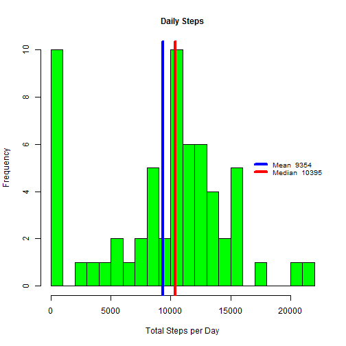
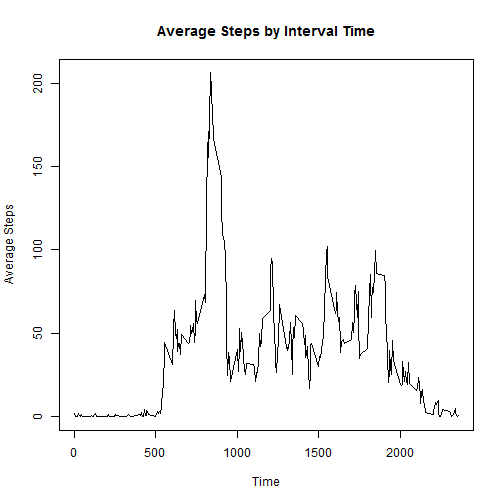
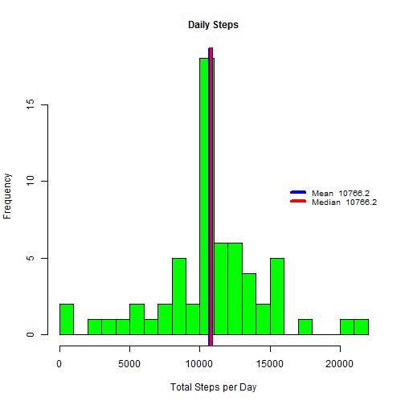
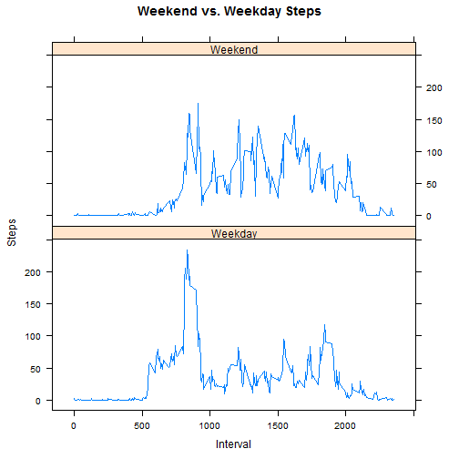

# Reproducible Research Project 1
*This assignment makes use of data from a personal activity monitoring device. This device collects data at 5 minute intervals through out the day. The data consists of two months of data from an anonymous individual collected during the months of October and Nove
mber, 2012 and include the number of steps taken in 5 minute intervals each day.*

## Data Load and Preprocessing

```r
## Coursera Reproducible Research 032
## Project 1

## clear the workspace of any existing variables
rm(list=ls())

## Adjust working directory as required 
## Load libraries
library(data.table)
library(plyr)

## Acquire Data and format date column
unzip("./activity.zip")
raw_Data <- data.table(read.table("activity.csv", header=T, sep=","))
raw_Data$date <- as.Date(as.character(raw_Data$date))
head(raw_Data)
```

```
##    steps       date interval
## 1:    NA 2012-10-01        0
## 2:    NA 2012-10-01        5
## 3:    NA 2012-10-01       10
## 4:    NA 2012-10-01       15
## 5:    NA 2012-10-01       20
## 6:    NA 2012-10-01       25
```
## What is the Mean Total number of steps taken per day?
### Total, Mean and Median Steps per Day
 - Total Number of Steps per Day is calculated by summing the data in *steps*, grouped by *date*.
 - Mean of the Total Number of Steps per Day is calculated by averaging Total Steps (*total_steps*) data.
 - Median of the Total Number of Steps per Day is calculated using the Median function on the Total Steps (*total_steps*) data.
 - *calculations rounded to whole numbers.*

```r
mm_Data <- raw_Data[,.(total_steps = sum(na.omit(steps))), by = date]
steps_Mean <- round(mean(mm_Data$total_steps), digits = 0)
steps_Median <- round(median(mm_Data$total_steps), digits = 0)
head(mm_Data)
```

```
##          date total_steps
## 1: 2012-10-01           0
## 2: 2012-10-02         126
## 3: 2012-10-03       11352
## 4: 2012-10-04       12116
## 5: 2012-10-05       13294
## 6: 2012-10-06       15420
```
Average Total steps are 

```r
steps_Mean
```

```
## [1] 9354
```
while the Median total steps are

```r
steps_Median
```

```
## [1] 10395
```
### Generate Histogram

```r
hist(mm_Data$total_steps,
     xlab = "Total Steps per Day",
     main = "Daily Steps",
     col = "green",
     cex.main = 1.0,
     breaks = 30)

abline(v = steps_Mean,
       lwd = 4, 
       col = 'blue')

abline(v = steps_Median,
       lwd = 4, 
       col = "red")    
     
legend("right", 
       bty = "n",
       lty = 1,
       lwd = 4, 
       col = c("blue", "red"),
       cex = .8, 
       legend = c(paste("Mean ", steps_Mean),
                  paste("Median ", steps_Median))
)
```

 

## What is the Average Daily Activity Pattern and what is the Maximum Interval Average?
- Average steps calculated using mean function, omitting all NA values, and grouped by *interval* rather than date, to allow display of activity throughout an average day.

```r
ada_Pattern <- raw_Data[,.(ave_steps = mean(na.omit(steps))), by = interval]
head(ada_Pattern)
```

```
##    interval ave_steps
## 1:        0 1.7169811
## 2:        5 0.3396226
## 3:       10 0.1320755
## 4:       15 0.1509434
## 5:       20 0.0754717
## 6:       25 2.0943396
```

```r
plot(ada_Pattern,
     type="l",
     main = "Average Steps by Interval Time",
     xlab = "Time",
     ylab = "Average Steps"
     )
```

 

 The 5-minute interval with the highest number of average steps is

```r
max_ave_Steps <- with(ada_Pattern, interval[ave_steps == max(ave_steps)])
max_ave_Steps
```

```
## [1] 835
```
corresponding to 8:35 AM, with

```r
round(with(ada_Pattern, ave_steps[interval == max_ave_Steps]), digits = 0)
```

```
## [1] 206
```
average steps.

## Imputing Missing Values
 There are a total of 

```r
missing_Data <- as.numeric(sum(is.na(raw_Data$steps)))
missing_Data
```

```
## [1] 2304
```
(NA) values in the data.

### Missing Data Strategy
Having determined the total number of NA values in the steps dataset (*steps*), we will replace them with the previously calculated interval mean (*ave_steps*), with the result that all values of NA in, for example, interval 0 will be replaced with the interval 0 average steps value (*ave_steps*).

```r
new_Data <- merge(raw_Data, ada_Pattern, "interval")
new_Data$steps[is.na(new_Data$steps)] <- new_Data$ave_steps[is.na(new_Data$steps)]

## Sort new_Data by date and interval time, calculate new total, mean and median values with the imputed data.
new_Data <- arrange(new_Data, date, interval)
new_mmData <- new_Data[,.(total_steps = sum(steps)), by = date]
new_steps_Mean <- round(mean(new_mmData$total_steps), digits = 1)
new_steps_Median <- round(median(new_mmData$total_steps), digits = 1)
head(new_mmData)
```

```
##          date total_steps
## 1: 2012-10-01    10766.19
## 2: 2012-10-02      126.00
## 3: 2012-10-03    11352.00
## 4: 2012-10-04    12116.00
## 5: 2012-10-05    13294.00
## 6: 2012-10-06    15420.00
```
The updated data, obtained by filling in NA values with the interval average value, results in an identical Mean and Median value of 10766, indicating a  symetrical distribution. This is a minor shift in median and a large shift in mean.

## Plot new Step Totals, Mean and Median

```r
hist(new_mmData$total_steps,
     xlab = "Total Steps per Day",
     main = "Daily Steps",
     col = "green",
     cex.main = 1.0,
     breaks = 30)

abline(v = new_steps_Mean,
       lwd = 6, 
       col = 'blue')

abline(v = new_steps_Median,
       lwd =3, 
       col = "red")    

legend("right", 
       bty = "n",
       lty = 1,
       lwd = 4, 
       col = c("blue", "red"),
       cex = .8, 
       legend = c(paste("Mean ", new_steps_Mean),
                  paste("Median ", new_steps_Median))
)
```

 

## Are there differences in activity between Weekdays and Weekends?
Generate Weekday/Weekend variable from Date, Generate new average by Weekday/Weekend.

```r
week_End_Data <- raw_Data
week_End_Data$day <- weekdays(as.Date(week_End_Data$date))
week_End_Data$weekend <- factor(ifelse(week_End_Data$day %in% "Saturday" | week_End_Data$day %in% "Sunday","Weekend","Weekday"))
week_End_Data <- ddply(week_End_Data, .(interval, weekend), summarise, ave_steps = mean(na.omit(steps)))
head(week_End_Data)
```

```
##   interval weekend ave_steps
## 1        0 Weekday 2.3333333
## 2        0 Weekend 0.0000000
## 3        5 Weekday 0.4615385
## 4        5 Weekend 0.0000000
## 5       10 Weekday 0.1794872
## 6       10 Weekend 0.0000000
```

Generate panel plot to compare Weekend vs. Weekday.

```r
library(lattice)
xyplot(ave_steps~interval | factor(weekend),
       data = week_End_Data,
       type = "l",
       main = "Weekend vs. Weekday Steps", 
       ylab = "Steps", 
       xlab = "Interval",
       layout = c(1,2))
```

 
