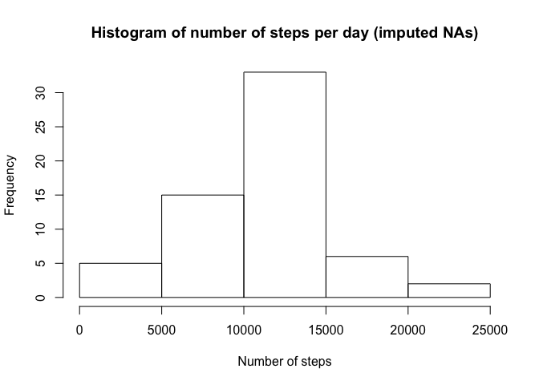
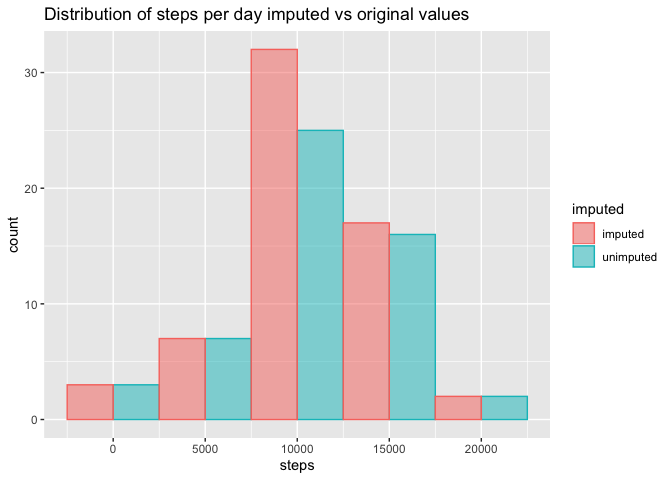
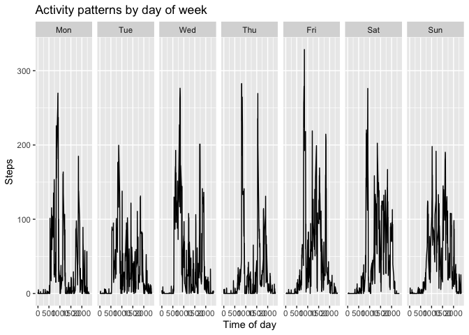
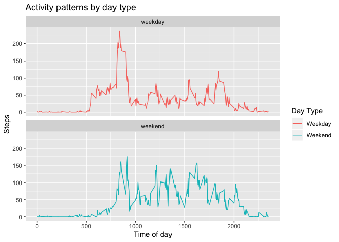

Install necessary packages ('messages' turned off to ease readability of output)

```r
library(tidyverse)
library(knitr)
library(rmarkdown)
library(lubridate)
library(data.table)
```

## Loading and preprocessing the data
The following code checks to see if the data file has already been downloaded and unzipped and then downloads and/or unzips the file as required. Finally, the activity.csv file is loaded into R, the date variable transformed from factor to date format with several additional variables created from the date to aid later analysis


```r
# Ensure that echo = TRUE throughout
opts_chunk$set(echo = TRUE)

# Checking if data already exists.
filename <- "activity.zip"
if (!file.exists(filename)){
  fileURL <- "https://d396qusza40orc.cloudfront.net/repdata%2Fdata%2Factivity.zip"
  download.file(fileURL, filename, method="curl")
}  

# Check if file exists, if not extract zip
if (!file.exists("activity.csv")) { 
  unzip(filename) 
}

# Read in data, assign NA values and transform data to appropriate format 
data <- read.csv("activity.csv", na.strings = "NA")
data$date <- as.Date(data$date)
data$min <- minutes(substr(data$interval,nchar(data$interval)-1,nchar(data$interval)))
data$hour <- hours(ifelse(data$interval< 100, 0, substr(data$interval,nchar(data$interval)-4,nchar(data$interval)-2)))
data$datetime <- as.POSIXct(data$date+data$hour+data$min)
data$time <- strftime(data$datetime, format = "%H:%M")
data$weekday <- weekdays(data$date, abbreviate = TRUE)
```

## What is the mean total number of steps taken per day?

```r
# calculate total number of steps taken
totalsteps <- aggregate(steps ~ date, data = data, sum)
hist(totalsteps$steps, main = "Histogram of total number of steps per day", xlab = "Number of steps")
```

<!-- -->

### Mean steps per day

```r
meansteps <- mean(totalsteps$steps, na.rm = TRUE)
meansteps
```

```
## [1] 10766.19
```
### Median steps per day

```r
mediansteps <- median(totalsteps$steps, na.rm = TRUE)
mediansteps
```

```
## [1] 10765
```
## What is the average daily activity pattern?

```r
avgsteps <- aggregate(steps ~ interval, data = data, mean)
avgsteps$time <- unique(data$time)
labels <- data.frame(interval = avgsteps[which(avgsteps$steps == max(avgsteps$steps)), "interval"]+1, steps = avgsteps[which(avgsteps$steps == max(avgsteps$steps)), "steps"],text = paste0("Highest Average Steps = ", signif(max(avgsteps$steps),digits = 4)," at ", avgsteps[which(avgsteps$steps == max(avgsteps$steps)), "time"]))

ggplot(avgsteps, aes(interval, steps))+
    geom_line()+
    geom_text(data = labels, aes(label = text), nudge_y = 10)+
    labs(x = "Time")
```

<!-- -->

## Imputing missing values

The total number of missing values in the dataset is:

```r
sum(is.na(data$steps))
```

```
## [1] 2304
```

My strategy for dealing with missing values is to impute the mean for that day/interval combination, calculated as per the following code.

```r
# create reference table to look up means for each day/time combination
avgsteps_bytimeday <- aggregate(steps ~ interval+weekday, data=data, mean, na.rm = TRUE)

# create function to look up imputed value for each missing variable
imputesteps<-function(ival, wday){
    avgsteps_bytimeday[avgsteps_bytimeday$interval==ival & avgsteps_bytimeday$weekday == wday,]$steps
}

# code to impute all missing values
for (i in 1:nrow(data)) {
  if(is.na(data[i,"steps"])==TRUE) {
    data$steps_new[i] <- imputesteps(data[i,"interval"],data[i,"weekday"])} else {
      data$steps_new[i] <- data[i,"steps"]
    }
}
```

Creation of new dataset with missing values filled in

```r
data_new <- select(data, steps = steps_new, date, interval)
```


Revised histogram and mean/median steps.
### Revised histogram of mean steps per day

```r
# calculate total number of steps taken
totalsteps_new <- aggregate(steps_new ~ date, data = data, sum)
hist(totalsteps_new$steps, main = "Histogram of number of steps per day (imputed NAs)", xlab = "Number of steps")
```

<!-- -->

### Revised mean steps per day

```r
newmean <- mean(totalsteps_new$steps_new, na.rm = TRUE)
newmean
```

```
## [1] 10821.21
```
### Revised median steps per day

```r
newmedian <- median(totalsteps_new$steps_new, na.rm = TRUE)
newmedian
```

```
## [1] 11015
```
### Are the imputed summary values different to the original summary values

```r
newsteps <- tibble(steps = totalsteps_new$steps, imputed = "imputed")
oldsteps <- tibble(steps = totalsteps$steps, imputed = "unimputed")
histdata <- rbind(newsteps, oldsteps)
ggplot(histdata, aes(x=steps, colour = imputed, fill = imputed)) + geom_histogram(binwidth = 5000, alpha = 0.5, position = "dodge") + labs(title = "Distribution of steps per day imputed vs original values")
```

<!-- -->

The mean and median number of steps per day are 1.0766189\times 10^{4} and 10765 unimputed and 1.082121\times 10^{4} and 1.1015\times 10^{4} imputed. The mean therefore increases by 0.5110529% while the median value increased 2.3223409%. Showing that the mean remains largely the same while the median increases slightly.

## Are there differences in activity patterns between weekdays and weekends?
### Activity by day of week

```r
avgsteps_bytimeday$weekday <- ordered(avgsteps_bytimeday$weekday, levels=c("Mon", "Tue", "Wed", "Thu", 
"Fri", "Sat", "Sun"))
ggplot(avgsteps_bytimeday) +
  geom_line(aes(x=interval,y=steps,group=weekday))+
  facet_grid(.~weekday,scales="free")+
  labs(title = "Activity patterns by day of week", x = "Time of day", y = "Steps")
```

<!-- -->

The above charts compare the pattern of activity throughout the week. However, it is hard to determine any general pattern for weekdays and weekends.

### Activity weekday vs weekend

```r
#Code to determine weekday or weekend
for (i in 1:nrow(data)) {
  if(data$weekday[i] == "Mon" | data$weekday[i] == "Tue" | data$weekday[i] == "Wed" | data$weekday[i] == "Thu" | data$weekday[i] == "Fri") {
    data$daytype[i] <- "weekday"} else {data$daytype[i] <- "weekend"}
}

#Plots mean activity pattern for both weekdays and weekends
stepsbydaytype <- aggregate(steps_new~interval+daytype, data = data, mean)
ggplot(stepsbydaytype, aes(x=interval,y=steps_new,group=daytype, colour = daytype)) +
  geom_line()+
  labs(title = "Activity patterns by day type", x = "Time of day", y = "Steps", colour = "Day Type")+
  facet_wrap(~daytype, ncol = 1, nrow=2)+
  scale_color_discrete(labels = c("Weekday", "Weekend"))
```

<!-- -->

The chart above shows that the pattern for weekdays involves spikes of activity at about 8:30 in the morning and again at about 18:00 whereas at the weekends the activity is more evenly distributed throughout the day.

