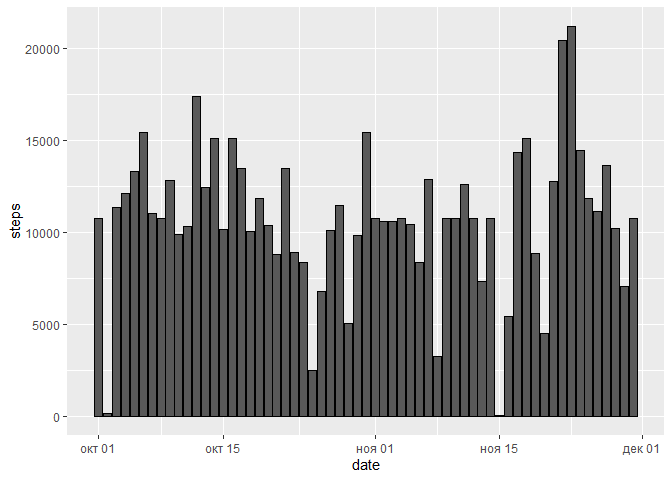
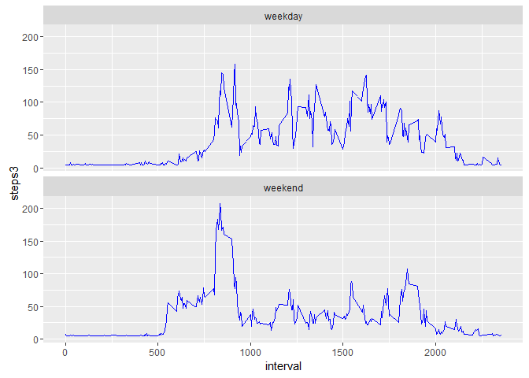

Introduction (version md.)

It is now possible to collect a large amount of data about personal
movement using activity monitoring devices such as a Fitbit, Nike
Fuelband, or Jawbone Up. These type of devices are part of the
"quantified self" movement - a group of enthusiasts who take
measurements about themselves regularly to improve their health, to find
patterns in their behavior, or because they are tech geeks. But these
data remain under-utilized both because the raw data are hard to obtain
and there is a lack of statistical methods and software for processing
and interpreting the data.

This assignment makes use of data from a personal activity monitoring
device. This device collects data at 5 minute intervals through out the
day. The data consists of two months of data from an anonymous
individual collected during the months of October and November, 2012 and
include the number of steps taken in 5 minute intervals each day.

Dataset: Activity monitoring data [52K] The variables included in this
dataset are:

steps: Number of steps taking in a 5-minute interval (missing values are
coded as NA)

date: The date on which the measurement was taken in YYYY-MM-DD format

interval: Identifier for the 5-minute interval in which measurement was
taken

The dataset is stored in a comma-separated-value (CSV) file and there
are a total of 17,568 observations in this dataset.

The data for this assignment was downloaded from the course web site and
read with the read.csv R syntax:

    act <- read.csv("activity.csv",
                colClasses = c("numeric", "character","integer"))
    summary(act)

    ##      steps            date              interval     
    ##  Min.   :  0.00   Length:17568       Min.   :   0.0  
    ##  1st Qu.:  0.00   Class :character   1st Qu.: 588.8  
    ##  Median :  0.00   Mode  :character   Median :1177.5  
    ##  Mean   : 37.38                      Mean   :1177.5  
    ##  3rd Qu.: 12.00                      3rd Qu.:1766.2  
    ##  Max.   :806.00                      Max.   :2355.0  
    ##  NA's   :2304

In the next steps, the data is aggregated by date in order to:

1.  Calculate the total number of steps taken per day
2.  Make a histogram of the total number of steps taken each day
3.  Calculate and report the mean and median of the total number of
    steps taken per day

<!-- -->

    library(lubridate)
    library(plyr)

    ## 
    ## Attaching package: 'plyr'

    ## The following object is masked from 'package:lubridate':
    ## 
    ##     here

    library(dplyr)

    ## 
    ## Attaching package: 'dplyr'

    ## The following objects are masked from 'package:plyr':
    ## 
    ##     arrange, count, desc, failwith, id, mutate, rename, summarise,
    ##     summarize

    ## The following objects are masked from 'package:lubridate':
    ## 
    ##     intersect, setdiff, union

    ## The following objects are masked from 'package:stats':
    ## 
    ##     filter, lag

    ## The following objects are masked from 'package:base':
    ## 
    ##     intersect, setdiff, setequal, union

    library(ggplot2)
    library(lattice)
    library(data.table)

    ## 
    ## Attaching package: 'data.table'

    ## The following objects are masked from 'package:dplyr':
    ## 
    ##     between, last

    ## The following objects are masked from 'package:lubridate':
    ## 
    ##     hour, mday, month, quarter, wday, week, yday, year

    library(knitr)
    library(rmarkdown)
    library("markdown")

    actAgg <- tapply(act$steps, act$date, FUN = sum, na.rm = TRUE)
    print(actAgg)

    ## 2012-10-01 2012-10-02 2012-10-03 2012-10-04 2012-10-05 2012-10-06 
    ##          0        126      11352      12116      13294      15420 
    ## 2012-10-07 2012-10-08 2012-10-09 2012-10-10 2012-10-11 2012-10-12 
    ##      11015          0      12811       9900      10304      17382 
    ## 2012-10-13 2012-10-14 2012-10-15 2012-10-16 2012-10-17 2012-10-18 
    ##      12426      15098      10139      15084      13452      10056 
    ## 2012-10-19 2012-10-20 2012-10-21 2012-10-22 2012-10-23 2012-10-24 
    ##      11829      10395       8821      13460       8918       8355 
    ## 2012-10-25 2012-10-26 2012-10-27 2012-10-28 2012-10-29 2012-10-30 
    ##       2492       6778      10119      11458       5018       9819 
    ## 2012-10-31 2012-11-01 2012-11-02 2012-11-03 2012-11-04 2012-11-05 
    ##      15414          0      10600      10571          0      10439 
    ## 2012-11-06 2012-11-07 2012-11-08 2012-11-09 2012-11-10 2012-11-11 
    ##       8334      12883       3219          0          0      12608 
    ## 2012-11-12 2012-11-13 2012-11-14 2012-11-15 2012-11-16 2012-11-17 
    ##      10765       7336          0         41       5441      14339 
    ## 2012-11-18 2012-11-19 2012-11-20 2012-11-21 2012-11-22 2012-11-23 
    ##      15110       8841       4472      12787      20427      21194 
    ## 2012-11-24 2012-11-25 2012-11-26 2012-11-27 2012-11-28 2012-11-29 
    ##      14478      11834      11162      13646      10183       7047 
    ## 2012-11-30 
    ##          0

    library(lubridate)
    act$date <- ymd(act$date)
    summary(actAgg)

    ##    Min. 1st Qu.  Median    Mean 3rd Qu.    Max. 
    ##       0    6778   10400    9354   12810   21190

    library(data.table)
    actAgg_dt=data.table(actAgg)
    summary(actAgg_dt)

    ##        V1       
    ##  Min.   :    0  
    ##  1st Qu.: 6778  
    ##  Median :10395  
    ##  Mean   : 9354  
    ##  3rd Qu.:12811  
    ##  Max.   :21194

    mean(actAgg_dt$V1)

    ## [1] 9354.23

    median(actAgg_dt$V1)

    ## [1] 10395

    library(plyr)
    library(dplyr)

    steps1 <- act %>%
      filter(!is.na(steps)) %>%
      group_by(date) %>%
      summarize(steps = sum(steps)) %>%
      print

    ## Source: local data frame [53 x 2]
    ## 
    ##          date steps
    ##        (time) (dbl)
    ## 1  2012-10-02   126
    ## 2  2012-10-03 11352
    ## 3  2012-10-04 12116
    ## 4  2012-10-05 13294
    ## 5  2012-10-06 15420
    ## 6  2012-10-07 11015
    ## 7  2012-10-09 12811
    ## 8  2012-10-10  9900
    ## 9  2012-10-11 10304
    ## 10 2012-10-12 17382
    ## ..        ...   ...

    barplot(steps1$steps, names.arg=steps1$date, 
            main= 'Total Number of Steps per day',
            xlab='Dates', ylab='Steps')

<!-- -->

What is the average daily activity pattern?

    intervl <- act %>%
      filter(!is.na(steps)) %>%
      group_by(interval) %>%
      summarize(steps = mean(steps)) %>%
      print    

    ## Source: local data frame [288 x 2]
    ## 
    ##    interval     steps
    ##       (int)     (dbl)
    ## 1         0 1.7169811
    ## 2         5 0.3396226
    ## 3        10 0.1320755
    ## 4        15 0.1509434
    ## 5        20 0.0754717
    ## 6        25 2.0943396
    ## 7        30 0.5283019
    ## 8        35 0.8679245
    ## 9        40 0.0000000
    ## 10       45 1.4716981
    ## ..      ...       ...

Time series plot of the 5-minute interval (x-axis) and the average
number of steps taken, averaged across all days (y-axis)

    plot(intervl, type = 'l')

<!-- -->

Which 5-minute interval, on average across all the days in the dataset,
contains the maximum number of steps?

    intervl[which.max(intervl$steps), ]$interval

    ## [1] 835

Imputing missing values

There are a number of days/intervals where there are missing values
(coded as NA). The presence of missing days may introduce bias into some
calculations or summaries of the data.

Calculate and report the total number of missing values in the dataset
(i.e. the total number of rows with NAs).

    #values missing in orIginal dataset
    missing1 <- sum(is.na(act))
    missing1

    ## [1] 2304

Create a new dataset with the missing data filled in:

    act_miss_rep  <- transform(act, steps = ifelse(is.na(steps), round(mean(steps, na.rm=TRUE)), steps))

missing values replaced verification

    missing2 <- sum(is.na(act_miss_rep))
    missing2

    ## [1] 0

Summary of new dataset with missing values replaced:

    #values missing in orginal dataset
    summary(act_miss_rep)

    ##      steps             date               interval     
    ##  Min.   :  0.00   Min.   :2012-10-01   Min.   :   0.0  
    ##  1st Qu.:  0.00   1st Qu.:2012-10-16   1st Qu.: 588.8  
    ##  Median :  0.00   Median :2012-10-31   Median :1177.5  
    ##  Mean   : 37.33   Mean   :2012-10-31   Mean   :1177.5  
    ##  3rd Qu.: 37.00   3rd Qu.:2012-11-15   3rd Qu.:1766.2  
    ##  Max.   :806.00   Max.   :2012-11-30   Max.   :2355.0

Make a histogram of the total number of steps taken each day and
Calculate and report the mean and median total number of steps taken per
day.

    steps2 <- act_miss_rep %>%
      group_by(date) %>%
      summarize(steps = sum(steps)) %>%
      print      

    ## Source: local data frame [61 x 2]
    ## 
    ##          date steps
    ##        (time) (dbl)
    ## 1  2012-10-01 10656
    ## 2  2012-10-02   126
    ## 3  2012-10-03 11352
    ## 4  2012-10-04 12116
    ## 5  2012-10-05 13294
    ## 6  2012-10-06 15420
    ## 7  2012-10-07 11015
    ## 8  2012-10-08 10656
    ## 9  2012-10-09 12811
    ## 10 2012-10-10  9900
    ## ..        ...   ...

    barplot(steps2$steps, names.arg=steps2$date, 
            main= 'Total numbers of Steps per day',
            xlab='Dates', ylab='Steps - *missing values replaced with the mean of steps')

<!-- -->
Do these values differ from the estimates from the first part of the
assignment? What is the impact of imputing missing data on the estimates
of the total daily number of steps?

    #aggregate corrected data by date to calculate daily stats 

    actAgg2 <- tapply(act_miss_rep$steps, act_miss_rep$date, FUN = sum, na.rm = TRUE)
    act$date <- ymd(act_miss_rep$date)

    #mean and median total number of steps taken per day
    mean(actAgg2)

    ## [1] 10751.74

    median(actAgg2)

    ## [1] 10656

    #DO VALUES DIFFER?
    diff_in_means=mean(actAgg)-mean(actAgg2)
    diff_in_means

    ## [1] -1397.508

    # Do the data estimates differ from the first part of the assignment?

    summary(actAgg)

    ##    Min. 1st Qu.  Median    Mean 3rd Qu.    Max. 
    ##       0    6778   10400    9354   12810   21190

    summary(actAgg2)

    ##    Min. 1st Qu.  Median    Mean 3rd Qu.    Max. 
    ##      41    9819   10660   10750   12810   21190

    #What is the impact of imputing missing data on the estimates 
    #of the total daily number of steps?

    summary(actAgg2)-summary(actAgg)

    ##    Min. 1st Qu.  Median    Mean 3rd Qu.    Max. 
    ##      41    3041     260    1396       0       0

third part
==========

Are there differences in activity patterns between weekdays and
weekends?

A new factor variable (d\_type) in a third dataset (act\_weekday\_ind)
has been created. It has two levels - "weekday" and "weekend"--
indicating whether a given date is a weekday or weekend day.

    act_weekday_ind=act_miss_rep
    act_weekday_ind$d_type[as.POSIXlt(act_weekday_ind$date)$wday %in% c(0,6)] <- "weekday"
    act_weekday_ind$d_type[as.POSIXlt(act_weekday_ind$date)$wday %in% c(1:5)] <- "weekend"
    table(act_weekday_ind$d_type,as.POSIXlt(act_weekday_ind$date)$wday)

    ##          
    ##              0    1    2    3    4    5    6
    ##   weekday 2304    0    0    0    0    0 2304
    ##   weekend    0 2592 2592 2592 2592 2592    0

Time series plot of the 5-minute interval (x-axis) and the average
number of steps taken, averaged across all weekday days or weekend days
(y-axis).

    actAgg3 <- act_weekday_ind  %>% 
      group_by(d_type, interval) %>%
      summarize(steps3 = mean(steps))

plot

    library(ggplot2)
    ggplot(actAgg3, aes(interval,steps3))+geom_line(color="blue")+
        facet_wrap(~d_type, ncol=1)

<!-- -->
