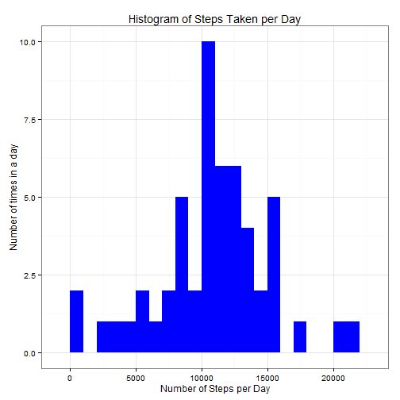
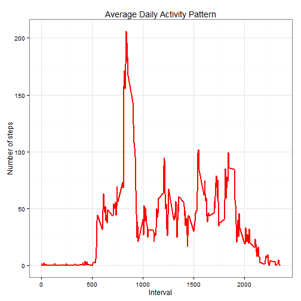
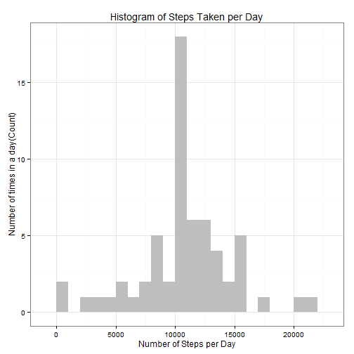
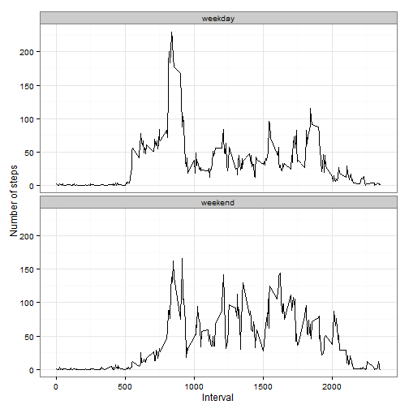

---

# Reproducible Research: Peer assessment 1
###### Github repository with RMarkdown source code: https://github.com/rostislavuhlir/RepData_PeerAssessment1
output: 
  html_document: 
    toc: yes
---
## Setting the necessary R environment

While writing code chunks in the R markdown document, **always use echo = TRUE** so that someone else will be able to read the code. 

First, we set echo equal a **TRUE** and results equal a **'hold'** as global options for this document.  

```r
library(knitr)
opts_chunk$set(echo = TRUE, results = 'hold')
```

### Load required libraries

```r
library(data.table)
library(ggplot2) # ggplot2 used for plotting the figures
```

## Loading and preprocessing the data
This assignment makes use of data from a personal activity monitoring device. This device collects data at 5 minute intervals through out the day. The data consists of two months of data from an anonymous individual collected during the months of October and November, 2012 and include the number of steps taken in 5 minute intervals each day.  

Show any code that is needed to:  

1. Load the data (i.e. > <font color='red'>read.csv()</font>)  
2. Process/transform the data (if necessary) into a format suitable for your analysis
### Load the required data

The following statement is used to load the data using `read.csv()`.

**Note**: It is assumed that the file activity.csv is in the current working directory. File can be downloaded from [here](https://d396qusza40orc.cloudfront.net/repdata%2Fdata%2Factivity.zip)


```r
rdata <- read.csv('activity.csv', header = TRUE, sep = ",",
                  colClasses=c("numeric", "character", "numeric"))
```

### Create a tidy data set

Here, we convert the **date** field to `Date` class and **interval** field to `Factor` class.


```r
rdata$date <- as.Date(rdata$date, format = "%Y-%m-%d")
rdata$interval <- as.factor(rdata$interval)
```

We can now check the data using `str()` function:


```r
str(rdata)
```

```
## 'data.frame':	17568 obs. of  3 variables:
##  $ steps   : num  NA NA NA NA NA NA NA NA NA NA ...
##  $ date    : Date, format: "2012-10-01" "2012-10-01" ...
##  $ interval: Factor w/ 288 levels "0","5","10","15",..: 1 2 3 4 5 6 7 8 9 10 ...
```


## What is mean total number of steps taken per day?

For this part of the assignment, we can ignore the missing values in the dataset.

1. Calculate the total number of steps taken per day.


```r
steps_per_day <- aggregate(steps ~ date, rdata, sum)
colnames(steps_per_day) <- c("date","steps")
head(steps_per_day)
```

```
##         date steps
## 1 2012-10-02   126
## 2 2012-10-03 11352
## 3 2012-10-04 12116
## 4 2012-10-05 13294
## 5 2012-10-06 15420
## 6 2012-10-07 11015
```

2. Make a histogram of the total number of steps taken each day plotted appropriately.


```r
ggplot(steps_per_day, aes(x = steps)) + 
       geom_histogram(fill = "blue", binwidth = 1000) + 
        labs(title="Histogram of Steps Taken per Day", 
             x = "Number of Steps per Day", y = "Number of times in a day") + theme_bw() 
```

 

3. Calculate and report the ***mean*** and ***median*** of the number of steps taken per day.


```r
steps_mean   <- mean(steps_per_day$steps, na.rm=TRUE)
steps_median <- median(steps_per_day$steps, na.rm=TRUE)
```

The mean is **10766.189** and median is **10765**.


## What is the average daily activity pattern?

We calculate the aggregation of steps by intervals of 5-minutes and convert the intervals as integers and save them in a data frame called `steps_per_interval`.


```r
steps_per_interval <- aggregate(rdata$steps, 
                                by = list(interval = rdata$interval),
                                FUN=mean, na.rm=TRUE)
#convert to integers
##this helps in plotting
steps_per_interval$interval <- 
        as.integer(levels(steps_per_interval$interval)[steps_per_interval$interval])
colnames(steps_per_interval) <- c("interval", "steps")
```


1. We make the plot with the time series of the average number of steps taken averaged across all days versus the 5-minute intervals:


```r
ggplot(steps_per_interval, aes(x=interval, y=steps)) +   
        geom_line(color="red", size=1) +  
        labs(title="Average Daily Activity Pattern", x="Interval", y="Number of steps") +  
        theme_bw()
```

 


2. We find the 5-minute interval with the maximum number of steps:


```r
max_interval <- steps_per_interval[which.max(  
        steps_per_interval$steps),]
```

The **835<sup>th</sup>** interval has maximum **206** steps.


## Imputing missing values
### 1. Total number of missing values:

The total number of missing values in steps can be calculated using `is.na()` method to check whether the value is mising or not and then summing the logical vector.


```r
missing_vals <- sum(is.na(rdata$steps))
```

The total number of ***missing values*** is **2304**.

### 2. Strategy for filling in all of the missing values in the dataset

To populate missing values, we choose to replace them with the mean value at the same interval across days.

We create a function `na_fill(data, pervalue)` where the `data` argument is the `rdata` data frame and `pervalue` argument is the `steps_per_interval` data frame.


```r
na_fill <- function(data, pervalue) {
        na_index <- which(is.na(data$steps))
        na_replace <- unlist(lapply(na_index, FUN=function(idx){
                interval = data[idx,]$interval
                pervalue[pervalue$interval == interval,]$steps
        }))
        fill_steps <- data$steps
        fill_steps[na_index] <- na_replace
        fill_steps
}

rdata_fill <- data.frame(  
        steps = na_fill(rdata, steps_per_interval),  
        date = rdata$date,  
        interval = rdata$interval)
str(rdata_fill)
```

```
## 'data.frame':	17568 obs. of  3 variables:
##  $ steps   : num  1.717 0.3396 0.1321 0.1509 0.0755 ...
##  $ date    : Date, format: "2012-10-01" "2012-10-01" ...
##  $ interval: Factor w/ 288 levels "0","5","10","15",..: 1 2 3 4 5 6 7 8 9 10 ...
```

Check if there are any missing values remaining


```r
sum(is.na(rdata_fill$steps))
```

```
## [1] 0
```

Zero output shows that there are ***NO MISSING VALUES***.


### 3. A histogram of the total number of steps taken each day

Now we plot a histogram of the daily total number of steps taken, plotted after filling missing values.


```r
fill_steps_per_day <- aggregate(steps ~ date, rdata_fill, sum)
colnames(fill_steps_per_day) <- c("date","steps")

##plotting the histogram
ggplot(fill_steps_per_day, aes(x = steps)) + 
       geom_histogram(fill = "grey", binwidth = 1000) + 
        labs(title="Histogram of Steps Taken per Day", 
             x = "Number of Steps per Day", y = "Number of times in a day(Count)") + theme_bw() 
```

 

### Calculate and report the **mean** and **median** total number of steps taken per day.


```r
steps_mean_fill   <- mean(fill_steps_per_day$steps, na.rm=TRUE)
steps_median_fill <- median(fill_steps_per_day$steps, na.rm=TRUE)
```

The mean is **10766.189** and median is **10766.189**.

### Do these values differ from the estimates from the first part of the assignment?

Yes, these values differ slightly.

- **Before filling the data**
    1. Mean  : **10766.189**
    2. Median: **10765**
    
    
- **After filling the data**
    1. Mean  : **10766.189**
    2. Median: **10766.189**

We see that the values after filling the data mean and median are equal.

### What is the impact of imputing missing data on the estimates of the total daily number of steps?

Comparing the calculations done in the first part of this document and the calculations done in the second part, we observe that while the mean value remains unchanged, the median value has changed and matches the mean.  

The impact of aggregating missing values has increased the peak, but it does not have any negative impact on our predictions. 


## Are there differences in activity patterns between weekdays and weekends?

We do this comparison with the table with filled-in missing values.  
1. Augment the table with a column that indicates the day of the week  
2. Subset the table into two parts - weekends (Saturday and Sunday) and weekdays (Monday through Friday).  
3. Tabulate the average steps per interval for each data set.  
4. Plot the two data sets side by side for comparison.  


```r
weekdays_steps <- function(data) {
    weekdays_steps <- aggregate(data$steps, by=list(interval = data$interval),
                          FUN=mean, na.rm=T)
    # convert to integers for plotting
    weekdays_steps$interval <- 
            as.integer(levels(weekdays_steps$interval)[weekdays_steps$interval])
    colnames(weekdays_steps) <- c("interval", "steps")
    weekdays_steps
}

data_by_weekdays <- function(data) {
    data$weekday <- 
            as.factor(weekdays(data$date)) # weekdays
    weekend_data <- subset(data, weekday %in% c("Saturday","Sunday"))
    weekday_data <- subset(data, !weekday %in% c("Saturday","Sunday"))
    
    weekend_steps <- weekdays_steps(weekend_data)
    weekday_steps <- weekdays_steps(weekday_data)
    
    weekend_steps$dayofweek <- rep("weekend", nrow(weekend_steps))
    weekday_steps$dayofweek <- rep("weekday", nrow(weekday_steps))
    
    data_by_weekdays <- rbind(weekend_steps, weekday_steps)
    data_by_weekdays$dayofweek <- as.factor(data_by_weekdays$dayofweek)
    data_by_weekdays
}

data_weekdays <- data_by_weekdays(rdata_fill)
```

Below you can see the panel plot comparing the average number of steps taken per 5-minute interval across weekdays and weekends:

```r
ggplot(data_weekdays, aes(x=interval, y=steps)) + 
        geom_line(color="black") + 
        facet_wrap(~ dayofweek, nrow=2, ncol=1) +
        labs(x="Interval", y="Number of steps") +
        theme_bw()
```

 

We observe that weekend activities have more peaks over a hundred than during the weekdays. This could result from the fact that during the weekday, we usually try to intensify our activities in a very short time after work. During the weekend we can see a better distribution of effort over the period of time.
