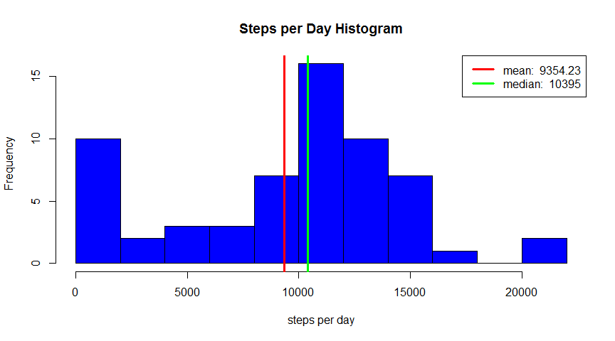
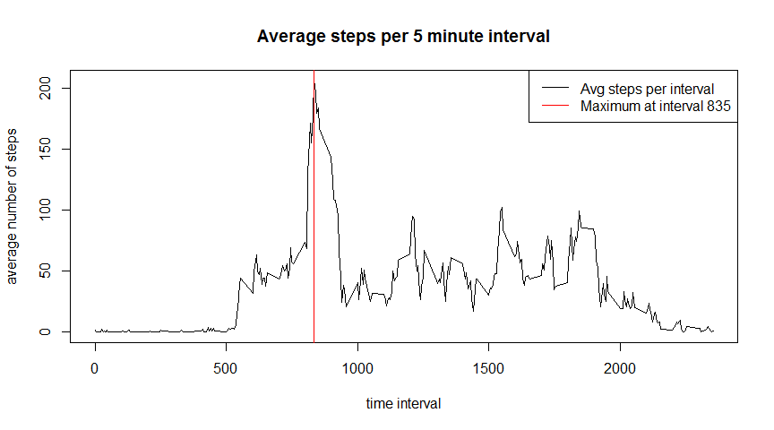
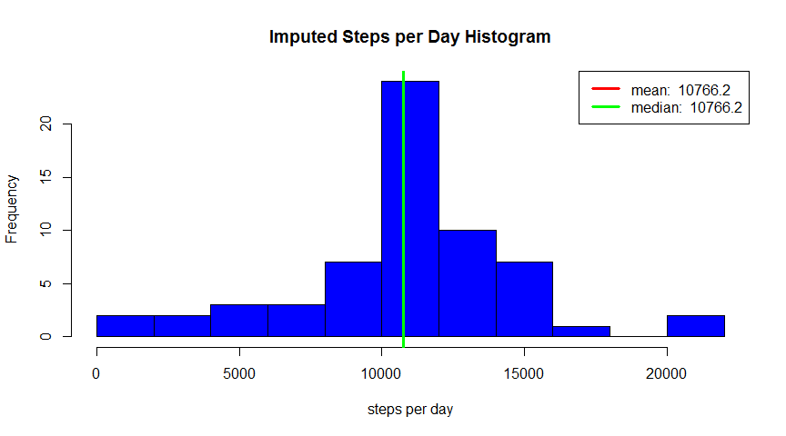
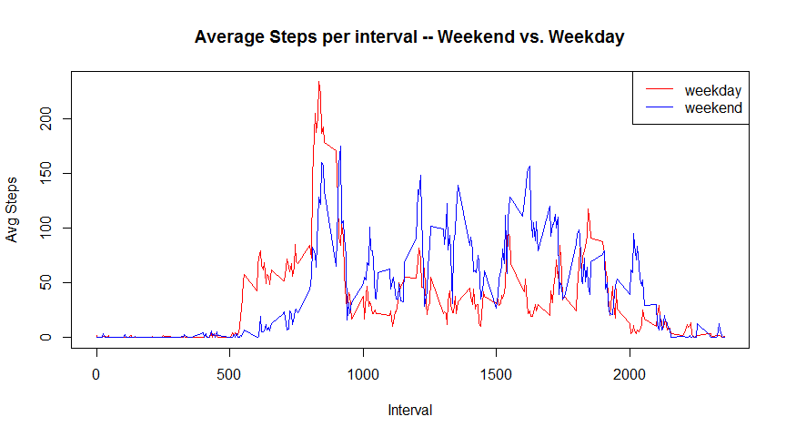

# Reproducible Research: Peer Assessment 1


## Loading and preprocessing the data


```r
library('dplyr')
```

```
## 
## Attaching package: 'dplyr'
```

```
## The following objects are masked from 'package:stats':
## 
##     filter, lag
```

```
## The following objects are masked from 'package:base':
## 
##     intersect, setdiff, setequal, union
```

```r
rm (list=ls())
setwd("~/GitHub/RepData_PeerAssessment1")
steps <- read.table(unz("activity.zip", "activity.csv"), header=T, quote="\"", sep=",")
```

And showing a summary of the loaded data


```r
summary(steps)
```

```
##      steps                date          interval     
##  Min.   :  0.00   2012-10-01:  288   Min.   :   0.0  
##  1st Qu.:  0.00   2012-10-02:  288   1st Qu.: 588.8  
##  Median :  0.00   2012-10-03:  288   Median :1177.5  
##  Mean   : 37.38   2012-10-04:  288   Mean   :1177.5  
##  3rd Qu.: 12.00   2012-10-05:  288   3rd Qu.:1766.2  
##  Max.   :806.00   2012-10-06:  288   Max.   :2355.0  
##  NA's   :2304     (Other)   :15840
```


-------------

## What is mean total number of steps taken per day?


```r
steps.per.day <- steps %>% group_by(date) %>% summarize(sum=sum(steps, na.rm=T))

## Plot the histogram of steps per day
hist(steps.per.day$sum, col="blue", main="Steps per Day Histogram", xlab = "steps per day", breaks=8)
abline(v=mean(steps.per.day$sum, na.rm=T), col="red", lwd=3)
abline(v=median(steps.per.day$sum, na.rm=T), col="green", lwd=3) 
legend("topright", lwd=c(3,3), col=c("red", "green"),   
    legend=c(paste("mean: ",signif(mean(steps.per.day$sum, na.rm=T),6)),
             paste("median: ",signif(median(steps.per.day$sum, na.rm=T),6))
            )
    )
```

<!-- -->

-------------

## What is the average daily activity pattern?


```r
steps$intfactor <- factor(format(steps$interval,digits=4))

steps.per.interval <- steps %>% group_by(interval) %>% 
  summarize(avg=mean(steps, na.rm=T))

with(steps.per.interval, plot(interval, avg,type="l", 
    main="Average steps per 5 minute interval", ylab="average number of steps",
    xlab="time interval"))
avgmax <- steps.per.interval[which.max(steps.per.interval$avg),]$interval
abline(v=avgmax, col="red")
legend("topright", lwd=c(1,1), col=c("black","red"),   
    legend=c("Avg steps per interval",
             paste("Maximum at interval", avgmax)))
```

<!-- -->

-------------

## Imputing missing values


```r
missing <- is.na(steps)
total.missing <- sum(missing)
pct.missing <- signif(mean(missing)*100,3)
```

### Total missing values 2304 or 3.28% of the values.

I chose to impute the missing values with the mean of the same interval over the entire data set.


```r
# make new df with the average steps per interval as a new column
new.steps <- merge(steps, steps.per.interval, by="interval")
# add a new column 'imputed' that checks if the original steps is na, and then uses 
# the average if it is na
new.steps$imputed <- ifelse(is.na(new.steps$steps),new.steps$avg,new.steps$steps)

new.steps.per.day <- new.steps %>% group_by(date) %>% summarize(sum=sum(imputed, na.rm=T))
hist(new.steps.per.day$sum, col="blue", main="Imputed Steps per Day Histogram", 
     xlab = "steps per day", breaks=8)
abline(v=mean(new.steps.per.day$sum, na.rm=T), col="red", lwd=3)
abline(v=median(new.steps.per.day$sum, na.rm=T), col="green", lwd=3) 
legend("topright", lwd=c(3,3), col=c("red", "green"),   
    legend=c(paste("mean: ",signif(mean(new.steps.per.day$sum),6)),
             paste("median: ",signif(median(new.steps.per.day$sum),6))
            )
      )
```

<!-- -->

With the missing values imputed to the average, the median is essentially the same as the mean.

-------------

## Are there differences in activity patterns between weekdays and weekends?


```r
## add columns to original dataset for day of the week and weekday vs. weekend

steps$dayofweek <- factor(weekdays(as.Date(as.character(steps$date),'%Y-%m-%d')), 
                          levels=c("Sunday","Monday","Tuesday","Wednesday",
                                   "Thursday","Friday","Saturday"))
                          
steps$weekend <- factor(ifelse(steps$dayofweek %in% c("Saturday","Sunday"), "weekend", "weekday"))

steps.per.weekend <- steps %>% group_by(weekend,interval) %>% 
         summarize(avg=mean(steps, na.rm=T))

with(steps.per.weekend[steps.per.weekend$weekend == "weekday",], 
     plot(interval, avg, type="l", col="red", 
     main="Average Steps per interval -- Weekend vs. Weekday", xlab="Interval", ylab="Avg Steps" ))
with(steps.per.weekend[steps.per.weekend$weekend == "weekend",], points(interval, avg, type="l", col="blue"))
legend("topright", lwd=c(1,1), col=c("red","blue"), legend=c("weekday","weekend"))
```

<!-- -->

#### Observations

- Average activity starts later on the weekend days, around 0700 or 0800 vs. around 0500 on the weekdays
- Higher average activity during the middle of the day on weekends
- Higher activity later in the night on weekends, around between 1900 and 2100 vs. the weekdays.
- Would be interesting to look at Friday and Saturday nights vs. Sunday through Thursday nights.

-------------

Published by username: *Maurice* on *2016-05-26*.


