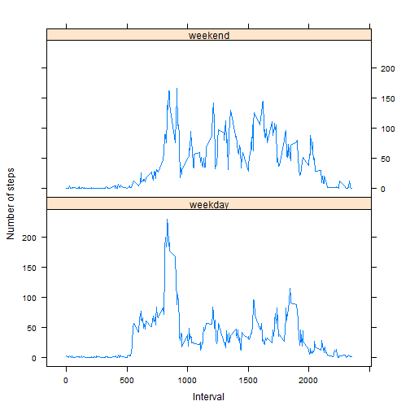

# Reproducible Research: Peer Assessment 1  
### Analysis of one personal activity monitoring device  
========================================================
  
  
Set locale to make the output of function weekdays() return english day names

```r
Sys.setlocale("LC_TIME", "English")
```

  
Set echo to true in code chunks so that others can read the code.

```r
opts_chunk$set(echo = TRUE)
```

  
## 1.Loading and preprocessing the data
  
### 1.1.Load the data

```r
download.file("https://d396qusza40orc.cloudfront.net/repdata%2Fdata%2Factivity.zip", 
    dest = "activity.zip")
```

```
## Error: 不支持这种URL方案
```

```r
unzip("activity.zip")
raw <- read.csv("activity.csv", na.strings = "NA")
```

  
### 1.2.Process the data into a format suitable for analysis

```r
raw$date <- as.Date(raw$date, "%Y-%m-%d")
raw$interval <- as.integer(raw$interval)
```

  
## 2.What is mean total number of steps taken per day?
For this part, ignore the missing values in the dataset first.
  
### 2.1.Make a histogram of the total number of steps taken each day

```r
raw.by.date <- split(raw, raw$date)
raw.stps <- sapply(raw.by.date, function(x) sum(x$steps))
hist(raw.stps, breaks = 10, main = "total number of steps taken each day", xlab = "steps")
```

 

  
### 2.2.Calculate and report the mean and median total number of steps taken per day

```r
mean.raw.stps <- mean(raw.stps, na.rm = T)
medi.raw.stps <- median(raw.stps, na.rm = T)
```

The **mean** total number of steps taken per day is **1.0766 &times; 10<sup>4</sup>**, and the **median** total number of steps taken per day is **10765**.
  
## 3.What is the average daily activity pattern?
  
### 3.1.Make a time series plot of the 5-minute interval and the average number of steps taken, averaged across all days

```r
raw.by.intv <- split(raw, raw$interval)
stp.by.intv <- sapply(raw.by.intv, function(x) mean(x$steps, na.rm = T))
plot(names(stp.by.intv), stp.by.intv, type = "l", main = "average daily activity pattern", 
    xlab = "interval", ylab = "steps")
```

 

  
### 3.2.Which 5-minute interval, on average across all the days in the dataset, contains the maximum number of steps?

```r
max.stps <- stp.by.intv[which(stp.by.intv == max(stp.by.intv))]
nam.stps <- names(max.stps)
```

The **835** 5-minute interval, on average across all the days in the dataset, contains the **maximum number of steps**, which is **206.1698** steps.
  
## 4.Imputing missing values
The presence of missing days may introduce bias into some calculations or summaries of the data. So now let's get rid of the NAs.
  
### 4.1.Calculate and report the total number of missing values in the dataset

```r
na <- table(is.na(raw$steps))[2]
```

The total number of **missing** values in the dataset is **2304**.
  
### 4.2.Filling in all of the missing values in the dataset.  
Use the mean for each 5-minute interval to replace NAs, set the values as integers to omit decimals. AND  
### 4.3.Create a new dataset "act" that is equal to the original dataset "raw" but with the missing data filled in.

```r
library(plyr)
```

```
## Warning: package 'plyr' was built under R version 3.0.3
```

```r
act <- ddply(raw, .(interval), transform, steps = ifelse(is.na(steps), mean(steps, 
    na.rm = TRUE), steps))
act$steps <- as.integer(act$steps)
```

  
### 4.4.Make a histogram of the total number of steps taken each day and Calculate and report the mean and median total number of steps taken per day.

```r
act.by.date <- split(act, act$date)
act.stps <- sapply(act.by.date, function(x) sum(x$steps))
hist(act.stps, breaks = 10, main = "total number of steps taken each day", xlab = "steps")
```

 

```r
mean.act.stps <- mean(act.stps, na.rm = T)
medi.act.stps <- median(act.stps, na.rm = T)
```

After filling in the missing values, the **mean** total number of steps taken per day is **1.075 &times; 10<sup>4</sup>**, and the **median** total number of steps taken per day is **10641**.
  
These values **differ slightly** from the estimates from the raw data. Imputing missing data **should not have a large impact** on the estimates of the total daily number of steps, or it will be translated differently from the raw data.
  
## 5.Are there differences in activity patterns between weekdays and weekends?
  
### 5.1.Create a new factor variable in the dataset with two levels �C “weekday” and “weekend” indicating whether a given date is a weekday or weekend day.

```r
act$weekdays <- "weekday"
act$weekdays[weekdays(act$date) %in% c("Saturday", "Sunday")] <- "weekend"
```

  
### 5.2.Make a panel plot containing a time series plot of the 5-minute interval  and the average number of steps taken, averaged across all weekday days or weekend days.

```r
act.by.wkdy <- split(act, act$weekdays)
act.by.wkdy.by.intv <- lapply(act.by.wkdy, function(x) split(x, x$interval))
fina <- data.frame(interval = as.integer(rep(names(table(act$interval)), times = 2)), 
    steps = c(sapply(act.by.wkdy.by.intv[[1]], function(x) mean(x$steps)), sapply(act.by.wkdy.by.intv[[2]], 
        function(x) mean(x$steps))), weekdays = rep(c("weekday", "weekend"), 
        each = 288))
library(lattice)
xyplot(steps ~ interval | weekdays, data = fina, type = "l", layout = c(1, 2), 
    xlab = "Interval", ylab = "Number of steps")
```

 

We can see from the plot, that number of steps is **distributed more averagely on weekends than weekdays**. There is a peak in weekday plot between 800-850 interval.
