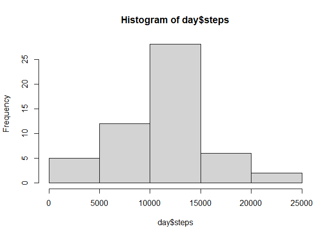
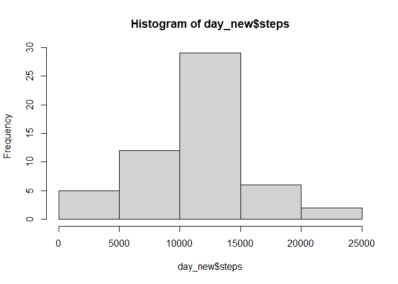
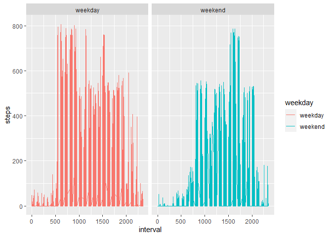

## Loading and preprocessing the data

```r
df<-read.csv("activity.csv", header=TRUE)
df_clean<-df[complete.cases(df), ]
df_clean$date<-as.Date(df_clean$date)    
df_clean$interval<-as.numeric(df_clean$interval)
summary(df_clean)
```

```
##      steps             date               interval     
##  Min.   :  0.00   Min.   :2012-10-02   Min.   :   0.0  
##  1st Qu.:  0.00   1st Qu.:2012-10-16   1st Qu.: 588.8  
##  Median :  0.00   Median :2012-10-29   Median :1177.5  
##  Mean   : 37.38   Mean   :2012-10-30   Mean   :1177.5  
##  3rd Qu.: 12.00   3rd Qu.:2012-11-16   3rd Qu.:1766.2  
##  Max.   :806.00   Max.   :2012-11-29   Max.   :2355.0
```

## What is mean total number of steps taken per day?


```r
# Group by day
library(lubridate)
library(dplyr)

day<- df_clean %>% 
      group_by(date = lubridate::floor_date(date, 'day')) %>%
      summarize(steps = sum(steps))

# Histogram of daily steps
hist(day$steps, fig.width=4, fig.height=4)
```

<!-- -->

```r
# Mean and median number of steps taken each day
summary(day$steps)
```

```
##    Min. 1st Qu.  Median    Mean 3rd Qu.    Max. 
##      41    8841   10765   10766   13294   21194
```

```r
mean(day$steps)
```

```
## [1] 10766.19
```

```r
median(day$steps)
```

```
## [1] 10765
```
### The mean and median of the total number of daily steps are:
### Mean = 10766.19
### Median = 10765


## What is the average daily activity pattern?


```r
# Time series plot
library(ggplot2)
p <- ggplot(day, aes(x=date, y=steps)) + geom_line() 
p
```

<!-- -->

```r
# Grouping by five-minute intervals, and sorting in descending order
library(dplyr)
options(digits=5)
five_min <- df_clean %>% group_by(interval) %>% 
    summarise(steps=mean(steps))

five_min[order(-five_min$steps),]
```

```
## # A tibble: 288 × 2
##    interval steps
##       <dbl> <dbl>
##  1      835  206.
##  2      840  196.
##  3      850  183.
##  4      845  180.
##  5      830  177.
##  6      820  171.
##  7      855  167.
##  8      815  158.
##  9      825  155.
## 10      900  143.
## # … with 278 more rows
```

### The interval with the highest average number of steps is the one at 8:35am.


## Imputing missing values


```r
# Computing missing values from original data
summary(df)
```

```
##      steps           date              interval   
##  Min.   :  0.0   Length:17568       Min.   :   0  
##  1st Qu.:  0.0   Class :character   1st Qu.: 589  
##  Median :  0.0   Mode  :character   Median :1178  
##  Mean   : 37.4                      Mean   :1178  
##  3rd Qu.: 12.0                      3rd Qu.:1766  
##  Max.   :806.0                      Max.   :2355  
##  NA's   :2304
```

```r
# Missing values (NA values) in the steps column are substituted by the 
# average number of steps in each interval of time
df_new<-df
df_new$steps[is.na(df_new$steps) == TRUE] <- five_min$steps[df_new$interval == five_min$interval]

# Grouping by day the newly completed dataset: 
df_new$date<-as.Date(df_new$date)    
df_new$interval<-as.numeric(df_new$interval)
df_new<-df_new[complete.cases(df_new), ]


library(lubridate)
library(dplyr)

day_new<- df_new %>% 
    group_by(date = lubridate::floor_date(date, 'day')) %>%
    summarize(steps = sum(steps))

# Histogram of daily steps in the newly completed dataset:
hist(day_new$steps)
```

<!-- -->

```r
#summary(day$steps) #without NA substitution
summary(day_new$steps) #with NA substitution
```

```
##    Min. 1st Qu.  Median    Mean 3rd Qu.    Max. 
##      41    8860   10766   10766   13191   21194
```

```r
mean(day_new$steps)
```

```
## [1] 10766
```

```r
median(day_new$steps)
```

```
## [1] 10766
```

### The total number of missing values is 2304. Missing values were substituted by the average number of steps in each interval of time. The difference obtained with the first part of the assignment is minimal. The average mean becomes equivalent to the mean (10766 steps).


## Are there differences in activity patterns between weekdays and weekends?

```r
# Grouping the data between weekdays and weekends

# Identifying the day of the week
df_new$weekday <- weekdays(df_new$date)

# Replacing each day of the week between weekday and weekend
df_new$weekday[(df_new$weekday == "lunes") | (df_new$weekday == "martes") | (df_new$weekday == "miércoles") | (df_new$weekday == "jueves") | (df_new$weekday == "viernes")]<-"weekday"
df_new$weekday[(df_new$weekday == "sábado") | (df_new$weekday == "domingo")] <- "weekend"

# Creating the panel graphs
library(ggplot2)
panel <- ggplot(df_new, aes(x=interval, y=steps, colour= weekday)) + geom_line() + facet_grid(~weekday) 
panel
```

<!-- -->
### There are differences between the distribution of steps during weekdays, and during weekends. During weekdays, the intervals with the higher number of steps are in the morning. During weekends, the intervals with the higher number of steps are in the afternoon.   

