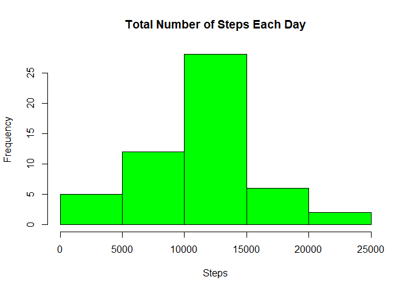
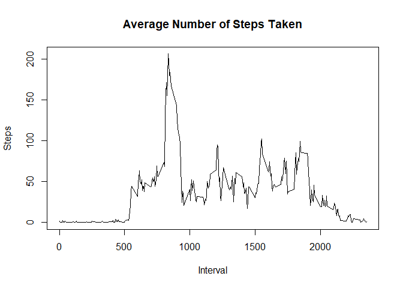
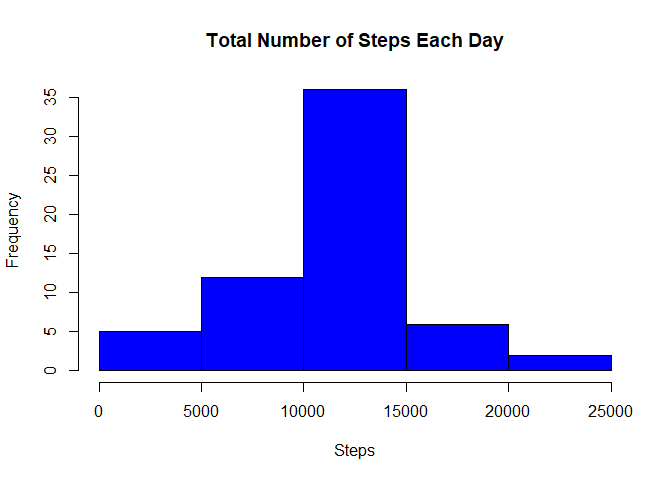
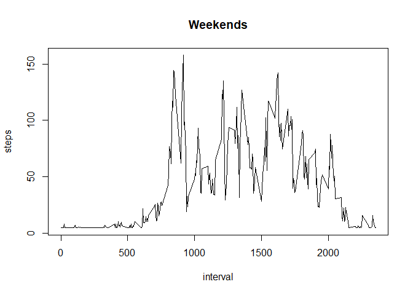

# Reproducible Research Project 1
November 3, 2017  


## Data Collection Overview
   Fit bit device collects data at 5 minute intervals through out the day. The data consists of two     months of data from an anonymous individual collected during the months of October and November,     2012 and include the number of steps taken in 5 minute intervals each day. Data is saved in          activity.csv. 

## Loading and preprocessing the data
   1. Load the data
   2. Process/transform the data into a format suitable for analysis


```r
      activity <- read.csv("activity.csv")
      activity$date <- as.Date(activity$date, format = "%Y-%m-%d")
```

## What is mean total number of steps taken per day?
   1. Calculate the total number of steps taken per day
   2. Make a histogram of the total number of steps taken each day
   3. Calculate and report the mean and median of the total number of steps taken per day


```r
    wrkActivity <- activity[!is.na(activity$steps), ]
    stepsPerDay <- aggregate(wrkActivity$steps ~ wrkActivity$date, FUN = sum)
    colnames(stepsPerDay) <- c("date", "steps")
    
    hist(stepsPerDay$steps, main = "Total Number of Steps Each Day", 
         xlab ="Steps", col="green")
```

<!-- -->

```r
    stepsPerDayMean <- mean(stepsPerDay$steps)
    stepsPerDayMean
```

```
## [1] 10766.19
```

```r
    stepsPerDayMedian <- median(stepsPerDay$steps)
    stepsPerDayMedian
```

```
## [1] 10765
```

## What is the average daily activity pattern?
   1. Make a time series plot (i.e. ) of the 5-minute interval (x-axis) and the average number 
      of steps taken, averaged across all days (y-axis)
   2. Which 5-minute interval, on average across all the days in the dataset, contains the 
      maximum number of steps?


```r
    avgStepsPerInterval <- aggregate(wrkActivity$steps ~ wrkActivity$interval, FUN = mean)
    colnames(avgStepsPerInterval) <- c("interval", "steps")
    
    plot(avgStepsPerInterval$interval, avgStepsPerInterval$steps, type="l", 
         xlab="Interval", ylab="Steps", main="Average Number of Steps Taken")
```

<!-- -->

```r
    maxInterval <-avgStepsPerInterval[which.max(avgStepsPerInterval$steps),1]
    maxInterval
```

```
## [1] 835
```

## Imputing missing values

   1. Calculate and report the total number of missing values in the dataset (i.e. the total 
      number of rows with NAs)
   
   2. Devise a strategy for filling in all of the missing values in the dataset. The strategy will        be based on filling in the NAs with the mean steps per interval over the days.

   3. Create a new dataset that is equal to the original dataset but with the missing data 
      fillled in.

   4. Make a histogram of the total number of steps taken each day and Calculate and report 
      the mean and median total number of steps taken per day. 


```r
      nrow(activity[is.na(activity$steps),])
```

```
## [1] 2304
```

```r
      meanIntervalSteps <- mean(avgStepsPerInterval$steps)
      
      wrkActivity <- activity
      
      wrkActivity$steps[which(is.na(wrkActivity))] <- meanIntervalSteps 
      
      stepsPerDay <- aggregate(wrkActivity$steps ~ wrkActivity$date, FUN = sum)
      colnames(stepsPerDay) <- c("date", "steps")
      
      hist(stepsPerDay$steps, main = "Total Number of Steps Each Day", 
         xlab ="Steps", col="blue")
```

<!-- -->

```r
      stepsPerDayMean <- mean(stepsPerDay$steps)
      stepsPerDayMean
```

```
## [1] 10766.19
```

```r
      stepsPerDayMedian <- median(stepsPerDay$steps)
      stepsPerDayMedian
```

```
## [1] 10766.19
```
      No significant change since the average was used to fill in the NAs
  
## Are there differences in activity patterns between weekdays and weekends?
1. Create a new factor variable in the dataset with two levels - "weekday" and "weekend" indicating    whether a given date is a weekday or weekend day.

2. Make a panel plot containing a time series plot (i.e. ) of the 5-minute interval (x-axis) and the    average number of steps taken, averaged across all weekday days or weekend days (y-axis). 


```r
      wrkActivity$DayOfWk <- factor(format(wrkActivity$date, "%A"))
      levels(wrkActivity$DayOfWk) <- list(weekday=c("Monday", "Tuesday", "Wednesday", 
                                                    "Thursday","Friday"), weekend = c("Saturday",
                                                                                    "Sunday")) 
      
      with(wrkActivity[wrkActivity$DayOfWk == "weekday",],
           plot(aggregate(steps ~ interval, FUN = mean), type = "l", main = "Weekdays"))
```

<!-- -->

```r
      with(wrkActivity[wrkActivity$DayOfWk == "weekend",], 
           plot(aggregate(steps ~ interval, FUN = mean), type = "l", main = "Weekends")) 
```

<!-- -->
      
