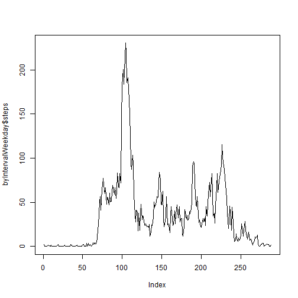

This is an R Markdown document for presenting Assignement 1 of the course.

This assignment makes use of data from a personal activity monitoring device. This device collects data at 5 minute intervals through out the day. The data consists of two months of data from an anonymous individual collected during the months of October and November, 2012 and include the number of steps taken in 5 minute intervals each day.

To complete this assignemet we will need the following libraries: library(plyr) for calculations and library(lattice) for plotting.


```r
library(plyr)
```

```
## Warning: package 'plyr' was built under R version 3.2.2
```

```r
library(lattice)
```

Then we read the table into r. To do so, we first set our working directory and read the data into r and see the variables of first two rows. Then covert the date into date class


```r
setwd("C:/Users/dpcortes/Desktop/Yo/R/Reproducible Research/Proyectos")
datos <- read.csv("activity.csv", header=T, sep=",", na.strings="NA")
head(datos, 2)
```

```
##   steps       date interval
## 1    NA 2012-10-01        0
## 2    NA 2012-10-01        5
```

```r
datos$date<-as.Date(datos$date, "%Y-%m-%d")
```

###What is mean total number of steps taken per day?

First, we need to get rid of the "NA" in the data, calculate the steps for each day and plot the histogram as a barplot


```r
tidydata<-na.omit(datos)
steps<-aggregate(steps ~ date, tidydata, sum)
hist(steps$steps, main="Total number of steps taken each day", xlab="Steps per Day", col="green")
```

 

Then, we calculate the mean and the median


```r
mean<-mean(steps$steps)
median<-median(steps$steps)
mean
```

```
## [1] 10766.19
```

```r
median
```

```
## [1] 10765
```

Both, mean and median in steps taken per day.

###What is the average daily activity pattern?

As interval is 5 minutes we need to average all the days for each 5 minute interval, 0, 5, 10... To do so we use the function `unique` in order to obtain a vector of all the intervals of every day. Then, we use `tapply` to obatin the average of each interval for all the days.


```r
Interval<-unique(tidydata$interval)
avgStep <- tapply(tidydata$steps, tidydata$interval, mean)
##and plot
plot(Interval,avgStep,type="l",ylab="Average steps", main="Average steps per interval")
```

 

To see Which 5-minute interval across all the days in the dataset contains,  on average, the maximum number of steps, we use the function `names` to find that one with the maximum average number of steps using `which.max()` argument.


```r
maximum <- names(which.max(avgStep))
maximum
```

```
## [1] "835"
```

So 835 interval has the maximum on average number of steps which are:


```r
avgStep[["835"]]
```

```
## [1] 206.1698
```

206.17.

###Imputing missing values

####1. Calculate and report the total number of missing values in the dataset (i.e. the total number of rows with NAs)

Is just the diference on rows from rought data and tidy data, and they amount to:


```r
Missing <- nrow(datos)-nrow(tidydata)
Missing
```

```
## [1] 2304
```

#### 2. Devise a strategy for filling in all of the missing values in the dataset. 

Using the work already done, a good fit would be to substitute the missing value with the average of the subject for that particular interval of the day.

#### 3. Create a new dataset that is equal to the original dataset but with the missing data filled in.


```r
isna <- is.na(datos)
datos2 <- datos
datos2$steps[which(isna)] <- avgStep[match(datos$interval[which(isna)], datos$interval)]
```

#### 4. Make a histogram of the total number of steps taken each day and Calculate and report the mean and median total number of steps taken per day. Do these values differ from the estimates from the first part of the assignment? What is the impact of imputing missing data on the estimates of the total daily number of steps?


```r
steps2 <- aggregate(steps ~ date, datos2, sum)
hist(steps2$steps, main="Total number of steps taken each day", xlab="Steps per Day", col="green")
```

 

Median an mean are:


```r
mean <- mean(steps2$steps)
median<- median(steps2$steps)
mean
```

```
## [1] 10766.19
```

```r
median
```

```
## [1] 10766.19
```

The mean and median are almost the same as the dataset omitted missing values, with a little difference in the scale of y axis. This is mainly because the NAs are replaced by the average value of the same interval as theirs. Typically doing this would only increase the frequency of each value of “steps per day”, would not make any effort to the distribution.

###Are there differences in activity patterns between weekdays and weekends?

We need to divide data into weekday data and weekend data. to do so we will use the function `weekdays` and use the dataset with the missing values filled in.

#### 1. Create a new factor variable in the dataset with two levels – “weekday” and “weekend” indicating whether a given date is a weekday or weekend day.


```r
day <- datos2$date
datos2 <- cbind(datos2,day)
datos2$day <- as.character(weekdays(datos2$day))
datos2$day <- gsub("lunes", "Weekday", datos2$day)
datos2$day <- gsub("martes", "Weekday", datos2$day)
datos2$day <- gsub("miércoles", "Weekday", datos2$day)
datos2$day <- gsub("jueves", "Weekday", datos2$day)
datos2$day <- gsub("viernes", "Weekday", datos2$day)
datos2$day <- gsub("sábado", "Weekend", datos2$day)
datos2$day <- gsub("domingo", "Weekend", datos2$day)
datos2$day <- as.factor(datos2$day)
```

#### 2. Make a panel plot containing a time series plot (i.e. type = "l") of the 5-minute interval (x-axis) and the average number of steps taken, averaged across all weekday days or weekend days (y-axis). 


```r
avgStep2 <- ddply(datos2, .(interval, day), summarize, steps = mean(steps))
xyplot(steps ~ interval | day, data = avgStep2, type = "l", layout = c(1, 2), 
    xlab = "Interval", ylab = "Number of steps", main = "Average steps by day")
```

  


