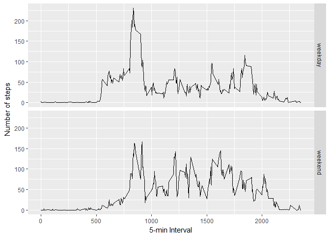

# Course Project 1 - Reproducible Research
Ivana  
9 May 2017  


## Loading and preprocessing the data

Show any code that is needed to:

1) Load the data (i.e. read.csv())
2) Process/transform the data (if necessary) into a format suitable for your analysis


```r
temp <- tempfile()
download.file( "https://d396qusza40orc.cloudfront.net/repdata%2Fdata%2Factivity.zip",temp)
data <- read.csv( unzip( temp, "activity.csv") )
```

## What is mean total number of steps taken per day?

For this part of the assignment, you can ignore the missing values in the dataset.

1) Calculate the total number of steps taken per day


```r
data_day <- aggregate( data$steps, by = list(Category = data$date), FUN = sum )
```

2) Make a histogram of the total number of steps taken each day


```r
hist_day <- ggplot( data_day, aes( x ) )
hist_day <- hist_day + labs( x = "Number of steps a day", y = "Frequency")
hist_day <- hist_day + geom_histogram( binwidth = 1000, fill = "navy", color = "black")
hist_day
```

```
## Warning: Removed 8 rows containing non-finite values (stat_bin).
```

<!-- -->

3) Calculate and report the mean and median of the total number of steps taken per day

Mean by date

```r
aggregate( data$steps, by = list(Category = data$date), FUN = mean )
```

```
##      Category          x
## 1  2012-10-01         NA
## 2  2012-10-02  0.4375000
## 3  2012-10-03 39.4166667
## 4  2012-10-04 42.0694444
## 5  2012-10-05 46.1597222
## 6  2012-10-06 53.5416667
## 7  2012-10-07 38.2465278
## 8  2012-10-08         NA
## 9  2012-10-09 44.4826389
## 10 2012-10-10 34.3750000
## 11 2012-10-11 35.7777778
## 12 2012-10-12 60.3541667
## 13 2012-10-13 43.1458333
## 14 2012-10-14 52.4236111
## 15 2012-10-15 35.2048611
## 16 2012-10-16 52.3750000
## 17 2012-10-17 46.7083333
## 18 2012-10-18 34.9166667
## 19 2012-10-19 41.0729167
## 20 2012-10-20 36.0937500
## 21 2012-10-21 30.6284722
## 22 2012-10-22 46.7361111
## 23 2012-10-23 30.9652778
## 24 2012-10-24 29.0104167
## 25 2012-10-25  8.6527778
## 26 2012-10-26 23.5347222
## 27 2012-10-27 35.1354167
## 28 2012-10-28 39.7847222
## 29 2012-10-29 17.4236111
## 30 2012-10-30 34.0937500
## 31 2012-10-31 53.5208333
## 32 2012-11-01         NA
## 33 2012-11-02 36.8055556
## 34 2012-11-03 36.7048611
## 35 2012-11-04         NA
## 36 2012-11-05 36.2465278
## 37 2012-11-06 28.9375000
## 38 2012-11-07 44.7326389
## 39 2012-11-08 11.1770833
## 40 2012-11-09         NA
## 41 2012-11-10         NA
## 42 2012-11-11 43.7777778
## 43 2012-11-12 37.3784722
## 44 2012-11-13 25.4722222
## 45 2012-11-14         NA
## 46 2012-11-15  0.1423611
## 47 2012-11-16 18.8923611
## 48 2012-11-17 49.7881944
## 49 2012-11-18 52.4652778
## 50 2012-11-19 30.6979167
## 51 2012-11-20 15.5277778
## 52 2012-11-21 44.3993056
## 53 2012-11-22 70.9270833
## 54 2012-11-23 73.5902778
## 55 2012-11-24 50.2708333
## 56 2012-11-25 41.0902778
## 57 2012-11-26 38.7569444
## 58 2012-11-27 47.3819444
## 59 2012-11-28 35.3576389
## 60 2012-11-29 24.4687500
## 61 2012-11-30         NA
```

Median by date

```r
aggregate( x = data$steps, by = list(Category = data$date), FUN = function( x ) { median(x, na.rm = TRUE ) } )
```

```
##      Category  x
## 1  2012-10-01 NA
## 2  2012-10-02  0
## 3  2012-10-03  0
## 4  2012-10-04  0
## 5  2012-10-05  0
## 6  2012-10-06  0
## 7  2012-10-07  0
## 8  2012-10-08 NA
## 9  2012-10-09  0
## 10 2012-10-10  0
## 11 2012-10-11  0
## 12 2012-10-12  0
## 13 2012-10-13  0
## 14 2012-10-14  0
## 15 2012-10-15  0
## 16 2012-10-16  0
## 17 2012-10-17  0
## 18 2012-10-18  0
## 19 2012-10-19  0
## 20 2012-10-20  0
## 21 2012-10-21  0
## 22 2012-10-22  0
## 23 2012-10-23  0
## 24 2012-10-24  0
## 25 2012-10-25  0
## 26 2012-10-26  0
## 27 2012-10-27  0
## 28 2012-10-28  0
## 29 2012-10-29  0
## 30 2012-10-30  0
## 31 2012-10-31  0
## 32 2012-11-01 NA
## 33 2012-11-02  0
## 34 2012-11-03  0
## 35 2012-11-04 NA
## 36 2012-11-05  0
## 37 2012-11-06  0
## 38 2012-11-07  0
## 39 2012-11-08  0
## 40 2012-11-09 NA
## 41 2012-11-10 NA
## 42 2012-11-11  0
## 43 2012-11-12  0
## 44 2012-11-13  0
## 45 2012-11-14 NA
## 46 2012-11-15  0
## 47 2012-11-16  0
## 48 2012-11-17  0
## 49 2012-11-18  0
## 50 2012-11-19  0
## 51 2012-11-20  0
## 52 2012-11-21  0
## 53 2012-11-22  0
## 54 2012-11-23  0
## 55 2012-11-24  0
## 56 2012-11-25  0
## 57 2012-11-26  0
## 58 2012-11-27  0
## 59 2012-11-28  0
## 60 2012-11-29  0
## 61 2012-11-30 NA
```

## What is the average daily activity pattern?

1) Make a time series plot (i.e. type = "l") of the 5-minute interval (x-axis) and the average number of steps taken, averaged across all days (y-axis)

```r
data_int <- aggregate( data$steps, by = list(Category = data$interval), FUN = function( x ) { mean( x, na.rm = TRUE ) })
pl_int <- ggplot( data_int, aes( Category, x ) )
pl_int + geom_line() + labs( x = "5-min Interval", y = "Number of steps")
```

<!-- -->

2) Which 5-minute interval, on average across all the days in the dataset, contains the maximum number of steps?

```r
max <- data_int[ data_int$x == max(data_int$x ), ]
max
```

```
##     Category        x
## 104      835 206.1698
```
## Imputing missing values

Note that there are a number of days/intervals where there are missing values (coded as NA). The presence of missing days may introduce bias into some calculations or summaries of the data.

1) Calculate and report the total number of missing values in the dataset (i.e. the total number of rows with NAs)

```r
sum(is.na(data))
```

```
## [1] 2304
```

2) Devise a strategy for filling in all of the missing values in the dataset. The strategy does not need to be sophisticated. For example, you could use the mean/median for that day, or the mean for that 5-minute interval, etc.

3) Create a new dataset that is equal to the original dataset but with the missing data filled in.

```r
data_na <- data
intervals <- unique( as.integer(data$interval) )
for(int in intervals){ data_na[ (data_na$interval == int) & (is.na( data_na$steps )), ]$steps <- data_int[ data_int$Category == int, ]$x }
```

4) Make a histogram of the total number of steps taken each day

```r
data_na_day <- aggregate( data_na$steps, by = list(Category = data_na$date), FUN = sum )
hist_na_day <- ggplot( data_na, aes( steps ) )
hist_na_day <- hist_na_day + labs( x = "Number of steps per day", y = "Frequency")
hist_na_day <- hist_na_day + geom_histogram( binwidth = 10, fill = "navy", color = "black")
hist_na_day
```

<!-- -->

and Calculate and report the mean and median total number of steps taken per day. 

 Mean by date

```r
aggregate( data_na$steps, by = list(Category = data_na$date), FUN = mean )
```

```
##      Category          x
## 1  2012-10-01 37.3825996
## 2  2012-10-02  0.4375000
## 3  2012-10-03 39.4166667
## 4  2012-10-04 42.0694444
## 5  2012-10-05 46.1597222
## 6  2012-10-06 53.5416667
## 7  2012-10-07 38.2465278
## 8  2012-10-08 37.3825996
## 9  2012-10-09 44.4826389
## 10 2012-10-10 34.3750000
## 11 2012-10-11 35.7777778
## 12 2012-10-12 60.3541667
## 13 2012-10-13 43.1458333
## 14 2012-10-14 52.4236111
## 15 2012-10-15 35.2048611
## 16 2012-10-16 52.3750000
## 17 2012-10-17 46.7083333
## 18 2012-10-18 34.9166667
## 19 2012-10-19 41.0729167
## 20 2012-10-20 36.0937500
## 21 2012-10-21 30.6284722
## 22 2012-10-22 46.7361111
## 23 2012-10-23 30.9652778
## 24 2012-10-24 29.0104167
## 25 2012-10-25  8.6527778
## 26 2012-10-26 23.5347222
## 27 2012-10-27 35.1354167
## 28 2012-10-28 39.7847222
## 29 2012-10-29 17.4236111
## 30 2012-10-30 34.0937500
## 31 2012-10-31 53.5208333
## 32 2012-11-01 37.3825996
## 33 2012-11-02 36.8055556
## 34 2012-11-03 36.7048611
## 35 2012-11-04 37.3825996
## 36 2012-11-05 36.2465278
## 37 2012-11-06 28.9375000
## 38 2012-11-07 44.7326389
## 39 2012-11-08 11.1770833
## 40 2012-11-09 37.3825996
## 41 2012-11-10 37.3825996
## 42 2012-11-11 43.7777778
## 43 2012-11-12 37.3784722
## 44 2012-11-13 25.4722222
## 45 2012-11-14 37.3825996
## 46 2012-11-15  0.1423611
## 47 2012-11-16 18.8923611
## 48 2012-11-17 49.7881944
## 49 2012-11-18 52.4652778
## 50 2012-11-19 30.6979167
## 51 2012-11-20 15.5277778
## 52 2012-11-21 44.3993056
## 53 2012-11-22 70.9270833
## 54 2012-11-23 73.5902778
## 55 2012-11-24 50.2708333
## 56 2012-11-25 41.0902778
## 57 2012-11-26 38.7569444
## 58 2012-11-27 47.3819444
## 59 2012-11-28 35.3576389
## 60 2012-11-29 24.4687500
## 61 2012-11-30 37.3825996
```

Median by date

```r
aggregate( x = data_na$steps, by = list(Category = data_na$date), FUN = function( x ) { median(x, na.rm = TRUE ) } )
```

```
##      Category        x
## 1  2012-10-01 34.11321
## 2  2012-10-02  0.00000
## 3  2012-10-03  0.00000
## 4  2012-10-04  0.00000
## 5  2012-10-05  0.00000
## 6  2012-10-06  0.00000
## 7  2012-10-07  0.00000
## 8  2012-10-08 34.11321
## 9  2012-10-09  0.00000
## 10 2012-10-10  0.00000
## 11 2012-10-11  0.00000
## 12 2012-10-12  0.00000
## 13 2012-10-13  0.00000
## 14 2012-10-14  0.00000
## 15 2012-10-15  0.00000
## 16 2012-10-16  0.00000
## 17 2012-10-17  0.00000
## 18 2012-10-18  0.00000
## 19 2012-10-19  0.00000
## 20 2012-10-20  0.00000
## 21 2012-10-21  0.00000
## 22 2012-10-22  0.00000
## 23 2012-10-23  0.00000
## 24 2012-10-24  0.00000
## 25 2012-10-25  0.00000
## 26 2012-10-26  0.00000
## 27 2012-10-27  0.00000
## 28 2012-10-28  0.00000
## 29 2012-10-29  0.00000
## 30 2012-10-30  0.00000
## 31 2012-10-31  0.00000
## 32 2012-11-01 34.11321
## 33 2012-11-02  0.00000
## 34 2012-11-03  0.00000
## 35 2012-11-04 34.11321
## 36 2012-11-05  0.00000
## 37 2012-11-06  0.00000
## 38 2012-11-07  0.00000
## 39 2012-11-08  0.00000
## 40 2012-11-09 34.11321
## 41 2012-11-10 34.11321
## 42 2012-11-11  0.00000
## 43 2012-11-12  0.00000
## 44 2012-11-13  0.00000
## 45 2012-11-14 34.11321
## 46 2012-11-15  0.00000
## 47 2012-11-16  0.00000
## 48 2012-11-17  0.00000
## 49 2012-11-18  0.00000
## 50 2012-11-19  0.00000
## 51 2012-11-20  0.00000
## 52 2012-11-21  0.00000
## 53 2012-11-22  0.00000
## 54 2012-11-23  0.00000
## 55 2012-11-24  0.00000
## 56 2012-11-25  0.00000
## 57 2012-11-26  0.00000
## 58 2012-11-27  0.00000
## 59 2012-11-28  0.00000
## 60 2012-11-29  0.00000
## 61 2012-11-30 34.11321
```

Do these values differ from the estimates from the first part of the assignment?
- They differ, especially for the median. As per the histogram above, most of the values are zeros. So adding values for NAs moves the median substanially for those intervals that had NAs. 

What is the impact of imputing missing data on the estimates of the total daily number of steps?
- The impact is substantial, the first histogram showed steps in 1000s, while the second one shows that most days/intervals the number of recorded steps was 0.

## Are there differences in activity patterns between weekdays and weekends?

Create a new factor variable in the dataset with two levels - "weekday" and "weekend" indicating whether a given date is a weekday or weekend day.

```r
data_na$weekday <- weekdays(as.Date( data_na$date ) )
data_na[ is.element(data_na$weekday, c("Monday", "Tuesday", "Wednesday", "Thursday", "Friday")), ]$weekday <- "weekday"
data_na[ is.element(data_na$weekday, c("Saturday", "Sunday")), ]$weekday <- "weekend"
```

Make a panel plot containing a time series plot (i.e. type = "l") of the 5-minute interval (x-axis) and the average number of steps taken, averaged across all weekday days or weekend days (y-axis).

```r
data_na_week <- data_na[ data_na$weekday == "weekday", ]
weekday <- aggregate( data_na_week$steps, by = list(Category = data_na_week$interval), FUN = function( x ) { mean( x, na.rm = TRUE ) })
data_na_week <- data_na[ data_na$weekday == "weekend", ]
weekend <- aggregate( data_na_week$steps, by = list(Category = data_na_week$interval), FUN = function( x ) { mean( x, na.rm = TRUE ) })
weekday$weekday <- "weekday"
weekend$weekday <- "weekend"
week <- rbind(weekday, weekend)
pl_int_week <- ggplot( week, aes( Category, x ) )
pl_int_week + geom_line() + facet_grid(week$weekday ~. ) + labs( x = "5-min Interval", y = "Number of steps")
```

<!-- -->
