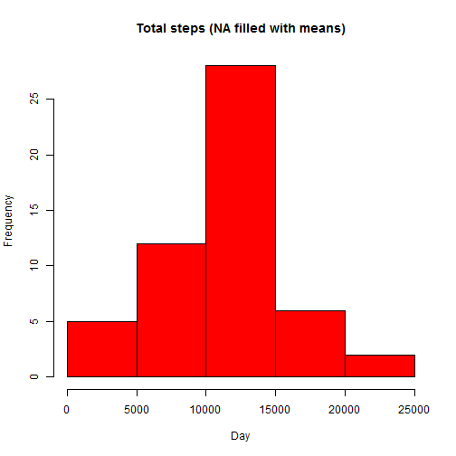

## Introduction

This assignment analyses the data from personal monitoring devices.

The data source is https://d396qusza40orc.cloudfront.net/repdata%2Fdata%2Factivity.zip and has got 17568 observations. 

Various requirements of the assignment are captured below.


## Loading and preprocessing the data


```r
activity_data <- read.csv("activity.csv")
```

##  What is mean total number of steps taken per day?

### Calculate the total number of steps taken per day


```r
total_steps <- tapply(activity_data$steps, activity_data$date, FUN=sum, na.rm=TRUE)
```
### Make a histogram of the total number of steps taken each day


```r
library(ggplot2)
qplot(total_steps, binwidth=1000, xlab="Total number of steps per day")
```

 

### Calculate and report the mean and median of the total number of steps taken per day


```r
mean(total_steps, na.rm=TRUE)
```

```
## [1] 9354.23
```

```r
median(total_steps, na.rm=TRUE)
```

```
## [1] 10395
```

## What is the average daily activity pattern?

### Time Series Plot

```r
avgSteps <- tapply(activity_data$steps,activity_data$interval,mean, na.rm=TRUE)
plot(names(avgSteps), avgSteps, type="l", main = "Time Series Plot", xlab="5-minute Intervals", ylab="Average Steps")
```

 

### Interval with Max number of steps


```r
as.numeric(names(which.max(avgSteps)))
```

```
## [1] 835
```

## Imputing missing values

### Calculate and report the total number of missing values in the dataset (i.e. the total number of rows with NAs)


```r
sum(is.na(activity_data))
```

```
## [1] 2304
```

## Devise a strategy for filling in all of the missing values in the dataset.


```r
activity_copy <- activity_data

meanInterval <-tapply(activity_data$steps, activity_data$interval,mean, na.rm=TRUE)
```

### Create an index of NAs and replace NAs with the mean for that interval in activity_copy. Each day contains 288 intervals of 5 mins.


```r
for (i in which(is.na(activity_copy)))
    {
    activity_copy[i,1] <- meanInterval[((i-1)%%288)+1]
    }
```

## Create a new dataset that is equal to the original dataset but with the missing data filled in.

### New dataset is activity_copy

##Make a histogram of the total number of steps taken each day and Calculate and report the mean and median total number of steps taken per day. 


```r
total_steps <- tapply(activity_copy$steps, activity_copy$date, FUN=sum)
qplot(total_steps, binwidth=1000, xlab="total number of steps taken each day")
```

 

```r
mean(total_steps)
```

```
## [1] 10766.19
```

```r
median(total_steps)
```

```
## [1] 10766.19
```

## Do these values differ from the estimates from the first part of the assignment? What is the impact of imputing missing data on the estimates of the total daily number of steps?

### Yes, the Values differ from the estimates from the first part of the assignment. Mean and median values are now higher after imputing missing data. The reason is that replacing the NA/Missing/defaulted zero values by steps of associated interval value has increased the mean/median.

## Are there differences in activity patterns between weekdays and weekends?


```r
day_type <- function(date) {
    day <- weekdays(date)
    if (day %in% c("Monday", "Tuesday", "Wednesday", "Thursday", "Friday"))
        return("weekday")
    else if (day %in% c("Saturday", "Sunday"))
        return("weekend")
    else
        stop("invalid date")
}
activity_copy$date <- as.Date(activity_copy$date)
activity_copy$day <- sapply(activity_copy$date, FUN=day_type)
```
### Time Series Plot


```r
avgSteps <- aggregate(steps ~ interval + day, data=activity_copy, mean)
ggplot(avgSteps, aes(interval, steps)) + geom_line() + facet_grid(day ~ .) + xlab("5-minute interval") + ylab("Number of steps")
```

 


### Yes, there are differences in the activity patterns between weekdays and weekends.
