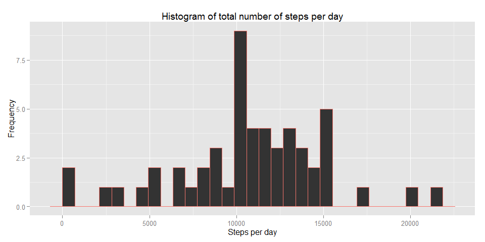
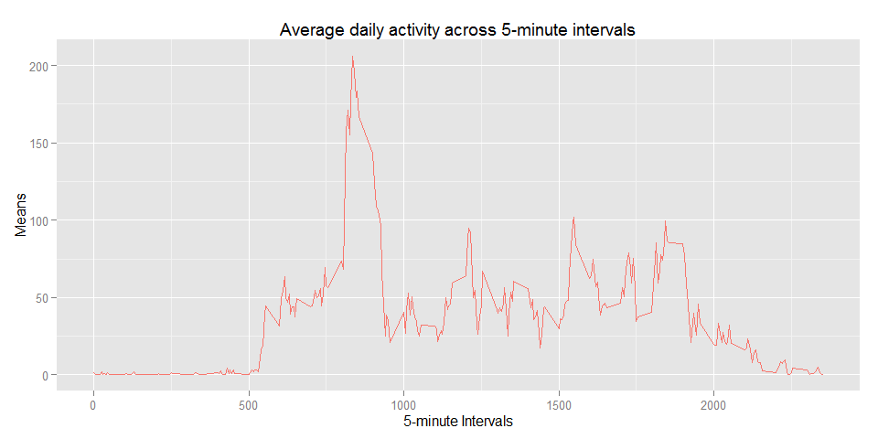
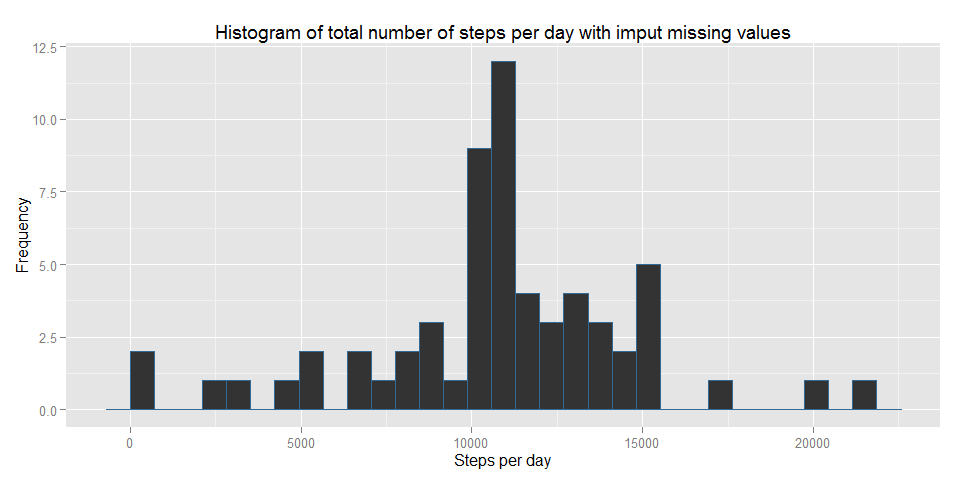
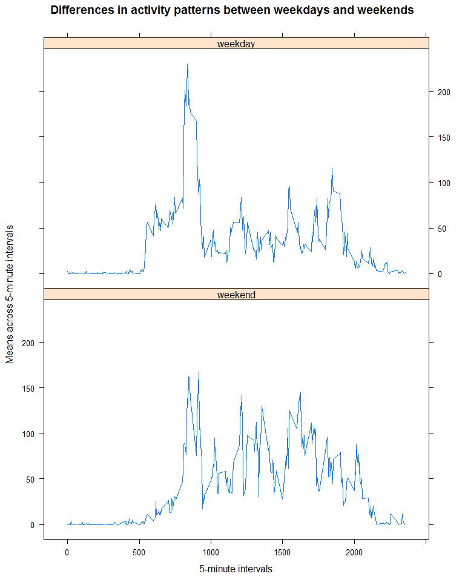

# Reproducible Research: Peer Assessment 1

## Loading and preprocessing the data


```r
data <- read.csv(unz("activity.zip", "activity.csv"))
```


## What is mean total number of steps taken per day?


```r
library(ggplot2)
sums <- tapply(data$steps, data$date, sum)

g <- qplot(sums, color = "red") +
     labs(x = "Steps per day", y = "Frequency") +
     ggtitle("Histogram of total number of steps per day") +
     theme(legend.position = "none")

print(g)
```



### Mean of the total number of steps taken per day

```r
median(sums, na.rm = TRUE)
```

```
## [1] 10765
```

### Median of the total number of steps taken per day

```r
mean(sums, na.rm = TRUE)
```

```
## [1] 10766.19
```

## What is the average daily activity pattern?


```r
library(ggplot2)
means <- tapply(data$steps, data$interval, mean, na.rm = TRUE)

g <- qplot(x = unique(data$interval), y = means, geom = "line", color = "red") + 
     labs(x = "5-minute Intervals", y = "Means") +
     ggtitle("Average daily activity across 5-minute intervals") +
     theme(legend.position = "none")

print(g)
```



### Which 5-minute interval, contains the maximum number of steps?

```r
means[which.max(means)]
```

```
##      835 
## 206.1698
```

## Imputing missing values

1. Number of missing values

```r
sum(is.na(data$steps))
```

```
## [1] 2304
```
2. Imput missing values


```r
data_full <- data

for(i in 1:nrow(data_full))
{
    if(is.na(data_full[i, "steps"]))
    {
        data_full[i, "steps"] <- 
            mean(data_full$steps[data_full$interval == data_full[i, "interval"]], na.rm = TRUE)
    }
}
```

3. Make histogram

```r
library(ggplot2)
sums <- tapply(data_full$steps, data_full$date, sum)

g <- qplot(sums, color = 1) +
     labs(x = "Steps per day", y = "Frequency") +
     ggtitle("Histogram of total number of steps per day with imput missing values") +
     theme(legend.position = "none")

print(g)
```



4. Calculate median and mean of updated data

### Mean of the total number of steps taken per day

```r
median(sums)
```

```
## [1] 10766.19
```

### Median of the total number of steps taken per day

```r
mean(sums)
```

```
## [1] 10766.19
```

## Are there differences in activity patterns between weekdays and weekends?

```r
library(lattice)
Sys.setlocale("LC_TIME", "English")
```

```
## [1] "English_United States.1252"
```

```r
# Add new factor variable to data_frame
data_full$date <- as.Date(data$date)
weekdays1 <- c('Monday', 'Tuesday', 'Wednesday', 'Thursday', 'Friday')
data_full$wDay <- factor((weekdays(data_full$date) %in% weekdays1), 
         levels=c(FALSE, TRUE), labels=c('weekend', 'weekday'))
         
means <- tapply(data_full$steps, list(data_full$interval, data_full$wDay), mean)

name <- c("interval", "means", "wDay")
buf <- data.frame(unique(data_full$interval), means[,1], rep("weekend", 288))
names(buf) <- name
buf1 <- data.frame(buf[,1], means[, 2], rep("weekday", 288))
names(buf1) <- name
buf2 <- merge(buf, buf1, all = TRUE)

xyplot(means ~ interval | wDay, data = buf2, type = "l", 
       main = "Differences in activity patterns between weekdays and weekends",
       xlab = "5-minute intervals", ylab = "Means across 5-minute intervals")
```


