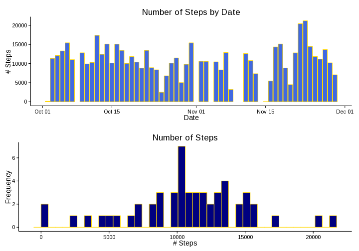
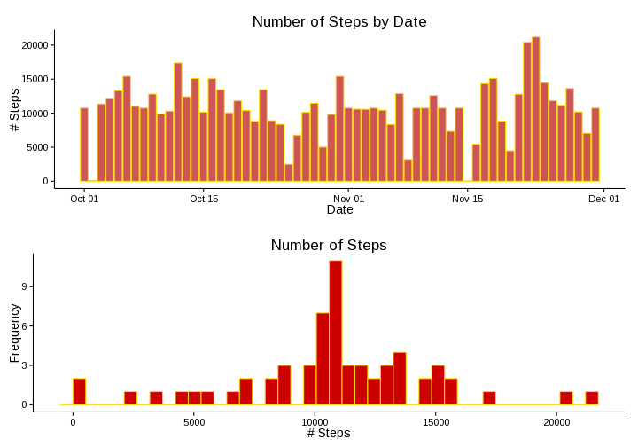
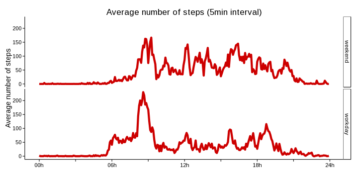

# Reproducible Research (Peer Assessment 1)  
**Data Science -> Reproducible Research -> Peer Assessment 1**   
   
   
-------------------  

### Welcome  

Hi,  
Welcome to the first Course Project / Peer Assessment Assignment.  
The purpose of this work is to produce a R Markdown document with all the code needed to answer the required questions in a reproducible way.  
  
This report was programmed, tested and '*knitred*' in the following environment:  

 - **Hardware**
   - CPU: Intel(R) Core(TM) i3-350M  @ 2.27GHz  
   - RAM: 4GB DDR3  
   - Videocard: ATI Mobility Radeon HD 5470  
  
 - **Software**
   - OS: Linux x86_64 (3.14.6-pclos1)
   - R: 3.0.2
   - RStudio: 0.98.481
   - The following R packages were used:
     - tools (3.0.2)
     - knitr (1.6)
     - ggplot2 (1.0.0)
     - grid (3.0.2)
   - Please check the following file at this repository for further details on the installed software: snapshot20140611.log  
  
I'll start the analysis preparing the environment by loading required packages and setting up knitr to always display the code chunks in the html output file and also to display verbose messages while processing the .Rmd file since this is useful for debugging.  


```r
# Setup
library(tools)
library(knitr)
library(ggplot2)
library(grid)
opts_chunk$set(echo=TRUE, results="markup")
opts_knit$set(verbose=TRUE)

cat("Report generated on:", format(Sys.time(), "%Y-%m-%d %H:%M:%S %Z"))
```

```
## Report generated on: 2014-06-14 14:46:53 CEST
```
-------------------  

### Loading and preprocessing the data

I will use two separate code chunks.  
  
The first code chunk is responsible for making sure the right data file is in the directory and then it loads it the `dataset` variable.  
First the code checks if the file is present (it should since it is in the repository, but I'll test it just in case). In case it is not present the script tries to download the data from the [assignment repository](https://github.com/bpvg/DS_RepRes_Peer1) (and raises an error in case the download did not complete successfully).  
If the file is present I'll make sure it is the right file by comparing its MD5 hash with a previously computed one. MD5 isn't cryptographically secure anymore, but it's enough for my checksumming needs. You can find more information about MD5 [here](http://en.wikipedia.org/wiki/MD5). If the hashes do not match the code will not continue because it might mean the file has the wrong data or is corrupt.  
If something goes wrong during execution an error should be raised. In case no handled error occurs the data is loaded from inside the zip file and message is returned to let user know everything is fine.


```r
# Loading
kRemote <- "https://raw.githubusercontent.com/bpvg/DS_RepRes_Peer1/master/activity.zip"
kFile   <- "activity.zip"
kFileDt <- "activity.csv"
kMd5    <- "61e0c1f8c4a736ff1ab0f8863344b301"
    
if (!file.exists(kFile)){
    # File is not present at the working directory. Lets download it!
    method <-"auto"  # Default method: shall be fine for MS Windows (untested!)
    if (.Platform$OS.type=="unix") method <- "curl"  # Use for unix-like systems
    download.file(kRemote, kFile, method, FALSE, "wb")
}
# stop() doesn't work inside knitr. Aarrghh! :(
# I had to change the way the test is preformed. I can actualy use print()
if (!file.exists(kFile)){
    stop("Download failed!")
} else {
    # File is now present (it was before or it was sucessfully downloaded).
    # Lets check if it is the expected file. I'll compare it's MD5 hash with
    # a precomputed one.
    if (as.vector(md5sum(kFile))!=kMd5){
        stop("File is not correct!")
    } else {
        # The correct file shall be present. I'll read the data directly from 
        # inside the Zip file.
        myConn <- unz(kFile, kFileDt)
        dataset <- read.csv(myConn, na.strings="NA", stringsAsFactors=FALSE)
        print("Data sucessfully loaded!")
    }
}
```

```
## [1] "Data sucessfully loaded!"
```
  
    
A second phase is the data preprocessing to make it suitable for further analysis.  
To start with, I will add a variable number of zeros (computed as 4 minus string length) to the beginning of the interval data. This will result in a 24h time format 'hhmm'.  
I will also create a new variable, containing the time encoded as a decimal value to allow smoother scaling in plots.  


```r
# Preprocessing
if (!exists("dataset")) {
    stop("It looks something went wrong in the 'Loading' chunk!")
} else {
    # Processing Time information by adding x times a 0 (zero) before the actual
    # data.
    f <- dataset$interval
    f <- ifelse(nchar(f)==3, paste0("0", f), f)
    f <- ifelse(nchar(f)==2, paste0("00", f), f)
    f <- ifelse(nchar(f)==1, paste0("000", f), f)
    dataset <- dataset[, -3] #remove interval
    #Transform date field from chr to date+time.
    dataset$date <- as.POSIXlt(paste(dataset$date,f), format="%Y-%m-%d %H%M")
    dataset$timeDecimal <- dataset$date$hour + dataset$date$min/60
    #Finishing
    print("Preprocessing finished!")
}
```

```
## [1] "Preprocessing finished!"
```
-------------------  

### What is mean total number of steps taken per day?

After loading and cleaning the data a little bit, we need to do the following:  
1. Make a histogram of the total number of steps taken each day;  
2. Calculate and report the *mean* and *median* total number of steps taken per day.  
  
To do this I'll start by grouping the original dataset by each day. Since this step depends on the data loaded and computed before I'll check the data actually exists before proceeding.  


```r
#Histogram
if (!exists("dataset")) {
    stop("It looks something went wrong in the 'Loading' or 'Preprocessing' chunk!")
} else {
    # sum the number of steps by date
    group <- aggregate(steps~as.Date(date), dataset, sum)
    names(group) <- c("date", "steps")
    
    # start creating the charts
    # barplot
    bar <- ggplot(group, aes(date, steps))
    bar <- bar + geom_histogram(stat   = "identity", 
                                colour = "gold1", 
                                fill   = "royalblue")
    bar <- bar + labs(title = "Number of Steps by Date", 
                      x     = "Date", 
                      y     = "# Steps")
    bar <- bar + theme_classic(base_size=14)
    
    # histogram
    hist <- ggplot(group, aes(steps))
    hist <- hist + geom_histogram(stat   = "bin", 
                                  binwid = max(group$steps)/40, 
                                  colour = "gold1", 
                                  fill   = "navyblue")
    hist <- hist + labs(title = "Number of Steps", 
                        x     = "# Steps", 
                        y     = "Frequency")
    hist <- hist + theme_classic(base_size=14)
    
    # Printing the charts
    grid.newpage()
    pushViewport(viewport(layout = grid.layout(nrow = 2, ncol = 1)))
    print(bar, vp = viewport(layout.pos.row = 1, layout.pos.col = 1))
    print(hist, vp = viewport(layout.pos.row = 2, layout.pos.col = 1))    
}
```

 

Now it's time to compute the *mean* and *median*.  
I'll reuse the grouped data computed for the Histogram, so I will start by checking the `group` variable exists.  


```r
# M&M
if (!exists("group")) {
    stop("It looks something went wrong in the 'Histogram' chunk!")
} else {
    cat("Mean:", 
        format(mean(group$steps), big.mark=",", nsmall=2), 
        "\n")
    cat("Median:", 
        format(median(group$steps), big.mark=",", nsmall=2), 
        "\n")
}
```

```
## Mean: 10,766.19 
## Median: 10,765
```
-------------------  

### What is the average daily activity pattern?  

We're now instructed to make a time series plot of the 5-minute interval (x-axis) and the average number of steps taken, averaged across all days (y-axis).  


```r
# TimeSeries
if (!exists("dataset")) {
    stop("It looks something went wrong in the 'Loading' or 'Preprocessing' chunk!")
} else {
    # average of the number of steps by interval
    average <- aggregate(steps~timeDecimal, dataset, mean)
    names(average) <- c("timeDecimal", "avgSteps")
    
    # Timeseries plot definition
    ts <- ggplot(average, aes(timeDecimal, avgSteps))
    ts <- ts + geom_line(colour = "navyblue", 
                         size   = 2)
    ts <- ts + labs(title = "Average number of steps (5min interval)", 
                    x     = "", 
                    y     = "Average number of steps")
    ts <- ts + scale_x_continuous(breaks = c(0, 3, 6, 9, 12, 15, 18, 21, 24),
                                  labels = c("00h", "", 
                                             "06h", "", 
                                             "12h", "", 
                                             "18h", "", 
                                             "24h"))
    ts <- ts + theme_classic(base_size = 14)
    
    #Printing the plot
    print(ts)
}
```

 

Then, we were asked which 5-minute interval, on average across all the days in the dataset, contains the maximum number of steps?  
To answer this question I will use the averages computed before to check which `timeDecimal` has the higher average number of steps.  


```r
#MaxAvgSteps 
if (!exists("average")) {
    stop("It looks something went wrong in the 'TimeSeries' chunk!")
} else {
    #computing timeperiod with more steps and getting its timedecimal value.
    high <- average[average$avgSteps==max(average$avgSteps), 1]
    cat("The maximum average number of steps happens in the 5min period begining at ",
        as.integer(high), 
        "h", 
        (high-as.integer(high))*60, 
        "m.", 
        sep="")
}
```

```
## The maximum average number of steps happens in the 5min period begining at 8h35m.
```
-------------------  

### Imputing missing values

Now it is time to fill in the missing values present at the data. To complete this point we'll need to complete several steps.  
  
  
First I'll compute and report the total number of missing values in the dataset (i.e. the total number of rows with `NA`s).  


```r
# ComputeNA

# I'll use the data loaded in the 'Loading' chunk.
if (!exists("dataset")) {
    stop("It looks something went wrong in the 'Loading' or 'Preprocessing' chunk!")
} else {
    # number of NA's
    countNa <- sum(is.na(dataset$steps))
    cat("There are", 
        format(countNa, big.mark=","), 
        "NA's in the original data set.\n")
    cat("This is about ", 
        round(countNa/nrow(dataset)*100, 2), 
        "% of the data.", 
        sep="")
}
```

```
## There are 2,304 NA's in the original data set.
## This is about 13.11% of the data.
```

After trying some random number generation algorithms with the log-normal (to avoid negative number of steps) and uniform (between zero and the max number of steps in each 5 minutes interval) distributions, I will finally fill the missing values with the average number of steps computed for the same 5 minutes interval I need to fill, rounded to the nearest unit (to avoid using fractional steps!).  


```r
# Filler
if (!exists("dataset")) {
    stop("It looks something went wrong in the 'Loading' or 'Preprocessing' chunk!")
} else {
    if (!exists("average")) {
        stop("It looks something went wrong in the 'TimeSeries' chunk!")
    } else {
        filledIn <- dataset
        
        fillNums <- rep(round(average$avgSteps, 0), times=61)
        filledIn$steps <- ifelse(is.na(filledIn$steps), 
                                 fillNums,
                                 filledIn$steps) 
    }
}
```


It's now time to make a histogram of the total number of steps taken each day and calculate and report the *mean* and *median* total number of steps taken per day.  I will use the dataset after NA filling.   


```r
#HistogramFill
if (!exists("filledIn")) {
    stop("It looks something went wrong in the 'Filler' chunk!")
} else {
    # sum the number of steps by date
    groupFill <- aggregate(steps~as.Date(date), filledIn, sum)
    names(groupFill) <- c("date", "steps")
    
    bar <- ggplot(groupFill, aes(date, steps))
    bar <- bar + geom_histogram(stat   = "identity", 
                                colour = "gold", 
                                fill   = "indianred3")
    bar <- bar + labs(title = "Number of Steps by Date", 
                      x     = "Date", 
                      y     = "# Steps")
    bar <- bar + theme_classic(base_size=14)
    
    # histogram
    hist <- ggplot(groupFill, aes(steps))
    hist <- hist + geom_histogram(stat   = "bin", 
                                  binwid = max(groupFill$steps)/40, 
                                  colour = "gold", 
                                  fill   = "red3")
    hist <- hist + labs(title = "Number of Steps", 
                        x     = "# Steps", 
                        y     = "Frequency")
    hist <- hist + theme_classic(base_size=14)
    
    # Printing the charts
    grid.newpage()
    pushViewport(viewport(layout = grid.layout(nrow = 2, ncol = 1)))
    print(bar, vp = viewport(layout.pos.row = 1, layout.pos.col = 1))
    print(hist, vp = viewport(layout.pos.row = 2, layout.pos.col = 1))    
}
```

 


```r
# M&MFill
if (!exists("groupFill")) {
    stop("It looks something went wrong in the 'HistogramFill' chunk!")
} else {
    cat("Mean:", 
        format(mean(groupFill$steps), big.m=",", nsmall=2), 
        "\n")
    cat("Median:", 
        format(median(groupFill$steps), big.m=",", nsmall=2), 
        "\n")
}
```

```
## Mean: 10,765.64 
## Median: 10,762.00
```


After filling the NA's, both the mean and median are lower.

-------------------

### Are there differences in activity patterns between weekdays and weekends?

In first place we were required to create a factor variable in the dataset with two levels.  
I used "weekend" and "weekday", indicating whether a given date is in weekend or not. Since my dates are in POSIXlt format, I can use its 'wday' named vector to  access the day number (it returns a number in the 0 to 6 range, for Sunday to Saturday days of the week).   


```r
# Weekdays
if (!exists("filledIn")) {
    stop("It looks something went wrong in the 'Filler' chunk!")
} else {
    whichDaytype <- function(dates){
        wd <- dates$wday
        ww <- ifelse(wd==0 | wd==6, "weekend", "weekday")
        ww <- factor(ww, c("weekend", "weekday"))
        return(ww)
    }
    
    filledIn$daytype <- whichDaytype(filledIn$date)
    print("Weekdays sucessfully completed!")
}
```

```
## [1] "Weekdays sucessfully completed!"
```

It's now time to make a panel plot containing the average number of steps taken, averaged across all day types and time frames.  


```r
# TimeSeriesByDaytype
if (!exists("filledIn")) {
    stop("It looks something went wrong in the 'Filler' chunk!")
} else {
    # average of the number of steps by interval
    averageByDaytype <- aggregate(steps~timeDecimal+daytype, filledIn, mean)
    names(averageByDaytype) <- c("timeDecimal", "daytype", "avgSteps")
    
    tsd <- ggplot(averageByDaytype, aes(timeDecimal, avgSteps))
    tsd <- tsd + geom_line(colour = "red3", 
                           size   = 2)
    tsd <- tsd + facet_grid(daytype~.)
    tsd <- tsd + labs(title = "Average number of steps (5min interval)", 
                      x     = "", 
                      y     = "Average number of steps")
    tsd <- tsd + scale_x_continuous(breaks = c(0, 3, 6, 9, 12, 15, 18, 21, 24),
                                    labels = c("00h", "", 
                                               "06h", "", 
                                               "12h", "", 
                                               "18h", "", 
                                               "24h"))
    tsd <- tsd + theme_classic(base_size = 14)
    
    #Printing the plot
    print(tsd)
}
```

 

From the charts, it looks there are some differences in the steps pattern between weekdays and weekends.
It looks the subject starts its daily activity earlier during the weekdays, because the number of steps rise from zero during the night to about 50 little before 6h00m, and during weekend the first signs of activity are more diffuse and usually start later. It also looks during the weekend the daily activity use to end later than during weekdays.    
Another finding is it looks during the weekdays there are 3 average step peaks: around lunch time (12h), in the middle of the afternoon (16h) and then about dinner time (19h). During the weekends the activity is more disperse across the day.    

-------------------
