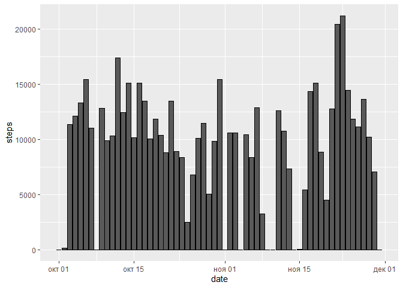
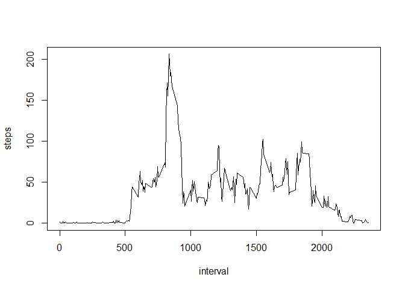
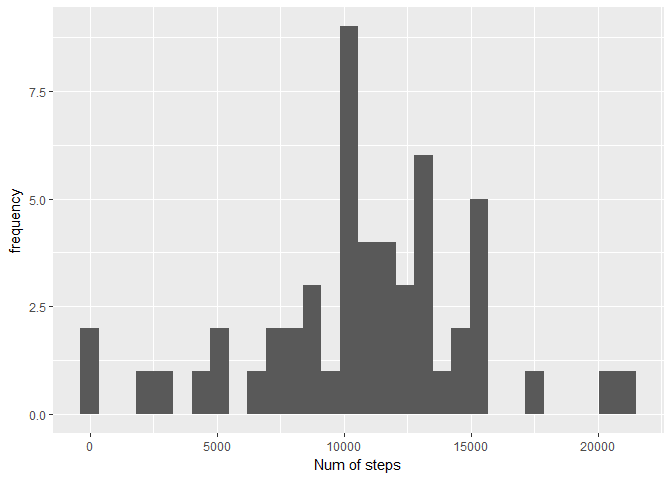

        #1. Loding the file in the variable data
        dataset<- read.csv("activity.csv")

        #2. Histogram of the total number of steps taken each day
        stepsperday <- aggregate(dataset$steps, list(dataset$date), FUN= sum)

        #creating the Histogram
        hist(stepsperday$x, xlab = "Steps per day", main = "Frequency of steps per day")

        #mean of steps
        mean(stepsperday$x, na.rm = TRUE)

    ## [1] 10766.19

        #median of steps
        median(stepsperday$x, na.rm = TRUE)

    ## [1] 10765

    #3. Time series plot of the average number of steps taken
    ds <- dataset[!is.na(dataset$steps),]
    meanSteps <-with(ds, tapply(steps, ds$interval, mean))
    int <- levels(as.factor(ds$interval))
    plot(int, meanSteps, type = "l", ylim = c(0,200))

    #Which 5-minute interval, on average across all the days in the
    #dataset, contains the maximum number of steps?
    df<-data.frame(meanSteps, int)
    df[df$meanSteps==max(df$meanSteps),]

    ##     meanSteps int
    ## 835  206.1698 835

    #4. Imputing missing values
    missing <- is.na(dataset$steps)
    # creating a copy of the dataset
    copyData <- dataset
    copyData$steps <- ifelse(is.na(copyData$steps),
                             df$meanSteps[match(copyData$interval, df$int)],
                             copyData$steps)

    stepsnotnull <- aggregate(copyData$steps, list(copyData$date), FUN= sum)
    hist(stepsnotnull$x, xlab = "Steps per day", 
         main = "Frequency of steps per day")

    #mean of steps
    mean(stepsnotnull$x)

    ## [1] 10766.19

    #median of steps
    median(stepsnotnull$x)

    ## [1] 10766.19

    #5. Differences in activity patterns between weekdays and weekends

    days <- weekdays(as.Date(copyData$date))
    days <- ifelse(grepl("Saturday|Sunday", days), "Weekend", "WeekDay")
    days <- as.factor(days)
    copyData <- cbind(copyData, days)

    #installing necessary packages
    library("ggplot2", lib.loc="~/R/win-library/3.3")
    library("dplyr", lib.loc="~/R/win-library/3.3")

    ## 
    ## Attaching package: 'dplyr'

    ## The following objects are masked from 'package:stats':
    ## 
    ##     filter, lag

    ## The following objects are masked from 'package:base':
    ## 
    ##     intersect, setdiff, setequal, union

    intbydaytype <- copyData %>% group_by(interval, days) %>%
        summarise(steps = mean(steps))
    ggplot(intbydaytype, aes(x=interval, y=steps, color= days))+
         geom_line() + facet_wrap(~days,nrow = 2, ncol = 1)

