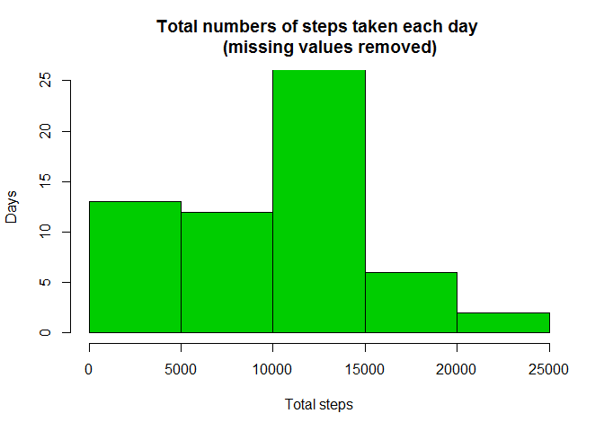
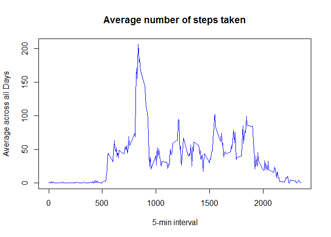
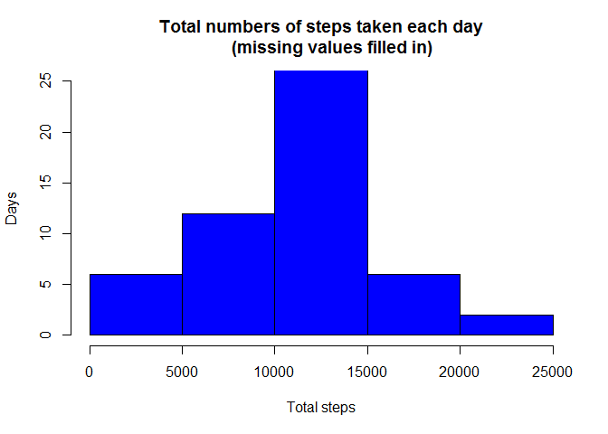
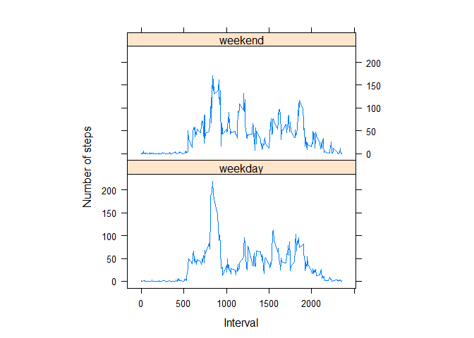

# Reproducible Research: Peer Assessment 1
horrorkumani  
18 septembre 2015  
## Loading and preprocessing the data

```r
  data <- read.csv("C:/Users/Thanh/Documents/GitHub/Huong/activity.csv",header=TRUE,sep=",")
  data$date <- as.Date(as.POSIXct(data$date),format = "%d/%m/%Y" )
  d1 <- as.Date("01/10/2012",format="%d/%m/%Y")
  d2 <- as.Date("30/11/2012",format="%d/%m/%Y")
```

## What is mean total number of steps taken per day?

```r
steps1 <- na.omit(data)
sumi <- data.frame()
datei <- data.frame()
for (i in d1:d2){
  subi <- subset(steps1, date==i)
  sumi <- rbind(sumi,sum(subi$steps))
  
}
colnames(sumi)<- c("Total steps")
hist(x=sumi$`Total steps`,main="Total numbers of steps taken each day 
     (missing values removed)",xlab="Total steps",ylab="Days",col=115,ylim=c(0,25))
```

 

```r
mean<- mean(sumi$`Total steps`)
median <- median(sumi$`Total steps`)
```

#### mean = 9354.2295082
#### median = 10395

## What is the average daily activity pattern?

```r
myts <- tapply(steps1$steps, steps1$interval, mean)
plot(row.names(myts), myts, type = "l", xlab = "5-min interval", 
    ylab = "Average across all Days", main = "Average number of steps taken", 
    col = 76)
```

 

```r
max_interval <- which.max(myts)
max <- names(max_interval)
```

#### The 5-minute interval that contains the maximum number of steps is 835

## Imputing missing values

### Strategy:

####We will replace all missing values in the dataset with the mean for the 5-minute interval of the missing days. fillNA is the combination of both the filled-in missing values and the available numeric steps. Then we store fillNA as the "steps" column of the filled-in dataset.


```r
sum_na <- sum(is.na(data))
averagesteps <- aggregate(steps ~ interval, data = data, FUN="mean")
fillNA <- numeric()
for (j in 1:nrow(data)) {
    m <- data[j, ]
    if (is.na(m$steps)) {
        steps <- subset(averagesteps, interval == m$interval)$steps
    } else {
        steps <- m$steps
    }
    fillNA <- c(fillNA, steps)
}

newdata <- data
newdata$steps <- fillNA
```

```r
sumk <- data.frame()
datek <- data.frame()
for (k in d1:d2){
  subk <- subset(newdata, date==k)
  sumk <- rbind(sumk,sum(subk$steps))
}
colnames(sumk)<- c("Total steps")
hist(x=sumk$`Total steps`,main="Total numbers of steps taken each day
     (missing values filled in)",xlab="Total steps",ylab="Days",col=100,ylim=c(0,25))
```

 

```r
mean2<- format(round(mean(sumk$`Total steps`),7),nsmall=7)
median2 <- format(round(median(sumk$`Total steps`),7),nsmall=7)
```


#### The total number of missing values is 2304
#### new mean = 10589.6937829
#### new median = 10766.1886792


## Are there differences in activity patterns between weekdays and weekends?

```r
newdata$dayname <- weekdays(as.Date(newdata$date, format="%d/%m/%Y"))
newdata$dayType <- c("weekday","weekend")
for (l in 1 : nrow(newdata))
{
  if (newdata$dayname[l] == "samedi" || newdata$dayname[l] == "dimanche")
    newdata$dayType[l] <- "weekend"
  else newdata$dayType[l] <- "weekday"
}
newdata$dayType <- as.factor(newdata$dayType)
library(lattice)
averageStepsDayType <- aggregate(steps ~ interval + dayType, data = newdata, FUN="mean")
xyplot(steps ~ interval | dayType, averageStepsDayType, type = "l", aspect = 1/2, xlab="Interval",ylab="Number of steps")
```

 
