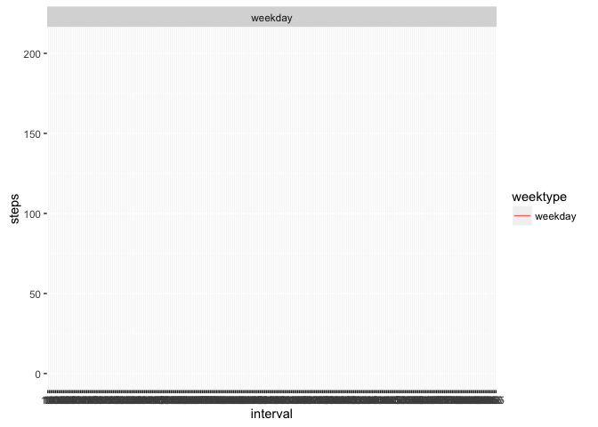

---
title: "Reproducible Research: Peer Assessment 1"
output: 
  html_document:
    keep_md: true  
---  
## Reproducible Research : Assignment 1
###1. Loading and preprocessing the data

Data downloaded from the course website https://d396qusza40orc.cloudfront.net/repdata%2Fdata%2Factivity.zip into a local directory first

```r
fileDest <- "./data/Factivity/activity.csv"
rawdata <- read.csv(fileDest, sep = ",", header = TRUE, na.strings = "NA", stringsAsFactors = TRUE)
head(rawdata)
```

```
##   steps       date interval
## 1    NA 2012-10-01        0
## 2    NA 2012-10-01        5
## 3    NA 2012-10-01       10
## 4    NA 2012-10-01       15
## 5    NA 2012-10-01       20
## 6    NA 2012-10-01       25
```

```r
str(rawdata)
```

```
## 'data.frame':	17568 obs. of  3 variables:
##  $ steps   : int  NA NA NA NA NA NA NA NA NA NA ...
##  $ date    : Factor w/ 61 levels "2012-10-01","2012-10-02",..: 1 1 1 1 1 1 1 1 1 1 ...
##  $ interval: int  0 5 10 15 20 25 30 35 40 45 ...
```
  
Convert dates into date format

```r
rawdata$date <- as.Date(rawdata$date,"%Y-%m-%d")
```


###2. What is mean total number of steps taken per day?

Group and sum total steps taken for each date

```r
totalSteps <- aggregate(steps~date, rawdata,sum)
```

Histogram of the frequency of total daily steps

```r
library(ggplot2)
g1 <- ggplot(totalSteps,aes(steps))
g1 + geom_histogram(bins = 20)+labs(x="Daily Steps",y = "Frequency", title = "Total Number of Steps Taken Each Day")
```

<!-- -->

The mean number of daily steps is :

```r
mean(totalSteps$steps,na.rm = TRUE)
```

```
## [1] 10766.19
```

The median number of daily steps is :

```r
median(totalSteps$steps,na.rm = TRUE)
```

```
## [1] 10765
```
The mean and median values for the data set are quite close to each other.


###3. What is the average daily activity pattern?  

Time series plot of the 5-minute intervaland the average number of steps taken, averaged across all days

```r
timeSteps <- aggregate(steps~interval, rawdata,mean)
g2 <- ggplot(timeSteps,aes(interval,steps))
g2 + geom_line()+labs(x="Time Interval",y = "Steps", title = "Average Steps Taken by Time Interval")
```

<!-- -->

The 5-minute interval, on average across all the days in the dataset, which contains the maximum number of steps is :  

```r
timeSteps$interval[which.max(timeSteps$steps)]
```

```
## [1] 835
```


###4. Imputing missing values  
There are a number of days/intervals where there are missing values (coded as NA). The total number of missing values in the dataset is :

```r
table(is.na(rawdata))
```

```
## 
## FALSE  TRUE 
## 50400  2304
```

The missing values by steps column is :

```r
sum(is.na(rawdata$steps))
```

```
## [1] 2304
```

All of the missing values occur in the data for the steps column.

The strategy for filling in all of the missing values in the dataset is to replace these with the median for that that 5-minute interval. As the mean and median values are quite close to each other, there should be no discernable difference in using mean vs median.  

Create a new dataset that is equal to the original dataset but with the missing data filled in

```r
ismissing <- which(is.na(rawdata$steps))
tidydata <- rawdata
tidydata$steps[ismissing]<-timeSteps$steps[match(tidydata$interval,timeSteps$interval)]
```

```
## Warning in tidydata$steps[ismissing] <- timeSteps$steps[match(tidydata
## $interval, : number of items to replace is not a multiple of replacement
## length
```

Check that the data has imputed correctly given warning message

```r
head(rawdata)
```

```
##   steps       date interval
## 1    NA 2012-10-01        0
## 2    NA 2012-10-01        5
## 3    NA 2012-10-01       10
## 4    NA 2012-10-01       15
## 5    NA 2012-10-01       20
## 6    NA 2012-10-01       25
```

```r
head(timeSteps)
```

```
##   interval     steps
## 1        0 1.7169811
## 2        5 0.3396226
## 3       10 0.1320755
## 4       15 0.1509434
## 5       20 0.0754717
## 6       25 2.0943396
```

```r
head(tidydata)
```

```
##       steps       date interval
## 1 1.7169811 2012-10-01        0
## 2 0.3396226 2012-10-01        5
## 3 0.1320755 2012-10-01       10
## 4 0.1509434 2012-10-01       15
## 5 0.0754717 2012-10-01       20
## 6 2.0943396 2012-10-01       25
```

```r
table(is.na(tidydata))
```

```
## 
## FALSE 
## 52704
```
The new table has correctly imputed the value of all of the missing data.

Histogram of the frequency of total number of steps taken each day

```r
totalStepsTidy <- aggregate(steps~date, tidydata,sum)
g3 <- ggplot(totalStepsTidy,aes(steps))
g3 + geom_histogram(bins = 20)+labs(x="Daily Steps",y = "Frequency", title = "Total Number of Steps Taken Each Day")
```

<!-- -->

The new mean number of daily steps is :

```r
mean(totalStepsTidy$steps, na.rm = TRUE)
```

```
## [1] 10766.19
```

The new median number of daily steps is :

```r
median(totalStepsTidy$steps, na.rm = TRUE)
```

```
## [1] 10766.19
```

The impact of imputing the data on the mean is :

```r
mean(totalStepsTidy$steps, na.rm = TRUE) - mean(totalSteps$steps, na.rm = TRUE)
```

```
## [1] 0
```
There is no difference in the mean of the number of daily steps between the raw and tidy data set. This makes sense as the imputed value is equal to the original mean value.

The impact of imputing the data on the median is :

```r
median(totalStepsTidy$steps, na.rm = TRUE) - median(totalSteps$steps, na.rm = TRUE)
```

```
## [1] 1.188679
```
The median number of daily steps has increased slightly due to the imputed data.  This makes sense because the imputed value is slightly higher than the original median value.


###5. Are there differences in activity patterns between weekdays and weekends?  
Create a new factor variable in the dataset with two levels - "weekday" and "weekend" indicating whether a given date is a weekday or weekend day.  

```r
tidydata$weekend <- weekdays(tidydata$date)==c("Saturday","Sunday")
tidydata$weekend <- gsub("TRUE","weekend",tidydata$weekend)
tidydata$weekend <- gsub("FALSE","weekday",tidydata$weekend)
```

Panel plot containing a time series plot of the 5-minute interval (x-axis) and the average number of steps taken, averaged across all weekday days or weekend days (y-axis)

```r
timeStepsTidy <- aggregate(steps~interval+weekend, tidydata,mean)
par(mfrow=c(2,1))
g4 <- ggplot(timeStepsTidy,aes(interval,steps,fill = weekend))
g4 + geom_line()+ facet_grid(.~weekend)+labs(x="Time Interval",y = "Steps", title = "Average Steps Taken by Time Interval")
```

<!-- -->


