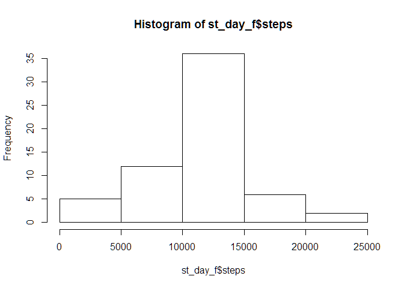
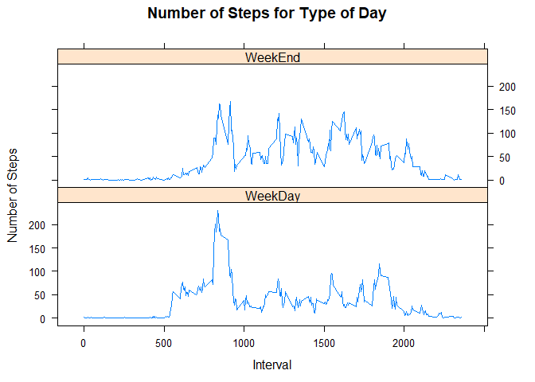

# Reproducible Research - Project 1
Dan Schreck  
June 13, 2016  

<style type="text/css">

body, td {
   font-size: 12px;
}
code.r{
  font-size: 10px;
}
pre {
  font-size: 10px
}
</style>


</br>


###Summary
As part of the Coursera Reproducible Research Project 1 the object of this report
is to read data from an anonymous individual consisting of the number of steps 
taken in 5 minute intervals each day over a two month period and document the 
analysis in R Markdown.

</br>


###Data Set Fields
steps - number of recorded steps over the interval, which is every 5 minutes

date - date recorded in YYYY-MM-DD

interval - time period (midnight=0 through 11:55pm/23:55)

</br>


###Repository
The data source and supporting files may be found here at:
https://github.com/schreda36/RepData_PeerAssessment1

</br>


###Loading the data
In addition to the repository the data used in this report may also be downloaded
from Download dataset file <https://d396qusza40orc.cloudfront.net/repdata%2Fdata%2Factivity.zip>. 


```r
setwd("/Users/schre/DataScience/wd/repro_research/Project1")
if(!file.exists("./data")){dir.create("./data")}
if (!file.exists('data/activity.zip')) {
      fileurl <- "https://d396qusza40orc.cloudfront.net/repdata%2Fdata%2Factivity.zip"
      download.file(fileurl, 'data/activity.zip')
      unzip('data/activty.zip', exdir='./data')
}
activity <- read.csv("data/activity.csv")
```

</br>


###What is mean total number of steps taken per day?
For this part of the assignment we will remove the NA values and calculate the total 
number of steps taken per day.


```r
#Total steps per day:
total.steps <- aggregate(steps ~ date, data=activity, na.rm=TRUE, sum)
```


Then we will make histogram of the total number of steps taken each day:

```r
#Total steps per day:
plot(as.Date(total.steps$date), total.steps$steps, type="h", main="Steps per Day", xlab="", ylab="# Steps per Day", col="#0033FF", lwd=5)
abline(h=mean(total.steps$steps, na.rm=TRUE), col="#FF3333", lwd=3)
text(as.Date("2012-11-29"),mean(total.steps$steps)+700," Mean", col="#FF3333")
```

<!-- -->


The average steps taken per day works out to be: 

```r
mean(total.steps$steps)
```

```
## [1] 10766.19
```

And the median steps taken per day is:

```r
median(total.steps$steps)
```

```
## [1] 10765
```

</br>


###What is the average daily activity pattern?
To determine the average daily activity pattern we will use a time series plot of the 
5-minute interval (x-axis) and average number of steps taken during the day. In this 
plot the first record is 0, which represents midnight and the last recording is 23:55,
which is 11:55pm.

```r
avgStepsDay <- tapply(activity$steps, activity$interval, mean, na.rm=T, simplify=T)
plot(as.integer(names(avgStepsDay)), avgStepsDay, type="l", main="Daily Activity Pattern\nAvg Steps per 5 mins", xlab="Time of Day\n 0=midnight to 2355 (11:55pm)", ylab="# Steps", col="#0033FF", lwd=2)
```

<!-- -->
      
From here we can calculate the 5-minute interval, on average across all the days in 
the dataset that has the highest average number of steps:

```r
mean.steps.interval <- data.frame(interval=as.integer(names(avgStepsDay)), average=avgStepsDay)
max.steps <- max(mean.steps.interval$average)
mean.steps.interval[mean.steps.interval$average == max.steps, ]
```

```
##     interval  average
## 835      835 206.1698
```

We can concluded from this on average the maximum number of steps (206.2) is taken
at 8:35am.

</br>


###Imputing missing values
Note that there are a fairly large number of NAs is this dataset:

```r
sum(is.na(activity$steps))
```

```
## [1] 2304
```

If we were to replace all NA values with the mean for that 5-minute interval:

```r
#populate NA values with the mean for that interval
activity.na.removed <- activity
# get index of NA values
na.index <- which(is.na(activity$steps)==TRUE)  
interval.avg <- tapply(activity$steps, activity$interval, mean, na.rm=TRUE, simplify=T)
 # replace all na values with the mean for that interval
activity.na.removed$steps[na.index] <- interval.avg[as.character(activity$interval[na.index])]
```

And then plot it as we did in the first plot above:

```r
#Total steps per day:
total.steps.na.agg <- aggregate(steps ~ date, data=activity.na.removed, na.rm=TRUE, sum)
plot(as.Date(total.steps.na.agg$date), total.steps.na.agg$steps, type="h", main="Steps per Day\n(NA values replaced with average for that time period)", xlab="", ylab="# Steps per Day", col="#0033FF", lwd=5)
abline(h=mean(total.steps.na.agg$steps, na.rm=TRUE), col="#FF3333", lwd=3)
text(as.Date("2012-11-29"),mean(total.steps.na.agg$steps)+700,"  Mean", col="#FF3333")
```

<!-- -->


We see only slight changes in the histogram and no change to the mean:

```r
mean(total.steps.na.agg$steps)
```

```
## [1] 10766.19
```

And again, very little change to the Median value:

```r
median(total.steps.na.agg$steps)
```

```
## [1] 10766.19
```

</br>


###Are there differences in activity between weekdays and weekends?
To determine if there are measurable differences between weekday and weekend activity
we will use the dataset in the previous section where NAs are imputed.

First we'll define 'weekend' as Saturday and Sunday and create a factor in a column 
called 'day' which will represent if that day is 'weekend' or 'weekday':

```r
total.steps.day <- activity.na.removed
weekend <- c("Saturday","Sunday")
total.steps.day["day"] <-  factor(weekdays(as.Date(total.steps.day$date)) %in% weekend, levels=c(TRUE,FALSE), labels=c('weekend', 'weekday'))
```

We then create a time series plot of the 5-minute interval (x-axis) and the average 
number of steps taken, averaged across all weekday days or weekend days (y-axis):

```r
library(lattice)
avg.step.day <- aggregate(steps ~ day+interval, data=total.steps.day, mean)
xyplot(steps ~ interval | factor(day),
       layout = c(2, 1),
       ylab="# Steps",
       xlab="Interval",
       type="l",
       col="#0033FF",
       lty=1,
       data=avg.step.day)
```

<!-- -->

Based on this analysis we can see that weekday activity starts around 5am and peaks 
around 8-9am, compared to a slower ramp in activity on the weekend, peaking closer
to 10am. After the early morning activity, however, weekends generally see higher 
activity than weekends for the remainder of the day.
