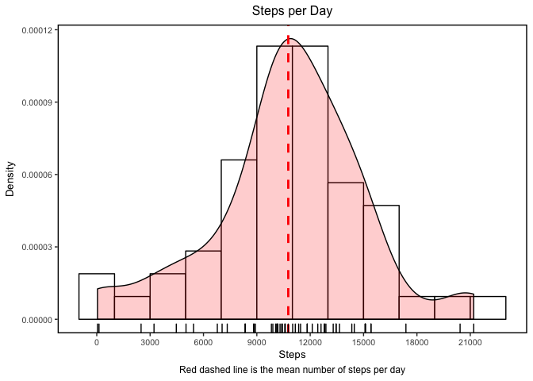
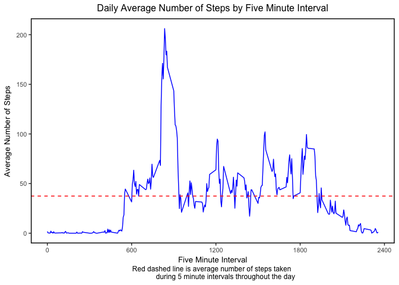
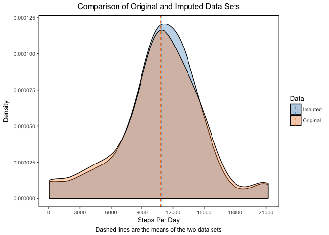
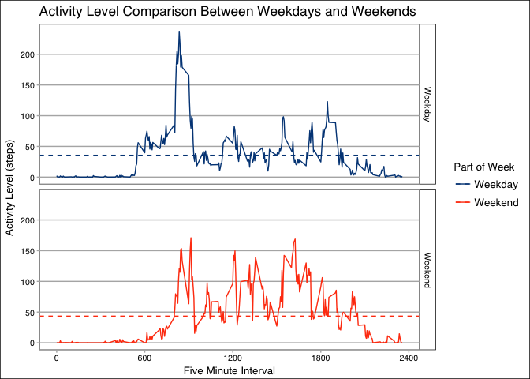

# Reproducible Research: Peer Assessment 1
#####Introduction (from the course website)
######It is now possible to collect a large amount of data about personal movement using activity monitoring devices such as a Fitbit, Nike Fuelband, or Jawbone Up. These type of devices are part of the "quantified self" movement -- a group of enthusiasts who take measurements about themselves regularly to improve their health, to find patterns in their behavior, or because they are tech geeks. But these data remain under-utilized both because the raw data are hard to obtain and there is a lack of statistical methods and software for processing and interpreting the data.

######This assignment makes use of data from a personal activity monitoring device. This device collects data at 5 minute intervals through out the day. The data consists of two months of data from an anonymous individual collected during the months of October and November, 2012 and include the number of steps taken in 5 minute intervals each day.

#####The Data (from the course website).
######The data for this assignment can be downloaded from the course web site:
######The variables included in this dataset are:
######-steps: Number of steps taking in a 5-minute interval (missing values are coded as NA)
######-date: The date on which the measurement was taken in YYYY-MM-DD format
######-interval: Identifier for the 5-minute interval in which measurement was taken
######-The dataset is stored in a comma-separated-value (CSV) file and there are a total of 17,568 observations in this dataset.

######The following is the process and code that I used to answer the questions posed in the assignment. 

#####Loading and Pre-processing the Data.


```r
#Reproducable Research Week 1 Project
#assignment_1.R
#by Lawrence Tomaziefski
#2016-12-16
#_______________________________________________________________________________

#Script Begins

#Clear workspace of prior objects to free memory.
rm(list = ls())

#Set working directory
setwd('/Users/lawrence_tomaziefski/R_Working_Directory/161212_Reproducable_Research')

#Function to install and load libraries that are not already installed or loaded
#using very cool approach found here https://gist.github.com/stevenworthington/3178163
ipak <- function(pkg){
        new.pkg <- pkg[!(pkg %in% installed.packages()[, "Package"])]
        if (length(new.pkg))
                install.packages(new.pkg, dependencies = TRUE)
        sapply(pkg, require, character.only = TRUE)
}
print(paste("started at :", Sys.time()))

print("loading libraries.")

#Create vector of libraries and pass into the above function.
libraries <- c("tibble","data.table","dtplyr","dplyr","readr",
               "lubridate","ggplot2","RColorBrewer","gridExtra",
               "devtools","ggthemes", "tidyr")
ipak(libraries)

#Check for data folder.  Create one if none exists
if (!file.exists("./data")) { dir.create("./data")}

#The activity zip file should be in your working directory
sourcefile = "./activity.zip"
loadfile = "activity.csv"

#Using "unzip", extract only those file.  using "jumkpaths" removes any internal folder structure
#to allow all files to be placed as designated, in this case, all in the root of the "./data" folder.
unzip(sourcefile, loadfile, list = FALSE, junkpaths = TRUE, exdir = "./data", unzip = "internal")

#Check to see if your data set is in the data folder
list.files("./data")

#Read in the data, we are going to need to ensure that the second column in the data set is read in 
#as a date for further analysis
activity_data = read.csv("./data/activity.csv", header = TRUE, stringsAsFactors = FALSE, 
                         colClasses = c("numeric","Date","numeric"))
```

######Use str to take a look at the structure of our "activity_data" 


```r
str(activity_data)
```

```
## 'data.frame':	17568 obs. of  3 variables:
##  $ steps   : num  NA NA NA NA NA NA NA NA NA NA ...
##  $ date    : Date, format: "2012-10-01" "2012-10-01" ...
##  $ interval: num  0 5 10 15 20 25 30 35 40 45 ...
```

######If the data read in correctly there should be 17568 observations, which there is, so we are ready for further analysis.

#####What is mean total number of steps taken per day?
######In order to determine the total number of steps taken per day, we have to summarize the data with the following code:


```r
steps_per_day = activity_data %>%
        filter(!is.na(steps)) %>%
        group_by(date) %>%
        summarize(steps_day = sum(steps))
```

######The following is a summary where we find the mean and median number of steps taken per day:


```r
summary(steps_per_day$steps_day)
```

```
##    Min. 1st Qu.  Median    Mean 3rd Qu.    Max. 
##      41    8841   10760   10770   13290   21190
```

######Histogram for number of steps per day.


```r
steps_hist = ggplot(steps_per_day, aes(x = steps_day)) +
        geom_histogram(aes(y =..density..), size = .5, binwidth = 2000, color = "black", fill = "white") + 
        geom_density(alpha = .2, fill = "red") +
        theme(panel.background = element_rect(fill = "white"),
              panel.grid.minor = element_line(color = NA),
              panel.grid.major.x = element_line(color = NA),
              panel.grid.major.y = element_line(color = NA),
              panel.border = element_rect(color = "black", fill = NA, size = 1),
              plot.title = element_text(hjust = 0.5),
              text = element_text(size = 10, color = "black"),
              plot.caption = element_text(hjust = 0.5)) +
        labs(y = "Density",
             x = "Steps",
             title = "Steps per Day",
             caption = "Red dashed line is the mean number of steps per day") +
        geom_vline(aes(xintercept= mean(steps_day, na.rm = TRUE)),  
                   color ="red", linetype = "dashed", size = 1) +
        geom_rug() +
        scale_x_continuous(breaks = seq(0, 21000, by = 3000)) 
```
<!-- -->

#####What is the average daily activity pattern?
######Create a data frame that groups each five minute interval and takes the mean for each daily interval.  


```r
daily_activity = activity_data %>%
        group_by(interval) %>%
        summarize(steps_interval = mean(steps, na.rm = TRUE))
```

######The following is a summary of the "daily_activity" data frame created above:


```r
summary(daily_activity$steps_interval)
```

```
##    Min. 1st Qu.  Median    Mean 3rd Qu.    Max. 
##   0.000   2.486  34.110  37.380  52.830 206.200
```

######The following is a graphical representation of the subject's daily activity pattern:


```r
daily_activity_line = ggplot(daily_activity, aes(x= interval, y = steps_interval)) +
        geom_line(color = "blue") +
        theme(panel.background = element_rect(fill = "white"),
              panel.grid.minor = element_line(color = NA),
              panel.grid.major.x = element_line(color = NA),
              panel.grid.major.y = element_line(color = NA),
              panel.border = element_rect(color = "black", fill = NA, size = 1),
              plot.title = element_text(hjust = 0.5),
              text = element_text(size = 10, color = "black"),
              plot.caption = element_text(hjust = 0.5)) +
        labs(y = "Average Number of Steps",
             x = "Five Minute Interval",
             title = "Daily Average Number of Steps by Five Minute Interval",
             caption = "Red dashed line is average number of steps taken 
             during 5 minute intervals throughout the day") +
        geom_hline(aes(yintercept= mean(steps_interval, na.rm = TRUE)),  
                   color ="red", linetype = "dashed", size = .5) +
        scale_x_continuous(breaks = seq(0, 2400, by = 600)) 
```
<!-- -->

#####Imputing missing values.
######The number of missing values or NAs can be found by simply taking a summary of "steps" of our data frame "activity_data".


```r
summary(activity_data$steps)
```

```
##    Min. 1st Qu.  Median    Mean 3rd Qu.    Max.    NA's 
##    0.00    0.00    0.00   37.38   12.00  806.00    2304
```

######We see that there are 2304 NA values.  If we filter the NAs from activity_data and put into another data frame named "NA" we can explore a little more clearly where the NAs occur. Using the table function we see that there are 8 days where the data is completely missing. 


```r
NAs = filter(activity_data,is.na(steps))
table(NAs$date)
```

```
## 
## 2012-10-01 2012-10-08 2012-11-01 2012-11-04 2012-11-09 2012-11-10 
##        288        288        288        288        288        288 
## 2012-11-14 2012-11-30 
##        288        288
```

######In order to impute the missing values we are going to take the following steps:
######1. We will to add two new columns to "activity_data" detemine the day of week and the month for each date and rename it "activity_day_month".
######2. Then add an index column which will use to summarize the data and for joining dataframes later in the process.
######3. Separate the "activity_day_month" data frame into three data frames, one with just NAs, one with no NAs, and one that groups the data by the index 
######and then finds the mean. 
######4. We will then join the NA dataframe with the summarized data frame, thus imputing the data with the mean of steps by interval, day of the week, 
######and month.  
######5. Finally add the imputed data set back into data set.
######6. Do a summary of the imputed data set to ensure there are no NAs.


```r
#Steps 1 and 2
activity_day_month = activity_data %>%
        mutate(dayofweek = wday(date,label = TRUE)) %>%
        mutate(month = month(date,label = TRUE)) %>%
        mutate(index = paste0(interval,dayofweek,month)) %>%
        select(index,steps,date,interval,dayofweek,month)
#Step 3
activity_day_month_NAs = filter(activity_day_month,is.na(steps))

activity_day_month_No_NAs = filter(activity_day_month,!is.na(steps))

activity_day_month_summarized = activity_day_month_No_NAs %>%
        group_by(index) %>%
        summarize(average = mean(steps, na.rm = TRUE))
#Step 4
activity_day_month_imp = left_join(activity_day_month_NAs,
                                   activity_day_month_summarized,
                                   by = "index") %>%
                        select(index, average, date, interval,dayofweek,month) %>%
                        rename(steps = average)
#Step 5
activity_data_imp = bind_rows(activity_day_month_No_NAs, activity_day_month_imp)
#Step 6
summary(activity_data_imp$steps)
```

```
##    Min. 1st Qu.  Median    Mean 3rd Qu.    Max. 
##    0.00    0.00    0.00   37.59   17.00  806.00
```

######Did imputing values make a difference?  The short answer is yes. We are going to show this both visually and computationally.  First we will create a data set that will help us make a direct comparison between the imputed and original data sets.  


```r
steps_per_day_imp = activity_data_imp %>%
        group_by(date) %>%
        summarize(steps_day = sum(steps)) %>%
        mutate(Data = "Imputed")

steps_per_day_orignal = mutate(steps_per_day, Data = "Original")

steps_per_day_combined = bind_rows(steps_per_day_imp, steps_per_day_orignal)

mean_steps = steps_per_day_combined %>%
        group_by(Data) %>%
        summarize(Mean = mean(steps_day, na.rm = TRUE), Median = median(steps_day, na.rm =TRUE))
```

```
## # A tibble: 2 × 3
##       Data     Mean Median
##      <chr>    <dbl>  <dbl>
## 1  Imputed 10827.17  11015
## 2 Original 10766.19  10765
```
######We see that both the mean and median number of steps per day increased after imputing the data set.  The following graph demonstrates the shift in distribution of the average steps taken per day.  


```r
steps_compare = ggplot(steps_per_day_combined, aes(x = steps_day, group = Data, 
                                                fill = Data)) +
        geom_density(alpha = .3) +
        theme(panel.background = element_rect(fill = "white"),
              panel.grid.minor = element_line(color = NA),
              panel.grid.major.x = element_line(color = NA),
              panel.grid.major.y = element_line(color = NA),
              panel.border = element_rect(color = "black", fill = NA, size = 1),
              plot.title = element_text(hjust = 0.5),
              text = element_text(size = 10, color = "black"),
              plot.caption = element_text(hjust = 0.5)) +
        labs(y = "Density",
             x = "Steps Per Day",
             title = "Comparison of Original and Imputed Data Sets",
             caption = "Dashed lines are the means of the two data sets") +
        geom_vline(data = mean_steps,
                   aes(xintercept= Mean, 
                       color = Data), 
                       linetype = "dashed", 
                       size = .5) +
        scale_x_continuous(breaks = seq(0, 21000, by = 3000)) +
        scale_fill_tableau() +
        scale_color_tableau()
```
<!-- -->

####Are there differences in activity patterns between weekdays and weekends?
######We will make a new data frame named "activity_level_compare" which will make use of the work we did in the previous section to convert the dates to days of the week.  Use mutate and an ifelse statement to classify each date as either a weekday or weekend.  The following code will allow us to summarize the data and plot it to see what insights we can draw out.


```r
activity_level_compare = activity_data_imp %>%
        mutate(partofweek = ifelse(dayofweek == "Sat" | dayofweek == "Sun", "Weekend","Weekday")) %>%
        group_by(partofweek,interval) %>%
        summarize(average = mean(steps))

partofweek_steps = activity_level_compare %>%
        group_by(partofweek) %>%
        summarize(Mean = mean(average))
```

```
## # A tibble: 2 × 2
##   partofweek     Mean
##        <chr>    <dbl>
## 1    Weekday 35.52869
## 2    Weekend 43.40394
```

```r
activity_compare_line = 
        ggplot(activity_level_compare, aes(x= interval, y = average, group = partofweek, color = partofweek)) +
        geom_line() +
        theme_calc()+ 
        labs(y = "Activity Level (steps)",
             x = "Five Minute Interval",
             title = "Activity Level Comparison Between Weekdays and Weekends") +
        scale_colour_calc(name = "Part of Week")+
        geom_hline(data = partofweek_steps,
                   aes(yintercept= Mean, 
                       color = partofweek), 
                   linetype = "dashed", 
                   size = .5) +
        scale_x_continuous(breaks = seq(0, 2400, by = 600)) + 
        facet_grid(partofweek~.) 
```
<!-- -->

######The average activity level is higher on the weekend.  However, activity begins earlier during the week, and weekday intervals see the highest levels of activity.  On the weekends activity levels are relatively stable, and are generally higher durign later intervals as compared to weekdays.   
