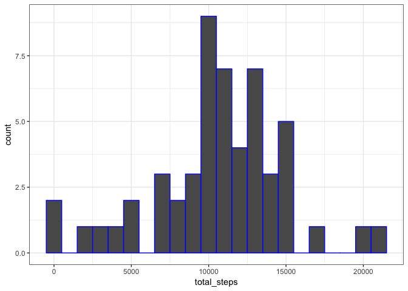
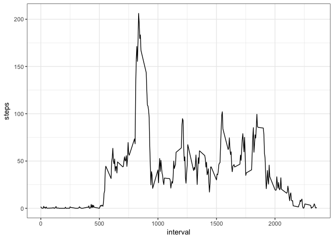
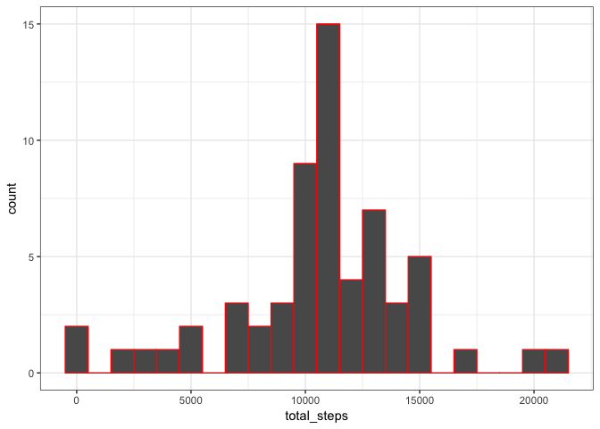
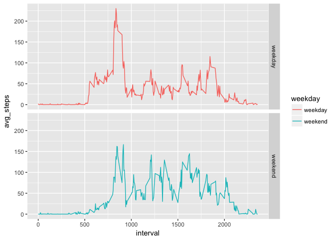

# Reproducible Research: Peer Assessment 1

# Expected outputs:
1.Code for reading in the dataset and/or processing the data  
2.Histogram of the total number of steps taken each day  
3.Mean and median number of steps taken each day  
4.Time series plot of the average number of steps taken  
5.The 5-minute interval that, on average, contains the maximum number of steps  
5.Code to describe and show a strategy for imputing missing data  
6.Histogram of the total number of steps taken each day after missing values are imputed  
7.Panel plot comparing the average number of steps taken per 5-minute interval across weekdays and weekends  

## Loading and preprocessing the data
Show any code that is needed to:
1.Load the data (i.e. read.csv())  
2.Process/transform the data (if necessary) into a format suitable for your analysis  

```r
setwd("/Users/DE/Desktop/Coursera/Reproducible Research/RepData_PeerAssessment1")
unzip("activity.zip")
require(data.table)
mdata <- read.csv("activity.csv")
str(mdata)
```

```
## 'data.frame':	17568 obs. of  3 variables:
##  $ steps   : int  NA NA NA NA NA NA NA NA NA NA ...
##  $ date    : Factor w/ 61 levels "2012-10-01","2012-10-02",..: 1 1 1 1 1 1 1 1 1 1 ...
##  $ interval: int  0 5 10 15 20 25 30 35 40 45 ...
```

```r
require(lubridate)
mdata$date <- ymd(mdata$date)
require(dplyr)
require(ggplot2)
```

## What is mean total number of steps taken per day?
For this part of the assignment, you can ignore the missing values in the dataset.  
1.Make a histogram of the total number of steps taken each day  
2.Calculate and report the mean and median total number of steps taken per day  

```r
mdata_by_day <- mdata %>% group_by(date) %>% summarize(total_steps = sum(steps))
summary(mdata_by_day)
```

```
##       date             total_steps   
##  Min.   :2012-10-01   Min.   :   41  
##  1st Qu.:2012-10-16   1st Qu.: 8841  
##  Median :2012-10-31   Median :10765  
##  Mean   :2012-10-31   Mean   :10766  
##  3rd Qu.:2012-11-15   3rd Qu.:13294  
##  Max.   :2012-11-30   Max.   :21194  
##                       NA's   :8
```

```r
q <- ggplot(mdata_by_day, aes(total_steps))
q + geom_histogram(na.rm = T, binwidth = 1000, color = 'blue') + theme_bw()
```

<!-- -->

```r
mean_total_steps <- format(mean(mdata_by_day$total_steps, na.rm = T), nsmall = 2)
median_total_steps <- median(mdata_by_day$total_steps, na.rm = T)
```

The mean total number of steps taken per day is 10766.19 
and median total number of steps taken per day is 10765

## What is the average daily activity pattern?  

1.Make a time series plot (i.e. type = "l") of the 5-minute interval (x-axis) and the average number of steps taken, averaged across all days (y-axis)  
2.Which 5-minute interval, on average across all the days in the dataset, contains the maximum number of steps?  

```r
mdata_by_interval <- aggregate(steps ~ interval, data = mdata, FUN = mean)
q1 <- ggplot(mdata_by_interval, aes(interval,steps))
q1 + geom_line() + theme_bw()
```

<!-- -->

```r
max_interval <- mdata_by_interval$interval[which.max(mdata_by_interval$steps)]
max_steps <- format(mdata_by_interval$steps[which.max(mdata_by_interval$steps)], digits = 5, nsmall = 2)
```

The 835 5-minute interval, on average across all the days in the dataset, contains the maximum number of steps: 206.17

## Imputing missing values
1.Calculate and report the total number of missing values in the dataset (i.e. the total number of rows with NAs)  

```r
dim(mdata)
```

```
## [1] 17568     3
```

```r
missing_values <- apply(mdata, 2, function(x){sum(is.na(x)|is.nan(x))})
missing_rows <- missing_values["steps"]
```

There is 2304 missing values of 'steps' in the dataset  

2.Devise a strategy for filling in all of the missing values in the dataset. The strategy uses the mean for that 5-minute interval.  
3.Create a new dataset that is equal to the original dataset but with the missing data filled in.  

```r
mdata_imputed <- mdata %>% left_join(mdata_by_interval, by = "interval") %>%
    mutate(steps=ifelse(is.na(steps.x), steps.y, steps.x)) %>% select(date, interval, steps)
```

4.Make a histogram of the total number of steps taken each day and Calculate and report the mean and median total number of steps taken per day. Do these values differ from the estimates from the first part of the assignment? What is the impact of imputing missing data on the estimates of the total daily number of steps?  

```r
mdata_imputed_by_day <- mdata_imputed %>% group_by(date) %>% 
    summarize(total_steps = sum(steps))
summary(mdata_imputed_by_day)
```

```
##       date             total_steps   
##  Min.   :2012-10-01   Min.   :   41  
##  1st Qu.:2012-10-16   1st Qu.: 9819  
##  Median :2012-10-31   Median :10766  
##  Mean   :2012-10-31   Mean   :10766  
##  3rd Qu.:2012-11-15   3rd Qu.:12811  
##  Max.   :2012-11-30   Max.   :21194
```

```r
mean_total_steps_imputed <- format(mean(mdata_imputed_by_day$total_steps, na.rm = T), nsmall = 2)
median_total_steps_imputed <- median(mdata_imputed_by_day$total_steps, na.rm = T)
q2 <- ggplot(mdata_imputed_by_day, aes(total_steps))
q2 + geom_histogram(na.rm = T, binwidth = 1000, color = 'red') + theme_bw()
```

<!-- -->

The mean and median from imputed values does not differ from the estimates from the first part of analysis. However, the 25% and 75% from imputed data are closer to the mean than those without. Specifically the 25% quantile from imputed data is bigger and 75% is smaller. Meanwhile the range of total daily steps remain the same. The imputation makes the distribution of daily total steps center more around averaged (mean) total daily steps. 

## Are there differences in activity patterns between weekdays and weekends?
For this part the weekdays() function may be of some help here. Use the dataset with the filled-in missing values for this part.  

1.Create a new factor variable in the dataset with two levels -- "weekday" and "weekend" indicating whether a given date is a weekday or weekend day.  
2.Make a panel plot containing a time series plot (i.e. type = "l") of the 5-minute interval (x-axis) and the average number of steps taken, averaged across all weekday days or weekend days (y-axis). The plot should look something like the following, which was created using simulated data  

```r
mdata_imputed_weekday <- mdata_imputed %>% mutate(weekday = as.factor(ifelse(weekdays(date) %in% c("Saturday", "Sunday"), "weekend", "weekday")))
mdata_imputed_summary <- mdata_imputed_weekday %>% group_by(interval, weekday) %>%
    summarize(avg_steps = mean(steps))
q3 <- ggplot(mdata_imputed_summary, aes(interval, avg_steps, color=weekday))
q3 + geom_line() + facet_grid(weekday ~ .)
```

<!-- -->

```r
mdata_imputed_summary %>% filter(weekday=="weekday") %>% summary()
```

```
##     interval         weekday      avg_steps      
##  Min.   :   0.0   weekday:288   Min.   :  0.000  
##  1st Qu.: 588.8   weekend:  0   1st Qu.:  2.247  
##  Median :1177.5                 Median : 25.803  
##  Mean   :1177.5                 Mean   : 35.611  
##  3rd Qu.:1766.2                 3rd Qu.: 50.854  
##  Max.   :2355.0                 Max.   :230.378
```

```r
mdata_imputed_summary %>% filter(weekday=="weekend") %>% summary()
```

```
##     interval         weekday      avg_steps      
##  Min.   :   0.0   weekday:  0   Min.   :  0.000  
##  1st Qu.: 588.8   weekend:288   1st Qu.:  1.241  
##  Median :1177.5                 Median : 32.340  
##  Mean   :1177.5                 Mean   : 42.366  
##  3rd Qu.:1766.2                 3rd Qu.: 74.654  
##  Max.   :2355.0                 Max.   :166.639
```
The plots between weekdays and weekends confirms the summary of imputed data by weekday/weekend: range of interval steps across all days for weekday is wider than that of weekend; the mean and median for weekdays are smaller than that of weekends. It leads to the conclusions that more people exercises more on weekends on average. However there are some extreme cases during some intervals on weekdays.  
