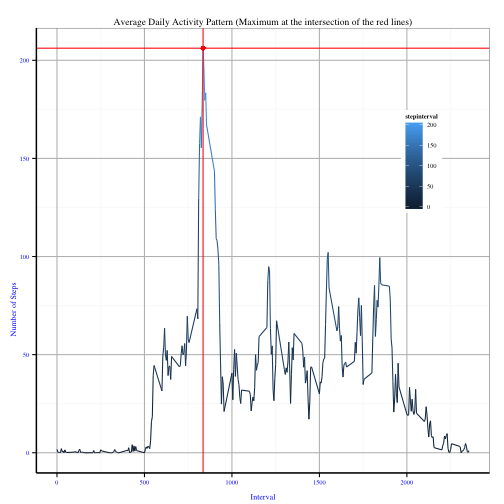
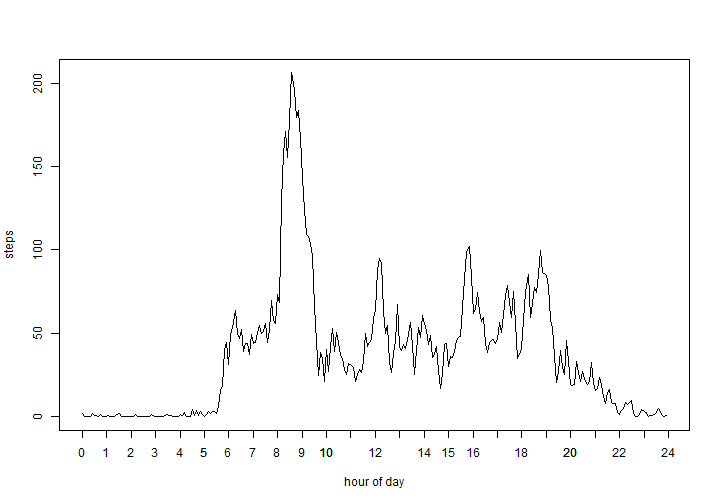
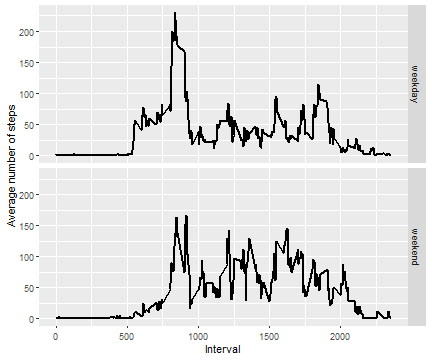
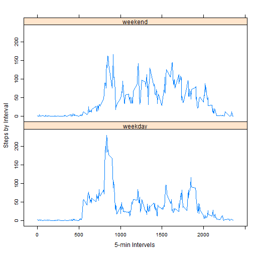

```r
library(ggplot2)
library(dplyr)
library(lattice)
```

###  Loading and preprocessing the data

1. Load the data (i.e. read.csv())

```r
setwd("C:/Users/Yuqi Wang/Google Drive/0_study/1_data_coding/31_coursera_DataSpecialization/5_reproducible/repdata_Fdata_Factivity")
list.files(path = ".")
data <- read.csv("activity.csv")
```

2. Process/transform the data (if necessary) into a format suitable for your analysis

```r
data$date <- as.Date(data$date)
```

###  What is mean total number of steps taken per day? The missing values should be ignored.

1.Calculate the total number of steps taken per day

```r
daily_tot <- tapply(data$steps, data$date, sum, na.rm = TRUE)   
sum(daily_tot =="NA") # check whether all missing values are ommitted
```

2. Make a histogram of the total number of steps taken each day

```r
rng <- range(daily_tot)
# hist(daily_tot,main = "Total Daily Number of Steps", xlab = "Num of Daily Total Steps") # another way to plot
qplot(daily_tot, main = "Total Daily Number of Steps", xlab='Total Daily Number of Steps', ylab='Frequency', binwidth=2000)
```



3. Calculate and report the mean and median of the total number of steps taken per day

```r
daily_mean <- mean(daily_tot)
daily_median <- median(daily_tot)
```
The mean number of steps taken per day is: 

```r
daily_mean
```

```
## [1] 9354.23
```
The median number of steps taken per day is: 

```r
daily_median
```

```
## [1] 10395
```

###  What is the average daily activity pattern?

1. Make a time series plot (i.e. type = "l") of the 5-minute interval (x-axis) and the average number of steps taken, averaged across all days (y-axis)

```r
time_avg <- aggregate(x=list(avgSteps=data$steps), by=list(interval=data$interval), FUN = mean, na.rm = TRUE)
ggplot(time_avg, aes(interval, avgSteps)) + geom_line() + xlab("5-min Intervels") + ylab("Steps by Interval") + ggtitle("Average Daily Activity Pattern") + theme(plot.title = element_text(hjust = 0.5))
```



2. Which 5-minute interval, on average across all the days in the dataset, contains the maximum number of steps?

```r
max_interval <- which.max(time_avg$avgSteps)
```
The 5-minute interval that contains the maximum number of steps is :

```r
max_interval
```

```
## [1] 104
```

### Imputing missing values

1. Calculate and report the total number of missing values in the dataset (i.e. the total number of rows with NAs)

```r
num_na <- sum(!complete.cases(data))
```
The total number of missing values in the dataset is:

```r
num_na
```

```
## [1] 2304
```

2. Devise a strategy for filling in all of the missing values in the dataset. 

Method: using the mean of that 5-minute interval to represent the missing values.

3. Create a new dataset that is equal to the original dataset but with the missing data filled in.

```r
by_interval <- group_by(data,interval)
impute.mean <- function(x) replace(x, is.na(x), mean(x, na.rm = TRUE))
data_noNA <- mutate(by_interval, steps = impute.mean(steps))
num_na <- sum(!complete.cases(data_noNA))  # check whether all missing values have been removed
```

4. Make a histogram of the total number of steps taken each day and Calculate and report the mean and median total number of steps taken per day. 
Do these values differ from the estimates from the first part of the assignment? What is the impact of imputing missing data on the estimates of the total daily number of steps?

```r
# daily_tot_2 <- with(data_noNA, tapply(steps, date, sum))
daily_tot_2 <- tapply(data_noNA$steps, data_noNA$date, sum)
qplot(daily_tot_2, main = "Total Daily Number of Steps \n(Missing Value Imputed)", xlab='Total Daily Number of Steps', ylab='Frequency', binwidth=2000)
```



```r
daily_mean_2 <- mean(daily_tot_2)
daily_median_2 <- median(daily_tot_2)
```
The new mean number of steps taken per day is: 

```r
daily_mean_2
```

```
## [1] 10766.19
```
The new median number of steps taken per day is: 

```r
daily_median_2
```

```
## [1] 10766.19
```
Both are different from the estimates before the missing data were imputed. 


### Are there differences in activity patterns between weekdays and weekends?
1. Create a new factor variable in the dataset with two levels - "weekday" and "weekend" indicating whether a given date is a weekday or weekend day.

```r
wkd <- c("Monday","Tuesday","Wednesday","Thursday","Friday")
data_noNA$weekDay <- c("weekend","weekday")[weekdays(data_noNA$date) %in% wkd +1]
data_noNA$weekDay <- as.factor(data_noNA$weekDay)
```

2. Make a panel plot containing a time series plot (i.e. type = "l") of the 5-minute interval (x-axis) and the average number of steps taken, averaged across all weekday days or weekend days (y-axis)

```r
time_avg_wkd <- aggregate(.~interval+weekDay, data_noNA, mean)
xyplot(steps~interval|weekDay,data=time_avg_wkd,type="l",ylim = range(time_avg_wkd$steps), xlab = "5-min Intervels", ylab = "Steps by Interval", scales=list(y=list(relation="free")),layout=c(1,2))
```




