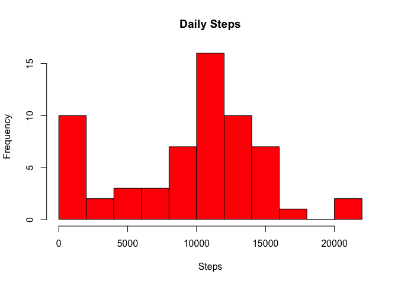
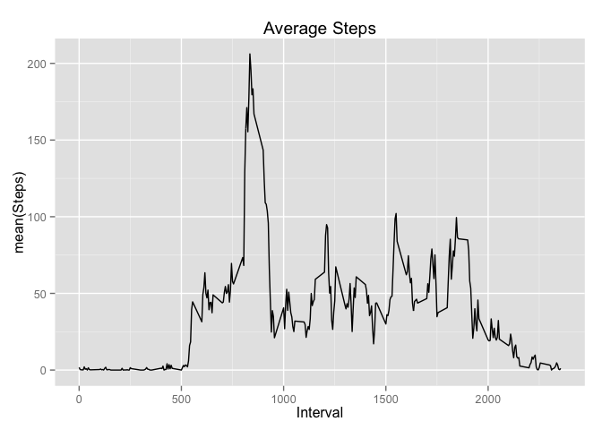

# Reproducible Research: Peer Assessment 1


```r
require(knitr)
require(ggplot2)
require(dplyr)
```

```
## Warning: package 'dplyr' was built under R version 3.2.1
```

```r
require(lubridate)
opts_chunk$set(echo = TRUE)
# opts_chunk$set(echo = TRUE, results = "hide")
```

## Loading and preprocessing the data


```r
dt <- read.csv2("~/Desktop/Coursera/ReproducibleResearch/RepData_PeerAssessment1/activity.csv", sep = ",", stringsAsFactors = FALSE, header = TRUE)  

# convert date string to POSIX ct date format

dt <- mutate(dt, date = ymd(date))

# convert interval from string (e.g. 1355 means 1:55 PM), to POSIXct date-time
minute(dt$date) <- dt$interval %% 100
hour(dt$date)   <- dt$interval %/% 100

# dt <- mutate(dt, minuteOfDay = (interval %/% 100)*60 + (interval %% 100))
```

## What is mean total number of steps taken per day?


```r
# Group the data by day of year, and then calculate daily stats.
by_date <- group_by(dt, doy = yday(date))
summary_date <- summarise(by_date, daily_total = sum(steps, na.rm = T))

hist(summary_date$daily_total,
     col="red", 
     breaks = 12,
     main = "Daily Steps", 
     xlab = "Steps"
)
```

 

```r
mean(summary_date$daily_total, na.rm = T)
```

```
## [1] 9354.23
```

```r
median(summary_date$daily_total, na.rm = T)
```

```
## [1] 10395
```

## What is the average daily activity pattern?


```r
# Group the data by day of year, and then calculate daily stats.
by_interval <- group_by(dt, interval)
summary_interval <- summarise(by_interval, interval_mean = mean(steps, na.rm = TRUE))

qplot(interval, interval_mean, data=summary_interval, 
      geom = "line",
      main="Average Steps",
      xlab="Interval", ylab="mean(Steps)"
)
```

 

```r
with(summary_interval, {
        interval[which(interval_mean == max(interval_mean))]
})
```

```
## [1] 835
```


## Imputing missing values


```r
sum(is.na(dt$steps))
```

```
## [1] 2304
```

```r
# replace missing values of steps with the mean value for that interval
imputed_dt <- dt
# This next steps only works because there are no missing intervals, just 
# missing data. In other words dt is a repeating set of same 288 intervals
# so the assignment "repeats" or "wraps" thru the 288 mean values. Wish I
# thought of this.
imputed_dt[is.na(imputed_dt$steps), "steps"] = summary_interval$interval_mean

mean(imputed_dt$steps, na.rm = F)
```

```
## [1] 37.3826
```

```r
mean(dt$steps, na.rm = T)
```

```
## [1] 37.3826
```

```r
by_date <- group_by(imputed_dt, doy = yday(date))
summary_date <- summarise(by_date, daily_total = sum(steps, na.rm = T))
hist(summary_date$daily_total,
     col="red", 
     breaks = 12,
     main = "Daily Steps (imputed values are interval mean)", 
     xlab = "Steps"
)
```

 

```r
mean(summary_date$daily_total, na.rm = T)
```

```
## [1] 10766.19
```

```r
median(summary_date$daily_total, na.rm = T)
```

```
## [1] 10766.19
```

## Are there differences in activity patterns between weekdays and weekends?


```r
imputed_dt = mutate(imputed_dt, weekend = ifelse(grepl('^S', weekdays(imputed_dt$date)), "weekend", "weekday"))

by_interval <- group_by(imputed_dt, interval, weekend)
summary_interval <- summarise(by_interval, interval_mean = mean(steps, na.rm = TRUE))


qplot(interval, interval_mean, data=summary_interval,
      facets = weekend ~ . ,
      geom = "line",
      main="Average Steps (imputed values are interval mean)",
      xlab="Interval", ylab="mean(Steps)"
)
```

 
