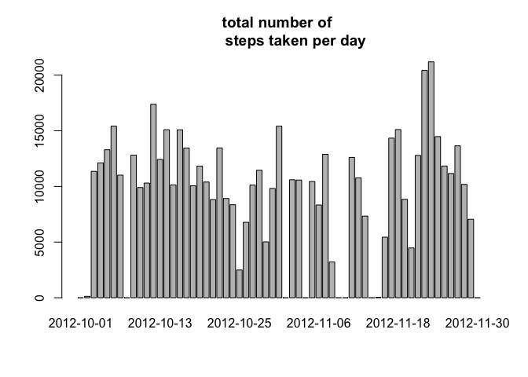
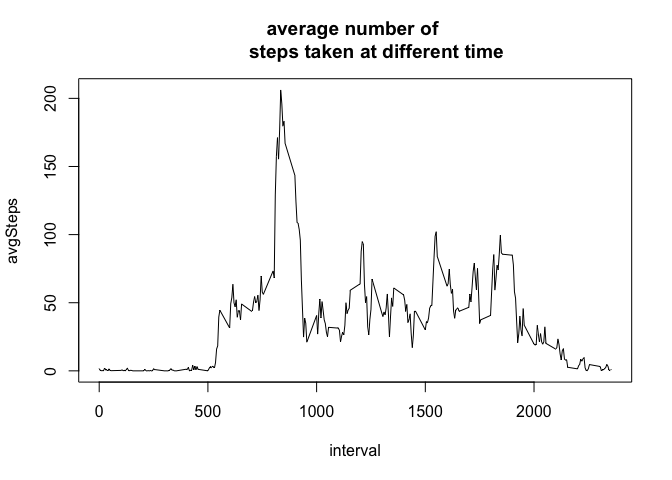
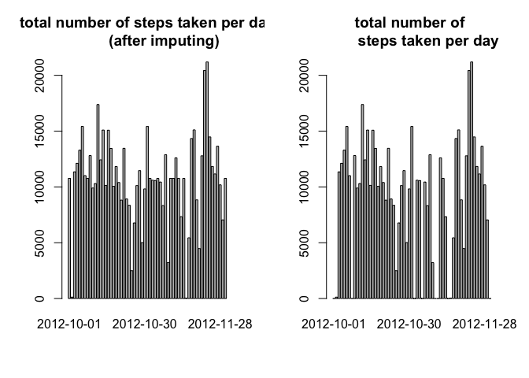
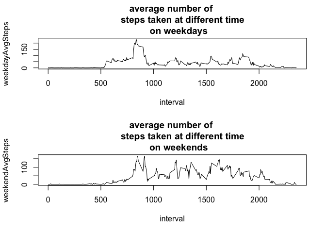

# Reproducible Research: Peer Assessment 1


## Loading and preprocessing the data

```r
data=read.csv("activity.csv",sep=",")
```


## What is mean total number of steps taken per day?

```r
totalSteps=tapply(data$steps,
                  data$date,sum,na.rm=TRUE)
barplot(totalSteps,main="total number of 
        steps taken per day")
```

 

```r
summary(totalSteps)
```

```
##    Min. 1st Qu.  Median    Mean 3rd Qu.    Max. 
##       0    6778   10400    9354   12810   21190
```


## What is the average daily activity pattern?

```r
avgSteps=tapply(data$steps,
                data$interval,
                mean,na.rm=T)

plot(unique(data$interval),avgSteps,
     main="average number of 
        steps taken at different time",type="l",xlab="interval") 
```

 

```r
which.max(avgSteps)
```

```
## 835 
## 104
```

As can be concluded from the result, the maximum number of steps is taken around 8:35 in the morning.

## Imputing missing values

```r
sum(is.na(data$steps))
```

```
## [1] 2304
```

```r
naData=is.na(data$steps)
newData=data
newData$steps[naData]=avgSteps[as.character(data[naData,]$interval)]
newTotalSteps=tapply(newData$steps,
                  newData$date,sum)
par(mfrow=c(1,2))
barplot(newTotalSteps,main="total number of steps taken per day
        (after imputing)")
barplot(totalSteps,main="total number of 
        steps taken per day")
```

 

```r
summary(newTotalSteps)
```

```
##    Min. 1st Qu.  Median    Mean 3rd Qu.    Max. 
##      41    9819   10770   10770   12810   21190
```

```r
summary(totalSteps)
```

```
##    Min. 1st Qu.  Median    Mean 3rd Qu.    Max. 
##       0    6778   10400    9354   12810   21190
```


## Are there differences in activity patterns between weekdays and weekends?


```r
weekday=c("Monday","Tuesday","Wednesday","Thursday","Friday")

newData$weekday=weekdays(as.Date(newData$date)) %in% weekday

weekdayData=newData[newData$weekday,]
weekendData=newData[!newData$weekday,]
par(mfrow=c(2,1))
weekdayAvgSteps=tapply(weekdayData$steps,
                weekdayData$interval,
                mean,na.rm=T)

plot(unique(weekdayData$interval),
     weekdayAvgSteps,
     main="average number of 
        steps taken at different time
     on weekdays",type="l",xlab="interval")
weekendAvgSteps=tapply(weekendData$steps,
                weekendData$interval,
                mean,na.rm=T)

plot(unique(weekendData$interval),
     weekendAvgSteps,
     main="average number of 
        steps taken at different time
     on weekends",type="l",xlab="interval")
```

 

As can be seen from the plot, the majority of steps are taken in the morning and the evening, when the individual seems to do exercise and travel to work. However, the steps taken on weekends are spread evenly throughout the whole day.


