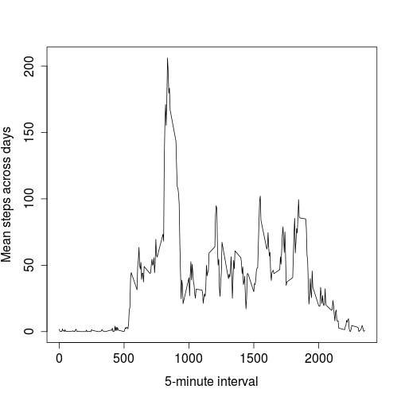

# Reproducible Research: Peer Assessment 1


## Loading and preprocessing the data

### Loading data

```r
if (!("activity.csv" %in% list.files())) {
    unzip("activity.zip")
}
activity <- read.csv("activity.csv")
```


### Preprocessing the data

```r
activity$date <- as.Date(activity$date, "%Y-%m-%d")
```


## What is mean total number of steps taken per day?

1.  histogram of the total number of steps taken each day

```r
library(ggplot2)
library(plyr)
activity_day <- ddply(activity, .(date), summarize, total_steps = sum(steps))
ggplot(activity_day) + geom_histogram(aes(x = total_steps)) + labs(x = "Total Number of Steps Taken per Day") + 
    theme_bw()
```

```
## stat_bin: binwidth defaulted to range/30. Use 'binwidth = x' to adjust this.
```

 


2.  Calculate and report the mean and median total number of steps taken per day

```r
mean_steps_per_day <- mean(activity_day$total_steps, na.rm = T)
median_steps_per_day <- median(activity_day$total_steps, na.rm = T)
```


The mean and median total number of steps taken per day is 1.0766 &times; 10<sup>4</sup> and 10765 respectively.

## What is the average daily activity pattern?

1. Time series plot (i.e. type = "l") of the 5-minute interval (x-axis) and the average number of steps taken, averaged across all days (y-axis)

```r
activity_interval <- ddply(activity[!is.na(activity$steps), ], .(interval), 
    summarize, average_steps = mean(steps))
ggplot(activity_interval) + geom_path(aes(x = interval, y = average_steps)) + 
    labs(x = "5 minute interval", y = "Average steps") + theme_bw()
```

 


2. Which 5-minute interval, on average across all the days in the dataset, contains the maximum number of steps?

```r
max_5min_interval <- activity_interval$interval[activity_interval$average_steps == 
    max(activity_interval$average_steps)]
```

The five minute interval 835 had the maxmimum average number of steps across all days.


## Imputing missing values

Note that there are a number of days/intervals where there are missing values (coded as NA). The presence of missing days may introduce bias into some calculations or summaries of the data.

* Calculate and report the total number of missing values in the dataset (i.e. the total number of rows with NAs)

```r
missing_value_count <- length(is.na(activity$steps))
```

There are a total of 17568 missing values in the dataset

* Devise a strategy for filling in all of the missing values in the dataset. The strategy does not need to be sophisticated. For example, you could use the mean/median for that day, or the mean for that 5-minute interval, etc.
Distribtution of 'NA' values

```r
ggplot(activity[is.na(activity$steps), ]) + geom_histogram(aes(x = interval)) + 
    labs(x = "NAs per Interval") + theme_bw()
```

```
## stat_bin: binwidth defaulted to range/30. Use 'binwidth = x' to adjust this.
```

 

```r
ggplot(activity[is.na(activity$steps), ]) + geom_histogram(aes(x = date)) + 
    labs(x = "NAs per Day") + theme_bw()
```

```
## stat_bin: binwidth defaulted to range/30. Use 'binwidth = x' to adjust this.
```

 

The missing data are for complete days.  
Will use the median number of steps for each interval to fill in the missing values. 

* Create a new dataset that is equal to the original dataset but with the missing data filled in.

```r
missing_values <- activity[is.na(activity$steps), ]
median_interval <- ddply(activity, .(interval), summarize, steps = median(steps, 
    na.rm = T))
missing_values$steps <- NULL
missing_values <- join(missing_values, median_interval)
```

```
## Joining by: interval
```

```r
activity_fill <- rbind(activity[!(is.na(activity$steps)), ], missing_values)
```


* Make a histogram of the total number of steps taken each day and Calculate and report the mean and median total number of steps taken per day. Do these values differ from the estimates from the first part of the assignment? What is the impact of imputing missing data on the estimates of the total daily number of steps?

```r
activity_fill_day <- ddply(activity_fill, .(date), summarize, total_steps = sum(steps))
ggplot(activity_fill_day) + geom_histogram(aes(x = total_steps)) + labs(x = "Total Number of Steps Taken per Day", 
    title = "Total Steps with Imputating the Data") + theme_bw()
```

```
## stat_bin: binwidth defaulted to range/30. Use 'binwidth = x' to adjust this.
```

 


Calculating the mean and median steps per day

```r
library(reshape2)
no_fill_total_mean <- mean(activity_day$total_steps, na.rm = T)
no_fill_total_median <- median(activity_day$total_steps, na.rm = T)
fill_total_mean <- mean(activity_fill_day$total_steps, na.rm = T)
fill_total_median <- median(activity_fill_day$total_steps, na.rm = T)
activity_compare <- data.frame(data = rep(c("no_fill", "fill"), each = 2), stat = rep(c("mean", 
    "median"), times = 2), value = c(no_fill_total_mean, no_fill_total_median, 
    fill_total_mean, fill_total_median))
activity_compare_table <- dcast(activity_compare, stat ~ data)
activity_compare_table$Difference <- activity_compare_table$fill - activity_compare_table$no_fill
```

Summary Table to compare the mean and median total steps per day

```r
library(xtable)
activity_compare <- data.frame(data = rep(c("no_fill", "fill"), each = 2), stat = rep(c("mean", 
    "median"), times = 2), value = c(no_fill_total_mean, no_fill_total_median, 
    fill_total_mean, fill_total_median))
activity_compare_table <- dcast(activity_compare, stat ~ data)
activity_compare_table$Difference <- activity_compare_table$no_fill - activity_compare_table$fill
compare_xtable <- xtable(activity_compare_table)
```


```r
print.xtable(compare_xtable, type = "html", include.rownames = F)
```

<!-- html table generated in R 3.0.2 by xtable 1.7-1 package -->
<!-- Sun Jun 15 09:58:37 2014 -->
<TABLE border=1>
<TR> <TH> stat </TH> <TH> fill </TH> <TH> no_fill </TH> <TH> Difference </TH>  </TR>
  <TR> <TD> mean </TD> <TD align="right"> 9503.87 </TD> <TD align="right"> 10766.19 </TD> <TD align="right"> 1262.32 </TD> </TR>
  <TR> <TD> median </TD> <TD align="right"> 10395.00 </TD> <TD align="right"> 10765.00 </TD> <TD align="right"> 370.00 </TD> </TR>
   </TABLE>

The imputing the data has a greater impact on the number of steps taken per day when comparing the mean then the meadian.   

## Are there differences in activity patterns between weekdays and weekends?
For this part the `weekdays()` function may be of some help here. Use the dataset with the filled-in missing values for this part.

```r
# adding a column to indicate the day of the week
activity_fill$day <- weekdays(activity_fill$date)
```


* Create a new factor variable in the dataset with two levels -- "weekday" and "weekend" indicating whether a given date is a weekday or weekend day.

```r
activity_fill$day_factor <- "weekday"
activity_fill$day_factor[activity_fill$day %in% c("Saturday", "Sunday")] <- "weekend"
activity_fill$day_factor <- as.factor(activity_fill$day_factor)
```


* Make a panel plot containing a time series plot (i.e. type = "l") of the 5-minute interval (x-axis) and the average number of steps taken, averaged across all weekday days or weekend days (y-axis). The plot should look something like the following, which was creating using simulated data:

```r
activity_fill_interval <- ddply(activity_fill, .(day_factor, interval), summarize, 
    average_steps = mean(steps))
ggplot(activity_fill_interval) + geom_path(aes(x = interval, y = average_steps)) + 
    labs(x = "5 minute interval", y = "Average steps") + facet_wrap(~day_factor, 
    ncol = 1) + theme_bw()
```

 


