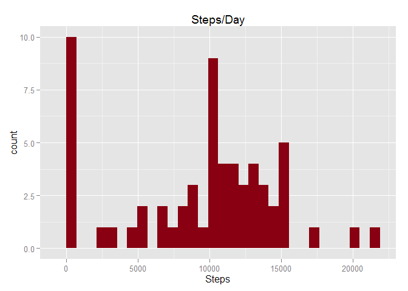
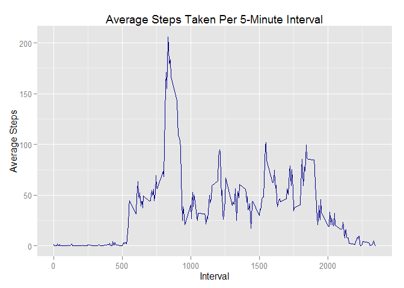
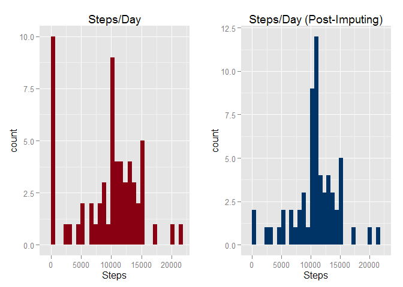
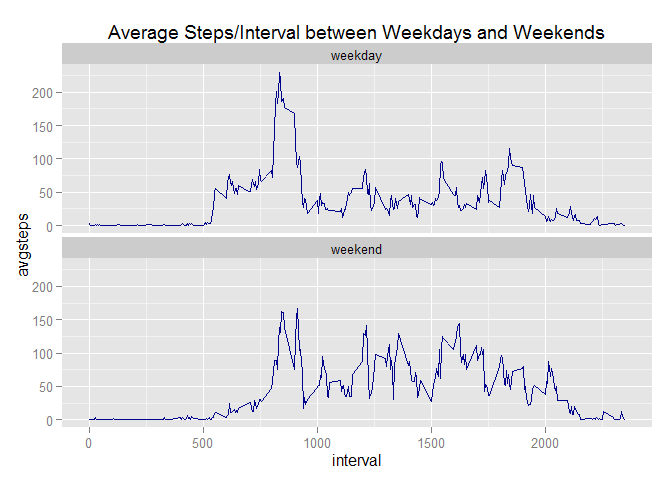

# Reproducible Research: Peer Assessment 1
KW  
December 20, 2015  


## Loading and preprocessing the data
**Libraries**

```r
library(dplyr)
```

```
## Warning: package 'dplyr' was built under R version 3.2.3
```

```
## 
## Attaching package: 'dplyr'
## 
## The following objects are masked from 'package:stats':
## 
##     filter, lag
## 
## The following objects are masked from 'package:base':
## 
##     intersect, setdiff, setequal, union
```

```r
library(ggplot2)
```

```
## Warning: package 'ggplot2' was built under R version 3.2.3
```

```r
library(gridExtra)
```

```
## Warning: package 'gridExtra' was built under R version 3.2.3
```

```r
library(lubridate)
```

```
## Warning: package 'lubridate' was built under R version 3.2.3
```

### Load data into dplyr data frame

```r
if (!file.exists("repdata-data-activity.zip")) {
        fileUrl <- "https://d396qusza40orc.cloudfront.net/repdata%2Fdata%2Factivity.zip"
        download.file(fileUrl, destfile = "./activity.zip") }

data <- tbl_df(read.csv(unz("activity.zip", "activity.csv"), header = T))
```


## What is mean total number of steps taken per day?
**Group base data on days**

```r
days <- group_by(data, date)
```

**Analyze steps over days**

```r
sumsteps <- summarise(days, 
                      "meansteps" = mean(steps, na.rm = TRUE), 
                      "mediansteps" = median(steps, na.rm = TRUE), 
                      "totalsteps" = sum(steps, na.rm = TRUE))
```

### Histogram of daily steps

```r
unimphist <- ggplot(sumsteps, aes(x = totalsteps)) + 
        stat_bin(binwidth = 10) +
        geom_histogram(fill = "#880011", binwidth = diff(range(sumsteps$totalsteps))/30) +
        ggtitle("Steps/Day") +
        labs(x = "Steps")
unimphist
```

 

### Mean and median steps per day

```r
as.data.frame(select(sumsteps,1:3))
```

```
##          date  meansteps mediansteps
## 1  2012-10-01        NaN          NA
## 2  2012-10-02  0.4375000           0
## 3  2012-10-03 39.4166667           0
## 4  2012-10-04 42.0694444           0
## 5  2012-10-05 46.1597222           0
## 6  2012-10-06 53.5416667           0
## 7  2012-10-07 38.2465278           0
## 8  2012-10-08        NaN          NA
## 9  2012-10-09 44.4826389           0
## 10 2012-10-10 34.3750000           0
## 11 2012-10-11 35.7777778           0
## 12 2012-10-12 60.3541667           0
## 13 2012-10-13 43.1458333           0
## 14 2012-10-14 52.4236111           0
## 15 2012-10-15 35.2048611           0
## 16 2012-10-16 52.3750000           0
## 17 2012-10-17 46.7083333           0
## 18 2012-10-18 34.9166667           0
## 19 2012-10-19 41.0729167           0
## 20 2012-10-20 36.0937500           0
## 21 2012-10-21 30.6284722           0
## 22 2012-10-22 46.7361111           0
## 23 2012-10-23 30.9652778           0
## 24 2012-10-24 29.0104167           0
## 25 2012-10-25  8.6527778           0
## 26 2012-10-26 23.5347222           0
## 27 2012-10-27 35.1354167           0
## 28 2012-10-28 39.7847222           0
## 29 2012-10-29 17.4236111           0
## 30 2012-10-30 34.0937500           0
## 31 2012-10-31 53.5208333           0
## 32 2012-11-01        NaN          NA
## 33 2012-11-02 36.8055556           0
## 34 2012-11-03 36.7048611           0
## 35 2012-11-04        NaN          NA
## 36 2012-11-05 36.2465278           0
## 37 2012-11-06 28.9375000           0
## 38 2012-11-07 44.7326389           0
## 39 2012-11-08 11.1770833           0
## 40 2012-11-09        NaN          NA
## 41 2012-11-10        NaN          NA
## 42 2012-11-11 43.7777778           0
## 43 2012-11-12 37.3784722           0
## 44 2012-11-13 25.4722222           0
## 45 2012-11-14        NaN          NA
## 46 2012-11-15  0.1423611           0
## 47 2012-11-16 18.8923611           0
## 48 2012-11-17 49.7881944           0
## 49 2012-11-18 52.4652778           0
## 50 2012-11-19 30.6979167           0
## 51 2012-11-20 15.5277778           0
## 52 2012-11-21 44.3993056           0
## 53 2012-11-22 70.9270833           0
## 54 2012-11-23 73.5902778           0
## 55 2012-11-24 50.2708333           0
## 56 2012-11-25 41.0902778           0
## 57 2012-11-26 38.7569444           0
## 58 2012-11-27 47.3819444           0
## 59 2012-11-28 35.3576389           0
## 60 2012-11-29 24.4687500           0
## 61 2012-11-30        NaN          NA
```


## What is the average daily activity pattern?

```r
intervals <- group_by(data, interval)
pp <- summarise(intervals, 
                "avgsteps" = mean(steps, na.rm = TRUE))

activityplot <- ggplot(pp, aes(interval, avgsteps)) + 
        geom_line(color = "blue4") +
        ggtitle("Average Steps Taken Per 5-Minute Interval") +
        labs(x = "Interval", y="Average Steps")
activityplot
```

 

### 5-minute interval, on average across all the days in the dataset, containing the maximum number of steps

```r
intsteps <- summarise(intervals, 
                      mean(steps, na.rm = TRUE))
colnames(intsteps) <- c("interval", "meansteps")
maxsteps <- as.integer(select(filter(intsteps, 
                                     meansteps == max(na.omit(meansteps))),
                              interval))
maxsteps
```

```
## [1] 835
```

## Imputing missing values
### Number of missing values

```r
nrow(filter(data, is.na(steps)))
```

```
## [1] 2304
```

**New dataset filling missing values with interval mean**

```r
dataf <- data %>% 
        group_by(interval) %>% 
        mutate(steps = ifelse(is.na(steps), 
                              as.integer(round(mean(steps, na.rm = TRUE))), 
                              steps))
```

**Replicate original dataset averages from imputed dataset**

```r
daysf <- group_by(dataf, date)
sumstepsf <- summarise(daysf, 
                       "meansteps" = mean(steps, na.rm = TRUE), 
                       "mediansteps" = median(steps, na.rm = TRUE), 
                       "totalsteps" = sum(steps, na.rm = TRUE))
```

**Prepare imputed histogram of daily steps**

```r
imphist <- ggplot(data=sumstepsf, aes(x=totalsteps)) +
        geom_histogram(fill="#003366", 
                       binwidth = diff(range(sumstepsf$totalsteps))/30) +
        ggtitle("Steps/Day (Post-Imputing)") +
        labs(x="Steps")
```

### Difference between original and imputed datasets
The impact imputing had to the dataset reduced the number of days having 0 steps and increasing the frequency of steps per day near the 10,000 step per day mean.  


```r
grid.arrange(unimphist, imphist, nrow = 1)
```

 

### Mean and median steps per day with imputed missing values

```r
as.data.frame(sumstepsf,1:3)
```

```
##          date  meansteps mediansteps totalsteps
## 1  2012-10-01 37.3680556        34.5      10762
## 2  2012-10-02  0.4375000         0.0        126
## 3  2012-10-03 39.4166667         0.0      11352
## 4  2012-10-04 42.0694444         0.0      12116
## 5  2012-10-05 46.1597222         0.0      13294
## 6  2012-10-06 53.5416667         0.0      15420
## 7  2012-10-07 38.2465278         0.0      11015
## 8  2012-10-08 37.3680556        34.5      10762
## 9  2012-10-09 44.4826389         0.0      12811
## 10 2012-10-10 34.3750000         0.0       9900
## 11 2012-10-11 35.7777778         0.0      10304
## 12 2012-10-12 60.3541667         0.0      17382
## 13 2012-10-13 43.1458333         0.0      12426
## 14 2012-10-14 52.4236111         0.0      15098
## 15 2012-10-15 35.2048611         0.0      10139
## 16 2012-10-16 52.3750000         0.0      15084
## 17 2012-10-17 46.7083333         0.0      13452
## 18 2012-10-18 34.9166667         0.0      10056
## 19 2012-10-19 41.0729167         0.0      11829
## 20 2012-10-20 36.0937500         0.0      10395
## 21 2012-10-21 30.6284722         0.0       8821
## 22 2012-10-22 46.7361111         0.0      13460
## 23 2012-10-23 30.9652778         0.0       8918
## 24 2012-10-24 29.0104167         0.0       8355
## 25 2012-10-25  8.6527778         0.0       2492
## 26 2012-10-26 23.5347222         0.0       6778
## 27 2012-10-27 35.1354167         0.0      10119
## 28 2012-10-28 39.7847222         0.0      11458
## 29 2012-10-29 17.4236111         0.0       5018
## 30 2012-10-30 34.0937500         0.0       9819
## 31 2012-10-31 53.5208333         0.0      15414
## 32 2012-11-01 37.3680556        34.5      10762
## 33 2012-11-02 36.8055556         0.0      10600
## 34 2012-11-03 36.7048611         0.0      10571
## 35 2012-11-04 37.3680556        34.5      10762
## 36 2012-11-05 36.2465278         0.0      10439
## 37 2012-11-06 28.9375000         0.0       8334
## 38 2012-11-07 44.7326389         0.0      12883
## 39 2012-11-08 11.1770833         0.0       3219
## 40 2012-11-09 37.3680556        34.5      10762
## 41 2012-11-10 37.3680556        34.5      10762
## 42 2012-11-11 43.7777778         0.0      12608
## 43 2012-11-12 37.3784722         0.0      10765
## 44 2012-11-13 25.4722222         0.0       7336
## 45 2012-11-14 37.3680556        34.5      10762
## 46 2012-11-15  0.1423611         0.0         41
## 47 2012-11-16 18.8923611         0.0       5441
## 48 2012-11-17 49.7881944         0.0      14339
## 49 2012-11-18 52.4652778         0.0      15110
## 50 2012-11-19 30.6979167         0.0       8841
## 51 2012-11-20 15.5277778         0.0       4472
## 52 2012-11-21 44.3993056         0.0      12787
## 53 2012-11-22 70.9270833         0.0      20427
## 54 2012-11-23 73.5902778         0.0      21194
## 55 2012-11-24 50.2708333         0.0      14478
## 56 2012-11-25 41.0902778         0.0      11834
## 57 2012-11-26 38.7569444         0.0      11162
## 58 2012-11-27 47.3819444         0.0      13646
## 59 2012-11-28 35.3576389         0.0      10183
## 60 2012-11-29 24.4687500         0.0       7047
## 61 2012-11-30 37.3680556        34.5      10762
```


## Are there differences in activity patterns between weekdays and weekends?

**Prepare dataset with weekday vs weekend levels over date**

```r
dataj <- mutate(dataf, 
                "dayt" = { ifelse (wday(date) < 2 | wday(date) > 6, "weekend", "weekday") })

intj <- group_by(dataj, interval, dayt)
ppj <- summarise(intj, 
                 "avgsteps" = mean(steps, na.rm = TRUE))
```

**Prepare plot of weekend vs weekday average steps/interval**

```r
daytypeplot <- ggplot(ppj, aes(interval, avgsteps)) +
        geom_line(color = "blue4") +
        facet_wrap(~ dayt, ncol = 1) +
        ggtitle("Average Steps/Interval between Weekdays and Weekends")
```
### Average steps/interval comparing weekday and weekend levels

```r
daytypeplot
```

 
