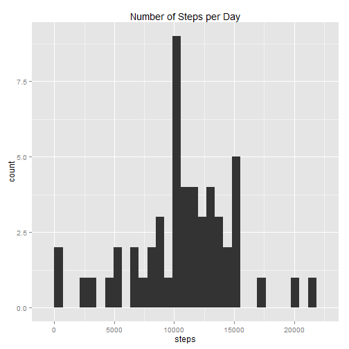

## Loading and preprocessing the data

### Download and unzip file in working directory.

### Load "activity" and requisite R packages


```r
    library(stats)
    library(plyr)
    library(dplyr)
    library(ggplot2)
    library(lubridate)
    library(timeDate)
    
    activity<- na.omit(read.csv("activity.csv"))
```

```
## Warning in file(file, "rt"): cannot open file 'activity.csv': No such file
## or directory
```

```
## Error in file(file, "rt"): cannot open the connection
```
### Get Total Number of Steps per Day

```r
    sum<- ddply(activity, .(date), summarize,  steps=sum(steps))
```
### Histogram of Total Number of Steps per Day

```r
        ggplot(data=sum, aes(steps)) +geom_histogram() + ggtitle("Number of Steps per Day")
```

```
## stat_bin: binwidth defaulted to range/30. Use 'binwidth = x' to adjust this.
```

 

###  Mean and median of total number of steps per day

```r
    mean(sum$steps)
```

```
## [1] NA
```

```r
    median(sum$steps)
```

```
## [1] NA
```

##Average Daily Activity Pattern
###  The following plot describes a time-series of 5-minute intervals (x-axis) and average steps taken, averaged across all days (y-axis).

```r
    sum_int<- ddply(activity, .(interval), summarize, steps=sum(steps))
    ggplot(sum_int, aes(interval, steps)) + geom_line() +ggtitle("Average Steps per Interval")
```

```
## Error in seq.default(from = best$lmin, to = best$lmax, by = best$lstep): 'from' must be of length 1
```

### On average Interval 835 has the highest number of steps with 10927.  See code below...

```r
    summary(sum_int)
```

```
##     interval          steps    
##  Min.   :   0.0   Min.   : NA  
##  1st Qu.: 588.8   1st Qu.: NA  
##  Median :1177.5   Median : NA  
##  Mean   :1177.5   Mean   :NaN  
##  3rd Qu.:1766.2   3rd Qu.: NA  
##  Max.   :2355.0   Max.   : NA  
##                   NA's   :288
```

```r
    filter(sum_int, steps=="10927")
```

```
## [1] interval steps   
## <0 rows> (or 0-length row.names)
```

## Imputing Missing Values
### Total Number of Rows with Missing Values (True = number of rows with NAs)

```r
    activity<- read.csv("activity.csv")
```

```
## Warning in file(file, "rt"): cannot open file 'activity.csv': No such file
## or directory
```

```
## Error in file(file, "rt"): cannot open the connection
```

```r
    na<- is.na(activity$steps)
    table(na)
```

```
## na
## FALSE  TRUE 
## 15264  2304
```

### Filling in NAs with column ("steps") averages and creating new dataset.  Head for new dataset is below...

```r
    activity_na<- read.csv("activity.csv")
```

```
## Warning in file(file, "rt"): cannot open file 'activity.csv': No such file
## or directory
```

```
## Error in file(file, "rt"): cannot open the connection
```

```r
    activity_na[is.na(activity_na)]=mean(activity_na$steps, na.rm=TRUE)
    head(activity_na)
```

```
##     steps       date interval    wDay
## 1 37.3826 2012-10-01        0 weekday
## 2 37.3826 2012-10-01        5 weekday
## 3 37.3826 2012-10-01       10 weekday
## 4 37.3826 2012-10-01       15 weekday
## 5 37.3826 2012-10-01       20 weekday
## 6 37.3826 2012-10-01       25 weekday
```

### Histogram of Number of Steps per Day with NAs as Averages

```r
    sum_na<- ddply(activity_na, .(date), summarize,  steps=sum(steps))
    hist(sum_na$steps, main = "Number of Steps per Day with NAs as Averages", col = "red")
```

 

###The Mean of total numbers of steps per day is exactly the same, given that NA's were replaced by mean values per respective interval.  The median was slightly lower, given that mean's were lower during 'spiky' periods.

```r
    sum_na<- ddply(activity_na, .(date), summarize,  steps=sum(steps))
    mean(sum_na$steps)
```

```
## [1] 10766.19
```

```r
    median(sum_na$steps)
```

```
## [1] 10766.19
```

### Adding weekdays and weekends

```r
    activity_na$date<- as.Date(activity_na$date)
    wDay<- c("Monday", "Tuesday", "Wednesday", "Thursday", "Friday")
    activity_na$wDay<- factor((weekdays(activity_na$date) %in% wDay), 
                              levels=c(FALSE, TRUE), labels=c('weekend', 'weekday'))
    head(activity_na)
```

```
##     steps       date interval    wDay
## 1 37.3826 2012-10-01        0 weekday
## 2 37.3826 2012-10-01        5 weekday
## 3 37.3826 2012-10-01       10 weekday
## 4 37.3826 2012-10-01       15 weekday
## 5 37.3826 2012-10-01       20 weekday
## 6 37.3826 2012-10-01       25 weekday
```

### Plot comparing steps during weekends and weekdays.

```r
    wd<- filter(activity_na, wDay=="weekday")
    we<- filter(activity_na, wDay=="weekend")
    wd_ave<- ddply(wd, .(interval), summarize,  steps=mean(steps))
    we_ave<- ddply(we, .(interval), summarize,  steps=mean(steps))
    wd_var<- read.csv("weekday.csv", header=TRUE)
```

```
## Warning in file(file, "rt"): cannot open file 'weekday.csv': No such file
## or directory
```

```
## Error in file(file, "rt"): cannot open the connection
```

```r
    we_var<- read.csv("weekend.csv", header=TRUE)
```

```
## Warning in file(file, "rt"): cannot open file 'weekend.csv': No such file
## or directory
```

```
## Error in file(file, "rt"): cannot open the connection
```

```r
    wd_ave2<- bind_cols(wd_ave, wd_var)
    we_ave2<- bind_cols(we_ave, we_var)
    wd_plot<- bind_rows(wd_ave2, we_ave2)
```

```
## Warning in rbind_all(x, .id): Unequal factor levels: coercing to character
```

```r
    g<- ggplot(wd_plot, aes(interval, steps))
    g+geom_line()+facet_grid(weekday~.) + theme_bw()
```

 
