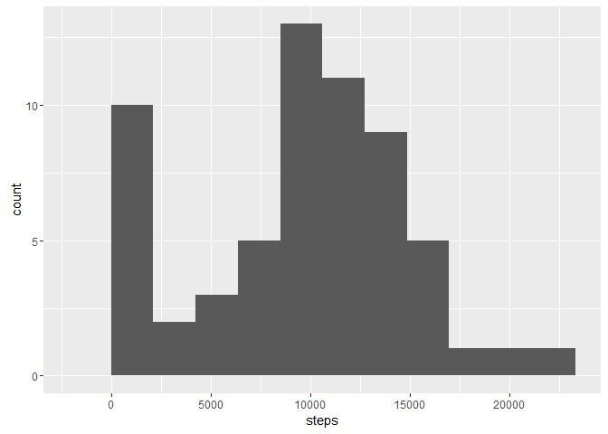
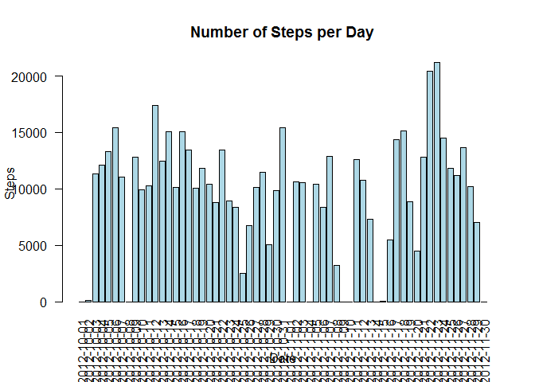

# Reproducible Research: Peer Assignment 1
Takashi Sendo  
2017/1/27  


## Loading and preprocessing the data:


```r
Activity<- read.csv(unz("./activity.zip","activity.csv"),header=TRUE)
#### changing column order
Activity<-Activity[,c(2,1,3)]
Activity_wo_NA<-na.omit(Activity)
```

## What is mean total number of steps taken per day?


```r
hist(Activity_wo_NA$steps)
```

<!-- -->

```r
StepMean<-aggregate(Activity_wo_NA[, 2], list(Activity_wo_NA$date), mean)
colnames(StepMean) <- c("date", "mean")
StepMean
```

```
##          date       mean
## 1  2012-10-02  0.4375000
## 2  2012-10-03 39.4166667
## 3  2012-10-04 42.0694444
## 4  2012-10-05 46.1597222
## 5  2012-10-06 53.5416667
## 6  2012-10-07 38.2465278
## 7  2012-10-09 44.4826389
## 8  2012-10-10 34.3750000
## 9  2012-10-11 35.7777778
## 10 2012-10-12 60.3541667
## 11 2012-10-13 43.1458333
## 12 2012-10-14 52.4236111
## 13 2012-10-15 35.2048611
## 14 2012-10-16 52.3750000
## 15 2012-10-17 46.7083333
## 16 2012-10-18 34.9166667
## 17 2012-10-19 41.0729167
## 18 2012-10-20 36.0937500
## 19 2012-10-21 30.6284722
## 20 2012-10-22 46.7361111
## 21 2012-10-23 30.9652778
## 22 2012-10-24 29.0104167
## 23 2012-10-25  8.6527778
## 24 2012-10-26 23.5347222
## 25 2012-10-27 35.1354167
## 26 2012-10-28 39.7847222
## 27 2012-10-29 17.4236111
## 28 2012-10-30 34.0937500
## 29 2012-10-31 53.5208333
## 30 2012-11-02 36.8055556
## 31 2012-11-03 36.7048611
## 32 2012-11-05 36.2465278
## 33 2012-11-06 28.9375000
## 34 2012-11-07 44.7326389
## 35 2012-11-08 11.1770833
## 36 2012-11-11 43.7777778
## 37 2012-11-12 37.3784722
## 38 2012-11-13 25.4722222
## 39 2012-11-15  0.1423611
## 40 2012-11-16 18.8923611
## 41 2012-11-17 49.7881944
## 42 2012-11-18 52.4652778
## 43 2012-11-19 30.6979167
## 44 2012-11-20 15.5277778
## 45 2012-11-21 44.3993056
## 46 2012-11-22 70.9270833
## 47 2012-11-23 73.5902778
## 48 2012-11-24 50.2708333
## 49 2012-11-25 41.0902778
## 50 2012-11-26 38.7569444
## 51 2012-11-27 47.3819444
## 52 2012-11-28 35.3576389
## 53 2012-11-29 24.4687500
```

## What is the average daily activity pattern?


```r
StepMean2<-aggregate(Activity_wo_NA[,2], list(Activity_wo_NA$interval), mean)
colnames(StepMean2) <- c("interval","mean_step")
with(StepMean2,plot(x=interval,y=mean_step,type="l",ylab = "mean_step",xlab="interval",main="Interval vs. Average Step"))
```

<!-- -->

```r
### Max mean_step is found at interval:
StepMean2[which.max(StepMean2$mean_step),1]
```

```
## [1] 835
```

## Imputing missing values


```r
#### coubting number of NA in "steps"
num_na=plyr::count(is.na(Activity$steps))
#### number of NA
num_na[2,2]
```

```
## [1] 2304
```

```r
#### imputing NA to 0
Activity$steps[is.na(Activity$steps)]<-0
StepMean_na0<-aggregate(Activity[, 2], list(Activity$date), mean)
colnames(StepMean_na0) <- c("date", "mean")
## average daily steps
StepMean_na0
```

```
##          date       mean
## 1  2012-10-01  0.0000000
## 2  2012-10-02  0.4375000
## 3  2012-10-03 39.4166667
## 4  2012-10-04 42.0694444
## 5  2012-10-05 46.1597222
## 6  2012-10-06 53.5416667
## 7  2012-10-07 38.2465278
## 8  2012-10-08  0.0000000
## 9  2012-10-09 44.4826389
## 10 2012-10-10 34.3750000
## 11 2012-10-11 35.7777778
## 12 2012-10-12 60.3541667
## 13 2012-10-13 43.1458333
## 14 2012-10-14 52.4236111
## 15 2012-10-15 35.2048611
## 16 2012-10-16 52.3750000
## 17 2012-10-17 46.7083333
## 18 2012-10-18 34.9166667
## 19 2012-10-19 41.0729167
## 20 2012-10-20 36.0937500
## 21 2012-10-21 30.6284722
## 22 2012-10-22 46.7361111
## 23 2012-10-23 30.9652778
## 24 2012-10-24 29.0104167
## 25 2012-10-25  8.6527778
## 26 2012-10-26 23.5347222
## 27 2012-10-27 35.1354167
## 28 2012-10-28 39.7847222
## 29 2012-10-29 17.4236111
## 30 2012-10-30 34.0937500
## 31 2012-10-31 53.5208333
## 32 2012-11-01  0.0000000
## 33 2012-11-02 36.8055556
## 34 2012-11-03 36.7048611
## 35 2012-11-04  0.0000000
## 36 2012-11-05 36.2465278
## 37 2012-11-06 28.9375000
## 38 2012-11-07 44.7326389
## 39 2012-11-08 11.1770833
## 40 2012-11-09  0.0000000
## 41 2012-11-10  0.0000000
## 42 2012-11-11 43.7777778
## 43 2012-11-12 37.3784722
## 44 2012-11-13 25.4722222
## 45 2012-11-14  0.0000000
## 46 2012-11-15  0.1423611
## 47 2012-11-16 18.8923611
## 48 2012-11-17 49.7881944
## 49 2012-11-18 52.4652778
## 50 2012-11-19 30.6979167
## 51 2012-11-20 15.5277778
## 52 2012-11-21 44.3993056
## 53 2012-11-22 70.9270833
## 54 2012-11-23 73.5902778
## 55 2012-11-24 50.2708333
## 56 2012-11-25 41.0902778
## 57 2012-11-26 38.7569444
## 58 2012-11-27 47.3819444
## 59 2012-11-28 35.3576389
## 60 2012-11-29 24.4687500
## 61 2012-11-30  0.0000000
```

```r
## interval to give maximum steps
StepMean_na02<-aggregate(Activity[,2], list(Activity$interval), mean)
colnames(StepMean_na02) <- c("interval","mean_step")
 
### Max mean_step is found at interval:
StepMean_na02[which.max(StepMean_na02$mean_step),1]
```

```
## [1] 835
```

Both original data (removing na) and one imputed for NA give th same result.

## Are there differences in activity patterns between weekdays and weekends?

```r
Activity_wo_NA$wDay1<-as.POSIXlt(Activity_wo_NA$date)$wday
#### number to represent days of week to handle the Japanese language
weekdays<-c(1,2,3,4,5)
Activity_wo_NA$wDay2<- factor(Activity_wo_NA$wDay1 %in% weekdays, levels=c(FALSE, TRUE), labels=c('weekend','weekday') )
which_weekdays <- Activity_wo_NA$wDay2 == "weekday"  ## subset weekday rows
which_weekends <- Activity_wo_NA$wDay2 == "weekend"  ## subset weekend rows

## Calculating average number of steps per interval across weekdays and
## weekends
StepsPerInterval_weekday <- tapply(Activity_wo_NA$steps[which_weekdays], as.factor(Activity_wo_NA$interval[which_weekdays]),mean, na.rm = T)
StepsPerInterval_weekend <- tapply(Activity_wo_NA$steps[which_weekends], as.factor(Activity_wo_NA$interval[which_weekends]), mean, na.rm = T)

## Plot results in panel plot
par(mfcol = c(2, 1))

  plot(levels(as.factor(Activity_wo_NA$interval)), StepsPerInterval_weekday, type = "l", 
    xlab = "Interval", ylab = "Average number of steps", main = "Average number of steps per interval in weekday", ylim = range(0:400), xlim = range(0:2400))

plot(levels(as.factor(Activity_wo_NA$interval)), StepsPerInterval_weekend, type = "l", 
    xlab = "Interval", ylab = "Average number of steps", main = "Average number of steps per interval in weekend", 
    ylim = range(0:400), xlim = range(0:2400))
```

<!-- -->

There is a differenc between pattern of the distributino of steps: one in weekends spreads more evenly to larger interval, while one in weekday is skewed to lower interval, reflecting time available to do excersise in weekdays.
